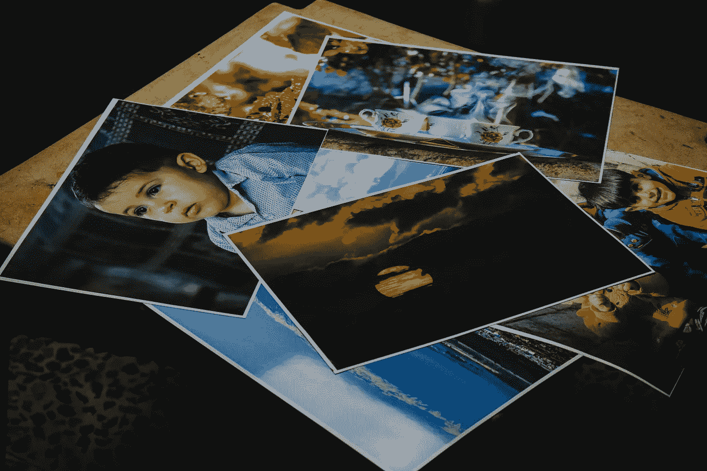
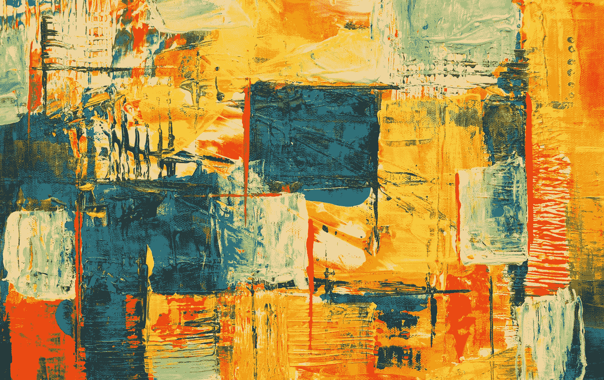
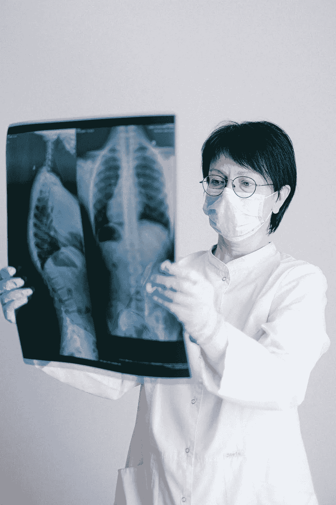
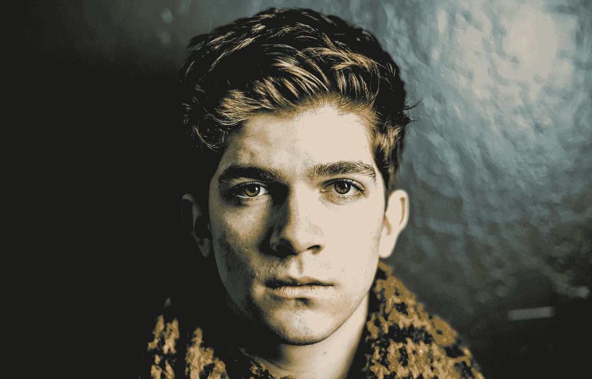

# 用于训练 GANs 的 5 个 Kaggle 数据集

> 原文：<https://towardsdatascience.com/5-kaggle-data-sets-for-training-gans-33dc2e035161?source=collection_archive---------21----------------------->

## GANs 入门的有用数据集

[来源](https://www.pexels.com/photo/close-up-shot-of-printed-photos-1226721/)

生成对抗网络(GANs)是一组深度神经网络模型，由 Ian Goodfellow 在 2014 年推出，用于生成合成数据。GANs 已被用于各种各样的任务，包括改善天文图像，提高旧视频游戏的分辨率，以及最著名的应用“deepfakes”，涉及人类图像合成。在本帖中，我将介绍一些可以用来训练 GAN 模型的有趣数据集。这个数据目录可以作为那些有兴趣开始构建 GAN 模型的人的起点。

我们开始吧！

首先，让我们简要回顾一下 GAN 模型背后的概念。GAN 由两个竞争的神经网络、一个生成器和一个鉴别器组成。生成器是一个修改的卷积神经网络，它学习从噪声中产生合成数据。鉴别器是一个卷积神经网络，它学习区分伪数据和真实数据。随着模型训练的进行，鉴别器在区分真实和虚假数据方面变得更好，生成器在生成真实数据方面变得更好。

现在，让我们进入一些有趣的数据集。

## [抽象艺术数据](https://www.kaggle.com/bryanb/abstract-art-gallery)

[来源](https://www.pexels.com/photo/multicolored-abstract-painting-1269968/)

这个数据集包含了 2782 幅从 wikiart.org 刮来的抽象艺术图像。此数据可用于构建 GAN，以生成抽象艺术的合成图像。数据集包含梵高、达利、毕加索等的真实抽象艺术图像。

## [用秀丽隐杆线虫进行高含量筛选](https://www.kaggle.com/kmader/high-content-screening-celegans)

[来源](https://www.pexels.com/photo/technology-lens-laboratory-medical-60022/)

该数据包含与使用蛔虫*秀丽隐杆线虫*寻找新型抗生素的筛选相对应的图像。该数据包含感染了一种名为*粪肠球菌的病原体的蛔虫图像。*一些图像是未经抗生素氨苄青霉素处理的蛔虫，其他图像是经氨苄青霉素处理的感染蛔虫。对于那些对将 GANs 应用于有趣的药物发现问题感兴趣的人来说，这是一个很好的起点！

## [肺部胸部 X 线异常](https://www.kaggle.com/kmader/pulmonary-chest-xray-abnormalities/home)

[来源](https://www.pexels.com/photo/doctor-holding-a-x-ray-4225880/)

该数据集包含由放射科医师临床标记的胸部 X 射线图像。有 336 个患有肺结核的胸部 X 射线图像和 326 个对应于健康个体的图像。对于那些对使用 GANs 进行医学图像数据合成感兴趣的人来说，这是一个很好的数据源。

## [假面](https://www.kaggle.com/hyperclaw79/fakefaces)

[来源](https://www.pexels.com/photo/man-leaning-on-wall-2128807/)

这些数据实际上包含了 GANs 生成的人脸合成图像。这些图片是从网站上刮来的[这个人不存在](https://thispersondoesnotexist.com/)。每当你刷新页面时，该网站就会生成一个由 GAN 生成的新的假人脸图像。对于用 GANs 生成合成图像来说，这是一个很好的数据集。

## [戴眼镜还是不戴眼镜](https://www.kaggle.com/jeffheaton/glasses-or-no-glasses)

[来源](https://www.pexels.com/photo/woman-with-brown-hair-wearing-eyeglasses-1112203/)

这个数据集包含戴眼镜的人脸图像和不戴眼镜的人脸图像。虽然这些图像是使用 GANs 生成的，但它们也可以作为生成其他合成图像的训练数据。

## 结论

总之，在这篇文章中，我们讨论了五个 Kaggle 数据集，它们可以用来生成 GAN 模型的合成图像。这些数据源应该是您尝试 GANs 的良好起点。如果你对一些帮助你开始使用 GANs 的有用代码感兴趣，可以看看这篇[GANs Kaggle 笔记本简介](https://www.kaggle.com/yushg123/introduction-to-gans-with-keras)。我希望你觉得这篇文章有用/有趣。感谢您的阅读！