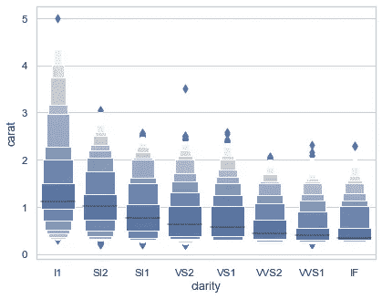
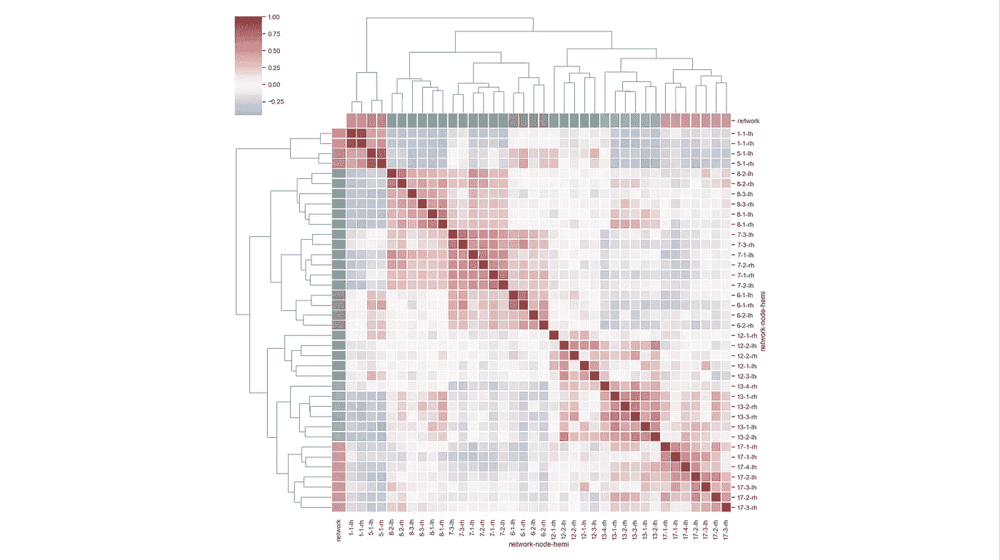
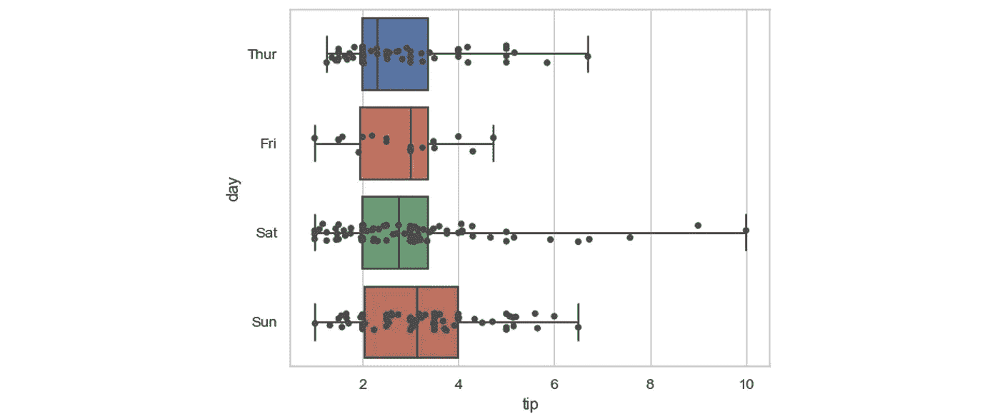
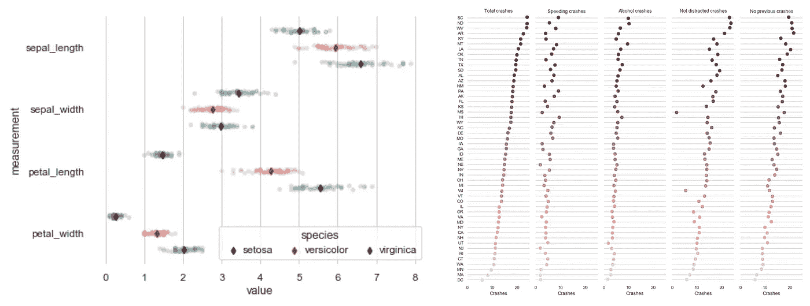
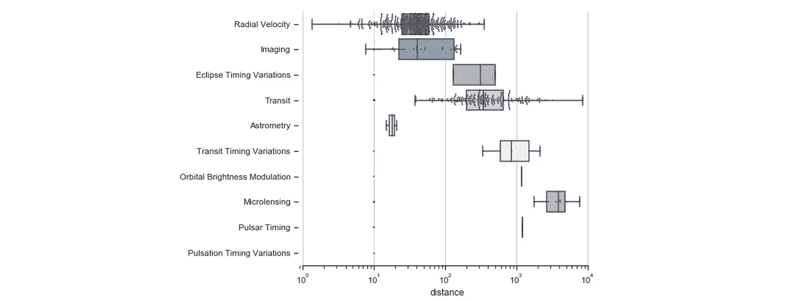
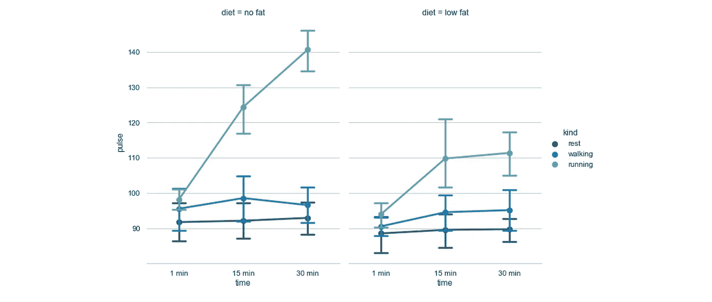

# 5 Seaborn 绘制了许多科学家不知道的数据

> 原文：<https://towardsdatascience.com/5-lesser-known-seaborn-plots-most-people-dont-know-82e5a54baea8?source=collection_archive---------19----------------------->

## 但是真的应该尝试

Seaborn 是 Python 中最流行的可视化库之一，它提供了大量的绘图方法，其中一些方法很多人并不熟悉。在本文中，将介绍五个相对不为人知的 Seaborn 地块(和一个复活节彩蛋)，以及图表、潜在的用例、代码和解释。

## 箱线图

箱线图是出了名的糟糕的可视化，因为它们隐藏了带有一些潜在误导性数据统计表示的分布。虽然在某些情况下，箱线图可能是数据的适当表现，但特别是对于大分布，用于绘制箱线图的五个数据点是远远不够的。

来源:Autodesk Research。图片免费分享。

“箱线图”是箱线图的扩展，试图通过增加更多的分位数来解决箱线图的问题。箱线图代表四分位数，即数据的四个部分的宽度，而箱线图可以将数据分成更多的分位数，以便更深入地了解数据的形状，尤其是分布的尾部。

Boxenplots 有许多每个 seaborn plot 都有的标准参数，但不同的参数包括`scale`、`outlier_propfloat`和`showfliersbool`。

## 聚类热图

虽然热图有助于可视化关系，但聚类热图提供了对矩阵层次结构的深入了解。聚类热点图通常用于相关矩阵(两个要素的每种组合之间的相关性)，但实际上也可用于任何矩阵，只要其元素处于相同的比例。

有许多热图聚类算法和方法，但每一种都试图通过最重要的元素来分解维度，在较低的级别将相似的特征(可能通过相关性或另一种度量)聚类在一起，在较高的级别将更不同的元素聚类在一起。然后，顶部的二元分割应该代表在特征中提供最不同信息的两个元素。

如果两个特征在最底部组合在一起(如上图中的 A 列和 B 列)，那么它们一定非常相似，并且包含相关信息。你可以在这里阅读更多关于聚类算法[的内容。](https://ncss-wpengine.netdna-ssl.com/wp-content/themes/ncss/pdf/Procedures/NCSS/Clustered_Heat_Maps-Double_Dendrograms.pdf)

## 脱衣舞场

去废图显示单个数据点，但沿宽度方向随机显示，这样即使数据点重叠，它们也是可见的。它们是高度可定制的，具有对透明度、形状和重叠的控制。

然而，在实践中，剥离图很少是最具信息性的可视化方法。相反，它们可以用作其他图(如箱线图或紫线图)顶部的抖动，以帮助查看者理解数据的真实分布。

剥离图是高度可定制的:例如，您可以在显示透明抖动时标记特征的方式，或者通过创造性地使用网格和旋转剥离图来创建点图。

## 群集图

虽然条带图利用随机性来显示重叠点，但群集图采用一种更系统的方法来显示重叠值，方法是堆叠具有相同(或非常相似)值的数据点。

群集图是小提琴图和脱衣舞图之间的可视化；它揭示了数据的对称分布，就像小提琴图，但没有平滑，而是揭示了原始数据点。它以宽度作为一个因素来显示各个数据点，以防止具有相似值的数据点模糊不清，但更具结构化。像条带图一样，群集图可以放置在其他更常见的可视化方法(如箱线图)之上。

## 点图

一个点状图可以被认为是一个带有垂直条的线形图。这可用于显示误差线、置信区间或数值范围。像传统的线形图一样，点状图可以使用连续的 *x* 轴；或者简单地绘制分类值之间的视觉差异，如平均值，这使得用户更容易基于连接线的斜率来评估差异的严重性。

点图是特别可定制的，可以控制条的长度、连接点的位置、帽长度、条的厚度等等。

## 奖励:狗场

seaborn 的创造者放入一个复活节彩蛋，然后 seaborn 会随机传回一张可爱狗狗的高清照片！

来源:Seaborn dogplot。图片免费分享。

这很可能给你的数据可视化项目一个急需的微笑！

感谢您的阅读，请在回复中告诉我您的想法！

如果你对最新的文章感兴趣，可以考虑[订阅](https://andre-ye.medium.com/subscribe)。如果你想支持我的写作，通过我的[推荐链接](https://andre-ye.medium.com/membership)加入 Medium 是一个很好的方式。干杯！

 [## 在 Python 中创建复杂可视化的最简单方法不是使用 matplotlib。

### 直接从熊猫身上创造流畅简单的情节

towardsdatascience.com](/the-simplest-way-to-create-complex-visualizations-in-python-isnt-with-matplotlib-a5802f2dba92)  [## 用一行代码彻底美化可视化效果:设计情节

### 制作吸引人的情节从未如此容易

towardsdatascience.com](/drastically-beautifying-visualizations-with-one-line-styling-plots-35a5712c4f54) 

*作者创建的图表/用 seaborn 创建的可视化。*