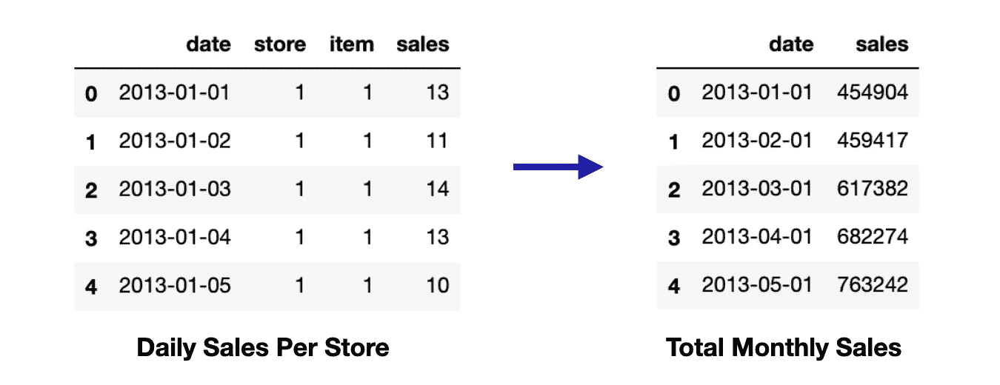
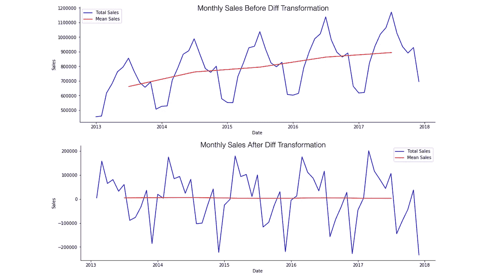
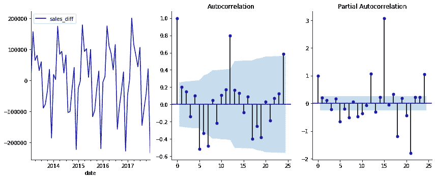
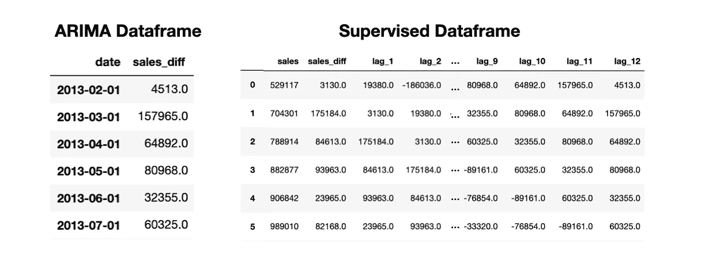
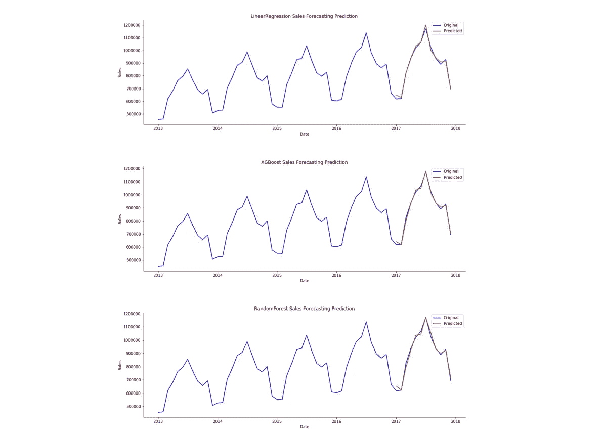
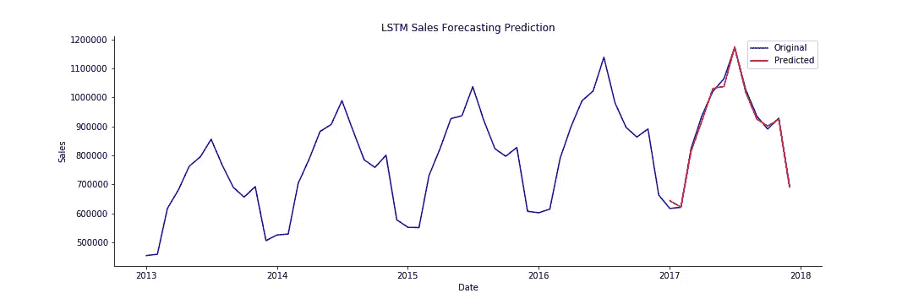
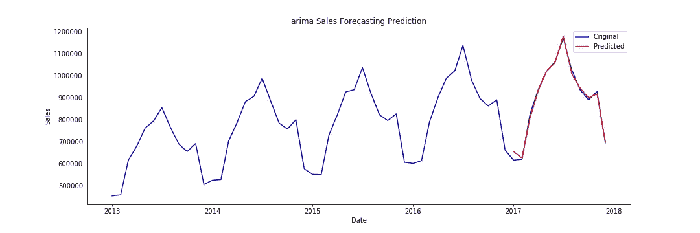
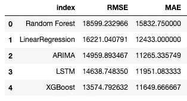
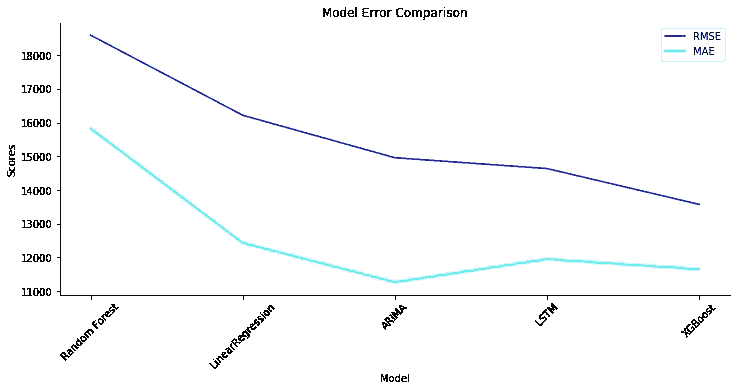

# 销售预测的 5 种机器学习技术

> 原文：<https://towardsdatascience.com/5-machine-learning-techniques-for-sales-forecasting-598e4984b109?source=collection_archive---------0----------------------->

## Python 中线性回归、随机森林回归、XGBoost、LSTMs 和 ARIMA 时间序列预测的比较

预测销售是机器学习(ML)的一个常见和基本的用途。销售预测可用于确定基准，确定新计划的增量影响，规划资源以响应预期需求，并预测未来预算。在本文中，我将展示如何实现 5 种不同的 ML 模型来预测销售。

这个演示的数据可以在 Kaggle 上找到[，完整的代码在](https://www.kaggle.com/c/demand-forecasting-kernels-only) [GitHub](https://github.com/mollyliebeskind/sales_forecasting) 上。

# 入门指南

第一步是加载数据，并将其转换成一种结构，然后我们将在每个模型中使用这种结构。在其原始形式中，每行数据代表 10 家商店中某一天的销售额。我们的目标是预测月销售额，所以我们首先将所有商店和天数合并为月总销售额。

```
def load_data():
    url = """https://www.kaggle.com/c/demand-forecasting-kernels
    only/download/ryQFx3IEtFjqjv3s0dXL%2Fversions%2FzjbSfpE39fdJl
    MotCpen%2Ffiles%2Ftrain.csv"""     

    return pd.read_csv(url)def monthly_sales(data):    
    data = data.copy()         # Drop the day indicator from the date column    
    data.date = data.date.apply(lambda x: str(x)[:-3])         # Sum sales per month    
    data = data.groupby('date')['sales'].sum().reset_index()    
    data.date = pd.to_datetime(data.date)  
    data.to_csv('../data/monthly_data.csv')     
    return datadata = load_data()
monthly_data = monthly_sales(data)
```

在我们的新数据框中，现在每一行都代表给定月份所有商店的总销售额。



如果我们绘制一段时间内的总月销售额，我们会看到平均月销售额随着时间的推移而增加，这意味着我们的数据不是稳定的。为了使其稳定，我们将计算每个月销售额之间的差异，并将其作为一个新列添加到我们的数据框中。关于信纸和差异的更多细节可以在[这里找到。](https://www.analyticsvidhya.com/blog/2018/09/non-stationary-time-series-python/)

```
# Calculate difference in sales month over month
def get_diff(data):
    data['sales_diff'] = data.sales.diff()    
    data = data.dropna()      
    return datastationary_df = get_diff(monthly_data)
```

下面是我们的数据在差异转换前后的视觉表现。所有情节的代码可以在这里找到[。](https://github.com/mollyliebeskind/sales_forecasting/tree/master/notebooks)



比较差分前后的平稳性。莫莉·里伯斯金图片。

既然我们的数据代表月销售额，并且我们已经将它转换为静态数据，我们将为不同的模型类型设置数据。为此，我们将定义两个不同的结构:一个用于 ARIMA 建模，另一个用于其余的模型。

对于我们的 Arima 模型，我们只需要一个日期时间索引和因变量(销售差异)列。

```
def generate_arima_data(data):
    dt_data = data.set_index('date').drop('sales', axis=1)        
    dt_data.dropna(axis=0)     
    dt_data.to_csv('../data/arima_df.csv')
    return dt_dataarima_data = generate_arima_data(stationary_df)
```

对于我们的其他模型，我们将创建一个新的数据框架，其中每个特性代表上个月的销售额。为了确定我们的特征集中包括多少个月，我们将观察自相关和偏自相关图，并使用[规则在 ARIMA 建模中选择滞后](https://people.duke.edu/~rnau/arimrule.htm)。这样，我们可以保持我们的 ARIMA 和回归模型的回望期一致。



自相关和偏自相关图。莫莉·里伯斯金图片。

基于上述情况，我们将回望期定为 12 个月。因此，我们将生成一个有 13 列的数据框，12 个月中的每个月有一列，另一列是我们的因变量——销售额差异。以下代码摘自[巴里斯·卡拉曼的《数据驱动增长》系列。](/predicting-sales-611cb5a252de)

```
def generate_supervised(data):
    supervised_df = data.copy()

    #create column for each lag
    for i in range(1,13):
        col = 'lag_' + str(i)
        supervised_df[col] = supervised_df['sales_diff'].shift(i)

    #drop null values
    supervised_df = supervised_df.dropna().reset_index(drop=True)
    supervised_df.to_csv('../data/model_df.csv', index=False)

    return supervised_dfmodel_df = generate_supervised(stationary_df)
```

现在我们有了两个独立的数据结构，一个是包含日期时间索引的 Arima 结构，另一个是包含延迟特性的监督结构。



销售预测的 ARIMA 和监督数据框架。莫莉·里伯斯金图片。

# 建模

为了创建和评估我们所有的模型，我们使用了一系列的助手函数来执行以下功能。所有助手功能的代码可以在找到[。](https://github.com/mollyliebeskind/sales_forecasting/blob/master/models.py)

1.  训练测试分割:我们分离我们的数据，以便过去 12 个月是测试集的一部分，其余的数据用于训练我们的模型
2.  缩放数据:使用最小-最大缩放器，我们将缩放数据，以便所有变量都在-1 到 1 的范围内
3.  反向缩放:在运行我们的模型之后，我们将使用这个辅助函数来反向缩放步骤 2
4.  创建一个预测数据框架:生成一个数据框架，其中包括在我们的测试集中捕获的实际销售额和来自我们的模型的预测结果，以便我们可以量化我们的成功
5.  对模型评分:这个辅助函数将保存我们预测的均方根误差(RMSE)和平均绝对误差(MAE ),以比较我们五个模型的性能

## 回归模型:线性回归、随机森林回归、XGBoost

对于我们的回归模型，我们可以使用 [scikit-learn 库](https://devdocs.io/scikit_learn/)的 fit-predict 结构。因此，我们可以建立一个基础建模结构，我们将为每个模型调用它。下面的函数调用上面概述的许多[辅助函数](https://github.com/mollyliebeskind/sales_forecasting/blob/master/models.py)来分割数据，运行模型，并输出 RMSE 和梅分数。

```
def regressive_model(train_data, test_data, model, model_name):

    # Call helper functions to create X & y and scale data
    X_train, y_train, X_test, y_test, scaler_object = 
        scale_data(train_data, test_data)

    # Run regression model
    mod = model
    mod.fit(X_train, y_train)
    predictions = mod.predict(X_test) # Call helper functions to undo scaling & create prediction df
    original_df = load_data('../data/monthly_data.csv')
    unscaled = undo_scaling(predictions, X_test, scaler_object)
    unscaled_df = predict_df(unscaled, original_df) # Call helper functions to print scores and plot results
    get_scores(unscaled_df, original_df, model_name)
    plot_results(unscaled_df, original_df, model_name)

# Separate data into train and test sets
train, test = tts(model_df)# Call model frame work for linear regression
regressive_model(train, test, LinearRegression(),'LinearRegression')# Call model frame work for random forest regressor 
regressive_model(train, test, 
                 RandomForestRegressor(n_estimators=100,
                                       max_depth=20),        
                                       'RandomForest')# Call model frame work for XGBoost
regressive_model(train, test, XGBRegressor(n_estimators=100,
                                           learning_rate=0.2), 
                                           'XGBoost')
```

下面的输出显示了每个回归模型的预测值(红色)叠加在实际销售额(蓝色)之上。虽然结果看起来相似，但细微的差异相当于几千美元的销售额，我们将在下面的比较部分看到这一点。



回归模型预测与实际销售。莫莉·里伯斯金图片。

## 长短期记忆(LSTM)

LSTM 是一种递归神经网络，对于使用序列数据进行预测特别有用。为此，我们将使用一个非常简单的 LSTM。为了提高准确性，可以添加季节性特征和额外的模型复杂性。

```
def lstm_model(train_data, test_data):
    # Call helper functions to create X & y and scale data
    X_train, y_train, X_test, y_test, scaler_object =    
        scale_data(train_data, test_data) X_train = X_train.reshape(X_train.shape[0], 1, X_train.shape[1])
    X_test = X_test.reshape(X_test.shape[0], 1, X_test.shape[1]) # Build LSTM
    model = Sequential()
    model.add(LSTM(4, batch_input_shape=(1, X_train.shape[1], 
                                         X_train.shape[2]), 
                                         stateful=True))
    model.add(Dense(1))
    model.add(Dense(1))
    model.compile(loss='mean_squared_error', optimizer='adam')
    model.fit(X_train, y_train, epochs=200, batch_size=1, verbose=1, 
              shuffle=False)
    predictions = model.predict(X_test, batch_size=1) # Call helper functions to undo scaling & create prediction df
    original_df = load_data('../data/monthly_data.csv')
    unscaled = undo_scaling(predictions, X_test, scaler_object, 
                            lstm=True)
    unscaled_df = predict_df(unscaled, original_df) # Call helper functions to print scores and plot results
    get_scores(unscaled_df, original_df, 'LSTM')
    plot_results(unscaled_df, original_df, 'LSTM')
```

结果图看起来类似于上面的三个回归图，所以我们将推迟比较结果，直到我们看到下面的误差。



LSTM 模型预测与实际销售。莫莉·里伯斯金图片。

## ARIMA:

ARIMA 模型看起来与上面的模型略有不同。我们使用 statsmodels SARIMAX 包来训练模型并生成动态预测。SARIMA 模型分为几个部分。

*   AR:表示为 p，是自回归模型
*   I:表示为 d，是区别项
*   马:表示为 q，是移动平均线模型
*   学生:使我们能够添加季节性成分

在下面的代码中，我们定义了模型，然后对过去 12 个月的数据进行了动态预测。对于标准的非动态预测，下个月的预测是使用前几个月的实际销售额进行的。相比之下，对于动态预测，下个月的预测是使用前几个月的预测销售额进行的。

```
def sarimax_model(data):
    # Model    
    sar = sm.tsa.statespace.SARIMAX(data.sales_diff, order=(12, 0, 
                                    0), seasonal_order=(0, 1, 0,  
                                    12), trend='c').fit() # Generate predictions    
    start, end, dynamic = 40, 100, 7    
    data['pred_value'] = sar.predict(start=start, end=end, 
                                     dynamic=dynamic)    # Call helper functions to undo scaling & create prediction df   
    original_df = load_data('../data/monthly_data.csv')
    unscaled_df = predict_df(data, original_df) # Call helper functions to print scores and plot results   
    get_scores(unscaled_df, original_df, 'ARIMA') 
    plot_results(unscaled_df, original_df, 'ARIMA')
```

同样，结果看起来相当不错。我们将在下面进一步挖掘。



ARIMA 模型预测与实际销售。莫莉·里伯斯金图片。

# 比较模型

为了比较模型性能，我们将考察均方根误差(RMSE)和平均绝对误差(MAE)。这些度量都是比较模型性能的常用方法，但是它们的直觉和数学意义略有不同。

*   MAE:平均绝对误差告诉我们，平均而言，我们的预测离真实值有多远。在这种情况下，所有错误都具有相同的权重。
*   RMSE:我们通过计算所有误差平方和的平方根来计算 RMSE。当我们平方时，较大的误差对总误差有较大的影响，而较小的误差对总误差没有那么大的影响。

从上面的[辅助函数](https://github.com/mollyliebeskind/sales_forecasting/blob/master/models.py)中，我们使用 get_scores 来计算每个模型的 RMSE 和 MAE 分数。这些分数被保存在一本字典里，腌起来。为了进行比较，我们将把字典转换成 Pandas 数据框架并绘制结果。

```
def create_results_df():
    # Load pickled scores for each model
    results_dict = pickle.load(open("model_scores.p", "rb")) # Create pandas df 
    results_df = pd.DataFrame.from_dict(results_dict, 
                    orient='index', columns=['RMSE', 'MAE', 'R2']) results_df = results_df.sort_values(by='RMSE',
                     ascending=False).reset_index() return results_dfresults = create_results_df()
```

这给了我们下面的数据框架。



我们可以看到，尽管我们的模型输出在上面的图中看起来很相似，但它们的精确度确实不同。下面的图片可以帮助我们看出区别。剧情代码可以在这里找到[。](https://github.com/mollyliebeskind/sales_forecasting/blob/master/results.py)



比较模型性能。莫莉·里伯斯金图片。

我们看到的是，总体而言，XGBoost 模型的性能最好，紧随其后的是 ARIMA 和 LSTM 模型。这里需要注意的是，上述所有模型都是以最基本的形式推导出来的，以展示它们如何用于销售预测。这些模型只是稍微调整了一下，以最大限度地降低复杂性。例如，LSTM 可以有许多额外的节点和图层来提高性能。

为了确定哪个模型适合您的用例，您应该考虑以下几点。

*   你对模型的复杂程度和可解释性感到满意。
*   模型可以调整，功能可以设计为包括季节信息、假期、周末等。
*   了解您将如何使用结果，以及数据将如何更新您的模型。
*   使用交叉验证或类似技术调整模型，以避免数据过度拟合。

销售预测介绍的完整代码可以在这里找到[。](https://github.com/mollyliebeskind/sales_forecasting)请在下面添加任何问题或意见。