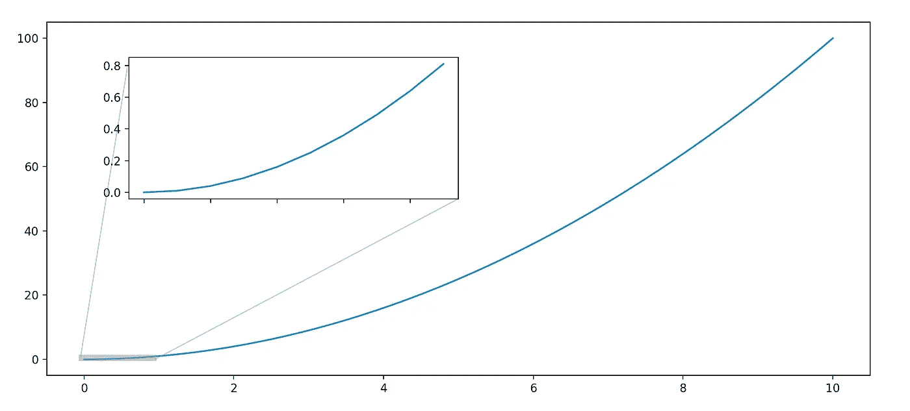
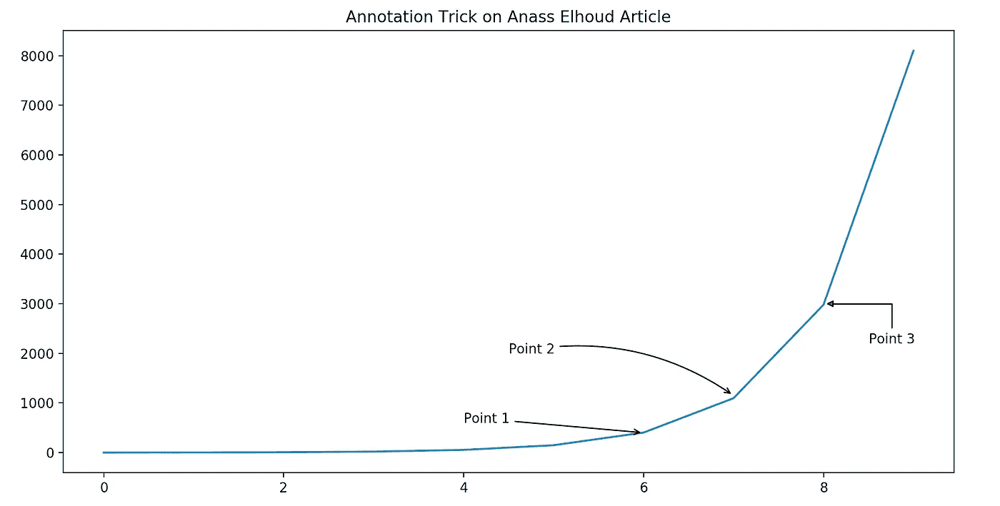
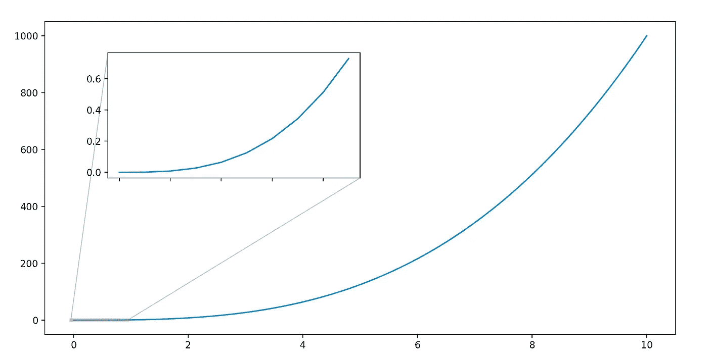
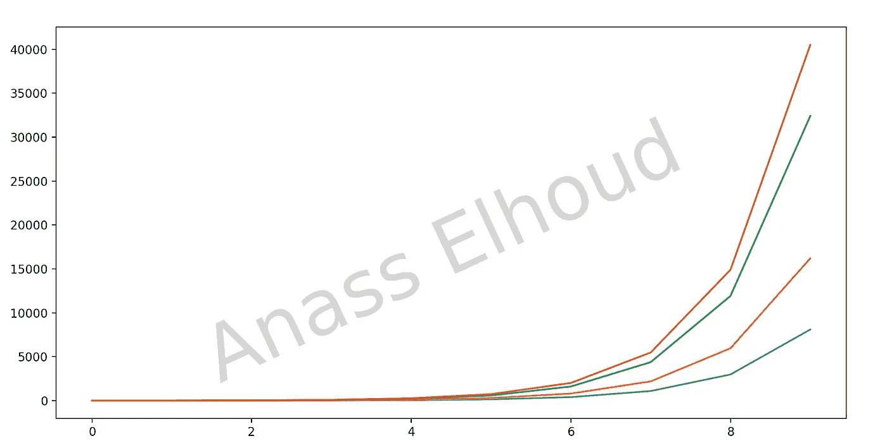
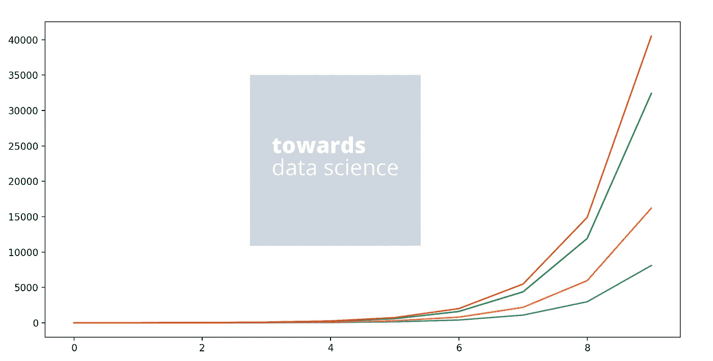
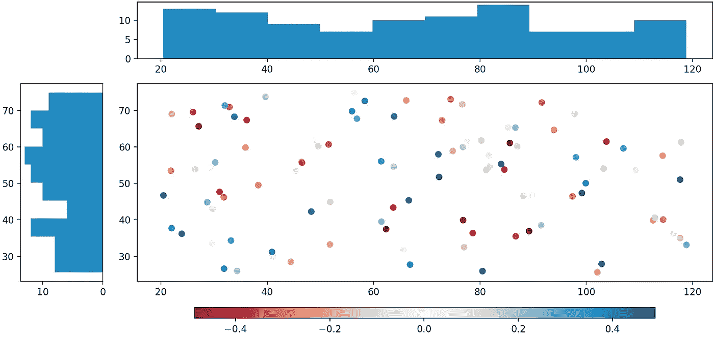
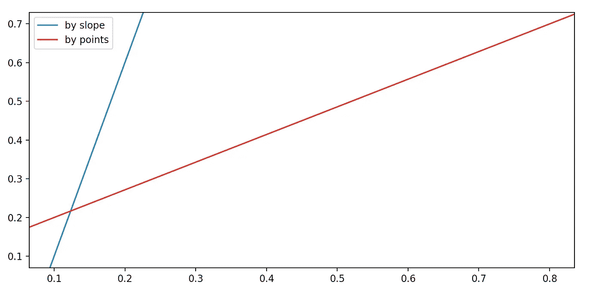

# 使用 Matplotlib 改进可视化设计的 5 个神奇技巧

> 原文：<https://towardsdatascience.com/5-magical-tricks-to-improve-your-visualization-design-using-matplotlib-dc47623f8cea?source=collection_archive---------22----------------------->

## 应该添加到代码中的新功能的集合



不可能什么都知道，不管我们的经验在这些年里增加了多少，有许多事情对我们来说仍然是隐藏的。这是正常的，也许是一个令人兴奋的动机去搜索和学习更多。我确信这是促使你写这篇文章的原因。

我们知道 Matplotlib 最重要的特性之一是它能够很好地与许多操作系统和图形后端兼容。Matplotlib 支持几十种后端和输出类型，这意味着无论您使用的是哪种操作系统或您希望的输出格式，您都可以依赖它工作[1]。

我正在与你分享我以前不知道的 5 个神奇的技巧和新特性，来提高你使用 Matplotlib 的设计和可视化技能。这些招数会对你的工作助一臂之力，让你的工作更加专业。

如果这些功能中有一个不适合您，请使用以下方法更新您的 Matplotlib 版本:

```
pip install -U matplotlib
```

事不宜迟，我们开始吧！

# 技巧 1:绘图注释

我们今天的第一个技巧是注释，它是在一个点上添加到一个图中的注释类型，以使它更容易理解，澄清更多信息，或者定义该点的角色。



为此，我们将使用 Matplotlib 中的 ***plt.annotate()*** 函数。它允许您创建箭头，连接它们，并使它们指向特定的区域。您可以根据自己的代码修改上面的代码行:

这种方法肯定会帮助你以书面形式、乳胶报告、博士论文答辩等方式展示你的工作

# 招数二:缩放法

我觉得这是最神奇的一招。这个新功能非常有用和有趣，尤其是对研究人员和数据科学家来说。方法***indicate _ inset _ zoom()***返回一个显示缩放位置的矩形，帮助您显示曲线的特定部分，而无需绘制另一部分。



上面的代码解释了如何调用方法并将其添加到您的绘图中:

# 招数三:剧情上水印

这个技巧对于解决版权问题很有用。它帮助您将水印添加到可视化设计中。它的使用并不广泛，但在准备可视化项目时，它仍然是一个需要了解的重要特性。在此功能中，您可以使用文本水印或图像水印。



文本水印

要添加文本水印，您可以使用下面一行:

您也可以通过更改上面代码中的第 11、12 和 13 行，将您的徽标或您公司的徽标用作水印。



图像水印

一旦您将徽标添加到主文件所在的目录中，您就可以使用此代码来代替文本水印。不要忘记用您自己的徽标名称来修改“tds.png ”:

# 招数 4:共享斧头

这些新方法允许在创建后立即共享轴。这为您的可视化效果提供了一个有吸引力和有条理的外观。请确保在使用代码之前更新您的 Matplotlib 版本，因为该方法是新发布的功能。



代码源代码写在下面:

# 招数五:无限线

这个技巧对数据科学家和机器学习工程师也很有用。它创建了一条通过两点的无限长的线。它可用于分离簇、组或图。



使用下面的代码源来检查这个特性，让我看看您将如何在您的数据可视化项目中应用它:

数据科学家、ML 工程师、数据分析师或业务分析师，您肯定知道 Matplotlib 的强大功能。它是帮助我们高效有力地讲述故事的最佳工具之一，将我们的分析与业务目标联系起来，并获得解释和决策结果。

有了这些功能，你将能够为你的学术或官方项目增添优雅和专业。您将使读者和审阅者更容易理解和跟踪数据可视化产生的信息和解释。

一个设计良好的视觉效果有一些非凡之处:颜色突出，层次协调，轮廓适合整个设计，它不仅具有美丽的美学品质，而且给我们一个有意义的洞察力。你知道数据可视化就像讲故事，这就是为什么你应该尽可能地让它专业和有趣。

最后注意，如果你不熟悉 Matplotlib，推荐你查看这篇有趣的[文章](/data-visualization-using-matplotlib-16f1aae5ce70)给初学者。

**感谢您的阅读。敬请关注即将推出的功能！**

# 参考

[1]杰克·范德普拉斯(2016 年 11 月)。” [Python 数据科学手册](https://www.oreilly.com/library/view/python-data-science/9781491912126/)。奥莱利媒体公司出版。