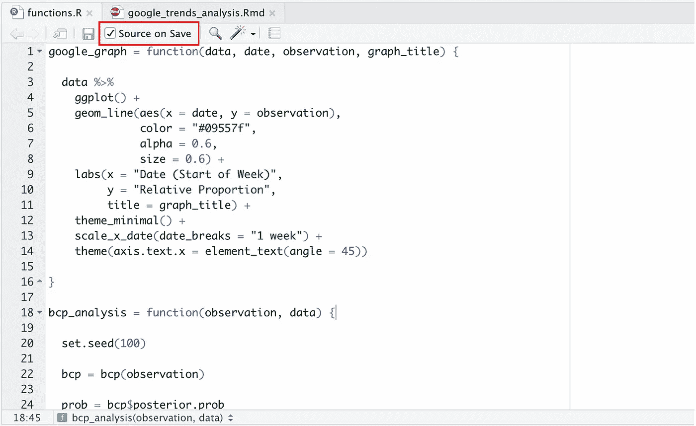
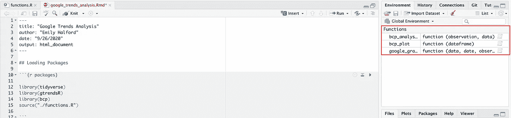
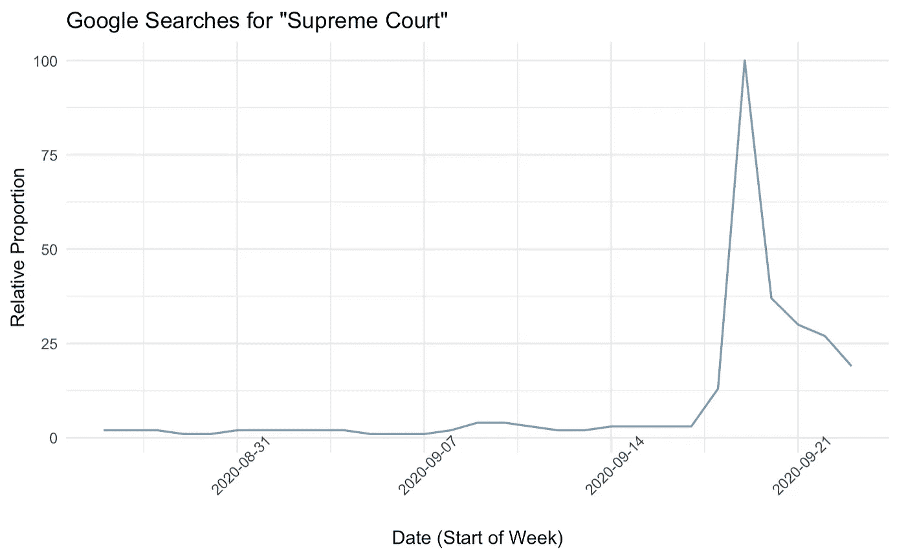
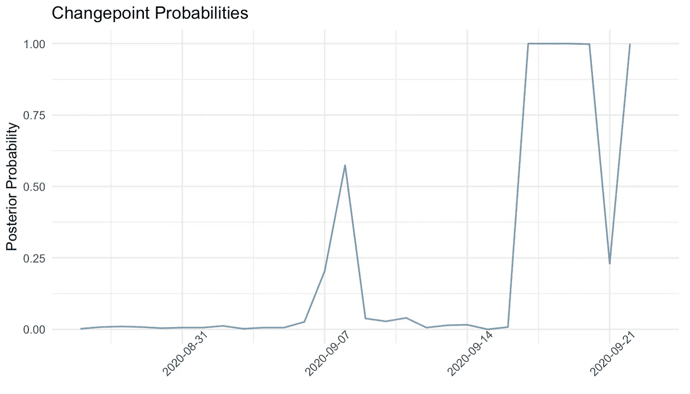

# 从 R 脚本调用函数的 5 分钟指南

> 原文：<https://towardsdatascience.com/5-minute-guide-to-calling-functions-from-r-scripts-41c4a09db1eb?source=collection_archive---------23----------------------->

## 使用谷歌趋势数据的 r 代码教程。


照片由来自[佩克斯](https://www.pexels.com/photo/photography-of-person-typing-1181675/?utm_content=attributionCopyText&utm_medium=referral&utm_source=pexels)的[克里斯蒂娜·莫里洛](https://www.pexels.com/@divinetechygirl?utm_content=attributionCopyText&utm_medium=referral&utm_source=pexels)拍摄

你可能听说过流行的指导方针，如果你发现自己复制和粘贴代码超过 3 次，你应该把它写成一个函数。虽然您可以在 R Markdown 文件的顶部编写和存储这些函数，但是如果您最终将这些函数复制并粘贴到多个文件中，这种方法可能会变得混乱，而且会适得其反。通常，保持条理的最好方法是在脚本中编写函数，并在需要时从任何附加文件中调用它们。

为了演示这个过程，我将使用 3 个函数对过去一个月中包含“supreme court”的 Google 搜索进行一个非常简单的变化点分析。

# **首先，创建你的函数**

在 R 脚本中，我们编写了三个简单的函数。第一个绘制 Google 趋势数据，第二个使用“bcp”包中的 bcp()函数执行简单的变化点分析，第三个绘制分析结果。

```
google_graph = function(data, date, observation, graph_title) {

  data %>% 
    ggplot() +
    geom_line(aes(x = date, y = observation), 
              color = "#09557f",
              alpha = 0.6,
              size = 0.6) +
    labs(x = "Date (Start of Week)", 
         y = "Relative Proportion",
         title = graph_title) +
    theme_minimal() +
    scale_x_date(date_breaks = "1 week") +
    theme(axis.text.x = element_text(angle = 45))

}bcp_analysis = function(observation, data) {

  set.seed(100)

  bcp = bcp(observation)

  prob = bcp$posterior.prob
  prob = as.data.frame(prob) 

  bcp_dataframe = cbind(data, prob) %>% 
    select(date, prob)

}bcp_plot = function(dataframe){

  dataframe %>% 
    ggplot() +
    geom_line(aes(x = date, y = prob),
              color = "#09557f",
              alpha = 0.6,
              size = 0.6) +
    labs(x = "",
         y = "Posterior Probability",
         title = "Changepoint Probabilities") +
    theme_minimal() +
    ylim(0, 1) +
    scale_x_date(date_breaks = "1 week") +
    theme(axis.text.x = element_text(angle = 45))

}
```

我还选中了“保存源”框。如果您选中此框，那么当您在脚本中保存对函数的更改时，该文件将自动来源于全局环境。



# 连接到您的功能

从 R Markdown 文件连接到脚本中存储的函数与连接到包中存储的函数非常相似。我们不使用 library()语句，而是使用 source()语句并指明脚本的路径名。在这种情况下，我们使用以下代码:

```
source("./functions.R")
```

当我们运行这行代码时，脚本中包含的函数会自动出现在全局环境中。连接成功！



# 使用你的功能

首先，我们将使用“gtrendsR”包中的 gtrends()函数来获取过去一个月中包含美国“supreme court”字样的 Google 搜索量。mutate 步骤还用于将“date”变量转换为日期格式:

```
data = gtrends(keyword = "supreme court", geo = "US", 
               time = "today 1-m")$interest_over_time %>% 
  mutate(date = as.Date(date))
```

现在我们有数据可以在函数中使用了！我们使用 google_graph()函数的方式与使用任何其他函数的方式相同，这使我们可以轻松地绘制数据:

```
google_graph(data, data$date, data$hits, ‘Google Searches for “Supreme Court”’)
```



剧情看起来不错！不出所料，在最高法院大法官鲁斯·巴德·金斯伯格去世后，包含“最高法院”的搜索量激增。让我们使用 bcp_analysis()和 bcp_plot()函数来查看这个峰值是否代表这个时间序列对象中的一个重大变化点。同样，我们使用函数的方式与使用已加载包中的函数的方式相同:

```
bcp_dataframe = bcp_analysis(data$hits, data)bcp_plot(bcp_dataframe)
```



鲁斯·巴德·金斯伯格死后几天的后验概率为 1.00，这表明包含“最高法院”的搜索可能在这段时间以一种有统计学意义的方式发生了变化。

就这么简单！如果我们想要在单独的 Rmd 文件中绘制和分析几个不同的数据源，那么用 source()语句将这些文件连接到我们的“functions”脚本并使用我们的函数就很容易了。