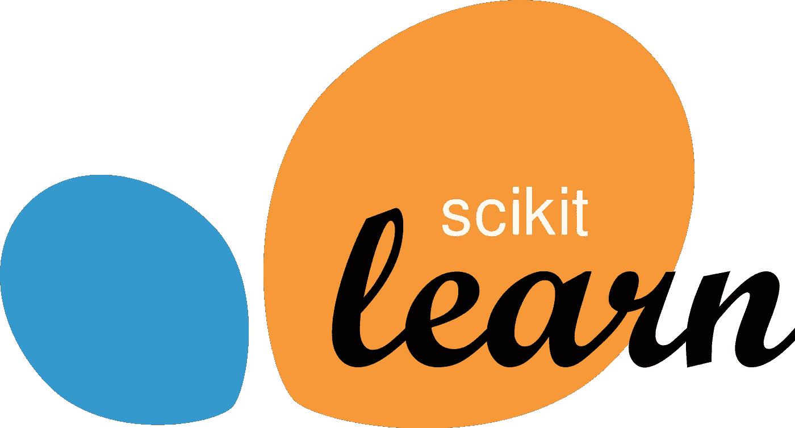
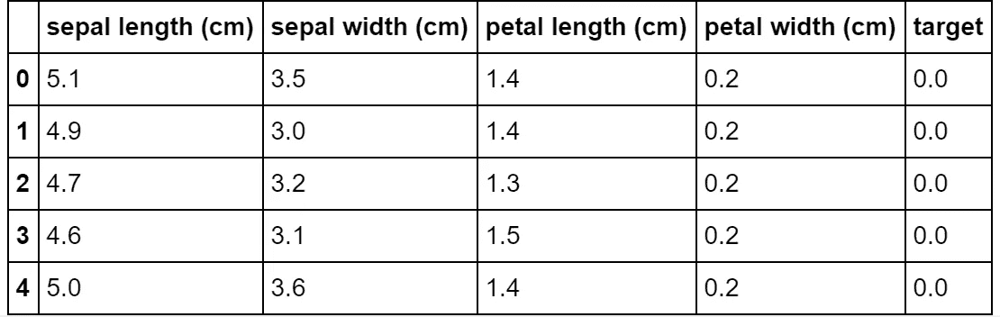
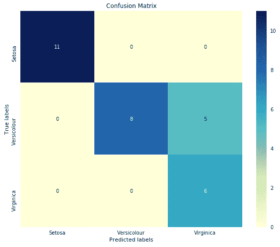

# 利用 Scikit-learn 进行 5 分钟的模型开发概述

> 原文：<https://towardsdatascience.com/5-minute-rundown-of-scikit-learn-for-complete-beginners-c7dc06a5ca17?source=collection_archive---------47----------------------->

## 在 5 分钟内训练一个玩具模型。

最近， [Edward Qian](https://medium.com/u/9ab35c11801?source=post_page-----c7dc06a5ca17--------------------------------) 和我做了一个为初学者介绍数据科学基础知识的网站(查看一下—[T8)。scikit-learn 的初级读本可以在网站上找到，还有其他数据科学资源和实践问题。](http://www.dscrashcourse.com)

我们想通过使用[著名的虹膜数据集](https://en.wikipedia.org/wiki/Iris_flower_data_set)作为例子来展示*使用 scikit-learn 训练玩具模型是多么容易。*

scikit-learn 通常缩写为`sklearn`，是 Python 的机器学习库。除了用于特征工程、特征和模型选择的工具之外，它还支持跨多种算法的模型开发。

本演示的目的是展示 scikit-learn 特性，而不考虑在如此小的数据集上的实用性。所有代码都是 Python 3。

# 加载虹膜数据集

我们将使用数据集模块来加载 Iris 数据集。我们还可以使用`pandas`库和`numpy`库将数据转换成数据帧，以便于预处理。

数据集模块还提供了关于数据集的简短描述:

> *…数据集包含 3 类，每类 50 个实例，每类涉及一种鸢尾植物。一个类与另一个类是线性可分的；后者彼此不是线性可分的。*

我们可以使用`data.head()`来预览前 5 行:

*目标*列代表鸢尾的亚种。

*   类 0 是 *Setosa*
*   第一类是*云芝*
*   二班是*海滨*

# 使用 train_test_split 对数据集进行分区

我们应该总是保留一部分数据用于测试。永远不要在开发模型的同一数据上测试你的模型。这被称为**数据泄漏**，它导致**过拟合**，这高估了模型在后续观测中的性能。

模型选择模块有几个用于分割数据集和超参数调整的有用功能。我们将使用`sklearn.model_selection.train_test_split`将我们的数据集随机划分为一个训练集和一个测试集。

# 特征选择

我们如何知道我们想要在我们的模型中使用哪些特性？我们如何从噪音中区分相关的预测因素？这很大程度上归结于领域知识，但这也是一个可以通过特征选择技术自动化的过程。Scikit-learn 有一个专门的模块。

我们将使用`SelectKbest`功能来选择顶部的 *k* 显著特征。通过将 *k* 设置为我们可用的相同数量的特征，我们可以使用这些输出来量化每个特征的相关性。分类的 [F 检验值](https://en.wikipedia.org/wiki/F-test)将用作评分函数。

F 值分数表明花瓣尺寸比萼片尺寸更能预测。

*   萼片长度(厘米):95
*   萼片宽度(厘米):35
*   花瓣长度(厘米):925
*   花瓣宽度(厘米):725

这些分数很难单独解读。我们需要查看它们对应的 p 值，以确定它们对目标变量的影响的统计显著性。

我们可以从`feature_selection.pvalues_`获得 pvalues

如果零假设为真，并且如果我们多次重复相同的实验，p 值表示更多“极端”观察的百分比。这里的零假设是该特征对目标没有影响(即，我们不应该将其用作预测器)。

低 p 值表明我们应该拒绝我们的零假设——换句话说，拒绝特征没有效果的说法。

在这个例子中，我们有非常小的 p 值:2.65205811e-25，8.62129460e-13，1.97685433e-72，1.15999788e-66。我们绝对应该在模型中保留所有 4 个变量。

# 训练分类器

我们所要做的就是实例化分类器并调用 *fit* 方法在训练集上训练它。

这里有一个逻辑回归的例子。逻辑回归的`predict`方法返回预测的类。`predict_proba`方法返回每个类的概率分数。

有关逻辑回归算法的更多详细信息，请单击此处的。

# 评估绩效

在我们训练了我们的模型之后，我们想要评估它的性能。这可以帮助我们在候选模型之间进行选择，并将模型期望传达给涉众。Scikit-learn 的度量模块可以帮助我们做到这一点。

首先，我们使用模型来预测测试集的标签。然后，我们将预测标签与真实标签进行比较，以确定性能。

我们模型的准确率在 83%左右。混淆矩阵显示了正确和错误分类的细目分类。该模型非常善于识别 Setosa，但在区分其他两类时有困难。

这就是你所拥有的——一个使用 scikit-learn 的一些核心功能在不到 5 分钟的时间内训练出来的玩具模型。

所有代码都在一个地方:

# 感谢您的阅读！

如果你喜欢这篇文章，你可能想看看我关于数据科学、数学和编程的其他文章。[通过 Medium](https://medium.com/@mandygu) 关注我的最新动态！

我还在建立一套全面的**免费**数据科学课程。来看看:【www.dscrashcourse.com 