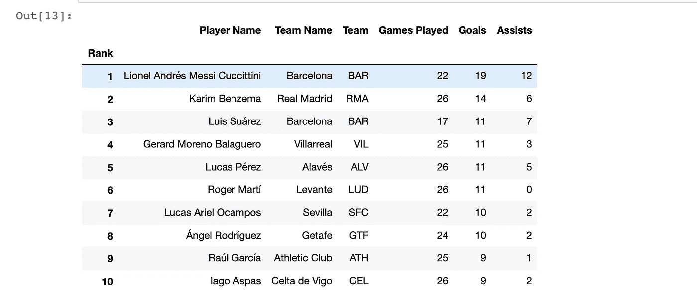

# 使用 Python 和美汤进行 5 分钟的网页抓取

> 原文：<https://towardsdatascience.com/5-minutes-of-web-scraping-using-python-and-beautiful-soup-98e6fbce9cc7?source=collection_archive---------56----------------------->

## 用 Python 和美汤刮西甲统计


埃米尔·佩龙——[Unsplash](http://www.unsplash.com)的照片

E 从网站上提取数据可以节省大量的时间和精力。感谢美汤，刮网之路变得更加顺畅。在这篇文章中，我们将使用 Python 从一个网站上收集西甲 2019–20 的统计数据。

**导入库**

```
import pandas as pd
import requests as rq
from bs4 import BeautifulSoup
```

首先，必须导入所有有用的库。我已经导入了熊猫来存储数据框中的统计数据。导入 Requests 库是为了向 HTTP 服务器发送请求，同时引入漂亮的 Soup 用于 web 元素检索。

**与网页通信**

```
get_url = rq.get("https://www.msn.com/en-us/sports/soccer/la-liga/player-stats")

get_text = get_url.text

soup = BeautifulSoup(get_text, "html.parser")
```

我们必须获得目标 URL，然后使用漂亮的 Soup 库解析它。一旦创建了汤对象，就可以开始了。

**提取网页元素**

```
rank = [i.text for i in soup.findAll('td', {
    "class" : "hide1 rankvalue"
})]

player_name = [i.text
               for i in soup.findAll('td', {
        "class" : "playername"
    })
               ]

team_name = [i.text
             for i in soup.findAll('td', {
        "class" : "teamname"
    })
             ]

team_la = [i.text
           for i in soup.findAll('td', {
        "class" : "teamtla"
    })
           ]

games_played = [int(i.findAll('td')[4].text) for i in soup.findAll('tr', {
    "class" : "rowlink"
})]

goals_scored = [int(i.findAll('td')[7].text) for i in soup.findAll('tr', {
    "class" : "rowlink"
})]

assists = [int(i.findAll('td')[8].text) for i in soup.findAll('tr', {
    "class" : "rowlink"
})]
```

使用漂亮的 Soup 方法，您可以访问 web 元素及其项目。我主要使用了*“find all”*方法，将“class”作为一个参数来获取所有项目的列表。

**存储在数据帧中**

```
laliga_stats = pd.DataFrame({

    "Rank" : rank,

    "Player Name" : player_name,

    "Team Name" : team_name,

    "Team" : team_la,

    "Games Played" : games_played,

    "Goals" : goals_scored,

    "Assists" : assists
    })
laliga_stats.set_index('Rank',inplace=True)
```

最后，使用 Pandas 库将数据存储到数据框中。并且，你可以进行你的分析了。

你只要写一行代码，就能获得 2019-20 西甲赛季的前 10 名射手:

```
laliga_stats[0 :10]
```



2019-20 赛季西甲十大射手

所有需要的是 Python 和美丽的汤的奇迹刮一个网站。所以，在一个新的标签上打开 Beautiful Soup 的文档，开始刮吧。

如需反馈和讨论，请在 [Linkedin](http://linkedin.com/in/vishal-sharma-239965140) 联系我！