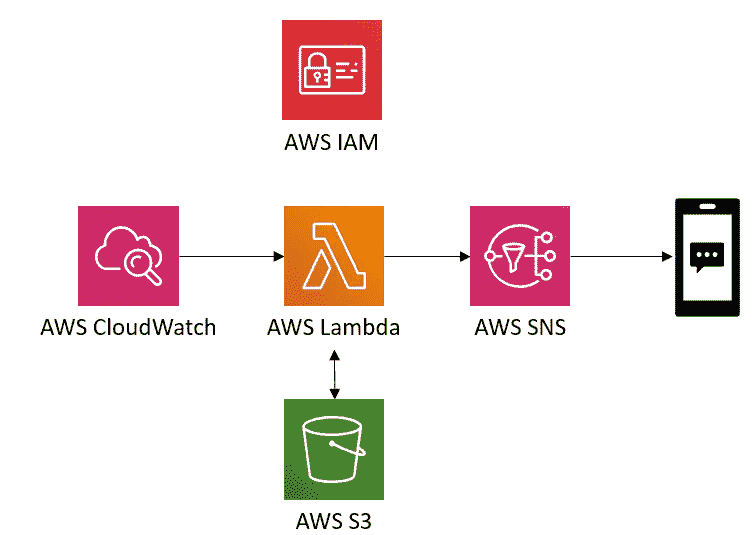
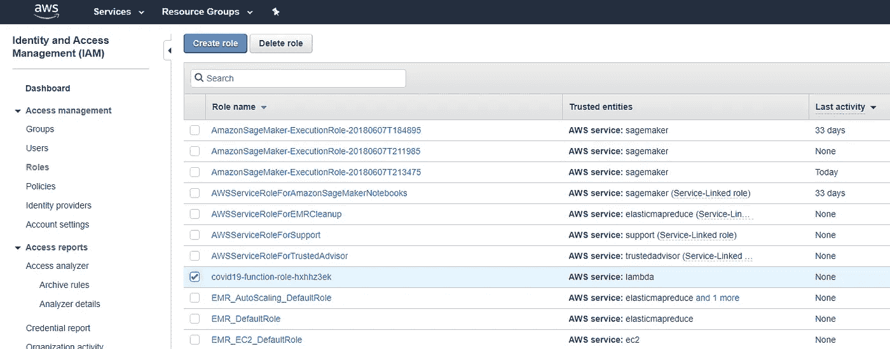
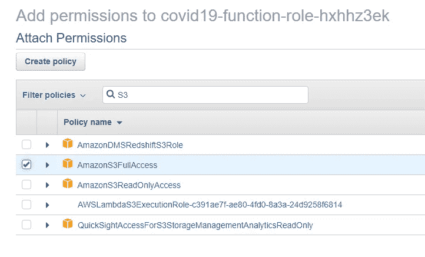
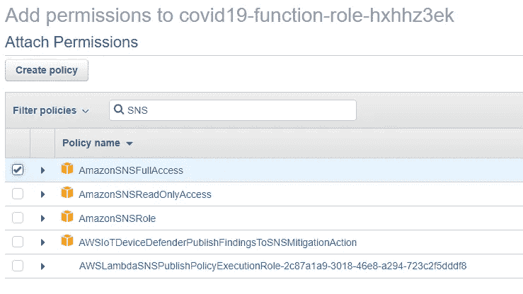
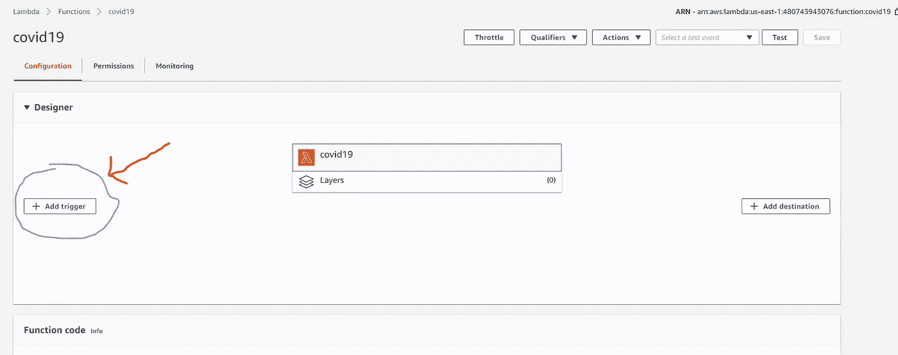
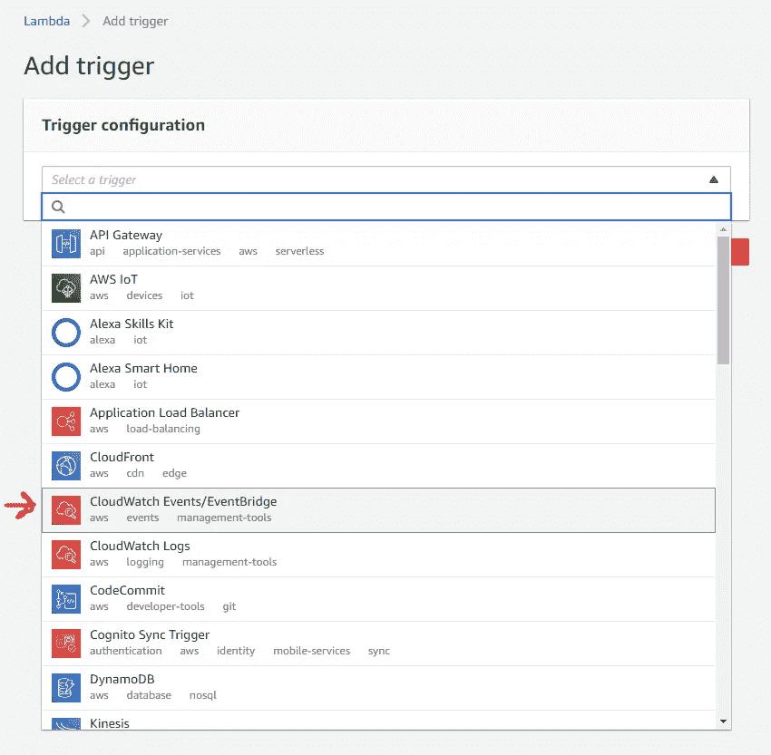

# 5 分钟创建一个 AWS Lambda 函数，以保持对您所在地区的新冠肺炎的更新

> 原文：<https://towardsdatascience.com/5-minutes-to-create-an-aws-lambda-function-to-stay-updated-about-covid-19-in-your-area-88a4abe77a04?source=collection_archive---------16----------------------->

## 几个简单的步骤，确保您始终拥有最新的信息

以下是如何利用 AWS 在当地政府更新新冠肺炎信息时给自己发短信的方法。我们将使用这些 AWS 资源:



*注意:我将使用 AWS web 控制台来完成这些步骤，但您也可以使用 boto3 和 Cloud Formation 等工具。*

# 步骤 1:创建一个 S3 存储桶

我们将创建一个 S3 存储桶来保存我们想要监控的当前网页的副本。这样，每当 lambda 函数查看网页的当前版本时，我们就可以将其与以前的版本进行比较。

如果您使用的是 web 控制台:

*   导航至 [S3 仪表盘](https://s3.console.aws.amazon.com/s3/home)
*   点击“创建存储桶”
*   输入存储桶名称。我用了`covid-bucket`(记住你用的名字)
*   继续点击“下一步”接受默认设置

现在从你的电脑上传一个文本文件。我给我的取名`current_webpage.txt`。它可以是一个空的文本文件，很快就会被覆盖。

*注意:确保它是一个* `**.txt*` *文件。并记住这个文件名以备后用。*

# 步骤 2:创建一个 Lambda 函数

*注意:在 SNS 支持的* [*这些区域*](https://docs.aws.amazon.com/sns/latest/dg/sns-supported-regions-countries.html) *中的一个进行。*

对于此步骤，请确保您拥有以下信息:

*   当地政府用来发布新信息的网站。(我住在明尼苏达州，所以我用的是卫生部的网页
*   您希望向其发送更新的电话号码
*   您刚刚创建的 S3 存储桶和文件名

导航至 [Lambda 仪表盘](https://console.aws.amazon.com/lambda/)并点击“创建功能”。使用“从头开始创作”选项。

给你的函数起一个名字，并选择一个 **Python3 运行时。**现在使用默认权限。

您可以将下面的代码复制并粘贴到控制台的文本编辑器中。确保填写网站 URL、本格式[中的电话号码](https://en.wikipedia.org/wiki/E.164#Numbering_formats)以及 S3 桶名。

```
import boto3
import urllib3# Define URL
url = 'https://PUT_YOUR_URL_HERE.gov/virus-updates'# Set up http request maker thing
http = urllib3.PoolManager()# S3 object to store the last call
bucket_name = 'covid-bucket'
file_name = 'current_webpage.txt'object_s3 = boto3.resource('s3') \
                 .Bucket(bucket_name) \
                 .Object(file_name)# List of phone numbers to send to
phone_numbers = ['+1REDACTED','+1REDACTED']# Connect to AWS Simple Notification Service
sns_client = boto3.client('sns')def lambda_handler(event, context):

    # Ping website
    resp = http.request('GET',url)
    new_page = resp.data

    # read in old results
    old_page = object_s3.get().get('Body').read()

    if new_page == old_page:
        print("No new updates.")
    else:
        print("-- New Update --")

        # Loop through phone numbers
        for cell_phone_number in phone_numbers:
            try:
                # Try to send a text message
                sns_client.publish(
                    PhoneNumber=cell_phone_number,
                    Message= f'Local COVID19 Update: {url}',
                )
                print(f"Successfuly sent to {cell_phone_number}")
            except:
                print(f"FAILED TO SEND TO {cell_phone_number}")

        # Write new data to S3
        object_s3.put(Body = new_page)
        print("Successfully wrote new data to S3")

    print("done")
    return None
```

# 步骤 3:更新函数的 IAM 角色

现在我们需要给 lambda 函数以下权限:

*   从我们的 S3 桶中读写
*   使用社交网络发布消息

导航到 [IAM 仪表板](https://console.aws.amazon.com/iam/home#/roles)，点击侧边栏上的**角色**。

找到为您的职能创建的角色。命名约定将包括你的 lambda 函数的名字`<function name>-role-******`。



单击“附加策略”

搜索“ *S3* 和“*社交网络*”，并添加**完全访问**策略。



点击**附加策略**

# 步骤 4:添加一个调度程序来调用 Lambda 函数

回到 web 控制台中的 lambda function dashboard，然后单击“添加触发器”。然后选择“云观察事件”



用“规则”下拉菜单:

*   选择“创建新规则”
*   输入规则名称和描述
*   为“规则类型”选择*调度表达式*
*   在“计划表达式”文本字段中输入`rate(5 minutes)`
*   点击“添加”

# 结论

运行这个应用程序应该会让您保持在这些 AWS 服务的**自由层**(这不是一个保证)。

您可以通过在 web 控制台中单击 lambda 函数配置屏幕顶部的“test”按钮来创建和运行测试。这个测试的输入是什么并不重要，因为输入并不用于 lambda 函数代码中。

或者你可以等 5 分钟，看看是否收到短信。

感谢阅读。注意安全。访问疾病预防控制中心网站获取更多关于新冠肺炎的信息。