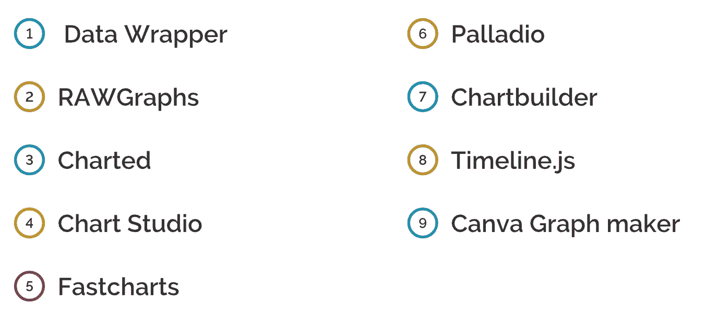
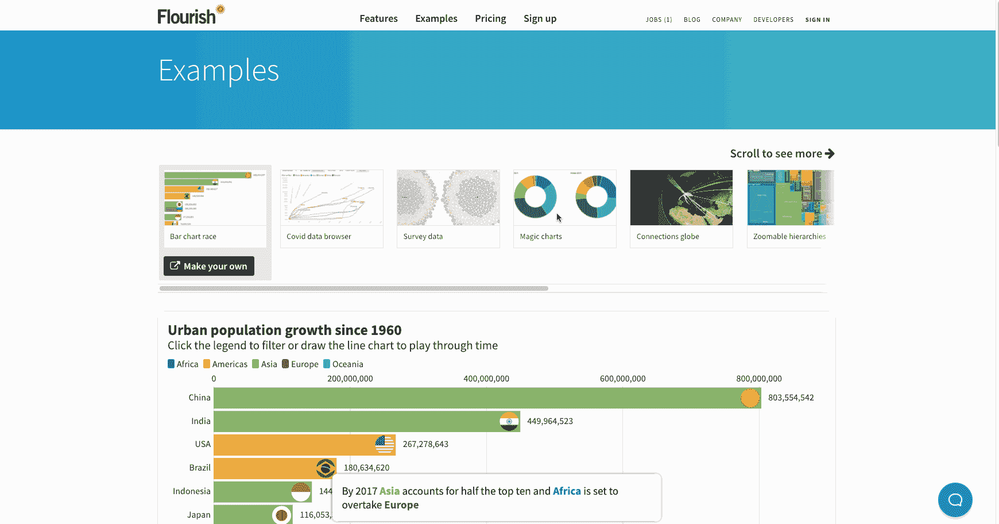
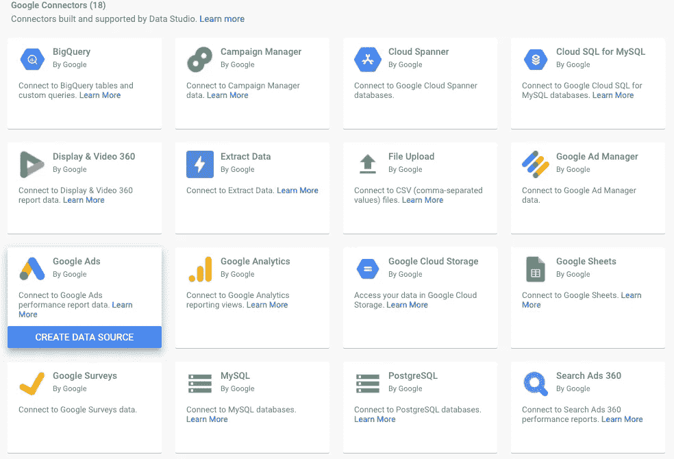
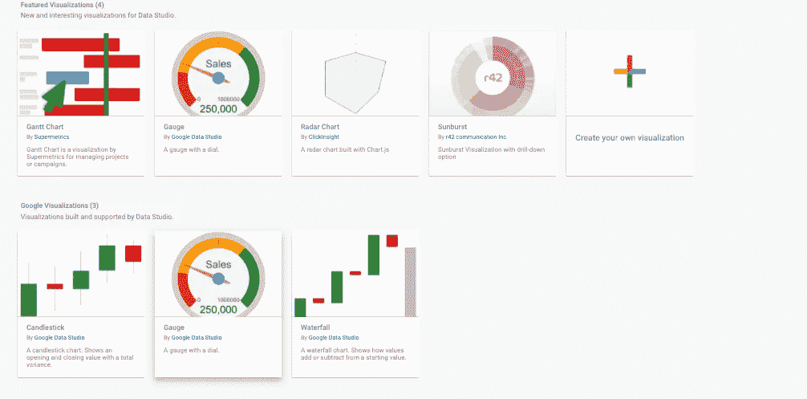

# 5“更多”开源工具，轻松开始数据可视化。

> 原文：<https://towardsdatascience.com/5-more-open-source-tools-to-get-started-with-data-visualisation-a03373972f81?source=collection_archive---------18----------------------->

## 数据可视化并不一定困难或昂贵。

里卡多·戈麦斯·安吉尔在 [Unsplash](https://unsplash.com?utm_source=medium&utm_medium=referral) 上的照片

想知道为什么这篇文章的标题有“更多”而不是“ *5 个开源工具来开始数据可视化*”？原因是这是我不久前写的一篇关于同一主题的文章的延伸👇

 [## 10 个免费工具，让您轻松、快速地开始数据可视化。

### 使用这些简单直观的工具，直接进入数据可视化流程。

towardsdatascience.com](/10-free-tools-to-instantly-get-started-with-data-visualisation-d7fadb5f6dce) 

在上面的文章中，我写了一些开源工具，它们可以让初学者立即开始构建漂亮的视觉效果。本文中包括的工具有:

[11 个免费工具让您立即轻松开始数据可视化&。](/10-free-tools-to-instantly-get-started-with-data-visualisation-d7fadb5f6dce)

本文建立在上一篇文章的基础上，包含了更多的开源数据可视化工具。这些工具使创建图表和地图变得容易，并把你的想象力放到画布上。

# 1.挥舞

[fruit](https://flourish.studio/)是一个数据可视化工具，也是一个讲述故事的工具。用户无需编写代码，就可以创建交互式的、有吸引力的、移动友好的图形。蓬勃发展的互动模板可以真正使您的数据生活。您可以选择一个模板，然后用您自己的数据替换它。除了其他基本图表，fluore 还提供 3D 地图和赛车条形图，可以将整个讲故事的体验提升到另一个水平。公版绝对免费，非常适合评测或教育使用。

## 使用

来源:[https://flourish.studio/examples/](https://flourish.studio/examples/)

# 2.图表块

[Chart Block](https://www.chartblocks.com/en/) 是一个可视化工具，能够在几分钟内构建漂亮的交互式图表。即使对初学者来说，这也是一个很好的工具，因为它不涉及任何编码。然后可以定制几十种图表类型来满足用户的需求。

生成的图表可以嵌入到任何网站或使用社交媒体工具共享。此外，图表还可以导出为 illustrators 和其他图形包的可编辑矢量图形。图表块包括一个免费的个人计划，这是理想的个人。

## 使用

视频来源:[https://www.chartblocks.com/en/](https://www.chartblocks.com/en/)

# 3.数据工作室

[Data Studio](https://datastudio.google.com/u/0/navigation/reporting) 是谷歌的免费报告和仪表板工具。它使用起来毫不费力，你可以在相当短的时间内上手。因为 Data Studio 完全基于云，所以它是可伸缩的。这也消除了下载它的需要。只要你有一个浏览器，你应该是好的。Data studio 的工具包中有以下产品:

*   **连接到各种数据源**

图片来源:[https://datastudio.google.com/data](https://datastudio.google.com/data)

*   **使用交互式报告和仪表盘快速可视化数据**

图片来源:[https://datastudio.google.com/data](https://datastudio.google.com/visualization)

*   **与他人共享这些报告和仪表板。**

## 使用

视频源:数据工作室

# 4.数据浏览器

[Matthew Renze](https://www.data-explorer.com/)创建的 Data Explorer 是另一个数据可视化工具，它通过简单的用户界面产生强大的可视化效果。这是一款面向所有人的免费开源交互式数据可视化工具。由于 UI 简单，对于初学者来说，入门并进行有效的探索性数据分析极其简单。它的一些显著特点是:

*   能够从 CSV 文件导入数据并自动检测数据类型
*   拖放功能
*   使用交互式导航树浏览您的数据。
*   平移和缩放功能的可用性
*   使用用户友好的交互式过滤器过滤您的数据。
*   最后，共享整个项目或选择感兴趣的数据并复制到其他应用程序中。

## 使用

视频来源:[https://www.data-explorer.com/](https://www.data-explorer.com/)

# 5.数据 GIF 生成器

Data GIF Maker 是比较两个术语的简单工具。最棒的是，你可以直接制作动画 gif，导出来在任何平台上分享。这个工具被有意地保持简约。这并不稀奇，但肯定可以用在演讲或写作中，来创造一个引人入胜的故事。用户可以使用三种模板，即矩形、跑道和圆形。以下是[官方博客](https://blog.google/outreach-initiatives/google-news-initiative/using-data-gif-maker-compare-data-and-tell-stories/)对这款工具的评价:

*我们通常用这个工具来表示竞争搜索兴趣，但它也可以显示你想让它显示的任何东西——投票数、销售额或一个赛季的进球。*

## 使用

作者提供的视频

# 结论

数据可视化是数据科学生态系统的重要组成部分。探索性数据分析有助于提供一些对任何数据分析工作流都至关重要的重要见解。一个好的数据可视化工具有助于保持对数据的关注，而不是工具。本文重点介绍了一些免费的数据可视化工具，它们可以让整个可视化过程变得直观而优雅，同时让数据自己说话。