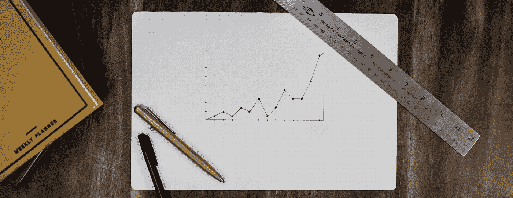
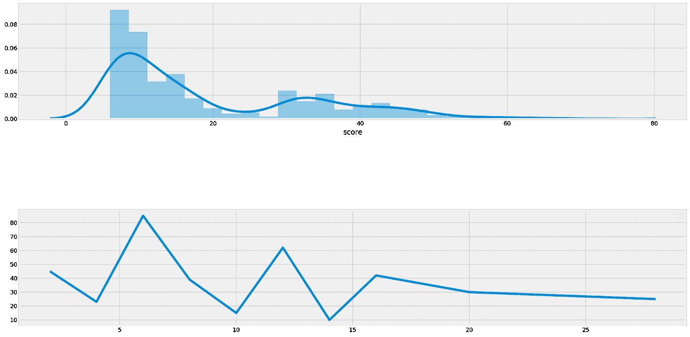

# 5 更好的绘图工具和技术

> 原文：<https://towardsdatascience.com/5-more-tools-and-techniques-for-better-plotting-ee5ecaa358b?source=collection_archive---------27----------------------->



来源:[艾萨克·史密斯](https://unsplash.com/@isaacmsmith)@ unsplash-免费库存图片

## 充分利用您的数据

大约四个月前，我写了第一篇关于绘图的文章( [10 个提高绘图技巧](/10-tips-to-improve-your-plotting-f346fa468d18?source=friends_link&sk=b2f7a584a74badc44d09d5de04fe30d8))。因为，正如我当时所说，在现实生活的数据科学中，绘图确实很重要。

在我的日常生活中，我花在绘制和分析这些图表上的时间比做其他任何事情都多。让我解释一下，我在 Ravelin 技术公司工作。我们的业务是数据，特别是为在线商家分析和预测欺诈。该公司的主要产品结合使用机器学习、网络分析、规则和人类洞察力来预测交易是否可能是欺诈。我们为我们的每一个客户都建立了一个专门的机器学习模型，但这个模型的建立是在与他们建立关系的开始，然后它主要需要维护。

怎么维护？有时是为了引入新功能，或者是因为顾客行为的改变。然而，也可能是我们收到的数据发生了变化。或者可能是因为我们第一次建立模型时没有足够的数据，所以我们最初遗漏了一些东西。也有可能是客户或我们在我们的预测中发现了一些不可靠的表现，例如，在一个特定的国家。无论是哪种情况，通常都会进行广泛的调查，以找出问题所在和/或我们可以做得更好的地方。为了给出更多的上下文，对我们来说，分析一个模型的性能通常意味着拥有数百万行和数千列的数据集。这只能通过绘图来解决。仅仅通过查看数据，几乎不可能找到模式或见解。绘图允许我们比较特性的性能，查看随时间的演变、值的分布、平均值和中值的差异等。等。等。等。

正如我在之前的故事中所说，在我们的领域中，我们必须同等重视可解释性和可解释性的重要性。现实生活中的数据科学永远不会发现你在一个项目中独自工作，你的同事和/或客户通常不太了解你将使用的数据。能够解释你的思维过程是任何数据相关工作的关键部分。这就是为什么复制和粘贴是不够的，图表个性化成为关键。

今天我们将学习 5 种技巧来制作更好的图表，我发现这些技巧在过去很有用。其中一些是日常使用的工具，而另一些你会不时地用到。但是，希望手头有这个故事，在那一刻到来时会派上用场。我们将使用的库包括:

```
import matplotlib.pyplot as pltimport seaborn as sns
```

具有以下样式和配置:

```
plt.style.use(‘fivethirtyeight’)%config InlineBackend.figure_format = ‘retina’%matplotlib inline
```

## 1.更改轴中的范围和步长

matplotlib 或 seaborn 设置范围和步骤的默认配置通常足以可视化数据，但有时我们会希望看到轴中的所有步骤被显式显示。或者，我发现有用的东西是绘制所有数据，但只包括特定范围的 y 轴或 x 轴的轴标签。

例如，假设我们正在绘制模型预测的分布图，我们希望专注于 30 到 50 之间的值，每两个单位一步，同时不忽略其余的值。我们最初的 seabon 的“distplot”应该是这样的:


我们现在有两种选择来实现上面的想法:

```
ax.set_xticks(range(30, 51, 2))ax.xaxis.set_ticks(np.arange(30, 51, 2))
```

在这两种情况下，我们都需要指定起点、终点和步骤。注意终点是如何遵循“小于”的逻辑，而不是“等于或小于”。结果将是下图:


另外，请注意我是如何从“ax”对象调用这两个选项的，因为这是默认设置。当我们创建任何类型的图表时，都会自动创建轴(' ax ')和图形(' fig ')。我们也可以用下面的方法做同样的事情:

```
myplot = sns.distplot(mydata)myplot.set_xticks(range(30,51,2))
```

## 2.旋转刻度

这是一个简单但非常有用的技巧，例如，如果我们处理的是文本标签而不是数字。我们可以通过使用“set_xticklabels”中的“rotation”超参数来做到这一点:

```
ax.set_xticklabels(labels=my_labels, rotation=90)
```

请注意我是如何将“my_labels”传递给“labels”超参数的，因为在使用“xticklabels”时这是强制的。但是，如果你正在绘制一个“distplot ”,你可以简单地传递要显示的数值范围，而对于任何其他图表，你可以传递与你为 x 轴指定的数组完全相同的数组。此外，您可以像这样将这种方法与第一种方法结合起来:

```
range_step = np.arange(30, 51, 2)ax.xaxis.set_ticks(range_step)ax.set_xticklabels(labels=range_step, rotation=90);
```

获得以下结果:


## 3.更改绘图之间的间距

通常情况下，我们会希望同时绘制几个图表来比较它们的结果，将它们可视化，或者可能只是为了节省时间和/或空间。无论如何，我们可以用一种非常简单的方式通过使用“支线剧情”来做到这一点:

```
fig, ax = plt.subplots(figsize=(18,10), nrows=2)
```

我们指定了两行，因此我们将绘制两个图表:

```
sns.distplot(mydata, ax=ax[0])sns.lineplot(x=mydata[‘xaxis’], y=mydata[‘yaxis’], ax=ax[1])
```


现在，有时，不是只有两张图表，我们可能有更多。也许我们需要包括他们所有人的标题。我们可能还有一些带有文本标签的图表，需要旋转它们以提高可读性。在这种情况下，我们可能会在图之间有一些重叠，增加图表之间的空间可以帮助我们更好地可视化它们。

```
plt.subplots_adjust(hspace = 0.8)
```



请注意，图的高度保持不变(在本例中为 10)，但图表之间的空间增加了。如果你想保持你的图表的大小，你必须通过“figsize”超参数来增加你的图形大小。

此外，超参数“hspace”跟随水平空间。如果你在画多列而不是多行，你可以用超参数“vspace”来完成同样的工作。

顺便说一下，如果你想知道如何为你的图表设置标题，你可以在我的[前一篇文章](/10-tips-to-improve-your-plotting-f346fa468d18?source=friends_link&sk=b2f7a584a74badc44d09d5de04fe30d8)中找到这个技巧和其他一些更好的绘图技巧。

> **注意**:就像我上面指定要画两行一样，你也可以指定固定的列数。在这种情况下，图表的索引将遵循双索引逻辑，如 ax=[0，1]。

## 4.定制您的混淆矩阵

不幸的是，这不是深入解释混淆矩阵如何工作或者它有什么用的空间。尽管如此，如果你想了解更多，我总是推荐[这个来自 M. Sunasra 的故事](https://medium.com/thalus-ai/performance-metrics-for-classification-problems-in-machine-learning-part-i-b085d432082b)。

现在，如果你已经熟悉了这个概念，你可能在过去遇到过这样的情况，有时由“sklearn.metrics”库中的“plot_confusion_matrix”创建的默认热图会出现上下方格被截断的情况，如下图所示:


来源:[https://gis.stackexchange.com/](https://gis.stackexchange.com/)

我们可以用一些线条从头开始绘制我们自己的混淆矩阵来解决这个问题。例如:

```
fig = plt.figure(figsize=(12,10))cm = skplt.metrics.confusion_matrix(real_y, pred_y)labels=[0,1,2,3,4]ax = sns.heatmap(cm, annot=True,annot_kws={“size”:12}, fmt=’g’, cmap=”Blues”, xticklabels=labels, yticklabels=labels)bottom, top = ax.get_ylim()ax.set_ylim(bottom + 0.5, top — 0.5)ax.set(ylabel=’True label’)ax.set(xlabel=’Predicted label’)plt.show()
```

我们在这里做的是:

1.  我们创造了一个空的形象。宽于高，因为我们将在热图的右侧添加注释
2.  我们通过‘skplt . metrics . confusion _ matrix’获得混淆矩阵的值
3.  我们根据类别的数量指定了“标签”
4.  我们使用第 2 点中的值创建一个热图，并指定:I)' annots '等于 True，ii) 'annot_kws '用于指定注释的字体大小(在本例中为 12)，iii) 'fmt '用于传递字符串格式代码，iv) 'cmap '用于颜色模式，v)最后我们指定两个轴的标签(在混淆矩阵中，两者是相同的)
5.  我们得到 y 轴视图限制，并再次设置为+- 0.5
6.  最后一步:将 y 和“xlabels”分别设置为真和预测标签

结果应该是这样的:


## 5.绘制累积分布图

当然，我不需要估计绘制累积分布有多有用，无论是为了更好地理解元素百分比达到某个值，还是为了比较我们数据中的两个不同组。

您可以通过 Seaborn 的“distplot”图表本身轻松获得这种图表，只需设置以下内容:

```
sns.distplot(my_data, label=’my label’, color=’red’, hist_kws=dict(cumulative=True))
```


我们可以通过设置 x 轴的界限来使图表看起来更好:

```
sns.distplot(my_data, label=’my label’, color=’red’, hist_kws=dict(cumulative=True)).set(xlim=(0, my_data.max()))
```


正如我在故事开始时所说的，这些工具或技巧中的一些我一直在使用，而另一些只是偶尔使用。但是，希望了解这些快速修复和技术将帮助您做出更好的图，并更好地理解您的数据本身。

最后，别忘了看看我最近的一些文章，比如[*‘分类变量编码:什么，为什么和如何？*](/categorical-variables-encoding-what-why-and-how-5b43af5ceb7f) *或* [官方说法:时间不存在](/its-official-time-doesn-t-exist-8c786530eca1?source=friends_link&sk=65f4f8a97a96efccc3931faef4046595)讲的是如何对待机器学习的数据集中的时间特征。此外，我们离圣诞节已经有点远了，但你可能会喜欢阅读这份 2020 年 [9 本数据科学相关书籍的清单](/9-data-science-related-books-to-ask-santa-for-christmas-37a1036478e9?source=friends_link&sk=089c71e8d8be1977dfe8a1b490501191)。

还有**如果你想直接在你的邮箱里收到我的最新文章，只需** [**订阅我的简讯**](https://gmail.us3.list-manage.com/subscribe?u=8190cded0d5e26657d9bc54d7&id=3e942158a2) **:)**

中号见！