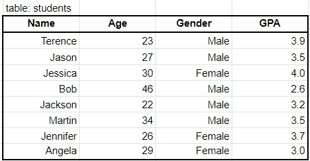
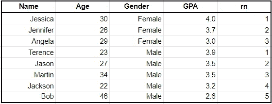
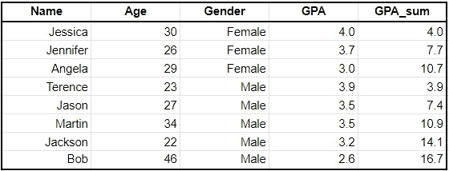
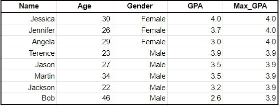
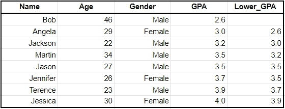
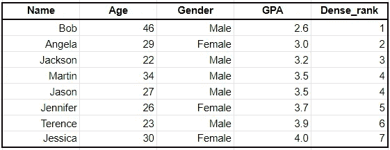

# 你应该知道的 SQL 中最有用的 5 个窗口函数

> 原文：<https://towardsdatascience.com/5-most-useful-window-functions-in-sql-you-should-know-35ea50ecd49e?source=collection_archive---------31----------------------->

## 让您的 SQL 技能更上一层楼


在 [Unsplash](https://unsplash.com/s/photos/window?utm_source=unsplash&utm_medium=referral&utm_content=creditCopyText) 上由 [Fabrizio Verrecchia](https://unsplash.com/@fabrizioverrecchia?utm_source=unsplash&utm_medium=referral&utm_content=creditCopyText) 拍摄的照片

# 介绍

[在我的上一篇文章](/sql-window-analytic-functions-explained-in-4-minutes-6171c6983263)中，我解释了什么是 **SQL 窗口函数**以及如何使用它们。在这篇文章中，我将分享我认为最有用的 5 个窗口(分析)功能。

如果您在工作中与数据打交道，我强烈建议您尝试理解这些(即数据分析师、产品分析师、数据科学家、数据工程师等)。它们肯定会派上用场的！

说到这里，让我们开始吧。

为了帮助您理解这 5 个窗口功能是如何工作的，我将使用下表作为示例:



# 1.行号

**它有什么作用？** ROW_NUMBER 简单地返回每一行的编号，第一条记录从 1 开始。

**什么时候有用？** 当你想得到一个特定表格的第一条或最后一条记录时，行号是非常有用的。例如，如果您有一个客户购买的表，并且您想获得每个客户的第一次购买，您可以按客户(姓名/id)进行分区，并按购买日期进行排序。然后，您可以筛选行数= 1 的表。

**示例:** 使用我上面的示例，假设我想对每一行应用一个行号，按性别并从最高 GPA 到最低 GPA 进行拆分。然后，我可以执行以下查询来获得以下结果:

```
SELECT *,
    ROW_NUMBER() OVER (PARTITION BY Gender ORDER BY GPA DESC) as rn
FROM 
    students
```



请注意，因为按 GPA desc 排序，GPA 最高的女性和男性的行号为 1。

# 2.总和/计数

**它有什么作用？** SUM()和 COUNT()是聚合函数，它们或者对列中的值求和，或者对列中非空的值进行计数。

**什么时候有用？** 通过在窗口函数中使用 SUM()或 COUNT()，可以计算累计总和或累计计数。如果您想要创建显示特定指标(即订单数量、收入等)随时间增长的图表，这将非常有用。

虽然这个例子不一定公正，但它会让你了解它是如何工作的。

```
SELECT *,
    SUM(GPA) OVER (PARTITION BY Gender ORDER BY GPA DESC) as GPA_sum
FROM 
    students
```



请注意 GPA_sum 列是如何计算累积 GPA 的(给定行的 GPA 加上之前所有行的 GPA)。

# 3.最小/最大

它是做什么的？
就像在聚合函数中使用 MIN()/MAX()一样，你也可以在窗口函数中使用它。

**什么时候有用？** 如果你想比较每一行的最高/最低值，最小/最大是有用的。

**例子:** 在下面的例子中，我们可以用这个来比较每个学生的 GPA 与每个性别的最高 GPA。您可以更进一步，创建一个新列来计算两者之间的差异。

```
SELECT *,
    MAX(GPA) OVER (PARTITION BY Gender ORDER BY GPA DESC) as Max_GPA
```



# 4.滞后/领先

**它是做什么的？/什么时候有用？** LEAD()和 LAG()在想要比较前几行或后几行的值时很有用。

**示例:** 假设我想比较每个学生的平均绩点与下一个学生的平均绩点，后者刚好低于他/她的平均绩点。我可以使用 LAG()函数来实现这一点。

```
SELECT *,
    LEAD(GPA) OVER (ORDER BY GPA ASC) as Lower_GPA
FROM
    students
```



请注意，第一行是空的，因为它没有可以引用的前一行。

# 5.稠密秩

**它有什么作用？** DENSE_RANK 类似于 ROW_NUMBER，只是对相等的值返回相同的秩(NUMBER)。

**什么时候有用？当您想要根据一个或多个特定变量对数据进行排序时，DENSE_RANK 非常有用。**

**例如:** 如果我们想将学生的 GPA 从最低到最高排序，我们可以使用下面的代码来实现。

```
SELECT *,
    DENSE_RANK() OVER(ORDER BY GPA ASC) as Dense_rank
```



请注意，Martin 和 Jason 有相同的 GPA，因此，他们的 Dense_rank 都等于 4。

# 感谢阅读！

通过阅读这篇文章，你不仅应该知道什么是窗口函数，还应该很好地掌握它的通用性和功能性。你可以用更多的方式来使用窗口函数，但是这五个绝对是我职业生涯中最有用的！

## 特伦斯·申

*   *查看* [*我的免费数据科学资源*](https://docs.google.com/document/d/1UV6pvCi9du37cYAcKNtuj-2rkCfbt7kBJieYhSRuwHw/edit#heading=h.m63uwvt9w358) *每周都有新素材！*
*   *如果你喜欢这个，* [*在 Medium 上关注我*](https://medium.com/@terenceshin) *了解更多*
*   *让我们连线上*[*LinkedIn*](https://www.linkedin.com/in/terenceshin/)