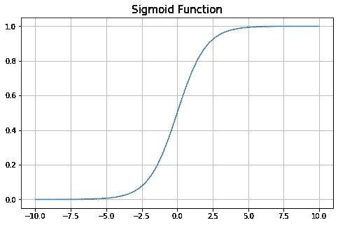
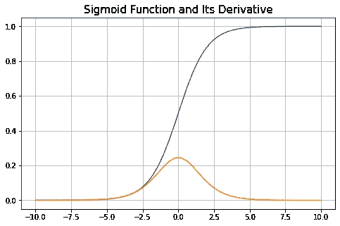
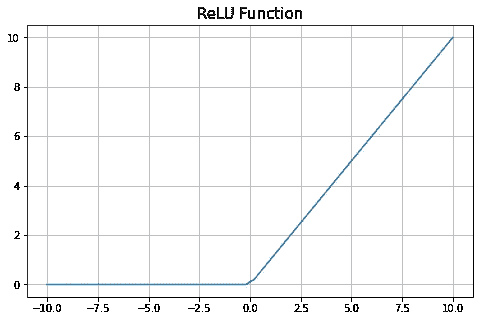
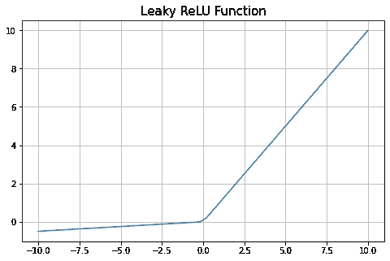
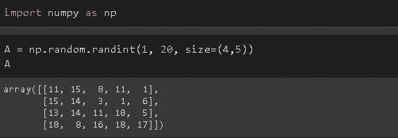
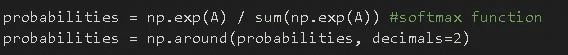
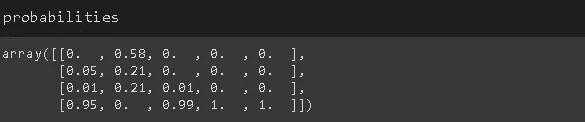

# 神经网络中使用的 5 个必须知道的激活函数

> 原文：<https://towardsdatascience.com/5-must-know-activation-functions-used-in-neural-networks-8c5052757750?source=collection_archive---------31----------------------->

## 非线性的本质

照片由[德鲁·帕特里克·米勒](https://unsplash.com/@drewpatrickmiller?utm_source=unsplash&utm_medium=referral&utm_content=creditCopyText)在 [Unsplash](https://unsplash.com/s/photos/adjust?utm_source=unsplash&utm_medium=referral&utm_content=creditCopyText) 上拍摄

通用逼近定理意味着神经网络可以逼近将输入(X)映射到输出(y)的任何连续函数。表示任何函数的能力是神经网络如此强大和广泛使用的原因。

为了能够逼近任何函数，我们需要非线性。这就是激活功能发挥作用的地方。它们用于向神经网络添加非线性。在没有激活函数的情况下，神经网络可以被认为是线性模型的集合。

神经网络是包含许多节点的层的组合。因此，构建过程从一个节点开始。下面是一个没有激活功能的节点。

没有激活功能的神经元(图片由作者提供)

输出 y 是输入和偏置的线性组合。我们需要以某种方式添加非线性元素。考虑下面的节点结构。

具有激活功能的神经元(图片由作者提供)

非线性是通过将激活函数应用于输入和偏置的线性组合的总和来实现的。增加的非线性取决于激活函数。

在本帖中，我们将讨论神经网络中 5 种常用的激活方式。

# 1.乙状结肠的

sigmoid 函数的取值范围介于 0 和 1 之间。它也用于逻辑回归模型。

(图片由作者提供)

无论 sigmoid 函数的输入值是什么，输出值都将在 0 和 1 之间。因此，每个神经元的输出被标准化为范围 0-1。

(图片由作者提供)

当 x 值接近 0 时，输出(y)对输入(x)的变化更敏感。随着输入值远离零，输出值变得不那么敏感。在某个时间点之后，即使输入值有很大的变化，输出值也几乎没有变化。这就是 sigmoid 函数实现非线性的方式。

这种非线性也有不利的一面。我们先来看 sigmoid 函数的导数。

(图片由作者提供)

当我们远离零时，导数趋向于零。神经网络的“学习”过程取决于导数，因为权重是基于梯度更新的，梯度基本上是函数的导数。如果梯度非常接近零，则以非常小的增量更新权重。这导致神经网络学习速度非常慢，永远无法收敛。这也被称为**消失梯度**问题。

# **2。Tanh(双曲正切)**

它与 sigmoid 非常相似，只是输出值在-1 至+1 范围内。因此，我们说 tanh 是以零为中心的。

(图片由作者提供)

sigmoid 和 tanh 之间的区别在于，对于 tanh，梯度并不局限于在一个方向上移动。因此，双曲正切函数可能比 sigmoid 函数收敛得更快。

双曲正切激活函数也存在消失梯度问题。

# 3.整流线性单位

relu 函数只对正值感兴趣。它保持输入值大于 0。所有小于零的输入值都变成 0。

(图片由作者提供)

神经元的输出值可以设置为小于 0。如果我们将 relu 函数应用于该神经元的输出，则从该神经元返回的所有值都变成 0。因此，relu 允许抵消一些神经元。

我们能够用 relu 函数仅激活一些神经元，而用 tanh 和 sigmoid 激活所有神经元，这导致了密集的计算。因此，relu 比 tanh 和 sigmoid 收敛得更快。

对于小于 0 的输入值，relu 的导数为 0。对于这些值，权重在反向传播期间从不更新，因此神经网络无法学习。这个问题被称为**将死再禄**问题。

# 4.泄漏 ReLU

它可以被认为是对垂死的 relu 问题的解决方案。漏 relu 为负输入输出一个小值。

(图片由作者提供)

尽管 leaky relu 似乎正在解决垂死的 relu 问题，但一些人认为在大多数情况下准确性没有显著差异。我想这可以归结为尝试两者，看看对于一个特定的任务是否有什么不同。

# **5。Softmax**

Softmax 通常用于多类分类任务，并应用于输出神经元。它所做的是将输出值归一化为概率分布，使概率值加起来等于 1。

Softmax 函数将每个输出的指数除以所有输出的指数之和。结果值形成一个概率分布，其概率总和为 1。

我们来做一个例子。考虑目标变量有 4 个类的情况。以下是 5 个不同数据点(即观察值)的神经网络输出。

每一列代表一个观察的输出(图片由作者提供)

我们可以将 softmax 函数应用于这些输出，如下所示:

(图片由作者提供)

在第一行中，我们将 softmax 函数应用于矩阵 a 中的值。第二行将浮点精度降低到 2 位小数。

这是 softmax 函数的输出。

(图片由作者提供)

如您所见，每列中的概率值加起来为 1。

# **结论**

我们已经讨论了神经网络中使用的 5 种不同的激活函数。为了增加非线性，必须在神经网络中使用激活函数。

天下没有免费的午餐！就计算复杂性而言，激活函数也给神经网络带来负担。它们也对模型的收敛有影响。

了解激活函数的属性以及它们的行为方式非常重要，这样我们就可以选择最适合特定任务的激活函数。

通常，激活函数的期望属性是:

*   计算成本低
*   零居中
*   可微的。激活函数的导数需要携带关于输入值的信息，因为权重是基于梯度更新的。
*   不会导致消失梯度问题

感谢您的阅读。如果您有任何反馈，请告诉我。