# 通过 Prince 的 5 个必须知道的降维技术

> 原文：<https://towardsdatascience.com/5-must-know-dimensionality-reduction-techniques-via-prince-e6ffb27e55d1?source=collection_archive---------4----------------------->

## 减少功能对您的数据科学项目有好处


Alexander Schimmeck 在 [Unsplash](https://unsplash.com?utm_source=medium&utm_medium=referral) 上的照片

答根据[维基百科](https://en.wikipedia.org/wiki/Dimensionality_reduction)的说法，降维是将高维空间数据转换到低维空间。

换句话说，降维将数据从大量特征转换成少量特征。**我们先说从一百个特性变成两个特性。**

但是我们为什么需要降维呢？如果我们的机器学习模型有许多功能，这不是很好吗？嗯，技术上来说是的，但只是到某一点。更多的特性可能会增加你的度量，但它会在某个地方达到峰值，然后下降。

此外，当我们拥有太多功能时，会出现一些问题，包括:

*   **较高数量的特征会增加数据的方差，这可能会导致过度拟合—** 尤其是在观察数量少于现有特征数量的情况下。
*   **数据**之间的密度**和**距离**变得不那么有意义**，这意味着**数据之间的距离是等距的或者是相同的相似/不同的**。这影响了**聚类**和**异常值检测**，因为数据中的关键信息被低估了。
*   **组合爆炸**或**大量值**会导致**计算上难以处理的**问题，这个过程需要太长时间才能完成。

和其他一些问题，但你明白了。**太多功能没用。这就是为什么我们需要降维技术。**

你可以认为降维技术是建模之前的一个中间步骤；无论你的目标是聚类还是预测。您是否只想看到隐藏的潜在变化或使用结果作为另一个特征是您的自由裁量权。

说到结果，所有这些 **降维技术的**结果都是奇异值分解或者 SVD** 。这个术语在这篇文章中可以找到。我不会在这里过多讨论，因为 SVD 只是把矩阵分解作为一个过程来处理，而不是主要的焦点。**

**头脑:知识和商业理解永远胜过任何一种技术**。尽管降维的目的是在特征空间中找到相关性，但是具有许多相关特征比变换不那么相关的特征更好。

很少有 Python 包来处理降维问题；一个例子是[王子](https://github.com/MaxHalford/Prince)套餐。在本文中，我将概述 prince 包中可用的五种降维技术。

# 维度缩减技术

王子包标榜自己是 Python [因子分析](https://www.wikiwand.com/en/Factor_analysis)库。虽然不是所有的维度技术都是因子分析方法，但有些是相关的。这就是为什么王子包，包括技术，也与因素分析。

prince 包可用于降维的技术有:

*   [**主成分分析** (PCA)](https://arxiv.org/pdf/1404.1100.pdf)
*   [**对应分析** (CA)](http://statmath.wu.ac.at/courses/CAandRelMeth/caipA.pdf)
*   [**多重对应分析** (MCA)](https://core.ac.uk/download/pdf/6591520.pdf)
*   [**多因素分析** (MFA)](https://www.utdallas.edu/~herve/Abdi-MFA2007-pretty.pdf)
*   [**混合数据的因子分析** (FAMD)](https://github.com/MaxHalford/Prince#factor-analysis-of-mixed-data-famd)

在本文中，我不会详细解释每种技术的理论，因为我计划创建一篇关于它的更详细的文章。相反，我将给出这些技术的一个简短概述，以及您应该在什么时候将它与示例一起应用。

何时使用该技术取决于特性，下面是根据 prince 包何时应用该技术的总结表。

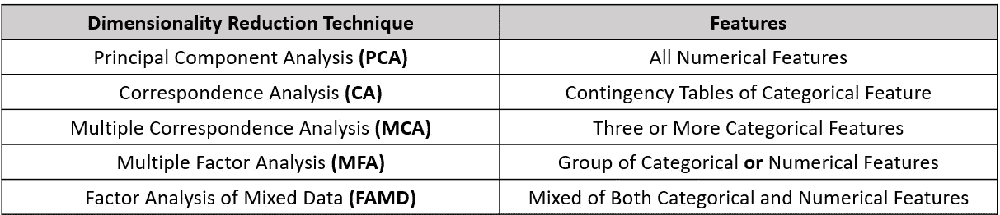

作者创建的表格

关于 prince 的一些注意事项是，prince 包使用了奇异值分解的随机版本(SVD )。这比使用更普遍的完全方法要快得多，但是结果可能包含很小的内在随机性。大多数时候，你不需要担心，但是**如果你想要可重复的结果，那么你应该设置** `**random_state**` **参数**。

SVD 的随机化版本是一种迭代方法，Prince 的每种应用 SVD 的算法都拥有一个`n_iter`参数，该参数控制用于计算 SVD 的迭代次数。一般来说，该算法收敛非常快，因此建议**使用较低的** `**n_iter**` **，尽管较高的数值可以给出更精确的结果，但计算时间较长**。

现在，在我们开始之前，让我们先安装软件包。

```
pip install prince
```

## 1.主成分分析

我认为主成分分析是降维概念中介绍最多和教科书式的模型。PCA 是现代数据分析中的标准工具，因为它是一种简单的非参数方法，用于从混乱的数据集中提取相关信息。

主成分分析旨在减少复杂的信息，并提供隐藏在高维数据下的简化结构。PCA **的主要优势在于计算每个维度对描述数据集可变性的重要性。**例如，六个维度的数据可能在一个维度上存在大部分变异。如果你想了解更多关于 PCA 及其局限性的信息，你可以在这里阅读教程论文。

那么，我们什么时候用 PCA 来降维呢？根据 prince 准则，当所有尺寸都是数值(全数值特征)时为**。让我们用数据集示例来尝试一下。**

```
#Importing the necessary packageimport pandas as pd
import seaborn as sns
from prince import PCA#Dataset preparation with only numerical featuresmpg = sns.load_dataset('mpg')mpg.dropna(inplace=True)
mpg_test = mpg.drop(['name', 'origin'], axis =1, inplace = True)
mpg_test.head()
```

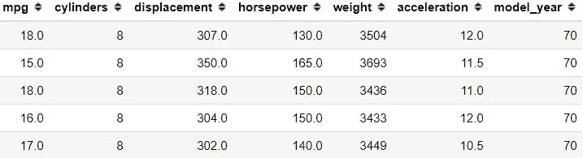

现在我们有了包含所有数字特征的 mpg 数据集。让我们尝试将主成分分析应用到数据集中，以将特征减少为两个主要成分。请注意，您可以设置与输入到模型中的特征数量一样多的主成分。在这种情况下，它是 7，但这意味着根本没有降维。

```
#Setup our PCA, n_components control the number of the dimension
pca =PCA(n_components = 2, n_iter = 3, random_state = 101)Training and transform our data
pca.fit(mpg_test)
mpg_pca = pca.transform(mpg_test)
mpg_pca.head()
```

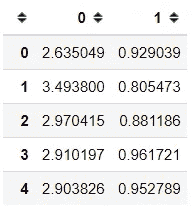

这样，我们将七维数据集缩减为二维(两个 PC)，但是这个二维解释了原始维度的多少变化？

```
pca.explained_inertia_
```

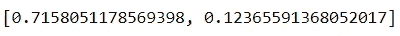

似乎 PC1 解释了大约 71%，PC2 解释了大约 12%，所以我们的二维特征解释了原始维度的大约 83%。那还不算太坏。我们可以试着想象我们的两台电脑以及附加标签。以‘原点’特性为标签来试试吧。

```
ax = pca.plot_row_coordinates(mpg_test, 
     color_labels=mpg['origin'])
```

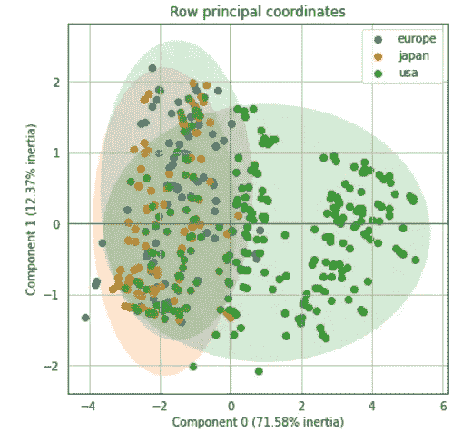

二维特征有助于区分美国和其他国家，尽管欧洲和日本的标签有点困难。

让我们试试 prince 提供的另一种方法 PCA。我们可以获得原始变量和主成分之间的相关性。

```
pca.column_correlations(mpg_test)
```

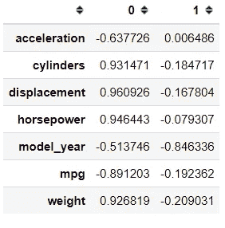

我不确定是哪种相关方法，但我假设是皮尔逊相关。我们还可以知道每个观察值对每个主成分的贡献有多大。

```
pca.row_contributions(mpg_test).head()
```

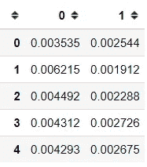

## 2.对应分析

CA 是一种降维技术，传统上应用于**列联表**。它以与 PCA 相似的方式转换数据，其中心结果是 SVD。需要列联表中数据的 CA 的固有属性意味着**更适合将 CA 应用于分类特征**。让我们用一个数据集示例来尝试一下。

```
#Creating Contigency tablesflights = sns.load_dataset('flights')
pivot = flight.pivot_table(values = 'passengers', index ='year' ,columns =  'month' )
```

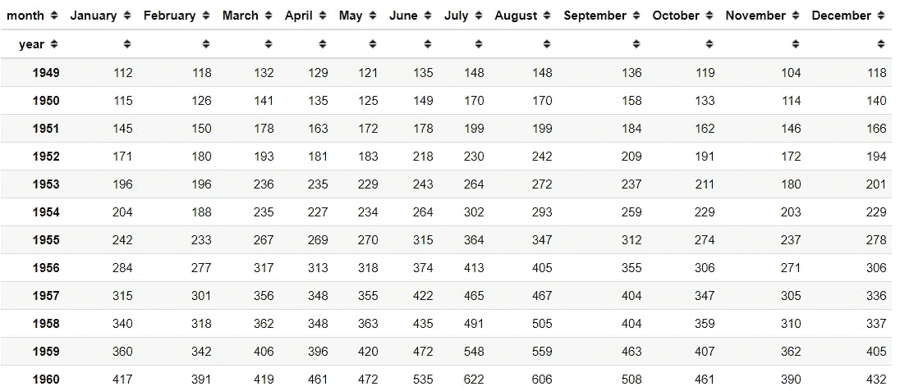

这是我们的飞行数据列联表，我们可以看到这里有如此多的信息。我们将使用 CA 来降低维度，并从中提取额外的洞察力。

```
#Preparing CAfrom prince import CA
ca = CA(n_components=2,n_iter=3,random_state=101 )#Fitting the data
ca.fit(pivot)
```

与 PCA 不同，没有数据转换，所以我们需要从类本身访问结果。让我们尝试获取行值(行坐标)。

```
ca.row_coordinates(pivot)
```

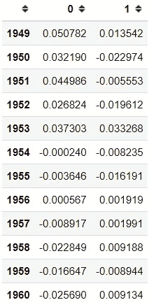

以上是列联表相对于行(在本例中是年)的变动信息。如果您想要从列的角度获得信息，我们也可以用下面的代码来完成。

```
ca.column_coordinates(pivot)
```

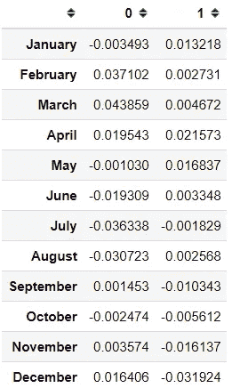

如果你想画出坐标，你可以用下面的代码。

```
ax = ca.plot_coordinates(X = pivot, figsize = (6,6))
```

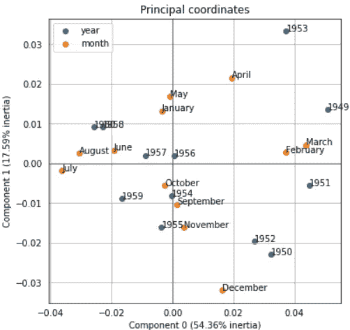

通过绘制坐标，我们可以知道数据实际在哪里。我们可以看到数据倾向于聚集在一起。这就是我们如何从列联表中获得隐藏的洞察力。

另外，您可以使用下面的代码访问 CA 解释的变体。

```
ca.explained_inertia_
```

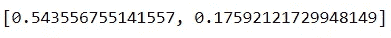

## 3.多重对应分析

**MCA 是 CA 对两个以上分类特征(三个或三个以上)的扩展**。这意味着 MCA 适用于特定的分类特征。MCA 的思想是将 CA 应用到数据集的独热编码版本中。现在让我们尝试使用一个数据集示例。

```
#Dataset preparationtips = sns.load_dataset('tips')
tips.drop(['total_bill', 'tip'], axis =1, inplace = True)
```

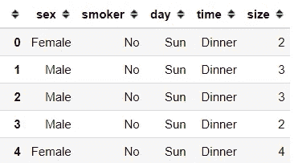

以上是仅包含我们将使用的分类特征的数据集(大小特征被视为分类特征)。让我们尝试将 MCA 应用于数据集。

```
from prince import MCA
mca = MCA(n_components = 2, n_iter = 3, random_state = 101)mca.fit(tips)
tips_mca = mca.transform(tips)
tips_mca.head()
```

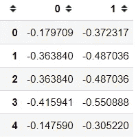

结果类似于 PCA 或 CA 结果，两个主成分以 SVD 结果作为值。就像以前的技术一样，我们可以将坐标绘制成二维图形。

```
mca.plot_coordinates(X = tips)
```

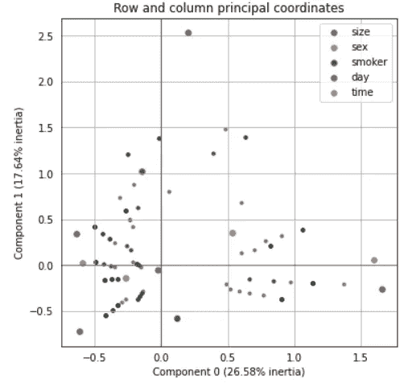

MCA 使用与 CA 相同的方法来获取它的列和行坐标，上面的图总结了这一切。我们可以看到彩色的是列坐标，灰度的是行坐标。我们可以看到似乎有两种数据聚类，左侧和右侧。

最后，您可以使用下面的代码访问模型解释的差异。

```
mca.explained_inertia_
```

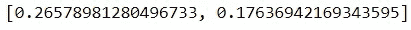

## 4.多因素分析

多因素分析(MFA)寻找所有特征中存在的共同结构。**当您有一组数字或分类特征**时，使用 MFA。这是因为 MFA 用于分析由几个组特征描述的一组观察值。MFA 的主要目标是整合描述相同观测值的不同特征组。

对于数据集示例，我将使用 prince 包中的教程。在教程数据集中，是关于三个专家对六种不同的葡萄酒给出他们的意见。对每种葡萄酒的意见都被记录为一个特征，我们希望在对每种葡萄酒有一个总体了解的同时，考虑每位专家的不同意见。MFA 适用于这种分析。

让我们试着建立数据。

```
X = pd.DataFrame(
data=[
         [1, 6, 7, 2, 5, 7, 6, 3, 6, 7],
         [5, 3, 2, 4, 4, 4, 2, 4, 4, 3],
         [6, 1, 1, 5, 2, 1, 1, 7, 1, 1],
         [7, 1, 2, 7, 2, 1, 2, 2, 2, 2],
         [2, 5, 4, 3, 5, 6, 5, 2, 6, 6],
            [3, 4, 4, 3, 5, 4, 5, 1, 7, 5]
     ],
     columns=['E1 fruity', 'E1 woody', 'E1 coffee',
              'E2 red fruit', 'E2 roasted', 'E2 vanillin', 'E2 woody',
              'E3 fruity', 'E3 butter', 'E3 woody'],
     index=['Wine {}'.format(i+1) for i in range(6)]
)
X['Oak type'] = [1, 2, 2, 2, 1, 1]
```

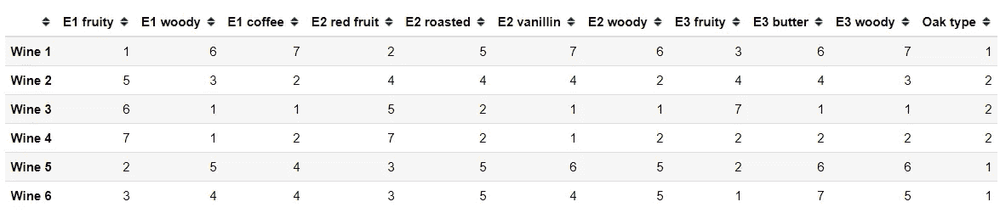

以上是我们的数据集，对每种葡萄酒的看法，以橡木类型作为额外的分类变量。现在，在 prince 中使用 MFA，我们需要指定组类别。所以，让我们创建一个。

```
groups = {
  'Expert #{}'.format(no+1): [c for c in X.columns if c.startswith('E{}'.format(no+1))] for no in range(3)}
groups
```

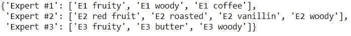

在小组成员在场的情况下，让我们尝试应用 MFA 来降低维度。

```
from prince import MFA
mfa = MFA(groups = groups, n_components = 2, n_iter = 3, random_state = 101)mfa.fit(X)
mfa.transform(X)
```

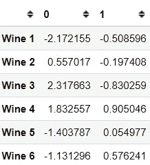

在这里，我们获取每种葡萄酒的全局行坐标，在这里我们已经将特征简化为二维。就像之前一样，我们可以尝试绘制行坐标。

```
mfa.plot_row_coordinates(X=X, labels = X.index, color_labels=['Oak type {}'.format(t) for t in X['Oak type']])
```

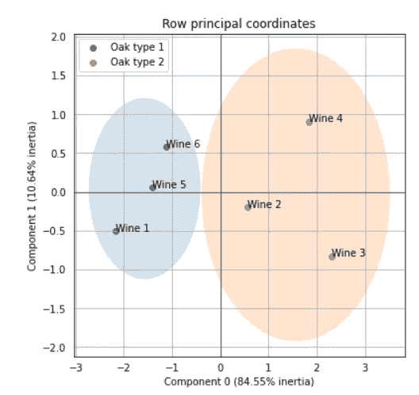

我们可以看到一个清晰的葡萄酒分离和密切的每种葡萄酒的橡木类型作为标签。如果你愿意，我们也可以得到组中每个数据的行坐标。

```
mfa.partial_row_coordinates(X)
```

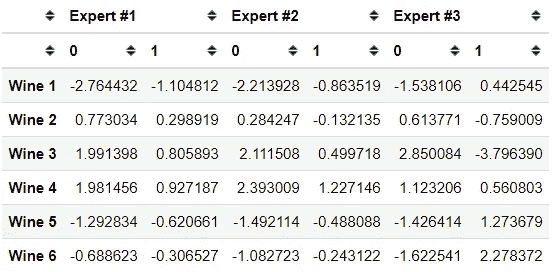

我们也可以画出这些组的行坐标。

```
mfa.plot_partial_row_coordinates(X =X , color_labels=['Oak type {}'.format(t) for t in X['Oak type']])
```

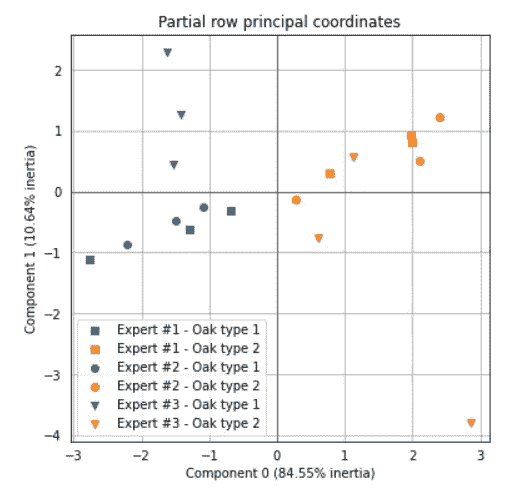

当您需要访问模型解释的方差时，您可以像前面的技术一样访问它。

```
mfa.explained_inertia_
```

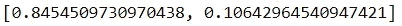

## **5。混合数据的因子分析(FAMD)**

最后，FAMD 是一种致力于对包含定量和定性特征的数据集进行降维的技术。**这意味着 FAMD 适用于具有分类和数值特征的数据。**通过考虑混合类型的特征来分析观察值之间的相似性是可能的。此外，我们可以探索所有功能之间的关联。

粗略地说，FAMD 算法可以被看作是 PCA 和 MCA 的混合。

让我们用一个数据集示例来尝试一下。

```
#Using the tips dataset, change the size feature to string object
tips = sns.load_dataset('tips')
tips['size'] = tips['size'].astype('object')from prince import FAMD
famd = FAMD(n_components =2, n_iter = 3, random_state = 101)#I leave out tips as I want the sex feature as the label
famd.fit(tips.drop('sex', axis =1))
famd.transform(tips)
```

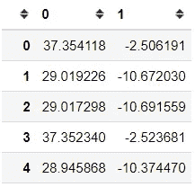

就像之前一样，我们通过将维度缩减为二维来获得全局行坐标。我们也可以画出行坐标。

```
ax = famd.plot_row_coordinates(tips,color_labels=['Sex {}'.format(t) for t in tips['sex']] )
```

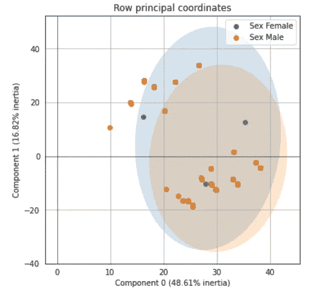

FAMD 在他们的分析中使用了 PCA 和 MCA 技术。这就是为什么坐标的构建块由分类特征和数字特征组成。如果您想访问这两个分析结果，我们也可以这样做。

```
famd.partial_row_coordinates(tips)
```

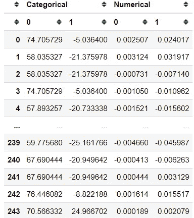

我们也可以画出来。

```
ax = famd.plot_partial_row_coordinates(tips, color_labels=['Sex {}'.format(t) for t in tips['sex']])
```

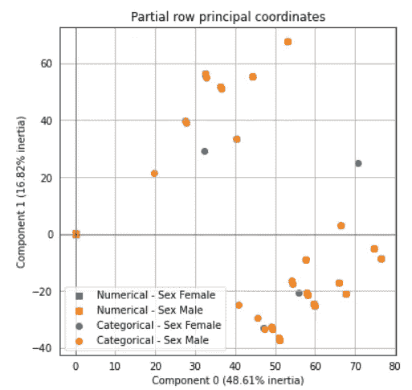

最后，如果你想知道模型解释了多少方差。您也可以用下面的代码来访问它。

```
famd.explained_inertia_
```

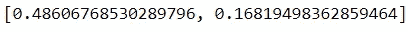

# **结论**

在本文中，我解释了 prince 包提供的五种不同的降维技术。它包括:

1.  主成分分析
2.  对应分析
3.  多重对应分析
4.  多因素分析
5.  FAMD(混合数据的因子分析)

何时使用这些技术取决于你所拥有的特性。

希望有帮助！

# 如果你喜欢我的内容，并想获得更多关于数据或作为数据科学家的日常生活的深入知识，请考虑在这里订阅我的[时事通讯。](https://cornellius.substack.com/welcome)

> 如果您没有订阅为中等会员，请考虑通过[我的推荐](https://cornelliusyudhawijaya.medium.com/membership)订阅。