# 熊猫 5 个必知的串线操作

> 原文：<https://towardsdatascience.com/5-must-know-pandas-operations-on-strings-4f88ca6b8e25?source=collection_archive---------18----------------------->

## 熊猫让字符串操作变得简单


阿玛多·洛雷罗在 [Unsplash](https://unsplash.com/s/photos/letters?utm_source=unsplash&utm_medium=referral&utm_content=creditCopyText) 上的照片

我们必须用数值来表示每一位数据，以便由机器学习和深度学习模型进行处理和分析。然而，字符串通常不会有一个好的和干净的格式，需要预处理来转换成数值。Pandas 提供了许多通用函数来高效地修改和处理字符串数据。

在这篇文章中，我们将会发现熊猫是如何操纵绳子的。我将字符串函数和方法分为 5 类:

1.  **分裂**
2.  **剥离**
3.  **更换**
4.  **过滤**
5.  **合并**

让我们首先创建一个示例数据框架来处理示例。

```
import numpy as np
import pandas as pdsample = {
'col_a':['Houston,TX', 'Dallas,TX', 'Chicago,IL', 'Phoenix,AZ',      'San Diego,CA'],
'col_b':['$64K-$72K', '$62K-$70K', '$69K-$76K', '$62K-$72K', '$71K-$78K' ],
'col_c':['A','B','A','a','c'],
'col_d':['  1x', ' 1y', '2x  ', '1x', '1y  ']
}df_sample = pd.DataFrame(sample)
df_sample
```

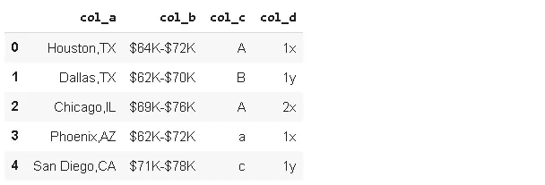

# **1。分割**

有时字符串携带多条信息，我们可能需要分别使用它们。例如，“col_a”包含城市和州。熊猫的**拆分**功能是一个非常灵活的拆分字符串的功能。

```
df_sample['col_a'].str.split(',')0      [Houston, TX] 
1       [Dallas, TX] 
2      [Chicago, IL] 
3      [Phoenix, AZ] 
4    [San Diego, CA] 
Name: col_a, dtype: object
```

现在，每个元素都根据用于拆分的字符转换成一个列表。我们可以很容易地从这些列表中导出单个元素。让我们创建一个“state”列。

```
df_sample['state'] = df_sample['col_a'].str.split(',').str[1]df_sample
```

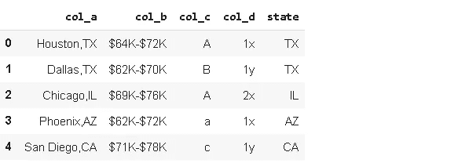

**警告**:下标([1])必须与 str 关键字一起应用。否则，我们将获得指定行中的列表。

```
df_sample['col_a'].str.split(',')[1]
['Dallas', 'TX']
```

拆分可以在任何字符或字母上进行。

如果**扩展**参数设置为真，分割功能返回一个数据帧。

```
df_sample['col_a'].str.split('a', expand=True)
```


# **拆分与再拆分**

默认情况下，从左侧进行拆分。要在右侧进行分割，请使用 **rsplit** 。

考虑下面的系列:

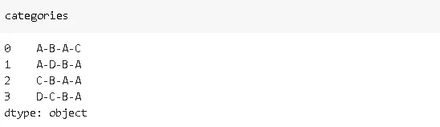

让我们应用分割功能，并使用 **n** 参数限制分割次数:

```
categories.str.split('-', expand=True, n=2)
```

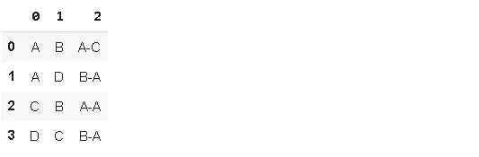

仅执行左侧的 2 次拆分。如果我们用 **rsplit** 做同样的操作:

```
categories.str.rsplit('-', expand=True, n=2)
```

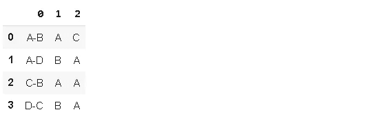

完成相同的操作，但在右侧。

# **2。剥离**

剥就像修剪树枝。我们可以删除字符串开头或结尾的空格或任何其他字符。

例如,“col_b”中的字符串开头有$字符，可以用 **lstrip** 删除:

```
df_sample['col_b'].str.lstrip('$')0    64K-$72K 
1    62K-$70K 
2    69K-$76K 
3    62K-$72K 
4    71K-$78K 
Name: col_b, dtype: object
```

类似地， **rstrip** 用于从末尾开始修剪字符。

字符串的开头或结尾可以有空格。考虑我们数据框架中的“col_d”。

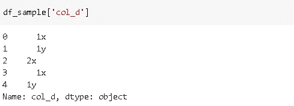

这些前导和尾随空格可以用 strip 删除:

```
df_sample['col_d'] = df_sample['col_d'].str.strip()
```

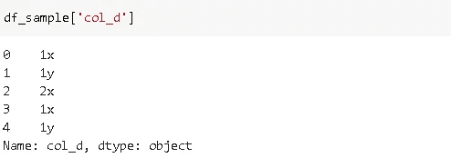

# **3。更换**

熊猫替换函数用于替换行或列中的值。类似地，替换为字符串操作用于替换字符串中的字符。

让我们用“z”代替“col_d”中的“x”字母。

```
df_sample['col_d'] = df_sample['col_d'].str.replace('x', 'z')
```

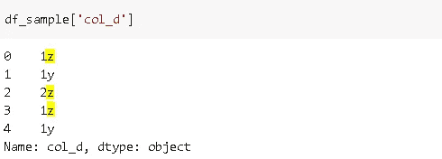

# **4。过滤**

我们可以根据第一个和最后一个字符过滤字符串。要使用的函数有 **startswith()** 和 **endswith()** 。

这是我们的原始数据框架:

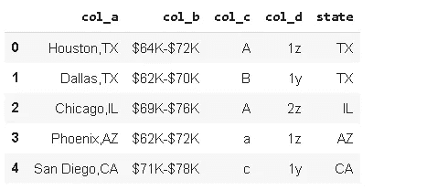

下面是一个经过筛选的版本，只包含“col_a”以字母“x”结尾的行。

```
df_sample[df_sample['col_a'].str.endswith('X')]
```

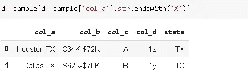

或者，“col_b”以“$6”开头的行:

```
df_sample[df_sample['col_b'].str.startswith('$6')]
```

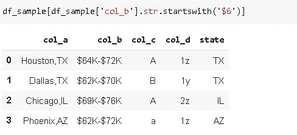

我们也可以通过提取某些字符来过滤字符串。例如，我们可以通过 **str[:2]** 得到一列或一系列字符串的前 2 个字符。

“col_b”表示一个数值范围，但数值隐藏在字符串中。让我们用字符串下标提取它们:

```
lower  = df_sample['col_b'].str[1:3]
```

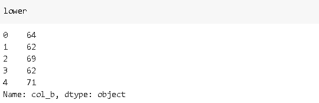

```
upper  = df_sample['col_b'].str[-3:-1]
```

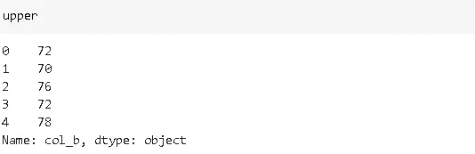

# **5。组合**

**Cat** 函数可用于连接字符串。

我们需要使用 **sep** 参数传递一个参数放在连接的字符串之间。默认情况下，cat 忽略缺失值，但是我们也可以使用 **na_rep** 参数指定如何处理它们。

让我们通过用“-”分隔符连接“col_c”和“col_d”来创建一个新列。

```
df_sample['new']=df_sample['col_c'].str.cat(df_sample['col_d'], sep='-')df_sample
```

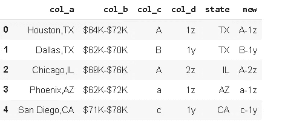

# 额外收获:对象 vs 字符串

在 pandas 1.0 之前，只有“object”数据类型用于存储字符串，这导致了一些缺点，因为非字符串数据也可以使用“object”数据类型存储。Pandas 1.0 引入了一种新的特定于字符串数据的数据类型，即**string type**。到目前为止，我们仍然可以使用 object 或 string type 来存储字符串，但是在将来，我们可能会被要求只使用 string type。

> 这里需要注意的一件重要事情是，对象数据类型仍然是字符串的默认数据类型。要使用 StringDtype，我们需要显式声明它。

我们可以通过“**字符串**或 **pd。StringDtype()** 参数为 Dtype 参数为 string 数据类型。

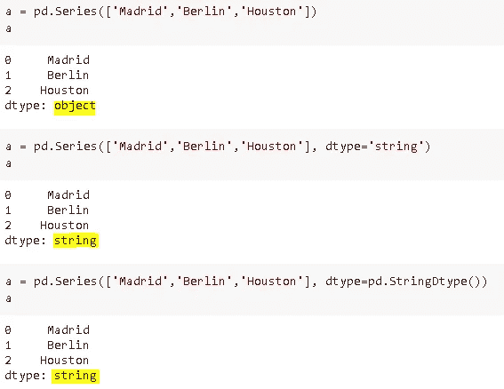

感谢您的阅读。如果您有任何反馈，请告诉我。