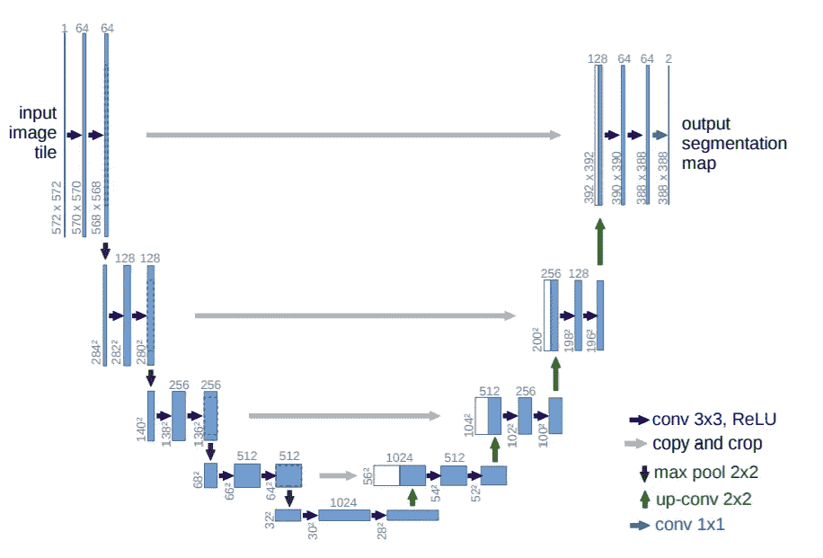
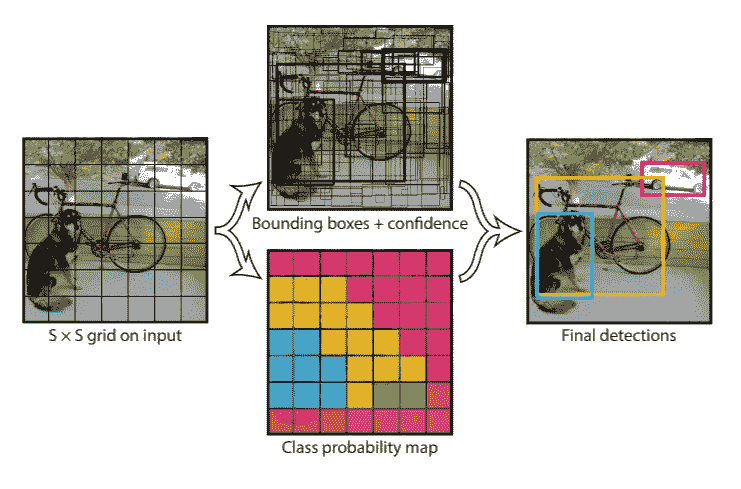
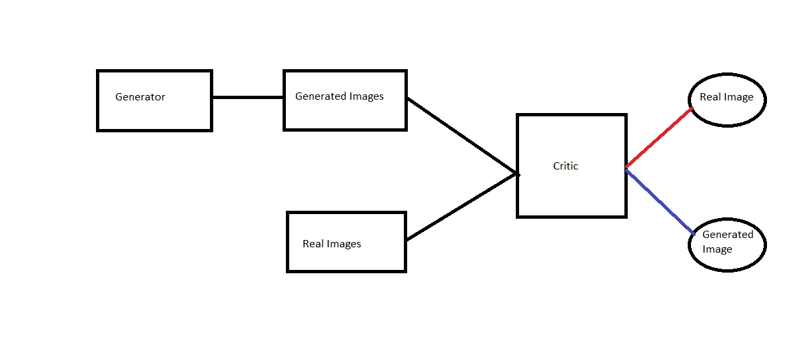

# 计算机视觉领域你必须知道的 5 种神经网络架构

> 原文：<https://towardsdatascience.com/5-neural-network-architectures-you-must-know-for-computer-vision-31d2991fe24e?source=collection_archive---------7----------------------->

## 在这篇文章中，我列出了计算机视觉的前 5 个神经网络架构，排名不分先后

# 卷积神经网络

## 历史

卷积的概念是由福岛国彦在 T2 的论文中首次提出的。 [neocognitron](https://en.wikipedia.org/wiki/Neocognitron) 引入了两种类型的层，卷积层和下采样层。

然后下一个关键进展是由 Yann LeCun 等人提出的，他们使用反向传播从图像中学习卷积核的系数。这使得学习自动化，而不是费力的手工制作。根据维基百科，这种方法成为了现代计算机视觉的基础。

然后是 2012 年由 *Alex Krizhevsky，Ilya Sutskever，Geoffrey E. Hinton，*撰写的“使用深度卷积神经网络的 ImageNet 分类”，这被广泛认为是卷积神经网络方面最有影响力的论文。他们创建了 Alexnet，并凭借他们的模型赢得了 2012 年的 Imagenet 竞赛。

## 机制

我不会深入探究 CNN 的机制，但想简单概述一下它是如何工作的。

常规的香草神经网络在计算 WX + b 的层上训练，其中 W 是通过反向传播学习的权重矩阵，卷积神经网络使用称为过滤器的权重。

卷积运算。图片来自[https://giphy.com/explore/convolution](https://giphy.com/explore/convolution)。

你可以想象一个卷积的[内核](https://en.wikipedia.org/wiki/Kernel_(image_processing))或过滤器，就像输入矩阵上的滑动窗口。在上面的 gif 中，过滤器是带有红色数字的橙色阴影矩阵。输入矩阵是带有黑色数字的绿色矩阵。在每个阶段，滤波器与输入矩阵的重叠部分逐元素相乘，然后对值求和。这给出了第一个输出。然后过滤器向左移动一步，依此类推，如 gif 所示。
可以根据滤波器值计算输出和标签的损失，通过反向传播，我们可以学习滤波器的值。

当你展开内核和输入时，卷积神经网络实际上只是矩阵乘法。这在[这篇非常好的博文](/a-comprehensive-introduction-to-different-types-of-convolutions-in-deep-learning-669281e58215)中有所展示。CNN 非常强大有两个主要原因。

1.  它们每层的参数明显更少，因此可以堆叠形成更深的层。
2.  它们处理输入的位置。图像中像素的局部性得以保持，因为内核一次只作用于图像的一部分，并且输入中接近的像素会创建同样接近的输出值。这不同于不考虑位置的传统网络。

# 剩余网络

[残差网络](https://arxiv.org/abs/1512.03385)是由[、](https://arxiv.org/search/cs?searchtype=author&query=He%2C+K)等人在他们极具影响力的论文《图像识别的深度残差学习》中引入的。来自微软研究团队的论文赢得了 2015 年 Imagenet 竞赛。

跳过连接。图片由作者提供。

ResNets 有一个非常简单却非常优雅的想法。这个想法是添加跳过连接或快捷连接，这创造了一个梯度公路。这使得梯度在后退过程中流动得更好，大大增加了收敛，训练时间，减少了梯度爆炸和消失。

Resnets 的微妙之处在于，最好的情况是跳过连接主动添加到输出中并计算有用的信息，最坏的情况是忽略跳过的连接，最坏的情况是与没有跳过连接的网络相同。**因此，跳过连接增加了如此多的价值，而且没有负面影响！**

# u 网

U-Net 是由 Olaf Ronneberger、Philipp Fischer 和 Thomas Brox 在他们的论文“U-Net:生物医学图像分割的卷积网络”中介绍的，你可以在这里阅读。这篇 2015 年的论文对于图像分割来说是革命性的。图像分割的任务是用类别标记图像中的每个像素。

U-Net 架构。图片取自[原 U 网论文](https://arxiv.org/pdf/1505.04597.pdf)。

u 网有两部分，收缩路径(下采样路径)和扩展路径(上采样路径)。在传统的图像分类卷积网络中，图像被送入执行卷积和汇集操作的网络，这两种操作都降低了输出的高度和宽度，但增加了输出的深度。随着高度和宽度的损失，获得的深度向分类输出添加了特征。

然而，在分割任务中，我们希望输出与输入图像具有相同的形状，并添加标记像素的特征。因此，传统 Conv 架构的下采样由上采样路径补充，以将图像的高度和宽度添加回输出，同时保持特征。有许多上采样方法，但大多数库中最常用的方法是转置卷积上采样。你可以在这里阅读这个方法[。](https://naokishibuya.medium.com/up-sampling-with-transposed-convolution-9ae4f2df52d0)

# YOLO

YOLO 最初是由[约瑟夫·雷德蒙](https://arxiv.org/search/cs?searchtype=author&query=Redmon%2C+J)、[桑托什·迪瓦拉](https://arxiv.org/search/cs?searchtype=author&query=Divvala%2C+S)、[罗斯·吉斯克](https://arxiv.org/search/cs?searchtype=author&query=Girshick%2C+R)、[阿里·法尔哈迪](https://arxiv.org/search/cs?searchtype=author&query=Farhadi%2C+A)在他们的论文《你只看一次:统一的实时物体检测》中介绍的，你可以在这里阅读。该论文被提议作为 2015 年物体检测的快速、最先进的模型。多年来，YOLO 有 4 个官方版本(论文发表的地方)。前三个是由原作者，最后一个是由不同的作者。我现在不会讨论 YOLO 的版本，也许在另一篇文章中；-)

YOLO 建筑。图片取自[原 YOLO 纸](https://arxiv.org/pdf/1506.02640.pdf)。

YOLO 代表你只看一眼。当这篇论文发表时，目标检测的流行方法是重用分类器对图像的局部区域进行分类，并使用滑动窗口方法来检查图像的每个区域是否有目标。YOLO 通过将目标检测作为一个回归问题提出来，改变了这种范式，在这种情况下，他们仅对整个管道使用一个单一的网络，并一次性处理整个图像，而不是在区域中处理。

YOLO 把输入图像分成一个 SxS 网格。并且对于每个网格，预测对象的中心是否存在于网格内。如果对象的中心在网格中，则网格将预测具有 5 个值的边界框，x，y，w，h，c。(x，y)是对象中心相对于网格的坐标，(w，h)是对象相对于整个图像的宽度和高度，以及(c)是对象的类别。

> “YOLO 有三大优势。松散引用自[原论文【1】](https://arxiv.org/pdf/1506.02640.pdf)。
> 
> 首先，YOLO 速度极快。由于论文将检测框架作为一个回归问题，因此不需要复杂的流水线。
> 
> 第二，YOLO 在做预测时会对图像进行全局推理。与基于滑动窗口和区域提议的技术不同，YOLO 在训练和测试期间看到整个图像，因此它隐式地编码了关于类及其外观的上下文信息。
> 
> 第三，YOLO 学习对象的概括表示。由于 YOLO 是高度概括的，当应用于新的领域或意想不到的输入时，它不太可能崩溃。"

# 生成对抗网络

[伊恩·j·古德费勒](https://arxiv.org/search/stat?searchtype=author&query=Goodfellow%2C+I+J)、[让·普盖-阿巴迪](https://arxiv.org/search/stat?searchtype=author&query=Pouget-Abadie%2C+J)、[迈赫迪·米尔扎](https://arxiv.org/search/stat?searchtype=author&query=Mirza%2C+M)、[徐炳](https://arxiv.org/search/stat?searchtype=author&query=Xu%2C+B)、[大卫·沃德-法利](https://arxiv.org/search/stat?searchtype=author&query=Warde-Farley%2C+D)、[谢尔吉尔·奥泽尔](https://arxiv.org/search/stat?searchtype=author&query=Ozair%2C+S)、[亚伦·库维尔](https://arxiv.org/search/stat?searchtype=author&query=Courville%2C+A)、[约舒阿·本吉奥](https://arxiv.org/search/stat?searchtype=author&query=Bengio%2C+Y)在他们的论文《生成对抗网络》中介绍了生成对抗网络，你可以阅读【生成对抗网络】

甘形象。图片由作者提供。

GANs 是通过对抗过程训练的神经网络对。GAN 的两个部分是发生器和鉴别器。生成器的作用是生成类似于训练数据的高质量数据，而批评家的作用是区分生成的数据和真实的数据。发电机的目标函数是使批评家的损失最大化，批评家的目标函数是使其损失最小化。

把这个过程想象成一个小偷和警察。小偷想愚弄警察，不断改进他们的工具和技术，而警察想抓住小偷，所以他们也在改进。发电机就像小偷，批评家就像警察。

GANs 有许多应用，并且一直有许多新的应用出现。但是因为这篇文章是关于计算机视觉的，GANs 的两个非常有趣的应用是:

1.  **超分辨率**
    超分辨率是指拍摄低质量的图像，并从中生成高质量的图像。英伟达的新 DLSS 可能会使用这种技术。
    来自 [fast.ai](https://www.fast.ai/) 的 Jeremey Howard 有一个非常有趣的方法，叫做超分辨率的 noGAN 方法。这个过程是对 GANs 的一种预训练，其中高质量的图像被转换成较低质量的图像用于生成器的训练数据，并且评论家在生成的图像上被预训练。这样，生成器和评论家都有一个良好的开端，并且这种方法被发现可以显著地提高 GANs 的训练时间。
2.  **深度假货** 相信大家都从媒体上听说过深度假货。深度假货也是 GANs，其中生成器被训练来执行假货操作，而评论家的任务是检测假货。发电机可以被训练足够长的时间来愚弄大多数人类。这是一种有点危险的技术，在互联网上需要注意。

# 参考

[1] [约瑟夫·雷德蒙](https://arxiv.org/search/cs?searchtype=author&query=Redmon%2C+J)，[桑托什·迪夫瓦拉](https://arxiv.org/search/cs?searchtype=author&query=Divvala%2C+S)，[罗斯·吉尔希克](https://arxiv.org/search/cs?searchtype=author&query=Girshick%2C+R)，[阿里·法尔哈迪](https://arxiv.org/search/cs?searchtype=author&query=Farhadi%2C+A)，《你只看一次:统一的、实时的物体检测》(2015)， [arXiv:1506.02640](https://arxiv.org/abs/1506.02640)