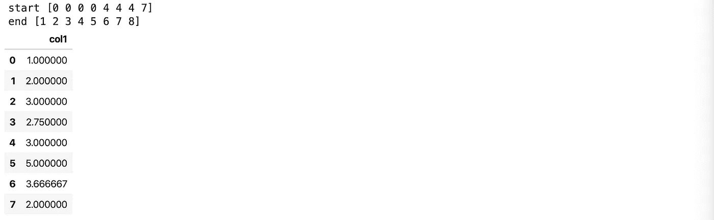

# 你应该知道的熊猫 1.0 的 5 个新特性

> 原文：<https://towardsdatascience.com/5-new-features-in-pandas-1-0-you-should-know-about-fc31c83e396b?source=collection_archive---------10----------------------->

## 动态窗口功能，更快的应用和更多。


来自 imgflip.com 的熊猫迷因

熊猫 1.0 于 2020 年 1 月 29 日发布。版本从 0.25 跳到了 1.0，并没有像一些熊猫用户期望的那样有太大的变化。版本的增加仅仅反映了数据处理库的成熟。

虽然没有多少突破性的变化，但有一些你应该知道。

**这里有几个你可能会感兴趣的链接:**

```
- [Labeling and Data Engineering for Conversational AI and Analytics](https://www.humanfirst.ai/)- [Data Science for Business Leaders](https://imp.i115008.net/c/2402645/880006/11298) [Course]- [Intro to Machine Learning with PyTorch](https://imp.i115008.net/c/2402645/788201/11298) [Course]- [Become a Growth Product Manager](https://imp.i115008.net/c/2402645/803127/11298) [Course]- [Deep Learning (Adaptive Computation and ML series)](https://amzn.to/3ncTG7D) [Ebook]- [Free skill tests for Data Scientists & Machine Learning Engineers](https://aigents.co/skills)
```

*上面的一些链接是附属链接，如果你通过它们进行购买，我会赚取佣金。请记住，我链接课程是因为它们的质量，而不是因为我从你的购买中获得的佣金。*

要升级你的熊猫游戏，请阅读:

[](/pandas-analytics-server-d9abceec888b) [## 熊猫分析服务器

### 一个开源项目，简化了熊猫与实时数据的连接，测试假设和可视化…

towardsdatascience.com](/pandas-analytics-server-d9abceec888b) 

# 1.具有滚动功能的动态窗口大小

处理时间序列数据时，滚动窗口函数非常有用(例如，移动平均值的计算)。以前版本的 pandas 要求我们传递窗口大小参数，例如计算 3 个周期的移动平均值。在 pandas 1.0 中，我们可以绕过这个要求，如下例所示。

让我们计算值的移动平均值，直到当前数字不大于 10。首先，我们创建一个数据帧，其中 3 个值大于或等于 10。

```
df **=** pd**.**DataFrame({'col1': [1, 2, 3, 10, 2, 3, 11, 2, 3, 12, 1, 2]})
df
```


车窗功能应展开，直到没有达到大于或等于 10 的值。

```
use_expanding **=**  (df**.**col1 **>=** 10)**.**tolist()
use_expanding # output
[False,
 False,
 False,
 True,
 False,
 False,
 True,
 False,
 False,
 True,
 False,
 False]
```

对于动态大小窗口函数，我们需要实现一个自定义索引器，它继承自 pandas BaseIndexer 类。BaseIndexer 类有一个 get_window_bounds 函数，它计算每个窗口的开始和结束。

```
from pandas.api.indexers import BaseIndexer**class** **CustomIndexer**(BaseIndexer): **def** **get_window_bounds**(self, num_values, min_periods, center, closed):
        start **=** np**.**empty(num_values, dtype**=**np**.**int64)
        end **=** np**.**empty(num_values, dtype**=**np**.**int64)
        start_i **=** 0
        **for** i **in** range(num_values):
            **if** self**.**use_expanding[i]:
                start[i] **=** start_i
                start_i **=** end[i] **=** i **+** 1
            **else**:
                start[i] **=** start_i
                end[i] **=** i **+** self**.**window_size
        **print**('start', start)
        **print**('end', end)
        **return** start, end indexer **=** CustomIndexer(window_size**=**1, use_expanding**=**use_expanding)
```

我们将索引器类放入滚动函数中，并计算每个窗口的平均值。我们还可以观察每个窗口的开始和结束索引。

```
df**.**rolling(indexer)**.**mean()
```



# 2.更快的滚动应用

Pandas 使用 Cython 作为滚动应用的默认执行引擎。在 pandas 1.0 中，我们可以将 Numba 指定为执行引擎，并获得不错的加速。

有几件事需要注意:

*   需要安装 Numba 依赖项:pip 安装 numba，
*   第一次使用 Numba 引擎运行函数会很慢，因为 Numba 会有一些函数编译开销。但是，滚动对象将缓存该函数，后续调用将会很快，
*   Numba 引擎具有较大数量的数据点(例如 1 百万以上)，
*   raw 参数需要设置为 True，这意味着该函数将接收 numpy 对象而不是 pandas 系列，以获得更好的性能。

让我们创建一个包含 100 万个值的数据框架。

```
df **=** pd**.**DataFrame({"col1": pd**.**Series(range(1_000_000))})
df**.**head()
```


some_function 计算值的总和并加 5。

```
**def** **some_function**(x):
    **return** np**.**sum(x) **+** 5
```

让我们用 Cython 执行引擎来测量执行时间。

```
**%%**timeitdf**.**col1**.**rolling(100)**.**apply(some_function, engine**=**'cython', raw**=**True)4.03 s ± 76.3 ms per loop (mean ± std. dev. of 7 runs, 1 loop each)
```

Cython 计算这个函数需要 4.03 秒。Numba 更快吗？让我们试一试。

```
**%%**timeitdf**.**col1**.**rolling(100)**.**apply(some_function, engine**=**'numba', raw**=**True)500 ms ± 11.5 ms per loop (mean ± std. dev. of 7 runs, 1 loop each)
```

我们看到 Numba 在这个玩具例子中快了 8 倍。

# 3.新 NA 值

熊猫 1.0 引入了新的实验性 pd。表示标量缺失值的 NA 值。

> 我知道你在想什么——又一个空值？已经有 nan，None 和 NaT 了！

pd 的目标。NA 将提供跨数据类型的一致性。它目前由 Int64、boolean 和新的 string 数据类型使用

让我们创建一系列无整数。

```
s **=** pd**.**Series([3, 6, 9, None], dtype**=**"Int64")
s
```


让我惊讶的是，NA == NA 产生 NA，而 np.nan == np.nan 产生 False。

```
s**.**loc[3] **==** s**.**loc[3]# output
<NA> np**.**nan **==** np**.**nan# output
False
```

# 4.新字符串类型

熊猫 1.0 终于有了一个专用的(实验性的)字符串类型。在 1.0 之前，字符串是作为对象存储的，所以我们不能确定这个系列是只包含字符串，还是混合了其他数据类型，如下所示。

```
s **=** pd**.**Series(['an', 'ban', 'pet', 'podgan', None])
s
```


当我们无意中将字符串与整数或浮点数混合在一起时，将字符串存储为对象就成了一个问题——数据类型仍然是对象。

```
s **=** pd**.**Series(['an', 'ban', 5, 'pet', 5.0, 'podgan', None])
s
```


为了测试新的字符串 dtype，我们需要设置 dtype='string '。

> 新的字符串数据类型返回序列中整数或浮点数的异常。进步很大！

```
s **=** pd**.**Series(['an', 'ban', 'pet', 'podgan', None], dtype**=**'string')
s
```


# 5.忽略排序数据帧上的索引

当我们按某一列对数据帧进行排序时，索引也会被排序。有时候我们不想这样。在 pandas 1.0 中，sort_values 函数采用忽略索引，正如参数名称所示。

```
df **=** pd**.**DataFrame({"col1": [1, 3, 5, 2, 3, 7, 1, 2]})df**.**sort_values('col1')
```


```
df**.**sort_values('col1', ignore_index**=**True)
```


# 结论

根据我的观点，这是 5 个最有趣的熊猫特征。从长远来看，缺失值的新 NA 可以给熊猫带来很多清晰度。函数如何处理丢失的值，它们是否跳过它们。

折旧政策也有变化:

*   次要版本(如 1.1.0)中将引入弃用，
*   在主要版本(如 2.0.0)中，将强制实施不推荐使用和突破 API 的更改。我们应该升级还是继续使用当前的熊猫版本

新的弃用政策提出了这个问题:“我应该更新熊猫吗？”比较好回答。似乎我们还可以期待未来更频繁的重大发布。要了解更多关于熊猫 1.0 的新特性，请阅读 1.0.0 的新特性。

# 在你走之前

在[推特](https://twitter.com/romanorac)上关注我，在那里我定期[发关于数据科学和机器学习的推特](https://twitter.com/romanorac/status/1328952374447267843)。


照片由[Courtney hedge](https://unsplash.com/@cmhedger?utm_source=medium&utm_medium=referral)在 [Unsplash](https://unsplash.com/?utm_source=medium&utm_medium=referral) 上拍摄