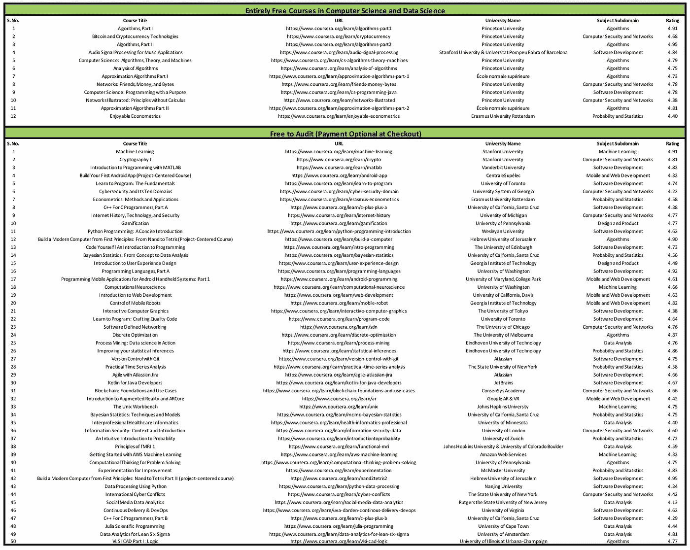

# 新冠肺炎疫情期间，你可以免费参加 5 门在线课程

> 原文：<https://towardsdatascience.com/5-online-courses-you-can-take-for-free-during-covid-19-epidemic-f5503161e861?source=collection_archive---------9----------------------->

莎伦·麦卡琴在 [Unsplash](https://unsplash.com?utm_source=medium&utm_medium=referral) 上的照片

## 在这个无情的时代，学习至关重要

随着冠状病毒的肆虐，随着学校和大学继续停课，全球对 MOOCs 的需求巨大。

所以，我觉得像 Coursera 这样的 ***提供商在他们的网站上免费提供大量优秀课程很棒，*** 但在所有付费课程中很难找到。

虽然这些课程不提供认证证书，但在我看来，知识比几个证书更重要。

***TLDR；随着成千上万的人在这场危机中被解雇，我认为现在向人们提供学习资源是至关重要的。因此，这里列出了一些很棒且可以免费学习的课程。***

# 1.机器学习

来源:免费课程是一条路要走

是的，你没听错，Coursera 正在免费提供吴恩达的游戏规则改变者 [**机器学习课程**](https://coursera.pxf.io/NKERRq) 。

至于我的评论，我认为这是每个对机器学习感兴趣的人都应该做的一门课程。首先，它包含了许多机器学习算法背后的数学知识，其次，吴恩达是一位伟大的导师。信不信由你，在我刚开始学习数据科学的时候，吴恩达不仅教了我，还激励了我。

至于课程，这门课什么都有——回归、分类、异常检测、推荐系统、神经网络，还有很多很棒的建议。

在学习本课程的过程中，您可能还想看看我的一些帖子:

 [## 《搭车人特征提取指南》

### 对特征工程技术的详尽研究

towardsdatascience.com](/the-hitchhikers-guide-to-feature-extraction-b4c157e96631)  [## 每个数据科学家都必须知道的 5 个分类评估指标

### 以及具体什么时候使用它们？

towardsdatascience.com](/the-5-classification-evaluation-metrics-you-must-know-aa97784ff226)  [## 每个数据科学家都应该知道的 5 种特征选择算法

### 额外收获:是什么让一个优秀的足球运动员变得伟大？

towardsdatascience.com](/the-5-feature-selection-algorithms-every-data-scientist-need-to-know-3a6b566efd2)  [## 3 个决策树分裂标准背后的简单数学

### 🌀理解分割标准

towardsdatascience.com](/the-simple-math-behind-3-decision-tree-splitting-criterions-85d4de2a75fe) 

# 2.算法

算法和数据结构是数据科学不可或缺的一部分。虽然我们大多数数据科学家在学习时没有上过适当的算法课程，但它们仍然是必不可少的。

许多公司在招聘数据科学家的面试过程中会询问数据结构和算法。

它们将需要像你的数据科学面试一样的热情来破解，因此，你可能想要给一些时间来研究算法和数据结构以及算法问题。

罗伯特·塞奇威克大学提供的这一系列两门课程涵盖了所有基本的算法和数据结构。本课程的 [**第一部分**](https://coursera.pxf.io/9WjrP4) 涵盖了基本的数据结构、排序和搜索算法，而 [**第二部分**](https://coursera.pxf.io/rnqB3j) 则侧重于图形和字符串处理算法。

你可能也想看看我的一些帖子，同时试图理解这些课程中的一些材料。

 [## 数据科学家的 3 个编程概念

### 数学更少，代码更多

towardsdatascience.com](/three-programming-concepts-for-data-scientists-c264fc3b1de8)  [## 面向数据科学家的链表简单介绍

### 或者说，什么是链表，为什么我需要了解它们？

towardsdatascience.com](/a-simple-introduction-of-linked-lists-for-data-scientists-a71f0eb31d87)  [## 数据科学家的动态编程

### DP 如何工作？

towardsdatascience.com](/dynamic-programming-for-data-scientists-bb7154b4298b) 

# 3.贝叶斯统计:从概念到数据分析

> "事实是顽固的东西，但统计数字是易驾驭的."
> ――马克·吐温

一个常客和贝叶斯之间的战争永远不会结束。

在本 [**课程**](https://coursera.pxf.io/x9jRay) 中，你将学习最大似然估计、先验、后验、共轭先验，以及大量其他我们可以使用贝叶斯统计的实际场景。总之，这是一门精心设计的课程，解释了统计的频率论和贝叶斯方法。

从[课程](https://coursera.pxf.io/x9jRay)网站:

> 本课程介绍了统计的贝叶斯方法，从概率的概念开始，到数据的分析。我们将比较贝叶斯方法和更普遍教授的频率主义方法，并看到贝叶斯方法的一些好处。

# 4.实用时间序列分析

你听说过 ARIMA 模型，时间序列的平稳性等吗？并被这些条款所困扰？本课程旨在从数学的角度教授时间序列。我在相当长的一段时间里没能找到这样一个[**球场**](https://coursera.pxf.io/jWGB0Z) 。现在它对所有人都是免费的。

从[课程](https://coursera.pxf.io/jWGB0Z)网站:

> 在实际的时间序列分析中，我们关注代表序列信息的数据集，如股票价格、年降雨量、太阳黑子活动、农产品价格等等。我们来看几个数学模型，它们可能被用来描述产生这些类型数据的过程

如果您想使用 XGBoost 或基于树的模型进行时间序列分析，请看看我以前的一篇文章:

 [## 对时间序列预测任务使用梯度增强

### 简单的时间序列建模

towardsdatascience.com](/using-gradient-boosting-for-time-series-prediction-tasks-600fac66a5fc) 

# 5.机器学习 AWS 入门

> 秘诀:重要的不是你知道什么，而是你表现出什么。

在构建一个伟大的机器学习系统时，有很多事情需要考虑。但是经常发生的是，作为数据科学家，我们只担心项目的某些部分。

但是我们有没有想过一旦有了模型，我们将如何部署它们？

我见过很多 ML 项目，其中很多注定要失败，因为他们从一开始就没有一套生产计划。

拥有一个好的平台，并了解该平台如何部署机器学习应用程序，将在现实世界中产生很大的影响。这个关于 AWS 的[课程](https://coursera.pxf.io/e45BJ6)是为了实现机器学习应用程序，它承诺了这一点。

> *本课程将教你:*
> 
> *1。如何使用内置算法的 Amazon SageMaker 和 Jupyter Notebook 实例构建、训练和部署模型。*
> 
> *2。如何使用亚马逊人工智能服务构建智能应用程序，如亚马逊理解、亚马逊 Rekognition、亚马逊翻译等。*

你也可以看看我的这篇文章，在这里我试着谈论应用并解释如何计划生产。

 [## 如何为数据科学家使用简单的 Python 编写 Web 应用？

### 无需了解任何 web 框架，即可轻松将您的数据科学项目转换为酷炫的应用程序

towardsdatascience.com](/how-to-write-web-apps-using-simple-python-for-data-scientists-a227a1a01582)  [## 如何使用 Amazon Free ec2 实例部署 Streamlit 应用程序？

### 10 分钟内将数据应用程序上传到网上

towardsdatascience.com](/how-to-deploy-a-streamlit-app-using-an-amazon-free-ec2-instance-416a41f69dc3)  [## 通过这 5 个简单的步骤将您的机器学习模型投入生产

### 或者为什么机器学习项目会失败？

towardsdatascience.com](/take-your-machine-learning-models-to-production-with-these-5-simple-steps-35aa55e3a43c) 

# 更多免费课程

还有，如果你不想学上面那几个也不用担心。在写这篇文章之前，我收集了一些高评级课程的列表，这些课程可以免费审核。你可以在这里下载 [excel](https://github.com/MLWhiz/data_science_blogs/blob/master/resources/CS_DS_Free_and_FreeToAudit.xlsx) 文件。所以尝试一下你想学的东西。

# 继续学习

将来我也会写更多初学者友好的帖子。在 [**中**](https://medium.com/@rahul_agarwal) 关注我，或者订阅我的 [**博客**](https://mlwhiz.ck.page/a9b8bda70c) 了解他们。一如既往，我欢迎反馈和建设性的批评，可以通过 Twitter [@mlwhiz](https://twitter.com/MLWhiz) 联系到我。

此外，一个小小的免责声明——这篇文章中可能会有一些相关资源的附属链接，因为分享知识从来都不是一个坏主意。