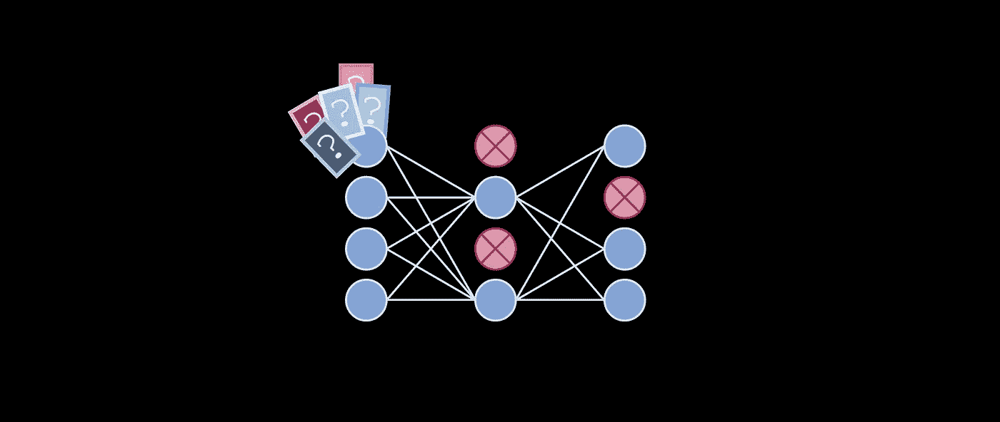
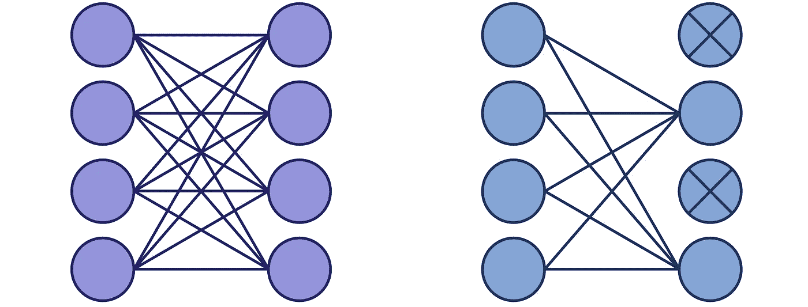
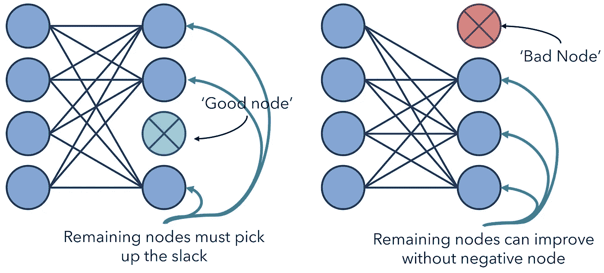
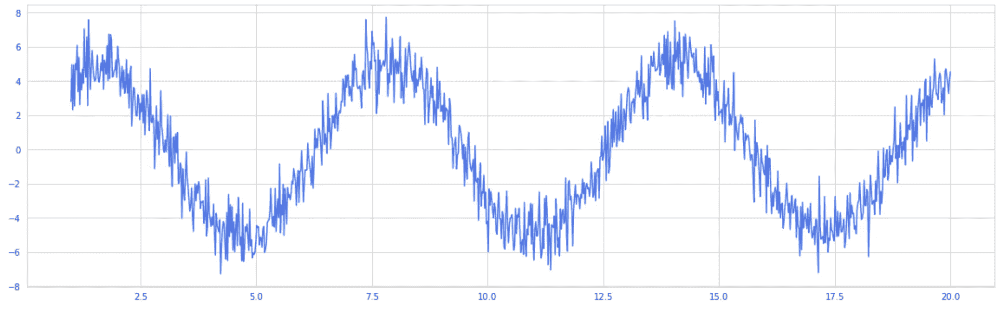
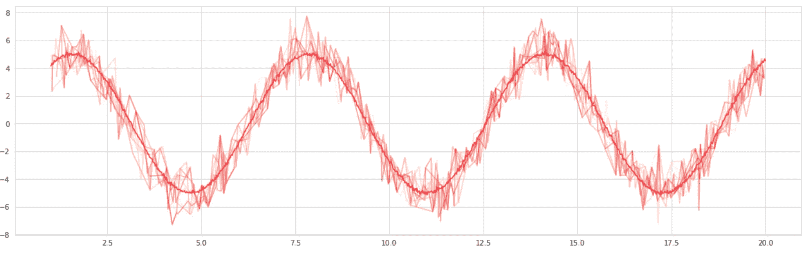

# 从 5 个角度看为什么辍学如此有效

> 原文：<https://towardsdatascience.com/5-perspectives-to-why-dropout-works-so-well-1c10617b8028?source=collection_archive---------19----------------------->

## 五分钟后

Dropout 的工作原理是在训练过程中随机阻断一层中的一小部分神经元。然后，在预测期间(训练之后)，Dropout 不会阻塞任何神经元。这一实践取得了巨大的成功——赢得竞争的网络几乎总是将辍学作为架构的重要组成部分。

要理解辍学到底为什么有效可能有点令人困惑。首先，我们实际上是在模型中插入了随机性，因此，当某些重要的节点被阻塞时，人们会认为它的预测会有很大的不同。在这样一个不稳定的环境中，很难想象有用的信息是如何传播的。再者，预测时突然消除随机性，适应这样随机环境的网络如何表现良好？

辍学为什么有效有许多观点，尽管其中许多观点是相互联系和相关的，但理解它们可以全面而深刻地理解这种方法为什么如此成功。

这里有一种方法:因为网络是在节点可能被随机阻塞的环境中训练的，所以有两种可能性:

*   被阻止的节点是“坏节点”，或者不提供任何信息的节点。在这种情况下，网络的其他节点通过反向传播接收到正信号，并且能够在没有负节点的情况下更好地学习。
*   被阻止的节点是“好节点”，或者为预测提供重要信息的节点。在这种情况下，网络必须学习其他神经元中数据的单独表示。

在这种 Dropout 的观点下，无论 Dropout 阻塞了什么节点，网络都可以从中受益。这种方法的观点认为它是一种干扰，一种从外部引入的随机来源，用来激发加速学习。

辍学的另一个角度是作为一个整体。在经常成功的随机森林算法中，根据随机选择的数据子集训练几个决策树，这一过程称为装袋。通过在模型中加入随机性，模型的方差实际上被抑制了。作为直观的理解，考虑以下数据，一个具有大量正态分布噪声的正弦波:

从这些数据中，我们得到几十条近似曲线，它们沿着原始曲线随机选择点。然后，这些近似曲线通过平均值聚合，结果是一条更清晰的曲线:

透明线是近似曲线。

Bagging 适用于高方差数据，因为它是一个可以以毒攻毒(噪声比噪声大)的实例。在这种情况下，通过重复随机选择曲线的部分，我们忽略了其他数据点，这有助于降低方差。

同样的想法也适用于辍学。当有数百甚至数千个信号从深层神经网络的前一层传入时，尤其是在训练开始时，必然会有大量的变化，甚至可能是不正确的信号。通过随机选择先前信号的子集并传递它们，Dropout 充当了一个近似器，并为反向传播留下了一个更纯净的信号。

我们可以从这个角度看得更远。每次在迭代中重新应用 Dropout 时，人们可能会认为正在创建一个新的网络。比方说，在用决策树打包时，每个模型都有不同的架构，正是这些不同的特征映射和数据子集中的特性的集合允许对整个特征空间的丰富理解。最终模型受到子模型学习的影响。

每次训练迭代，都会创建一个“新网络”,并且更新权重以反映新网络的学习。虽然实现的方法不同——更多的是一维的而不是二维的——但它本质上是作为一个整体执行相同的任务。经过足够的迭代后，网络学会寻找所谓的“通用权重”，即无论架构如何变化都表现良好的参数。像系综一样，Dropout 允许网络从许多更详细、更集中的网络中学习。

辍学也被视为正则化的一种形式，这是一系列防止神经网络过度拟合的方法。通过随机切断从一层到下一层的部分信号流，我们防止了过度详细的数字涌向网络的末端，这将通过反向传播遇到同样复杂的更新流。

辍学的另一个观点源于过度拟合问题，其基本思想是网络过度拟合是因为它们试图同时更新数百万个参数。当神经网络被初始化时，它们的参数不适应数据集，并开始探索误差范围。当所有这些个体探索被总结成一个巨大的网络时，它就像海啸一样冲向反向传播，这个网络迅速发展并迅速溢出。

辍学-特别是通过深度网络广泛实施的辍学，并且具有高比例的辍学神经元(40%至 50%)-让网络以更慢和更渐进的方式学习，以随机的方式一部分一部分地更新网络。

要更新的网络的每个新的随机选择的部分必须不仅更新它自己，而且注意其他先前更新的参数。因此，尽管这看起来有些矛盾，但增加随机性有助于模型以更可控的方式学习。

 [## 批量规范化:深度学习的最大突破

### 它是如何工作的——又是如何如此有效的？

towardsdatascience.com](/batch-normalization-the-greatest-breakthrough-in-deep-learning-77e64909d81d) 

所有图片均由作者创作。