# 使用 Matplotlib 可视化数据的 5 个强大技巧

> 原文：<https://towardsdatascience.com/5-powerful-tricks-to-visualize-your-data-with-matplotlib-16bc33747e05?source=collection_archive---------4----------------------->


[粘土银行](https://unsplash.com/@claybanks?utm_source=medium&utm_medium=referral)在 [Unsplash](https://unsplash.com?utm_source=medium&utm_medium=referral) 拍摄的照片

## [入门](https://towardsdatascience.com/tagged/getting-started)

## 如何使用 LaTeX 字体，创建缩放效果，发件箱图例，连续错误，以及调整框填充边距

数据可视化是用来以一种更直观、更易于理解的方式显示数据。它可以形成直方图、散点图、线图、饼图等。很多人还在用 Matplotlib 作为他们的后端模块来可视化他们的剧情。在这个故事中，我会给你一些技巧，5 个使用 Matplotlib 创建优秀情节的强大技巧。

1.  **使用乳胶字体**

默认情况下，我们可以使用 Matplotlib 提供的一些漂亮的字体。但是，有些符号不够好，无法用 Matplotlib 创建。例如，符号 phi (φ)，如图 1 所示。

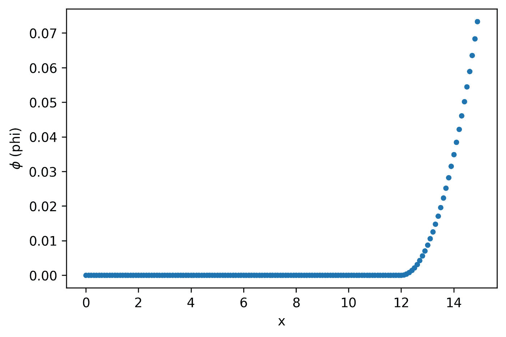

**图一。**符号“phi”的示例(图片由作者提供)

正如你在 y 标签中看到的，它仍然是 phi (φ)的符号，但对于某些人来说，它还不足以成为一个情节标签。为了让它更漂亮，你可以使用乳胶字体。怎么用？下面是答案。

您可以在 python 代码的开头添加上面的代码。第 1 行定义了绘图中使用的 LaTeX 字体。您还需要定义字体大小，大于默认大小。如果你没有改变它，我想它会给你一个小标签。我为它选择 18。应用上述代码后的结果如图 2 所示。

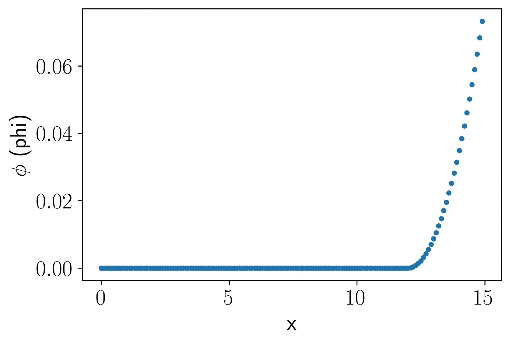

**图二。**使用 LaTeX 字体的符号“phi”示例(图片由作者提供)

您需要在符号的开头和结尾写双美元($ … $)，就像这样

如果您有一些错误或者没有安装使用 LaTeX 字体所需的库，您需要通过在 Jupyter 笔记本单元中运行以下代码来安装它们。

```
!apt install texlive-fonts-recommended texlive-fonts-extra cm-super dvipng
```

如果您想通过终端安装它们，您可以移除**！**，所以

```
apt install texlive-fonts-recommended texlive-fonts-extra cm-super dvipng
```

当然，你可以使用一些不同的字体系列，像衬线，无衬线(上面的例子)等。要更改字体系列，您可以使用以下代码。

```
plt.rcParams['font.family'] = "serif"
```

如果您将上面的代码添加到您的代码中，它将给出如图 3 所示的图。

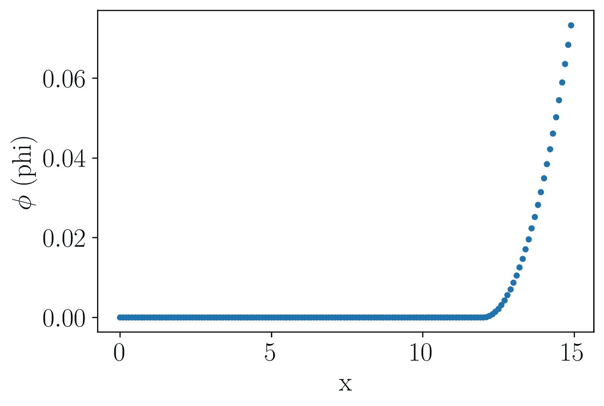

**图 3** 。使用 LaTeX 字体的符号“phi”示例(图片由作者提供)

你能意识到图 3 和图 2 的区别吗？Yups，仔细分析的话，区别就是字体的尾部。后一个图使用衬线，而前一个是无衬线。简单来说， ***衬线*** 表示尾部， ***sans*** 表示没有，如果你想了解更多关于字体家族或者字样的知识，我推荐这个链接。

[](https://en.wikipedia.org/wiki/Typeface) [## 字体

### 字体是字体的设计，可以包括各种变化，如超粗体，粗体，常规，轻，斜体…

en.wikipedia.org](https://en.wikipedia.org/wiki/Typeface) 

您也可以使用 Jupyterthemes 库设置字体系列/字样。我已经做了使用指南。只需点击以下链接。木星主题也可以改变你的木星主题，例如黑暗模式主题。

[](https://medium.com/@rizman18/how-can-i-customize-jupyter-notebook-into-dark-mode-7985ce780f38) [## 如何将 Jupyter 笔记本自定义为黑暗模式

### 一个关于自定义 Jupyter 笔记本主题和轻松调整 Maptlotlib 参数的故事

medium.com](https://medium.com/@rizman18/how-can-i-customize-jupyter-notebook-into-dark-mode-7985ce780f38) 

我们想给你一个插入 Matplotlib 的复杂文本，如图 4 的标题所示。

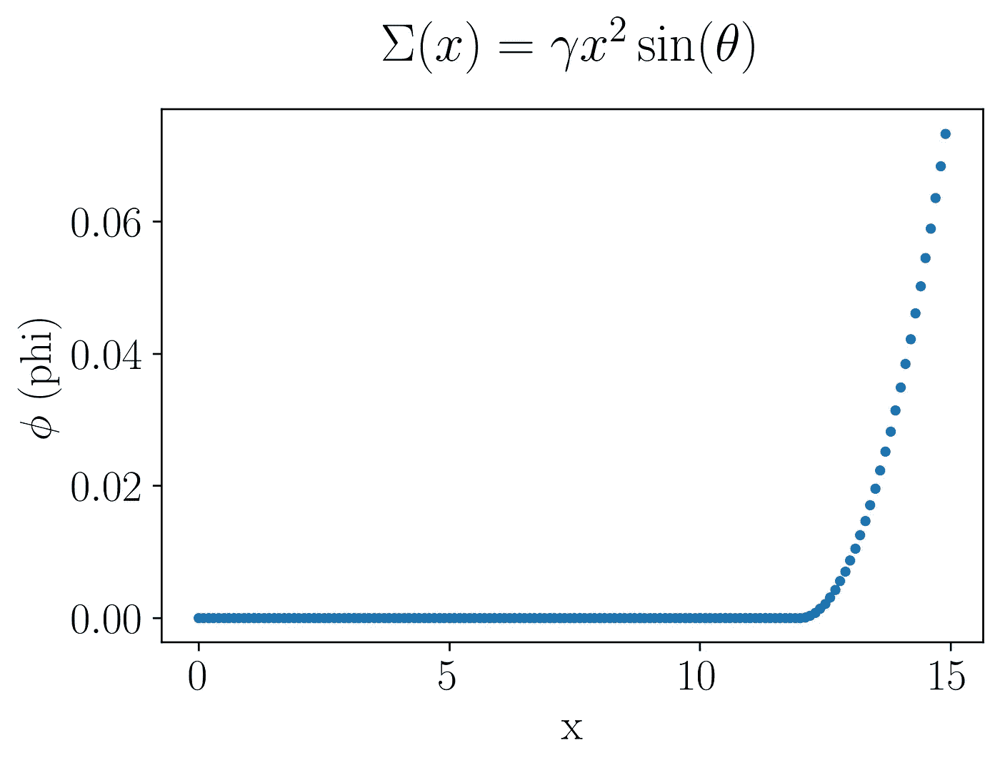

**图 4。**matplotlib 中使用 LaTeX 字体的复杂符号(图片由作者提供)

如果您想创建图 4，您可以使用这个完整的代码

如果你对代码有什么问题，请写在评论里。

**2。创建放大效果**

在这个技巧中，我将给出一个代码来生成一个图，如图 5 所示。

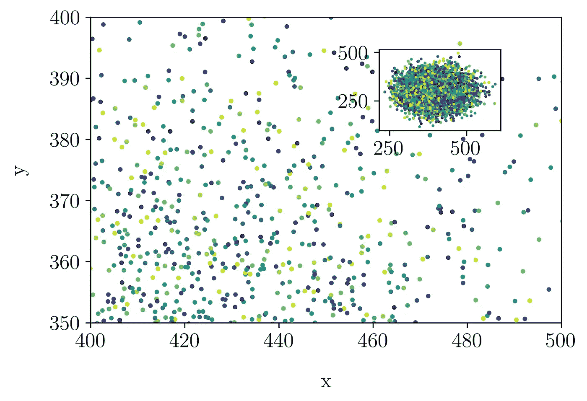

**图 5。**Matplotlib 中的缩放效果(图片由作者提供)

首先你需要了解 ***plt.axes*** ()和***PLT . figure()****的区别。*你可以在下面的链接里回顾一下。Code **plt.figure()** 覆盖了单个容器中的所有对象，包括轴、图形、文本和标签。Code **plt.axes()** 只是涵盖了具体的支线剧情。图 6 可以给你一个简单的理解，我觉得。


**图 6。**Matplotlib 中图形和轴的区别(图片由作者提供)

黑色方框位于 **plt.figure()** 下方，红色和蓝色方框位于 **plt.axes()** 下方。在图 6 中，有两个轴，红色和蓝色。您可以查看此链接以获得基本参考。

[](https://medium.com/datadriveninvestor/python-data-visualization-with-matplotlib-for-absolute-beginner-python-part-ii-65818b4d96ce) [## 用 Matplotlib 实现 Python 数据可视化——完全 Python 初学者第二部分

### 在这一部分中，我们将学习使用 Jupyter Notebook 在 matplotlib 中调整颜色、轴限制和制作网格…

medium.com](https://medium.com/datadriveninvestor/python-data-visualization-with-matplotlib-for-absolute-beginner-python-part-ii-65818b4d96ce) 

理解了之后，就可以分析如何创建图 5 了。简单来说，图 5 中有两个轴。第一个轴是一个大图，从 580 到 650 的放大版本，第二个轴是缩小版本。下面是创建图 5 的代码。

如果你需要代码的基本解释，你可以访问这个链接。

[](https://medium.com/datadriveninvestor/data-visualization-with-matplotlib-for-absolute-beginner-part-i-655275855ec8) [## 用 Matplotlib 实现数据可视化——绝对初学者第一部分

### 这是使用 Matplotlib 和 Jupyter Notebook(一个强大的 phyton 模块)可视化我们的数据的教程。

medium.com](https://medium.com/datadriveninvestor/data-visualization-with-matplotlib-for-absolute-beginner-part-i-655275855ec8) 

我也给出了另一个版本的缩放效果，你可以使用 Matplotlib。如图 7 所示。


**图 7。**Matplotlib 中的缩放效果(图片由作者提供)

要创建图 7，需要在 Matplotlib 中使用 ***add_subplot*** 或另一种语法( ***subplot*** )创建三个轴。在这里，我只是使用 ***add_subplot*** 并避免使用循环来使它更容易。要创建它们，可以使用下面的代码。

代码将生成一个图形，如图 8 所示。它告诉我们，它将生成 2 行 2 列。Axes ***sub1*** (2，2，1)是支线剧情中的第一个轴(第一行，第一列)。该序列从左上侧到右侧开始。第二轴 **sub2** (2，2，2) 放置在第一行第二列。最后的轴， **sub3** (2，2，(3，4))，是第二行第一列和第二行第二列之间的合并轴。

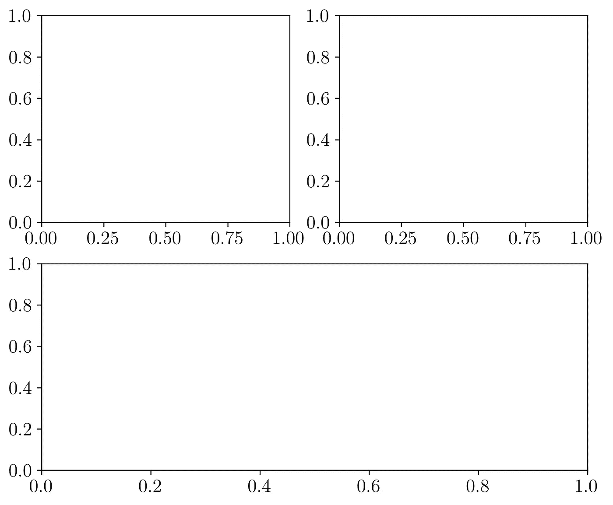

**图 8。**Matplotlib 中的三个复杂轴

当然，我们需要定义一个模拟数据，以便在您的图中可视化。这里，我定义了线性和正弦函数的简单组合，如下面的代码所示。

如果您将该代码应用到前面的代码中，您将得到一个图，如图 9 所示。

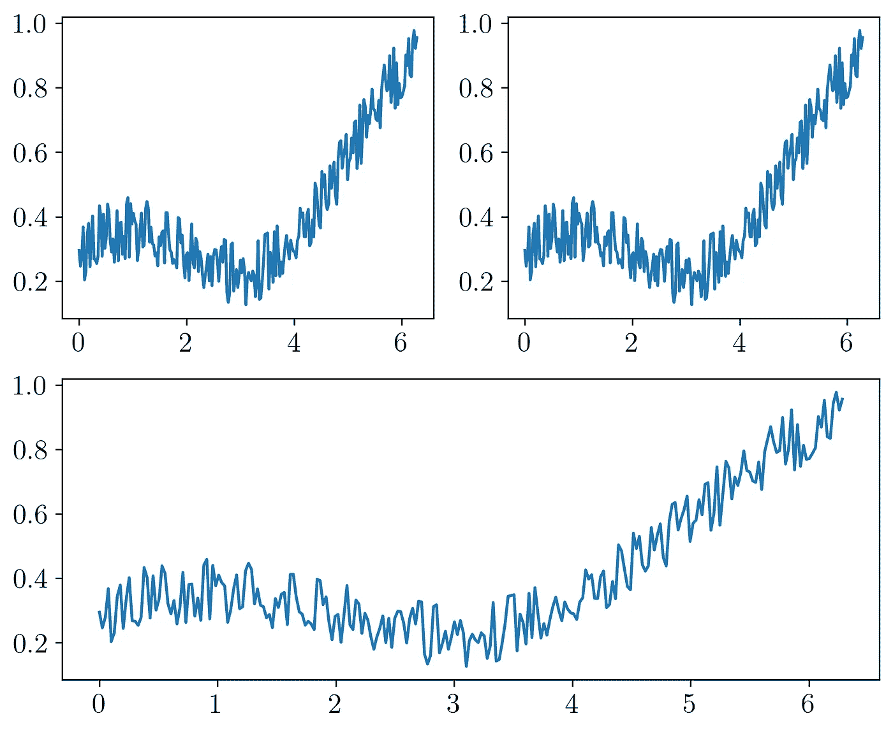

**图九。Matplotlib 中的复杂轴(图片由作者提供)**

下一步是在第一和第二轴( **sub1** 和 **sub2** )中限制 x 轴和 y 轴，在 **sub3** 中为两个轴创建遮挡区域，并创建作为缩放效果代表的**connection patch【T35(s)**。这可以使用完整的代码来完成(记住，为了简单起见，我没有使用循环)。****

**该代码将为您提供一个出色的缩放效果图，如图 7 所示。**

****3。创建发件箱图例****

**你的图有很多图例要在图中显示吗，比如图 10？如果是，您需要将它们放置在主轴之外。**

**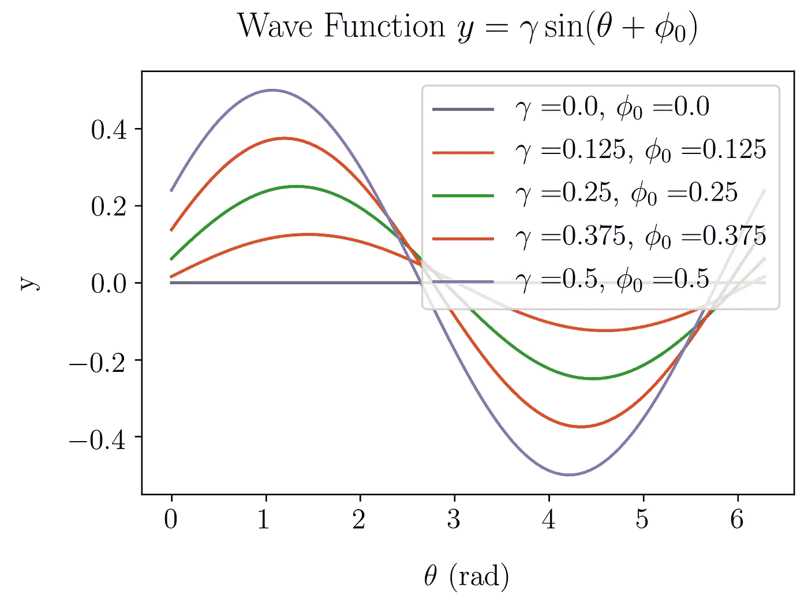**

****图 10。**五个不同的情节和一个糟糕的传说(图片由作者提供)**

**要将图例放置在主容器之外，您需要使用以下代码调整位置**

```
plt.legend(bbox_to_anchor=(1.05, 1.04)) # position of the legend
```

**1.05 和 1.04 的值在朝向主容器的 x 和 y 轴坐标中。你可以改变它。现在，将上面的代码应用到我们的代码中，**

**运行代码后，它会给出一个图，如图 11 所示。**

**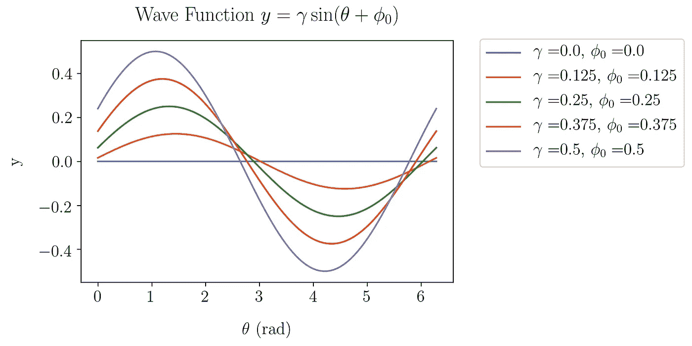**

****图 11。**五个不同的情节和一个美好的传说(图片由作者提供)**

**如果想让图例框更漂亮，可以使用下面的代码添加阴影效果。它将显示一个图，如图 12 所示。**

```
plt.legend(bbox_to_anchor=(1.05, 1.04), shadow=True)
```

**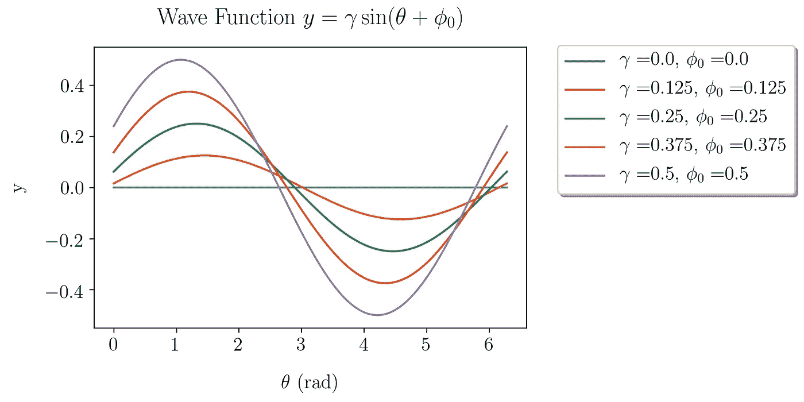**

****图 12。**Matplotlib 中奇特的发件箱图例(图片由作者提供)**

****4。创建连续误差图****

**在过去的十年中，数据可视化的风格被转移到一个干净的绘图主题。通过阅读国际期刊或网页上的一些新论文，我们可以看到这种转变。最流行的一种方法是可视化带有连续误差的数据，而不是使用误差线。您可以在图 13 中看到它。**

**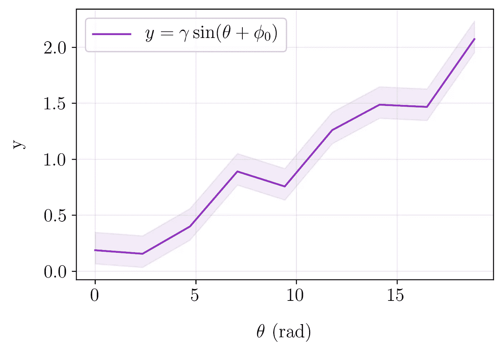**

****图十三。**Matplotlib 中的连续误差图(图片由作者提供)**

**使用 ***fill_between 生成图 13。*** 在 **fill_between** 语法中，需要定义上限和下限，如图 14 所示。**

**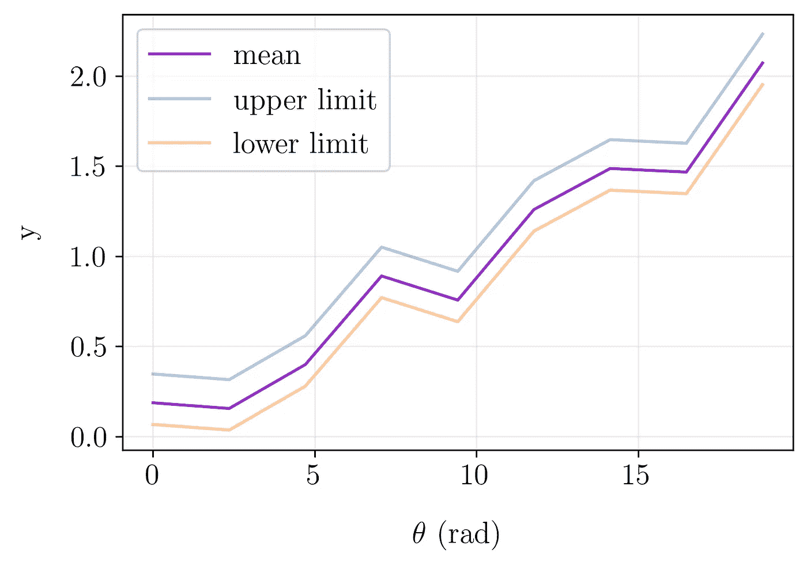**

****图 14。**定义上下限(图片由作者提供)**

**要应用它，您可以使用以下代码。**

```
plt.fill_between(x, upper_limit, lower_limit)
```

**自变量 ***上限*** 和 ***下限*** 可以互换。这是完整的代码。**

****5。调节盒垫边缘****

**如果你分析上面的每个代码，你会得到一个语法***PLT . save fig()***后面跟一个复杂的实参: ***bbox_inches*** 和 ***pad_inches。当你在撰写一篇期刊或文章时，它们是在为你提供便利。如果不包括它们，保存后，您的绘图会有更大的余量。图 15 显示了带 ***bbox_inches*** 和 ***pad_inches*** 和不带它们的不同曲线图。*****

**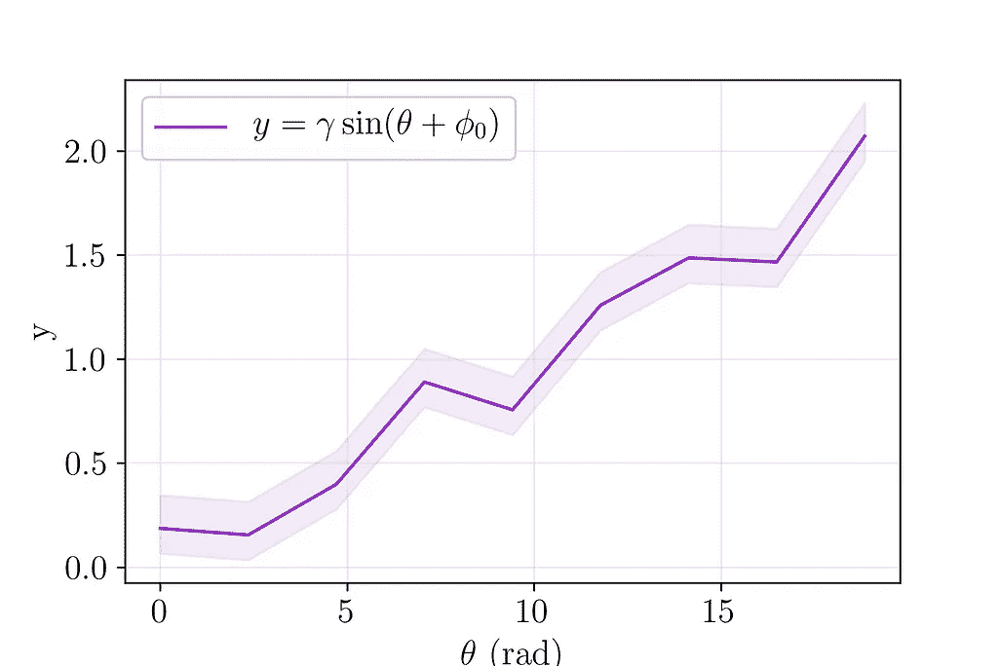****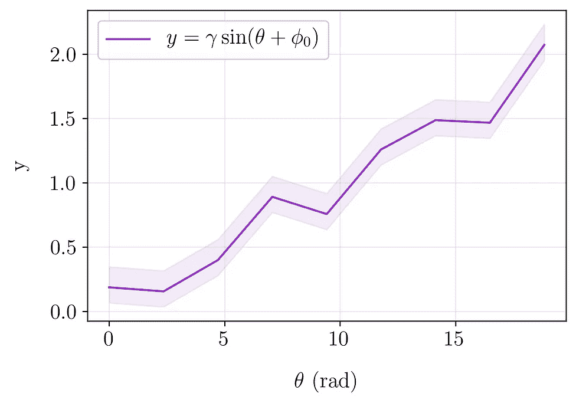**

**图 15。**左:**保存无页边距设置的图，**右:**有页边距设置(图片由作者提供)。**

**我认为你看不出图 15 中两个图的区别。我将尝试用不同的背景颜色来呈现它，如图 16 所示。**

**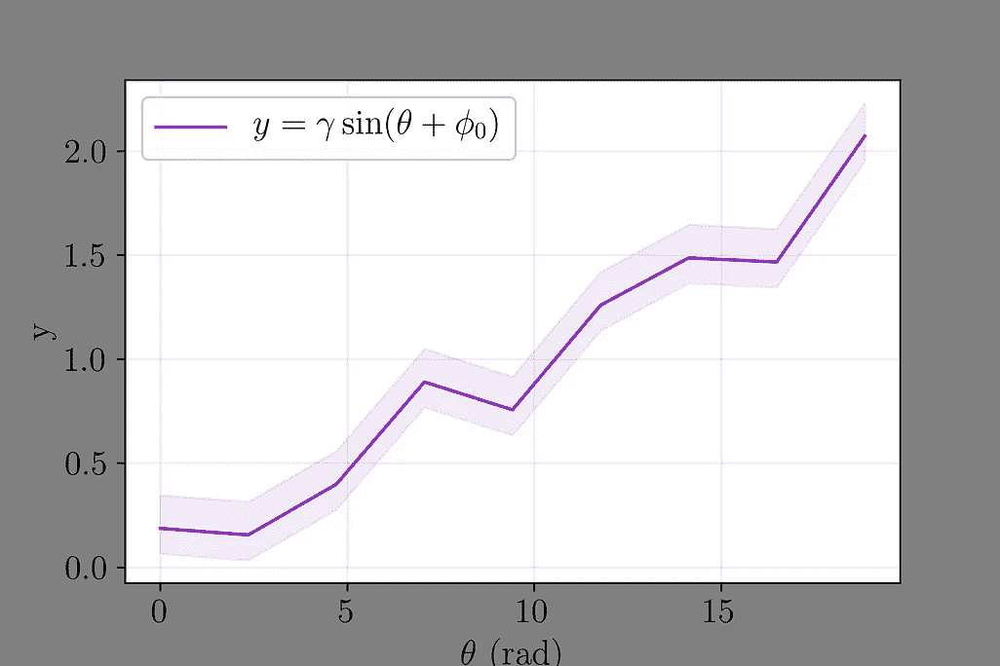****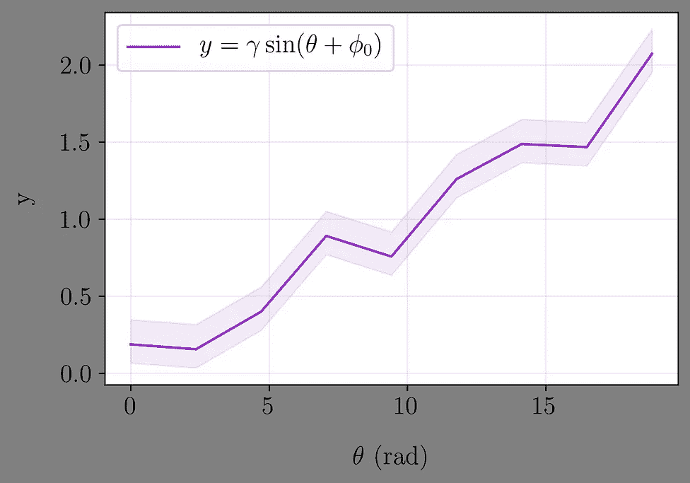**

**图 15。**左:**保存无边距设置的图，**右:**有边距设置(图片由作者提供)。**

**同样，当你把你的情节插入一篇论文或一篇文章时，这个技巧会帮助你。你不需要裁剪它来节省空间。**

****结论****

**Matplotlib 是一个多平台库，可以玩很多操作系统。这是一个用来可视化你的数据的老库，但是它仍然很强大。因为开发人员总是根据数据可视化的趋势进行一些更新。上面提到的一些技巧就是更新的例子。我希望这个故事可以帮助你更有趣地可视化你的数据。**

## **如果你喜欢这篇文章，这里有一些你可能喜欢的其他文章:**

**[](/visualizations-with-matplotlib-part-1-c9651008b6b8) [## 使用 Matplotlib 实现 Python 数据可视化—第 1 部分

### 完成了从基础到高级的 Python 绘图的 Matplotlib 教程，包含 90 多个示例

towardsdatascience.com](/visualizations-with-matplotlib-part-1-c9651008b6b8) [](/matplotlib-styles-for-scientific-plotting-d023f74515b4) [## 用于科学绘图的 Matplotlib 样式

### 为您的科学数据可视化定制 Matplotlib

towardsdatascience.com](/matplotlib-styles-for-scientific-plotting-d023f74515b4) [](/creating-colormaps-in-matplotlib-4d4de78a04b8) [## 在 Matplotlib 中创建色彩映射表

### 从颜色列表中创建和定制自己的色彩映射表的指南

towardsdatascience.com](/creating-colormaps-in-matplotlib-4d4de78a04b8) [](/customizing-multiple-subplots-in-matplotlib-a3e1c2e099bc) [## 在 Matplotlib 中自定义多个子情节

### 使用 subplot、add_subplot 和 GridSpec 在 Matplotlib 中创建复杂 subplot 的指南

towardsdatascience.com](/customizing-multiple-subplots-in-matplotlib-a3e1c2e099bc) [](/introduction-to-big-data-a-simple-code-to-read-1-25-billion-rows-c02f3f166ec9) [## Vaex 大数据简介—读取 12.5 亿行的简单代码

### 用 Python 高效读取和可视化 12.5 亿行星系模拟数据

towardsdatascience.com](/introduction-to-big-data-a-simple-code-to-read-1-25-billion-rows-c02f3f166ec9) 

仅此而已。感谢您阅读这个故事。喜欢就评论分享。我还建议您关注我的帐户，以便在我发布新故事时收到通知。**