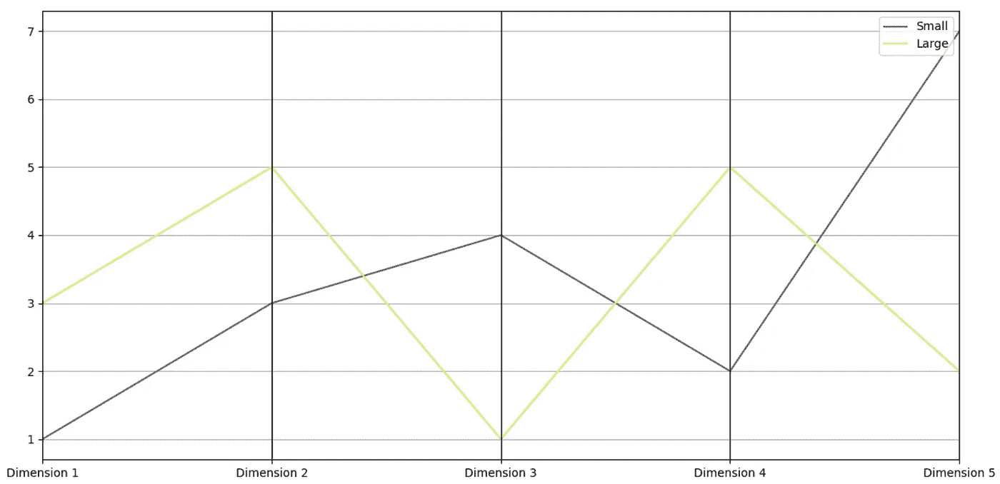

# 5 强大的熊猫数据预处理可视化

> 原文：<https://towardsdatascience.com/5-powerful-visualisation-with-pandas-for-data-preprocessing-bbf6a2033efd?source=collection_archive---------7----------------------->

## “一个眼神胜过千言万语。”分析数据点的探索性数据分析(EDA)是在为算法建立数据模型之前制定假设的正确步骤。


由作者使用文中提到的 Python 代码绘制

我在相对初级的数据科学家和机器学习专业人员中反复观察到的最常见的陷阱之一是，花数小时为他们的项目寻找最佳算法，而没有花足够的时间首先理解数据。

处理数据科学和机器学习项目的结构化方法始于项目目标。同一组数据点可以推断出几件事情的有意义的信息。基于我们正在寻找的东西，我们需要关注数据的不同方面。一旦我们明确了目标，我们就应该开始考虑同样目标所需的数据点。这将使我们能够专注于最相关的信息集，而忽略可能不重要的数据集。

在现实生活中，大多数时候从几个来源收集的数据都有空白值、打字错误和其他异常情况。在进行任何数据分析之前，清理数据至关重要。

在本文中，我将讨论五个强大的数据可视化选项，它们可以立即提供数据特征的感觉。甚至在正式建模或假设测试任务之前，执行 EDA 就传达了许多关于数据和特性之间关系的信息。

在本系列的下一篇文章中，我已经讨论了[探索性数据分析(EDA)的高级可视化](/5-advanced-visualisation-for-exploratory-data-analysis-eda-c8eafeb0b8cb)

**步骤 1-** 我们将导入包 pandas、matplotlib、seaborn 和 NumPy，我们将使用它们进行分析。

我们需要 pandas 中的散点矩阵、自相关图、滞后图和平行坐标来绘图。

```
import pandas as pd
import numpy as np
import matplotlib.pyplot as plt
from pandas.plotting import autocorrelation_plot
import seaborn as sns
from pandas.plotting import scatter_matrix
from pandas.plotting import autocorrelation_plot
from pandas.plotting import parallel_coordinates
from pandas.plotting import lag_plot
```

***步骤 2-*** 在 Seaborn 包中，有一个很小的内置数据集。我们将使用“mpg”、“tips”和“attention”数据进行可视化。在 seaborn 中，使用 load_dataset 方法加载数据集。

```
"""Download the datasets used in the program """
CarDatabase= sns.load_dataset("mpg")
MealDatabase= sns.load_dataset("tips")
AttentionDatabase= sns.load_dataset("attention")
```

***Hexbin 地块***

我们经常使用散点图来快速掌握变量之间的关系。只要图中没有过于拥挤的密集数据点，获得洞察力真的很有帮助。

在下面的代码中，我们绘制了“mpg”数据集中“加速度”和“马力”数据点之间的散点图。

```
plt.scatter(CarDatabase.acceleration ,CarDatabase.horsepower,marker="^")
plt.show()
```

散点图中点密集，从中获取有意义的信息有点困难。


由作者使用文中提到的 Python 代码绘制

Hexbins 是解决重叠点散点图的一个非常好的替代方案。在 hexbin 图中，每个点不是单独绘制的。

在下面的代码中，我们在“加速度”和“马力”之间绘制了一个具有相同数据集的 hexbin。

```
CarDatabase.plot.hexbin(x='acceleration', y='horsepower', gridsize=10,cmap="YlGnBu")
plt.show()
```

我们可以清楚地推导出加速度和马力值范围集中在赫克斯宾图和变量之间的负线性关系。六边形的大小取决于“网格大小”参数。

*自我探索:*我鼓励你改变网格大小参数，观察 hexbin 图的变化。


用文章中提到的代码绘制

***热图***

热图是我个人最喜欢查看不同变量之间的相关性。那些在 Medium 上关注我的人可能已经注意到我经常使用它。

在下面的代码中，我们计算 seaborn“mpg”数据集中所有变量之间的成对相关性，并将其绘制为热图。

```
sns.heatmap(CarDatabase.corr(), annot=True, cmap="YlGnBu")
plt.show()
```

我们可以看到“气缸”和“马力”是紧密正相关的(正如汽车中所预期的)，重量与加速度成反比。只需几行代码，我们就可以快速理解所有不同变量之间的指示性关系。


用文章中提到的代码绘制

***自相关图***

自相关图是确定数据点是否随机的快速试金石。如果数据点遵循某一趋势，那么一个或多个自相关将显著非零。图中的虚线显示 99%，置信带。

在下面的代码中，我们检查“tips”数据库中的 total_bill 金额是否是随机的。

```
autocorrelation_plot(MealDatabase.total_bill)
plt.show()
```

我们可以看到，对于所有时滞，自相关图都非常接近于零，这表明 total_bill 数据点是随机的。


用文章中提到的代码绘制

当我们为遵循特定顺序的数据点绘制自相关图时，我们可以看到该图明显不为零。

```
data = pd.Series(np.arange(12,7000,16.3))
autocorrelation_plot(data)
plt.show()
```


用文章中提到的代码绘制

***滞后地块***

滞后图还有助于验证数据集是一组随机值还是遵循某种趋势。

当绘制来自“tips”数据集的“total_bills”值的滞后图时，如在自相关图中，滞后图表明它是到处都有值的随机数据。

```
lag_plot(MealDatabase.total_bill)
plt.show()
```


用文章中提到的代码绘制

当我们绘制一个非随机数据序列时，如下面的代码所示，我们得到一条平滑的线。

```
data = pd.Series(np.arange(-12*np.pi,300*np.pi,10))
lag_plot(data)
plt.show()
```


用文章中提到的代码绘制

***平行坐标***

将我们的头脑包裹起来并可视化三维以上的数据总是一个挑战。绘制高维数据集平行坐标非常有用。每个维度由一条垂直线表示。

在平行坐标中，“N”条等间距垂直线代表数据集的“N”个维度。顶点在第 n 轴上的位置对应于该点的第 n 个坐标。

扑朔迷离！

让我们考虑一个小样本数据，它包含大小不同的小部件的五个特性。


垂直线代表小部件的每个功能。一系列连续的线段代表“小”和“大”部件的特征值。



用文章中提到的代码绘制

下面的代码绘制了 seaborn 中“attention”数据集的平行坐标。请注意，群集的点看起来靠得更近。

```
parallel_coordinates(AttentionDatabase,"attention",color=('#556270', '#C7F464'))
plt.show()
```


用文章中提到的代码绘制

如果您还没有使用探索性数据分析，我希望您开始使用这些开箱即用的图来执行探索性数据分析。我想听听你最喜欢的 EDA 可视化情节。

了解 Scikit-Learn 于 2020 年 5 月推出的[复合估算器和管道](/productivity-booster-interactive-visualisation-of-composite-estimator-and-pipeline-407ab780671a)的交互式可视化。

阅读我关于[探索性数据分析(EDA)的高级可视化](/5-advanced-visualisation-for-exploratory-data-analysis-eda-c8eafeb0b8cb)的文章，了解关于这个主题的更多信息。

如果你想了解深度学习模型中的张量板和可视化，那么请阅读文章[深度学习中的准确性可视化](/accuracy-visualisation-in-deep-learning-part-1-b42d32b07913)

如果你想学习一种结构化的方法来识别适当的独立变量以做出准确的预测，那么请阅读我的文章[“如何识别机器学习监督的正确独立变量](/how-to-identify-the-right-independent-variables-for-machine-learning-supervised-algorithms-439986562d32)。

```
"""Full code"""import pandas as pd
import numpy as np
import matplotlib.pyplot as plt
from pandas.plotting import autocorrelation_plot
import seaborn as sns
from pandas.plotting import scatter_matrix
from pandas.plotting import autocorrelation_plot
from pandas.plotting import parallel_coordinates
from pandas.plotting import lag_plotCarDatabase= sns.load_dataset("mpg")
MealDatabase= sns.load_dataset("tips")
AttentionDatabase= sns.load_dataset("attention")plt.scatter(CarDatabase.acceleration ,CarDatabase.horsepower, marker="^")
plt.show()CarDatabase.plot.hexbin(x='acceleration', y='horsepower', gridsize=10,cmap="YlGnBu")
plt.show()sns.heatmap(CarDatabase.corr(), annot=True, cmap="YlGnBu")
plt.show()autocorrelation_plot(MealDatabase.total_bill)
plt.show()data = pd.Series(np.arange(12,7000,16.3))
autocorrelation_plot(data)
plt.show()lag_plot(MealDatabase.total_bill)
plt.show()data = pd.Series(np.arange(-12*np.pi,300*np.pi,10))
lag_plot(data)
plt.show()parallel_coordinates(AttentionDatabase,"attention",color=('#556270', '#C7F464'))
plt.show()
```