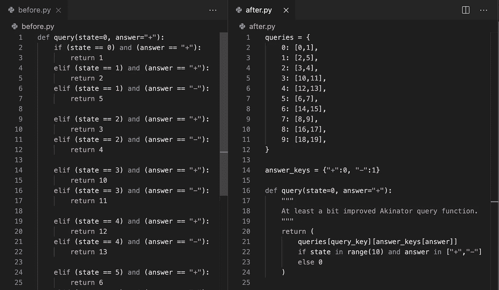

# 作为数据科学家或 ML 工程师，提高 python 技能的 5 个专业技巧

> 原文：<https://towardsdatascience.com/5-pro-tips-to-grow-your-python-skills-as-a-data-scientist-or-ml-engineer-1b899a91d6e?source=collection_archive---------30----------------------->

## Patrick 的博客—数据科学

## 从我作为数据科学家和机器学习工程师的旅程中学到的经验

不要做什么的例子，以及你可以如何改进(此处此图[的灵感)。图片作者。)](https://github.com/sobolevn/python-code-disasters/blob/master/python/akinator.py)

就像大多数从中断的学术生涯中走出来的数据科学家一样(不管是不是自愿的，对我来说两者都有一点！)，出于成为数据科学家/机器学习者的需要，我开始改进我的 python 技能。直到我使用 python 大约一年后，我才开始深深地担心我的 python 技能(为此我要感谢一些人，感谢[托马斯·莫亚诺](https://www.linkedin.com/in/tomasimoyano/)、[丹尼尔·蒙塔诺](https://www.linkedin.com/in/supdann/)和[埃里克·莫法·莫拉莱斯](https://www.linkedin.com/in/ericmorfamorales/)对我作为开发人员的批评，这极大地帮助了我的进步！).

所以我想分享我的经验，告诉大家在我过去的两年里，作为一名数据科学家，同时也是一名开发人员，帮助我提高最快的技巧是什么。

> “一个程序员一个月能做到的，两个程序员两个月就能做到。”
> 
> 弗雷德里克·布鲁克斯

1.  **掌握 git，并为其使用 GUI**

大多数开始的人会被告知“以后再担心 git，首先从编写好的代码开始”或“在开始时使用终端，这是真正的专业人员的做法”。我完全不同意这一点，因为我的个人经验告诉我不是这样…尽管这也是矛盾的事实，即创建任何类型的内容的第一条规则是“专注于内容，然后是内容，然后，如果你有时间，改进内容”。

Git 不仅仅是你工具箱里的一个工具。它记录您的更改，因此您不仅可以跟踪您的工作，还可以跟踪您的改进，并且它使您能够通过恢复更改来修复您的错误。你也可以同时处理不同的想法，通过将它们分开来管理你的时间。这是非常宝贵的，尤其是在学习阶段，您可以通过向提交添加有用的消息来注释对代码的修改。

我也强烈推荐使用 GUI，如 [SourceTree](https://www.sourcetreeapp.com/) 或 [GitKraken](https://www.gitkraken.com/) ，能够直观地看到你的代码库的发展。作为开始， [Git 手册](https://guides.github.com/introduction/git-handbook/)会给你一些基础知识，我也强烈建议创建一个虚拟仓库，对它进行测试修改(或者更好，在一个小项目上进行实际的修改),以测试命令并熟悉 Git 和贵由想要使用的东西。使用 GUI 的主要原因非常简单:你打开这个东西，一眨眼的功夫就能看到整个存储库中发生了什么。git 命令行工具永远无法实现这种级别的通信，与存储库的当前状态保持同步是至关重要的。在我看来，Git 存储库是一个非常可视化的对象，所以它应该被可视化。

2.**学习你所使用的编程语言的基础知识**

Python 是用于数据科学和机器学习的主要语言，但这不是它的唯一用途，有些人可能还在使用 R、JavaScript、Go，甚至 Java(呸！)用于他们的用例/工作。Python 是作为一种成熟的编程语言而设计的，它有大量的用例，所以它非常通用、灵活和有用。学习使用它将使你更有效率和生产力，不仅在你的数据科学或机器学习生涯中，而且作为一名开发人员。

这里有一个简短的清单，列出了你可能想了解的一些事情(按难易程度排列):

*   [列表理解](https://www.pythonforbeginners.com/basics/list-comprehensions-in-python)和[字典理解](https://www.datacamp.com/community/tutorials/python-dictionary-comprehension)
*   [文档字符串](https://www.python.org/dev/peps/pep-0257/)
*   [发电机](https://wiki.python.org/moin/Generators)
*   [装修工](https://realpython.com/primer-on-python-decorators/)
*   [上下文管理器](https://jeffknupp.com/blog/2016/03/07/python-with-context-managers/)
*   协议(如[描述符协议](https://docs.python.org/3/howto/descriptor.html?highlight=descriptor)或[复制协议](https://docs.python.org/3/library/copy.html)
*   类继承(虽然如果你以前学过另一种语言，这可能是已知的，但是回顾一下也无妨)
*   python 中的 [MRO，以及如何很好地使用 Mixins(以及不好的使用，所以你不要做那些！).](https://data-flair.training/blogs/python-multiple-inheritance/)
*   一般的软件工程(例如:[树遍历](https://en.wikipedia.org/wiki/Tree_traversal)、[算法的计算复杂度](https://en.wikipedia.org/wiki/Computational_complexity)、[管理内存](https://en.wikipedia.org/wiki/Space_complexity)等)。).

3.**使用 makefile**

一个 [Makefile](https://en.wikipedia.org/wiki/Makefile) 可以被看作是存储在一个文本文件中的终端快捷命令的集合，该文本文件集成了 *make* 命令行实用程序。看一下[本教程](https://opensource.com/article/18/8/what-how-makefile)了解如何使用 Makefiles。这是一个开始实现的简单技巧，但是它有两个主要影响:

*   它使复杂的命令更容易键入，从而节省了您的时间。您不必记住运行特定命令所需的所有参数、路径和环境变量，这样您就可以将更多的精力放在更重要的事情上。
*   它很自然地记录了您的存储库，而不是它的功能，而是它的用途。在一个存储库中看到一个 Makefile 文件，并用来运行存储库中的代码，这意味着开发人员第一次看到您的代码时，已经对如何运行您的脚本有了大致的了解。(您也可以将注释放在 Makefile 中，但是理想情况下，将您的指令放在 README.md 文件中，在那里您可以详细解释命令应该如何运行！)

4.**尽早学习如何使用单元测试**

当我开始写代码时，有一件事我一直在做:我写了一些代码，我会打开一个终端，然后我会将我的代码粘贴到终端中，然后继续玩它，看看它是否像我想要的那样工作。如果您打算使用这段代码一次或两次，这是最佳选择。如果你打算用更多的时间，那完全是浪费时间。(这是编程中的一个通用模式:如果你做一件事超过两次，你应该*可能*自动化它。有时候即使你做了两次。更少的次数，即使你只做一次。但是在某些时候，Python 的禅应该开始了:过早的优化是万恶之源！)

你应该做的是熟悉 python 库 [unittest](https://docs.python.org/3/library/unittest.html) 。它内置于 python 中，工作非常出色。它允许你做的是:你在终端里写的那个东西？您在单元测试中编写它，然后您所要做的就是从终端运行该测试(理想情况下，在 Makefile 中编写一个快捷方式来调用您的测试脚本)。

5.**学习 python 的标准库**

多少次我试图变得聪明，写一些超级复杂的代码(看起来也很复杂)来解决一个已经被 python 的标准库解决的问题！我给你举个例子。

假设你面前有一周中每天的自助餐厅菜单。所以你有两本字典:

你想写一个函数来生成下面的句子:

当然，现在你可以看到模板:

但是我们如何一次迭代所有这些呢？

一个简单的方法是创建一个新的数据结构(理想的是第一个例子，带有列表理解，不太理想的是第二个例子，完全没有自动化，但是它们创建了相同的结构):

然后在 for 循环中使用该数据结构:

稍微简单一点的方法是进行 for 循环并使用字典:

但是这使得 f 弦读起来有点不自然。理想的方法是，如果我们能够命名这些变量，它们实际上是什么，这是有可能的与 *zip！*

它有许多优点:

*   提高了可读性。现在你的 f-string 准确地说出了它在做什么，你的变量也准确地以它们的名字命名。(我提到过你应该在 python 中使用 f 字符串吗？他们太棒了！)
*   不需要中间数据结构。你所做的只是使用你已经拥有的数据和使用标准的库函数，所以它是快速、有效和可重复使用的。另外，当你学会经常使用这些技巧时，你可以以一种非常灵活和有效的方式重用你已经拥有的数据结构。
*   代码更少。由于 *zip* 是标准库的一部分，您不需要重新阅读或维护构建迭代器的逻辑，它基本上记录了它自己(因为您的变量是根据它们所代表的来命名的),并且您没有实现任何新的东西，所以您的代码保持更加简洁。

标准库中有如此多的工具，我鼓励您像上述情况一样探索改进您的代码，例如

*   [itertools](https://docs.python.org/3/library/itertools.html) (计数、重复、循环、乘积、组合、排列等。)
*   [收藏](https://docs.python.org/3/library/collections.html)(计数器(！！！)，defaultdict)
*   [随机](https://docs.python.org/3/library/random.html)(选择，样本)
*   [functools](https://docs.python.org/3/library/functools.html) (部分，装修者包装)

还有更多！

我相信，作为一名数据科学家，如果你在业余时间花点时间做一点这五个步骤，你的编码技能会增长得非常快，你会很快变得更有效率。

请在评论中告诉我你对这篇文章的看法！