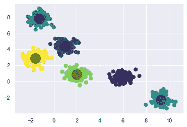
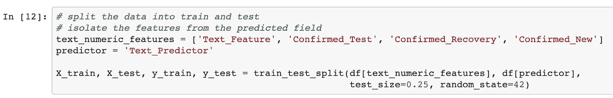

# 每个数据科学家都应该知道的 5 个专业项目

> 原文：<https://towardsdatascience.com/5-professional-projects-every-data-scientist-should-know-e89bf4e7e8e1?source=collection_archive---------8----------------------->

## 客户细分、文本分类、情感、时间序列和推荐系统。


[freestocks](https://unsplash.com/@freestocks?utm_source=unsplash&utm_medium=referral&utm_content=creditCopyText) 在[Unsplash](https://unsplash.com/s/photos/netflix?utm_source=unsplash&utm_medium=referral&utm_content=creditCopyText)【1】上拍摄的照片。

# 目录

1.  介绍
2.  客户细分
3.  文本分类
4.  情感分析
5.  时间数列预测法
6.  推荐系统
7.  摘要
8.  参考

# 介绍

本文的目标是概述专业数据科学家最终将执行或应该执行的项目。我参加了很多数据科学方面的训练营和教育课程。虽然它们在某种程度上都很有用，但我发现有些人忘记强调数据科学的实际应用。当您从教育型数据科学家过渡到专业数据科学家时，知道会发生什么是有益的。客户细分、文本分类、情感分析、时间序列预测和推荐系统都可以极大地帮助你的公司。我将深入解释为什么会想到这五个项目，我们希望能激励你在工作中使用它们。

# 客户细分

客户细分是数据科学的一种形式，其中采用无监督和聚类建模技术来开发人群或数据观察的组或段。目标是创建独立的组，但是这些组本身具有密切相关的特性。这种分离和结合的技术术语叫做:

***组间平方和(*******)****

*   *这些独特的群体是多么的不同*

****组内平方和(****WGSS****)****

*   *独特的群体特征有多密切相关*

**

*k-均值聚类。图片作者[2]。*

*正如你在上面的图像中所看到的，这些群体被很好地分开了——BGSS 和紧密地集中在一起——WGSS。这个例子很理想。把每一个集群想象成那些你会用特定营销广告瞄准的群体:'*我们想通过把我们公司的产品作为以年轻专业人士为中心的*来吸引刚毕业的大学生。一些有用的聚类算法有:*

```
*DBSCANK-meansAgglomerative Hierarchical Clustering*
```

****客户细分结果会怎么样？****

*—发现关于特定群体的见解*

*—针对特定群体的营销*

*—首先定义组*

*—跟踪某些组的指标*

> *这种类型的数据科学项目被广泛使用，但在营销行业中最有用。*

# *文本分类*

**

*文本分类实例的特点和目标。作者代码[3]。*

*文本分类属于自然语言处理(NLP)的范畴，NLP 利用技术摄取文本数据。您可以将该算法或项目视为一种通过使用文本特征(*以及数字特征)*对文本标签进行分类的方法。*

*[这里](https://github.com/mprzybyla123/nlp-example/blob/master/code/nlp_example.ipynb)【4】是一个利用文本和数字特征进行文本分类的简单例子。你的文本特征不是只有一个单词，而是可能有数百个，并且需要执行 NLP 技术，比如*词性标注*、*停止单词移除*、 *tf-idf* 、*计数矢量化*等。科学家在 Python 中使用的一个常见库数据是 *nltk* 。这些技术的目标是清理您的文本数据，并创建其自身的最佳表示，从而消除噪声。*

*[](https://github.com/mprzybyla123/nlp-example/blob/master/code/nlp_example.ipynb) [## mprzybyla 123/NLP-示例

### permalink dissolve GitHub 是超过 5000 万开发人员的家园，他们一起工作来托管和审查代码，管理…

github.com](https://github.com/mprzybyla123/nlp-example/blob/master/code/nlp_example.ipynb) 

***文本分类结果会怎么样？***

—观察值的自动分类

—与每个建议类别相关的分数

您还可以对文本文档进行分类，否则手动阅读需要花费数小时。

> 这种类型的项目在金融或历史学家/图书管理员行业非常有用。

# 情感分析

情感分析也属于 NLP 的范畴。这是一种从文本中分配情感分数的方式，或者更具体地说，是极性和主观性。当你有大量的文本数据并且想要消化它来创建好的或坏的情绪等级时，使用情绪分析是有益的。如果你的公司已经有了评级系统，这看起来可能是多余的，但是人们经常会留下与他们的数字分数不匹配的评论。情感分析的另一个好处是，你可以标记出某些你想要突出的关键词或短语，以使你的产品更好。将关键词与关键情感联系起来，可以用来汇总指标，这样你就可以直观地看到你的产品缺少什么，哪里可以进行改进。

***情感分析结果会怎么样？***

—产品改进

—情绪标记为客户服务

> 这种类型的项目在很多行业都很有用，尤其是电子商务、娱乐或任何包含文本评论的领域。

# 时间数列预测法


Sonja Langford 在 [Unsplash](https://unsplash.com/s/photos/time?utm_source=unsplash&utm_medium=referral&utm_content=creditCopyText) 上拍摄的照片。

时间序列可以应用于各种工业部门的几个部分。大多数情况下，时间序列预测最终可用于为未来分配资金或资源。如果你有一个销售团队，他们会从你的预测中受益，投资者也会受益，因为他们看到了你的公司的发展方向(*有望增加销售额*)。更直接地说，如果您为某些员工分配了当天的预测目标，您可以将员工分配到一般位置。一个流行的例子是亚马逊或任何类似的公司，其中消费者有频繁的行为，需要工厂、司机和不同位置的分配，这些将合并在一起。

***时间序列预测结果会怎么样？***

资源的分配

—对未来销售的认识

一些利用时间序列的流行算法是 ARIMA 和 LSTM。

> 这种类型的项目在很多行业也很有用，但通常是在销售或供应管理方面。

# 推荐系统


照片由[西蒙·贝克](https://unsplash.com/@simon_bak?utm_source=unsplash&utm_medium=referral&utm_content=creditCopyText)在[Unsplash](https://unsplash.com/s/photos/amazon?utm_source=unsplash&utm_medium=referral&utm_content=creditCopyText)【6】上拍摄。

虽然你可能在设计网飞的下一个推荐系统算法，也可能不在设计，但你可能会发现自己正在将类似的技术应用于自己业务的几个部分。想想用这种类型的项目，最终实现用户更多产品的销售。作为一名消费者，如果你正在购买某些产品或杂货，但你在购物车的最后看到一些推荐的产品，你可能会倾向于迅速购买这些推荐的产品。将这个结果扩展到每一个用户，你可以让你的公司赚上百万。

以下是数据科学中实现推荐系统的一些常用方法。

**协同过滤——交替最小二乘法(矩阵分解)**

*   其他人和你有多相似，向你推荐他们喜欢的东西

**基于内容的过滤—余弦相似度**

*   您已经购买的产品的属性或特征如何在未来推荐类似的产品

> 这种类型的项目在很多行业也很有用，但通常是在电子商务和娱乐业。

# 摘要

我希望我通过强调这些关键项目给了你一些启发，这些项目你可能已经经常使用，或者作为一名专业数据科学家将要使用。教育中对机器学习的关注，有时候是关注于获得最好的准确性，但专业意义上的数据科学的关注，是帮助你的公司改进产品，帮助人们，节省或赚更多的钱。

*总结一下，这里有五个热门的专业项目可以练习:*

```
customer segmentationtext classificationsentiment analysis time series forecastingrecommender systems
```

*我希望你喜欢我的文章。感谢您的阅读！请随时在下面发表评论，并建议您遇到的其他专业数据科学项目，以便我们都可以改进我们的专业数据科学产品组合。*

# 参考

[1]照片由[自由股票](https://unsplash.com/@freestocks?utm_source=unsplash&utm_medium=referral&utm_content=creditCopyText)在[Unsplash](https://unsplash.com/s/photos/netflix?utm_source=unsplash&utm_medium=referral&utm_content=creditCopyText)(2018)上拍摄

[2] M.Przybyla，k-均值可视化，(2020 年)

[3] M.Przybyla， [nlp-example.ipynb](https://github.com/mprzybyla123/nlp-example/blob/master/code/nlp_example.ipynb) ，(2020 年)

[4] M.Przybyla，[NLP-示例](https://github.com/mprzybyla123/nlp-example)，(2020)

[5]照片由 [Sonja Langford](https://unsplash.com/@sonjalangford?utm_source=unsplash&utm_medium=referral&utm_content=creditCopyText) 在[Unsplash](https://unsplash.com/s/photos/time?utm_source=unsplash&utm_medium=referral&utm_content=creditCopyText)(2014)上拍摄

[6]照片由[西蒙·贝克](https://unsplash.com/@simon_bak?utm_source=unsplash&utm_medium=referral&utm_content=creditCopyText)在[Unsplash](https://unsplash.com/s/photos/amazon?utm_source=unsplash&utm_medium=referral&utm_content=creditCopyText)(2020)上拍摄*