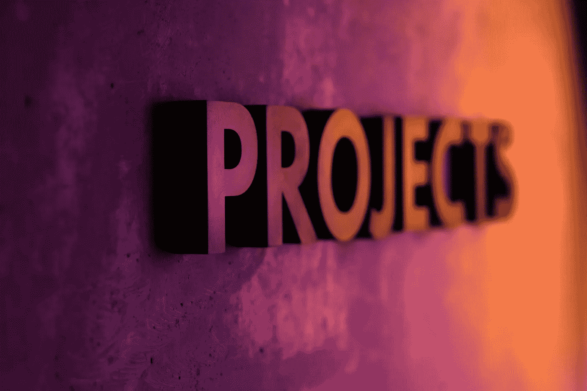
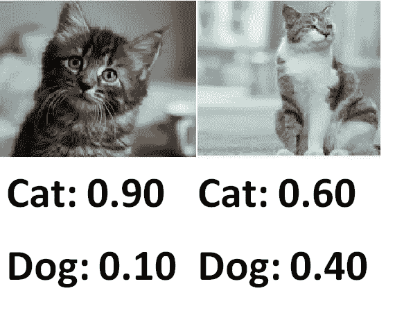

# 有抱负的数据科学家的 5 个项目想法

> 原文：<https://towardsdatascience.com/5-project-ideas-for-aspiring-data-scientists-2c705a11ea36?source=collection_archive---------25----------------------->

## 包括数据源和示例项目。



照片由[屋大维丹](https://unsplash.com/@octadan?utm_source=unsplash&utm_medium=referral&utm_content=creditCopyText)在 [Unsplash](https://unsplash.com/s/photos/projects?utm_source=unsplash&utm_medium=referral&utm_content=creditCopyText)

近年来，数据科学获得了极大的普及。越来越多的企业看到了数据创造价值的潜力。因此，对数据科学家的需求有所增加，这鼓励了许多人在数据科学领域开始职业生涯。现在学数据科学的资源绝对不缺。我没有数过，但我很确定有一千多个与数据科学相关的在线证书。当书籍、播客和 youtube 视频被添加到堆中时，它就成为一个巨大的资源集合来消费。

有各种各样的资源可以学习是很好的。然而，在你学习了基础知识和当前的工具和软件包之后，是时候用项目来挑战自己了。哪些独立的项目增加了你的技能，是在线证书所不能实现的。我有一个关于为什么你应该开始做项目的详细帖子。如果你想看的话，就在这里。

[](/5-reasons-why-you-should-do-projects-instead-of-collecting-data-science-certificates-9023accda6b4) [## 你应该做项目而不是收集数据科学证书的 5 个理由

### 把手弄脏来学习。

towardsdatascience.com](/5-reasons-why-you-should-do-projects-instead-of-collecting-data-science-certificates-9023accda6b4) 

在这篇文章中，我将列出 5 个项目想法以及如何找到相关的数据集。我还会给出一个例子项目的链接，它可以帮助你开始。

# **1。图像分类**

利用深度学习的领域之一是计算机视觉。神经网络在这一领域有许多应用，例如图像识别、检测或生成伪造的图像和视频。神经网络也广泛应用于医疗保健行业。例如，神经网络已经被证明在使用 x 射线的癌症检测中是成功的。图像分类项目将是你进入这一广阔领域的第一步。



二值图像分类

您可能会使用卷积神经网络(CNN)进行图像识别。细胞神经网络通常用于数据科学领域，尤其是计算机视觉和图像分类任务。图像由用数字表示的像素组成。在 CNN 的卷积层中，滤波器(或特征检测器)被应用于图像，以通过保持像素之间的空间关系来提取图像的独特特征。

数据集包含许多不同物体的大量图像。这是训练和测试 CNN 的一个很好的数据集。非常感谢社区准备并让我们使用这个数据集。

以下是创建基本影像分类模型的演练:

[](/a-practical-guide-on-convolutional-neural-networks-cnns-with-keras-21421172005e) [## 带有 Keras 的卷积神经网络实用指南

### 理论解释和实际例子

towardsdatascience.com](/a-practical-guide-on-convolutional-neural-networks-cnns-with-keras-21421172005e) 

# **2。流失预测**

流失预测是机器学习领域的一个常见用例。对于企业来说，了解客户可能流失(即离开公司)的原因和时间非常重要。拥有一个强大而准确的客户流失预测模型有助于企业采取措施防止客户离开公司。


照片由[克里斯·利维拉尼](https://unsplash.com/@chrisliverani?utm_source=unsplash&utm_medium=referral&utm_content=creditCopyText)在 [Unsplash](https://unsplash.com/s/photos/customer?utm_source=unsplash&utm_medium=referral&utm_content=creditCopyText) 上拍摄

提供任何类型服务的公司都担心客户流失。他们想尽可能长久地留住客户。为了完成这项任务，他们需要知道客户何时离开以及为什么离开。

网上有很多客户流失数据集。一个不错的例子是 kaggle 上的“[电信客户流失](https://www.kaggle.com/blastchar/telco-customer-churn)”数据集。

下面是一个流失预测示例的演示:

[](/churn-prediction-with-machine-learning-ca955d52bd8c) [## 基于机器学习的客户流失预测

### 机器学习项目的分步说明。

towardsdatascience.com](/churn-prediction-with-machine-learning-ca955d52bd8c) 

# **3。股票价格预测**

时间序列预测是数据科学的另一个广泛领域，在零售、金融、供应链等许多行业都有应用。历史数据用于预测未来的行为。

股票价格预测是时间序列预测的一个应用，帮助你熟悉这个领域。可以用来预测股票价格的一个关键因素是历史价格。Pandas 是一个 python 数据分析库，它提供了一个非常简单的工具来获取历史股票价格数据。你只需要如下使用 pandas 的 **datareader** 模块:

```
import pandas as pd
from pandas_datareader import data
aapl = data.DataReader("AAPL", 
                        start='2015-1-1',
                        end='2019-12-31',
                        data_source='yahoo')
```

上面的代码下载了苹果(AAPL)的股票价格，并将其保存到一个熊猫数据框中。可以使用参数更改开始和结束日期以及股票名称。

LSTM(长短期记忆)，这是一种 RNN(递归神经网络)，可用于预测股票价格使用历史数据。LSTM 适合对序列数据建模，因为它维护一个内部状态来跟踪它已经看到的数据。LSTMs 的常见应用包括时间序列分析和自然语言处理。

以下是使用 LSTMs 进行股票价格预测的过程:

[](/predicting-apple-stock-prices-with-neural-networks-4aefdf10afd0) [## 用神经网络预测苹果股票价格

### 如何使用递归神经网络预测股票价格？

towardsdatascience.com](/predicting-apple-stock-prices-with-neural-networks-4aefdf10afd0) 

# **4。预测二手车价格或房价**

我敢肯定，你遇到过一个网站或应用程序，给你的汽车或房子的市场价值。其中一些非常普遍，对市场产生了影响。我们可能会用这些价格作为谈判的基础。


艾伦·j·亨德利在 [Unsplash](https://unsplash.com/s/photos/house-price?utm_source=unsplash&utm_medium=referral&utm_content=creditCopyText) 上的照片

预测二手车或房子的价格最好用机器学习来完成。我们建立一个机器学习模型，并用我们已经知道的东西训练它。然后剩下的就是靠我们模型的预测了。

这将是回归的良好实践，回归具有广泛的应用，例如预测预期寿命、销售和需求预测或生产系统的运行效率。

kaggle 上有一个结构良好的[房价](https://www.kaggle.com/c/house-prices-advanced-regression-techniques)数据集。你也可以从网站上搜集自己的数据。网络抓取是数据科学家必须掌握的一项重要技能。

以下是二手车预测任务的一个示例。它还包含一个网页抓取部分:

[](/predicting-used-car-prices-with-machine-learning-fea53811b1ab) [## 用机器学习预测二手车价格

### 从数据收集到模型评估的完整数据科学项目

towardsdatascience.com](/predicting-used-car-prices-with-machine-learning-fea53811b1ab) 

# **5。探索性数据分析**

这一个与我们到目前为止讨论的不同。然而，这也是数据科学家的基本实践。创建机器学习或深度学习模型并不是数据科学家唯一要做的事情。在许多情况下，我们首先需要更深入地挖掘数据。我们应该从许多不同的角度处理数据，以便能够创造数据的价值。数据告诉我们的东西有时候并不那么清晰。我们需要探索数据中的底层结构或关系。因此，探索性数据分析(EDA)是一个非常重要的过程。数据科学家需要熟悉 EDA 中使用的工具，如数据分析和数据可视化库。

你可以选择 Kaggle 或任何其他平台上可用的数据集，并尝试探索它。实践越多，使用 EDA 工具就越容易。我用我感兴趣的数据集练习了很多。一旦你开始发现不那么明显的结构或关系，事情就变得更有趣了。

下面是我做过的几个 EDA 实践:

[](/a-practical-guide-for-exploratory-data-analysis-english-premier-league-cac1e2695d30) [## 探索性数据分析实用指南:英格兰超级联赛

### 探索英超 2019-2020 赛季

towardsdatascience.com](/a-practical-guide-for-exploratory-data-analysis-english-premier-league-cac1e2695d30) [](/a-practical-guide-to-exploratory-data-analysis-spotify-dataset-d8f703da663e) [## 探索性数据分析实用指南:Spotify 数据集

### 一张图胜过千言万语

towardsdatascience.com](/a-practical-guide-to-exploratory-data-analysis-spotify-dataset-d8f703da663e) 

就像任何学习过程一样，我们开始做简单的项目，然后通过做得越来越多来提高水平。我们最终认识到，我们的项目有可能在生产中实现。但是，为了能够达到生产水平，我们需要开始做项目。收集一堆证书不会把我们带到那一步。我建议在学习基础知识后，花时间在项目上。最好的做法是亲自动手，做很多项目。

感谢您的阅读。如果您有任何反馈，请告诉我。