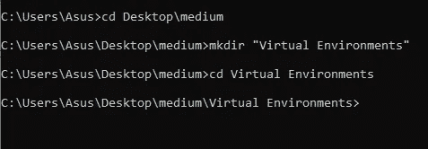
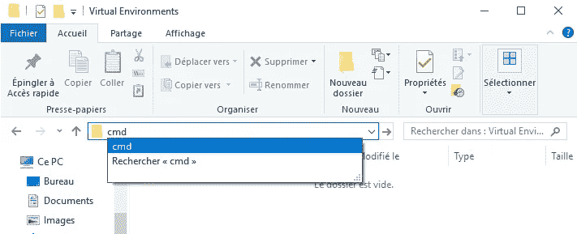
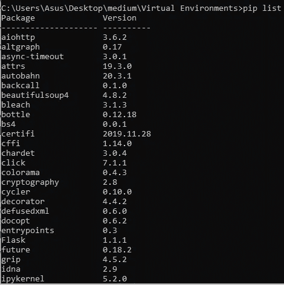
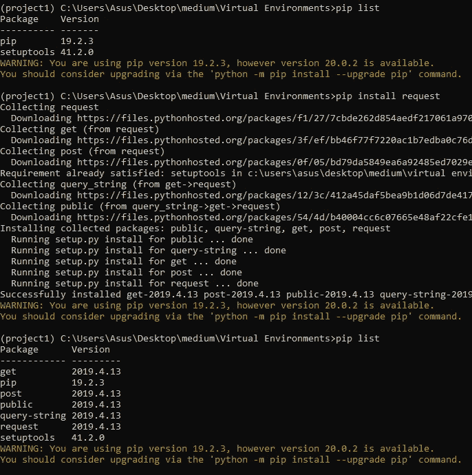
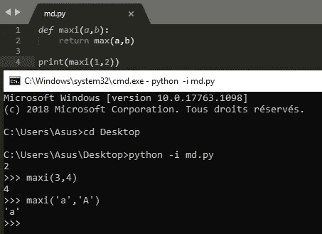

# 让我的生活更轻松的 5 个 Python 技巧

> 原文：<https://towardsdatascience.com/5-python-tips-that-made-my-life-easier-7da77f2cd120?source=collection_archive---------30----------------------->

## 计算机编程语言

## 使用 Python 提高您的工作效率


背景由 [Pakata Goh](https://unsplash.com/@pakata?utm_source=medium&utm_medium=referral) 在 [Unsplash](https://unsplash.com?utm_source=medium&utm_medium=referral)

# 目录

1.  **简介**
2.  **Python 虚拟环境**
3.  **Python 交互外壳**
4.  **Python 调试器**
5.  **λ函数λ**
6.  **列表和字典理解**

# 介绍

## Python 是什么？

Python 是一种流行的**解释的**、**面向对象的**、**高级编程语言**，可用于广泛的**多种**应用:软件开发、web 开发(后端)、数学、数据科学……

> 随着时间的推移，一个好的开发人员总是会寻求提高他的生产力。

所以让我告诉你，让我的 Python 生活变得更容易的 5 个技巧和诀窍。

# 1.Python 虚拟环境:

Python 如此占主导地位的很大一部分原因是因为它有很多好的库。事实上，Python 有这么多好的数学( [NumPy](/scientific-computing-with-python-daaaaddfa122) )、统计、数据分析库，它可能会存在很长一段时间。所以**依赖管理**可能有点烦人，换句话说，你如何找到你需要的特定项目的库，使它可共享和可移植？我们为什么要使用虚拟环境？

所以**虚拟环境**的目的是拥有空间，我们可以在那里安装特定于某个项目的软件包，所以*例如*，假设你有许多使用 Django 版本 1 的 Django 网站，但是你想在一个新项目中开始使用 Django 版本 2，那么，如果你只是使用单个全局环境，那么当你更新到 Django 版本 2 时，它可能会破坏一些使用 Django 版本 1 的旧项目。所以我们不希望所有的项目都指向姜戈·⟹的某个瞬间，每个项目都应该有自己独立的包。我们实现这一目标的方法之一是通过虚拟环境。

> 只需知道，当您使用 Python 时，通常在虚拟环境中工作是最佳实践。

让我们来设置一下我们的环境:

*   **对于 Windows:(内置 venv 模块)**

我们首先需要创建一个新的目录(文件夹)

1.  使用 cmd 命令(`cd`改变目录，`mkdir`创建新目录)。
2.  或者简单地通过使用 Windows Gui 创建一个新文件夹，然后在文件夹的路径上键入`cmd`。



**注意**:要列出您已安装的软件包，您可以在命令提示符(cmd)中键入`pip list`。



要创建虚拟环境，我们只需输入:

```
python -m venv *The name of the folder you want it to be in*
for example:
**python -m venv project1**
```

要激活它:

```
'virtual environment name'\Scripts\activate.bat
for example:
**project1\Scripts\activate.bat**
```



现在，如果我们尝试使用`pip list`，我们可以看到只安装了`pip`和`setuptools`。太好了，我们可以在我们的特定环境中安装某些包。

在这个截图中，我试着安装了'`request`'，所以结果是我们预期得到的。

*   **对于 Linux 和 macOS:(带有 virtualenv 软件包)**

首先，我们必须安装软件包:

```
pip install virtualenv
```

然后创建新环境:

```
virtualenv venv *The name of the folder you want it to be in*
for example:
**virtualenv venv Project2**
```

最后激活虚拟环境:

```
source venv/bin/activate
```

现在我们可以孤立地安装任何依赖项。

# 2.Python 交互式 Shell:

当你使用终端来运行你的 python 脚本时，我们习惯于键入`python filename.py`，但是还有另一种方式来运行你的脚本，那就是通过在文件名前添加`-i`来使用交互式 shell。所以我们可以调用函数或变量来测试和尝试(有点热重装)…

> 这对于开发像机器人这样的东西非常有用。

例如，让我们考虑这个函数:

```
def maxi(a,b):
    return max(a,b)
```



输出

# 3.Python 调试器:

*   **原生 Python 调试器(pdb):**

Python 调试器`set_trace()`方法可以在文件执行完毕之前停止它，这样您就可以调试了(这与插入断点是一样的)。

当我们试图运行这段代码时，会得到一个错误。但是假设这段代码很大，我们不知道错误发生在哪里。在这种情况下，我们可以导入 pdb 模块(内置 python)并调用`set_trace()`方法来停止这段代码的执行:

现在我们可以做不同的事情，例如:

*   [p](https://docs.python.org/3/library/pdb.html#pdbcommand-p) :打印变量和函数的当前值
*   [否](https://docs.python.org/3/library/pdb.html#pdbcommand-next):转到下一行

*你可以通过 kapeli.com*查看 [*这张小抄*](https://kapeli.com/cheat_sheets/Python_Debugger.docset/Contents/Resources/Documents/index)

*因此，这可以帮助我们确定代码在哪里中断，我们甚至可以通过复杂的多级函数调用跟踪调试器。*

> *最棒的一点是你可以内嵌导入 pdb，这样你就不需要在文件的顶部做了。*

*   ***视觉/图形调试器:***

*现代调试器是基于 GUI 的，通常是集成开发环境(IDE)的一部分，或者是具有 IDE 功能的编辑系统的一部分。我建议您使用:*

1.  *[**Visual Studio Code**](https://code.visualstudio.com/)**(vs Code)**:运行在 Windows、macOS、Linux 上的轻量级多语言 IDE/编辑器。*
2.  *[**py charm**](https://www.jetbrains.com/pycharm/)**:**是用于计算机编程的集成开发环境(IDE)，专门针对 Python 语言。它是由捷克公司 JetBrains 开发的。*
3.  *[**Komodo**](https://www.activestate.com/products/komodo-ide/)**:**是一个全功能的 Python IDE E，支持 ActiveState 开发的主流编程语言*

# *4.λ函数λ:*

*我们可以使用关键字`def`创建 Python 函数。Python 为我们提供了另一种创建函数的方法，这种方法非常简短，因为它们仅限于单个指令。*

***语法** : `lambda *arguments* : *expression*` **注意**:一个 lambda 函数可以接受任意数量的参数，但只能有一个表达式。*

> *为什么使用 lambda 函数而不是命名函数？*

*Lambda 函数通常用在特定的上下文中，对于这种情况，使用`def`定义一个函数会不太实用或者更长。例如，如果您想在交互式 shell 中定义一个函数，另一个可能更复杂的例子是在需要回调函数的列表方法(或 [NumPy](/scientific-computing-with-python-daaaaddfa122) )中，例如排序、映射和过滤。*

*关于 **numpy.fromfunction** 和 **Numpy 库**的更多信息，请查看[这篇文章](/scientific-computing-with-python-daaaaddfa122)。*

# *5.列表和字典理解:*

*   ***列表理解:***

*列表理解是**非常强大的工具**，允许使用更接近 Python 中常用语法的映射和过滤。此外，它们允许您同时将贴图和过滤器结合起来。想法很简单:简化代码，使其更具可读性，从而更快地编写**和**，更容易维护**。***

***语法**:*

```
*new_list = [function(item) **for** item **in** list **if** condition(item)]*
```

***示例**:*

*假设我们有这个`Users`列表，我们想从一个对象中提取一个属性，但是在传统语法中要做到这一点，我们至少要写 3 行，使用列表理解，我们只能在一行中完成。*

*我们还可以过滤列表，在最后添加一个条件语句:
例如:如果名称以‘A’开头，那么我们将它添加到新列表中。*

*   ***字典理解:***

*这有点类似于“列表理解”。*

*让我们从`Users`列表中提取一个字典，将用户名作为键，将薪水作为值。通常，我们必须手动循环列表项，但在这种情况下，我们可以只做一行。*

## *资源:*

*   *[https://python . doctor/page-comprehension-list-listes-python-cours-buttants](https://python.doctor/page-comprehension-list-listes-python-cours-debutants)*
*   *[https://open classrooms . com/fr/courses/1206331-utilization-avance ee-des-listes-en-python](https://openclassrooms.com/fr/courses/1206331-utilisation-avancee-des-listes-en-python)*
*   *[https://kapeli . com/cheat _ sheets/Python _ debugger . docset/Contents/Resources/Documents/index](https://kapeli.com/cheat_sheets/Python_Debugger.docset/Contents/Resources/Documents/index)*
*   *[https://www.activestate.com/products/komodo-ide/](https://www.activestate.com/products/komodo-ide/python-editor/)*
*   *[https://en.wikipedia.org/wiki/PyCharm](https://en.wikipedia.org/wiki/PyCharm)*

***感谢阅读！😄***

*[](https://medium.com/@ahmedazizkhelifi)

查看**我的其他文章**并关注我的 [**中型**](https://medium.com/@ahmedazizkhelifi)* 

*哈利菲·艾哈迈德·阿齐兹*