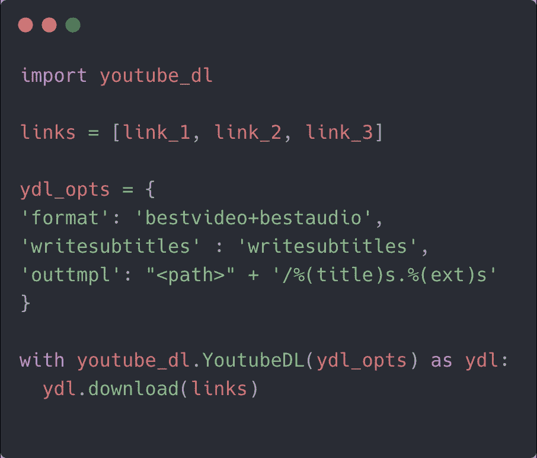
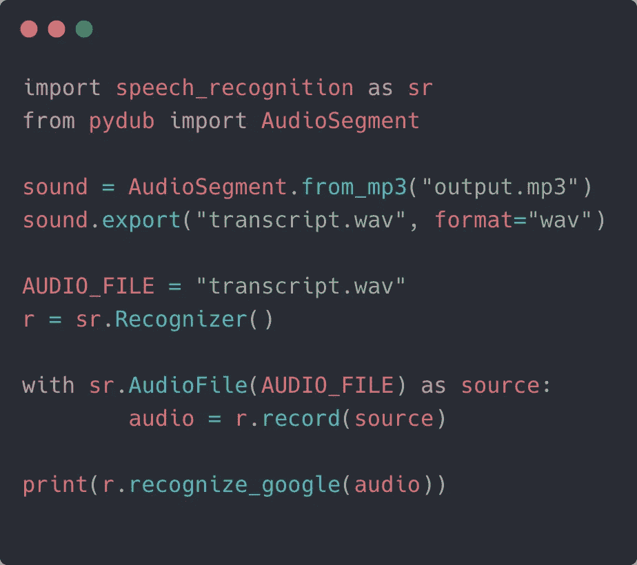

# 5 Python 实用工具和任务

> 原文：<https://towardsdatascience.com/5-python-tricks-to-make-your-life-more-productive-974ebeb54a53?source=collection_archive---------10----------------------->

## 将电子邮件标记为已读，将视频转换为音频再转换为文本等等


由[托比亚斯·齐尔斯](https://unsplash.com/@herrzett?utm_source=medium&utm_medium=referral)在 [Unsplash](https://unsplash.com?utm_source=medium&utm_medium=referral) 上拍照

Python 是当今最受欢迎的编程语言，这在很大程度上归功于其简单的学习曲线。

但是它的流行也归功于它提供的各种各样的模块。难怪它是自动化的绝佳选择，而且几乎是公用事业任务不可或缺的。

你可能是一名数据科学家或前端开发人员，或者只是一名分析师，但以下 Python 工具列表将对所有人都有帮助。其中一些可能是显而易见的，而另一些可能会让你大吃一惊。

# 查看最近的电子邮件，并将所有未读邮件标记为从命令行查看

有多少次你被迫从终端切换到互联网浏览器，只是为了查看最近的电子邮件？每个人都会经历几次，我们中的一员。

通过消除这种上下文切换，您可以加快工作流程并提高生产率。只需使用 python `imaplib`模块，就可以登录你的邮箱并获取邮件。

该库允许您按日期、主题、发件人等过滤电子邮件。因此，使用下面这段代码，您可以获取最新的 n 封电子邮件，而无需手动登录浏览器:

`RFC822`是一种互联网接入消息协议。你也可以从每封邮件回复中查找`Subject`、`Content`和`Date`。

注意:对于双因素身份验证的 Gmail 帐户，在登录方法中传递密码不起作用。您需要生成一个令牌，并通过参考以下步骤在密码字段中设置它:

```
1\. Log into your Gmail account.
2\. Navigate to https://security.google.com/settings/security/apppasswords
3\. In 'select app' choose 'Custom', give it any name name and press generate.
4\. It will give you a token which you can paste in the above script.
```

如今，我们的收件箱充满了促销邮件，这只会增加收件箱的未读数量。当您的收件箱超过 100 页时，选择所有邮件并将其标记为已读是一项非常耗时的任务。

幸运的是，上面的 imap 模块可以让您搜索看不见的邮件，并将它们设置为已读。首先，将前面代码的搜索过滤器改为:

```
mail.search(None, '(UNSEEN)')
```

最后，在 for 循环中添加以下代码:

```
original = email.message_from_bytes(response_part[1])
mail.store(num,'+FLAGS','\\Seen')
```

反斜杠`Seen`很重要。我用上面的脚本成功地将收件箱的未读计数减少到零！

# 2.视频下载程序

人人都爱看 YouTube 视频。我们中很少有人希望在本地保存一些视频文件。令我们惊讶的是，`[youtube-dl](https://github.com/ytdl-org/youtube-dl)` Python 模块正是为此而生的。

只需安装软件包，并在命令行上运行它，并带有 YouTube 链接，如下所示:

```
pip install youtube-dl> youtube-dl <Video Link Here>
```

但有时，我们喜欢定制下载选项。例如，下载多首曲目或一个播放列表，或者设置输出目录并根据分辨率选择视频格式。



这个库的伟大之处在于它允许你下载 YouTube 之外的视频链接。

# 3.从命令行获取股票更新

你多久在谷歌上查一次货币兑换率？当人们旅行时，这肯定是一个好数字。如果你是一个被动关注股市的人，拥有一个命令行 python 脚本肯定会有所帮助。尤其是，如果你想在工作的时候偷偷看一眼。

我们有 Python 的`[yfinance](https://github.com/ranaroussi/yfinance)`,这正是你追踪股票所需的库。

```
pip install yfinance
```

`yfinance`为我们提供了大量的数据，如股票信息，历史数据，分割，股息，`quarterly_financials`等等。所有这些都包含在一个`Ticker`模块中。

虽然没有任何直接的方法来获取股票的实时价值，但我们可以使用以下解决方法:

```
q = yf.Ticker("AAPL")
data_frame = q.history("1d")
price = data_frame["Close"].values[0print(f'Apple current stock price: {price}')
```

上面的代码工作起来很有魅力，但是如果你想听多个报价器，你也可以用下面的代码:

```
tickers = yf.Tickers('msft aapl amzn')print(tickers.tickers.MSFT.history("1d")["Close"].values[0])print(tickers.tickers.AAPL.history("1d")["Close"].values[0])print(tickers.tickers.AMZN.history("1d")["Close"].values[0])
```

同样，如果你想得到货币汇率，使用`freecurrencyrates.com`。这里是它的 Python 脚本。

# 4.将 mp4 转换为 mp3 再转换为文本

Python 的`pydub`模块可以让你完成从视频转换到直接混合不同文件的音频处理任务。

忠于它的名字，你也可以通过音调调制或设置音频的某些部分更大声或更安静来调整音调。现在，我们来看看从 mp4 视频中提取 mp3 文件有多简单:

```
from pydub import AudioSegmentAudioSegment.from_file("/path_to_video").export("~/output.mp3", format="mp3")
```

`AudioSegment`是加载、转换和保存音频文件的容器。

接下来，让我们从音频文件进行语音到文本的转录。首先，使用`pip`安装`SpeechRecognition`模块。接下来，我们将 mp3 导出为 wav 文件，并对其进行转录:



# 5.从视频中提取图像帧

最后但同样重要的是，我们有一个专门面向数据科学家的 Python 脚本。

数据科学家在训练他们的模型时总是希望收集更多的数据，视频是访问图像的最大来源之一。

令人高兴的是，拥有一系列图像处理技术的 OpenCV 可以为你从视频中提取帧。

简单地安装带有 pip 的`opencv-python`模块，如下所示:

```
pip install opencv-python
```

对任何视频文件运行以下脚本，从每一帧中获取 jpeg 图像。

```
import cv2
videocap = cv2.VideoCapture('input.mp4')
success,image = videocap.read()
count = 0while success:
  cv2.imwrite("frame%d.jpg" % count, image)
  success,image = videocap.read()
  print('Read a new frame: ', success)
  count += 1
```

现在，上面的脚本会创建太多重复的图像，因为我们还没有指定任何帧数。

要限制每秒提取的帧数，请在上述 while 循环中的`cv2.imwrite`之前添加以下代码行:

```
videocap.set(cv2.CAP_PROP_POS_MSEC,(count*1000))
```

这将每秒仅捕获一帧。您可以根据您的使用情况相应地更改它。

OpenCV 任务不仅仅局限于数据收集。您可以在提取的帧上运行计算机视觉任务。运行模糊检查或图像相似性请求只是您可以执行的许多用例中的两个。

# 外卖食品

Python 的模块生态系统使得以即插即用的方式运行复杂的任务成为可能。最好的事情是你不需要编码知识来运行上述任务。

最后，如果您希望将数据从一个 Python 脚本传递到另一个脚本，请执行以下操作:

```
#second_script.pyfrom first_cript import variableprint(f'Hello {variable}')
```

我希望你发现上面收集的 Python 脚本很有用，并在日常工作中使用这些很酷的技巧。

这一次到此为止。感谢阅读。