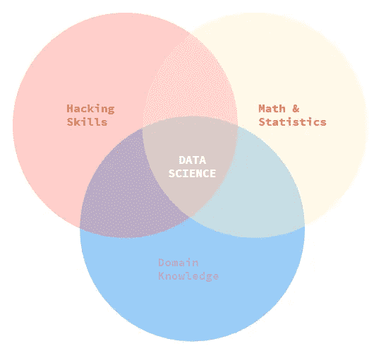
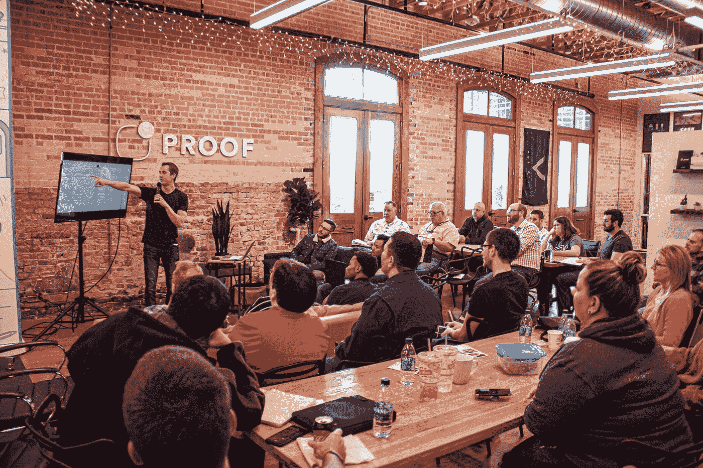

# 作为一名数据科学家，我学习 Web 开发的 5 个原因

> 原文：<https://towardsdatascience.com/5-reasons-why-im-learning-web-development-as-a-data-scientist-33bd61601b62?source=collection_archive---------3----------------------->

## 还有，为什么你也应该。

卢克·皮特斯在 [Unsplash](https://unsplash.com?utm_source=medium&utm_medium=referral) 上拍摄的照片

如果有一件事让我对数据科学过程感到沮丧，那可能是这样一个事实，我可能会花几个小时(也许几天)来构建和完善一个模型，但却意识到将它投入生产是另一项非常值得的工作，需要获得更专业的人的帮助。

每当我试图思考如何处理数据科学问题的想法时，我总是被将它转化为其他人(我的利益相关者)可以使用的形式这一绞尽脑汁的步骤所停滞。

经过多年的实践，我决定提升自己的技能，永远学习 web 开发。

以下是我这样做的原因:

# 我需要一条能让我在技术上更加精通的学习途径

如果你和我一样，我没有在*计算机科学*或任何相关技术领域接受过正式培训。

我受过自然科学的训练。具体来说，我本科学的是*化学*，硕士学的是*生物工艺工程*。我很喜欢研究天然产品和设计复合生物材料。

我是一个数据爱好者，在大学里学的数学比一般的程序员多一点，我碰巧决定用代码来做一些数据魔术，让一些商业人士高兴。

著名的数据科学维恩图。图片作者，灵感来源([http://drew Conway . com/Zia/2013/3/26/the-data-science-Venn-diagram](http://drewconway.com/zia/2013/3/26/the-data-science-venn-diagram))

幸运的是，我开始利用我的科学敏锐度和解决问题的能力来应对数据带来的商业挑战。作为一名数据科学家，我已经工作了两年，我意识到我并不像我想象的那样精通软件和其他技术，这些技术可以让我作为一名数据专业人员的生活变得更加轻松和有效。

此外，我意识到，虽然我对用 Python/R 编码和用 SQL 获取数据感到很舒服，但我的脚本看起来常常很枯燥，而且常常需要事后进行大量的重构。我用我的代码完成了一些事情，但是有时候我的笔记本并没有处于一种我很自豪能与其他人分享的状态。

我知道我需要以全面的方式变得更加精通技术。我想变得知识渊博，这样我就可以在几乎平等的水平上与我的技术同行进行交流。

# 我想对我的投资组合网站有更多的控制权

当我申请我的第一份数据科学工作时，我有一点 git 知识，但我已经把我现有的所有入门项目放在了 WordPress 网站上。

虽然使用博客网站做作品集没有错，但我花了三年多的时间才意识到一个自我托管的网站(甚至只是一个简单的 GitHub 页面)会做得更好，更便宜！)而不是一个收费的博客网站。

更不用说，做限量定制还要付出更多。我意识到我想为自己建立一个更好的投资组合网站，而不是为此付出太多。

我知道维护一个好的投资组合网站将是我数据职业生涯的支柱，所以我也可以自己学着做。

此外，我意识到典型的投资组合网站有多无聊——因为更多时候，你只是以一种非常静态的方式展示你的分析和结果。然而，有些人确实更上一层楼。 [JP Hwang](https://medium.com/u/964fe0870229?source=post_page-----33bd61601b62--------------------------------) ，在他的文章中，整理了几个[数据科学作品集，绝对会让你敬畏和鼓舞](/these-data-science-portfolios-will-awe-and-inspire-you-mid-2020-edition-728e1021f60)。

我羡慕那些知道如何部署展示项目价值的应用的人。因此，我想学习更多关于 web 开发的知识，以学习可视化和交互式的方式来分享我的作品。

# 我想用正确的方法学习软件开发

不要误解我。我并不是说你应该自己成为一名网络开发人员。我并不是说，如果不深入研究 web 开发，就不能建立一个好的作品集网站。

如果你和我一样，我总是想学习新的东西。而且，我决定学习 web 开发来补充我的数据科学实践。

我只是不想通过阅读 Stackoverflow 来修复错误，从而学习它。我想用正确的方式学习它。

我想更好地了解和我一起工作的开发人员的想法。我想学习超越我的 Jupyter 笔记本的编程最佳实践。

***免责声明:*** *我仍在寻找最佳的学习途径。请放心，当我了解到更多信息时，我会记录下来。我知道现有的 web 开发库和框架是数据科学家的必备，比如*[*D3 . js*](https://d3js.org/)*和* [*TensorFlow。JS*](https://www.tensorflow.org/js) *但是会在不同的帖子中编译它们。*

# 我是一名建筑工人，我一直想建造东西

化学让我着迷的原因是能够促进物质之间的反应以创造一种完全不同的材料的想法。一些对社会有潜在价值的东西。

我也在数据科学中发现了同样的魅力。

唯一不同的是，我不用去实验室，戴着护具做一些科学。

我可以穿着睡衣，完全在笔记本电脑上做实验。

我发现单独使用数据和编程来设计和创建解决方案很有趣。虽然，就像我在第一点中所说的，我意识到把我的作品放在那里需要比我所受的训练多得多的工作。

知道了数据科学和人工智能有多么强大，以及它在各行各业有多么广泛，我知道我可能会偶然发现一些好主意，我希望我能够自己(或与团队)转化为一些实际的产品

马修·奥斯本在 [Unsplash](https://unsplash.com?utm_source=medium&utm_medium=referral) 上拍摄的照片

# 我想给一个定义不清的角色增加更多的价值

数据科学社区中另一个众所周知的事情是处于一个被过度宣传的行业中的诅咒和祝福。它被吹捧为 21 世纪[最性感的工作是有原因的。](https://hbr.org/2012/10/data-scientist-the-sexiest-job-of-the-21st-century)

幸运的是，企业开始意识到，他们缺乏从数据中获得洞察力的关键能力(*或者可能只是普通的 FOMO？*)。因此，数据科学家和分析师的就业前景一飞冲天。

不幸的是，许多公司没有意识到如何让数据科学家参与进来并释放他们的全部潜力。许多公司认为数据科学家是多面手，他们有能力获取他们的脏数据，并立即为他们带来数百万的回报。

有些人甚至有荒谬的工作描述，要求技术堆栈不一定适用于他们的问题领域。

这里有一些文章展示了公司和数据科学之间的脱节，主要是从招聘的角度:

 [## 为什么这么多数据科学家离开他们的工作

### 乔尼·布鲁克斯。受这篇文章的启发，在 KDnuggets 投票中投票:数据科学/机器学习/数据专业工作…

www.kdnuggets.com](https://www.kdnuggets.com/2018/04/why-data-scientists-leaving-jobs.html)  [## 停止雇佣数据科学家，直到你准备好数据科学

### 今天，我又接到了一个电话，一位才华横溢的数据科学家在一家大型企业的人力资源部工作…

www.kdnuggets.com](https://www.kdnuggets.com/2015/07/stop-hiring-data-scientists-until-ready.html)  [## 哪些公司在雇佣数据科学家方面犯了错误

### 简而言之，如果你不了解一个特定的职位需要什么样的技能和才能，你就无法招聘到这个职位

towardsdatascience.com](/what-companies-get-wrong-about-hiring-data-scientists-704fa60c594) 

我敢打赌，随着公司找到利用数据科学的正确方法，以及当前的数据科学家专注于特定的数据科学领域，事情将保持不变，因为公司正在度过这个尴尬的阶段。

目前，我希望我的技能更加灵活，能够为我工作的公司增加更多的价值。我希望通过掌握数据和开发两方面的知识，以更敏捷的方式处理问题。

***学习 web 开发是在职场中脱颖而出的一种方式吗？***

也许吧。然而，这不是唯一的方法，因为我也可以通过深入问题领域来做到这一点。尽管如此，我知道学习软件开发无论如何都是有用的，并且可以拓宽我的视野，因为我正在科技行业建立我的职业生涯。

***这是进入更机器学习工程职业的一种方式吗？***

有可能。到目前为止，我知道 DS 相关角色的定义仍然模糊不清，但是关于 ML 工程师有一件事是肯定的，那就是他们比一般的数据科学家有更高的技术能力。我猜，学习如何部署 web 应用程序和修补后端是获得更接近 ML 工程师技能的一条途径。

# 结论

最后，作为一名数据科学家，我学习 web 开发的原因如下:

*   **拥有一条能让我在技术上变得更加熟练的学习途径**
*   **更好地控制我的投资组合网站**
*   **以正确的方式学习软件开发**
*   **建造东西**
*   **为定义不清的角色增加更多价值**

学习 web 开发可以让我以有趣和可视化的方式了解软件开发的来龙去脉，同时学习一些在我作为数据科学家的职业生涯中有用的技能。

现在，我将浏览以下在线资源，开始学习基础知识:

 [## 2021 年的完全网络开发者:零到精通

### 刚刚更新到 2021 年！通过学习最受欢迎的技能，成为一名全面的网络开发人员！这是其中一个…

www.udemy.com](https://www.udemy.com/course/the-complete-web-developer-zero-to-mastery/)  [## Web 开发人员训练营:学习 HTML、CSS、Node 等等！

### 嗨！欢迎来到 web 开发者训练营，这是学习 Web 开发的唯一课程。有很多…

www.udemy.com](https://www.udemy.com/course/the-web-developer-bootcamp/)  [## freeCodeCamp.org

### 在家学习编码。构建项目。获得认证。自 2014 年以来，超过 4 万名 freeCodeCamp.org 大学毕业生…

www.freecodecamp.org](https://www.freecodecamp.org/learn) 

补充一下，我特别喜欢安德烈·尼戈瓦的《零到精通》课程(上面的第一个链接)。不仅仅是因为他的课程是更新最活跃的课程之一(他最近将他的课程更新到了 2021 年版本)，还因为围绕它的巨大的活跃社区。我目前是一个由数千名学习者组成的社区的一员，也是一个由 30 人组成的令人敬畏的小型学习小组的一员，这个小组让学习变得更加有趣和吸引人。

随着未来几个月的进展，我期待着改进我的作品，以及我将建立的所有网站和应用程序。我会不时在这里发布我的进展。