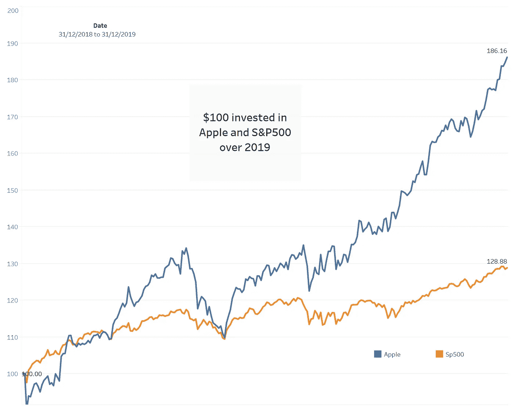
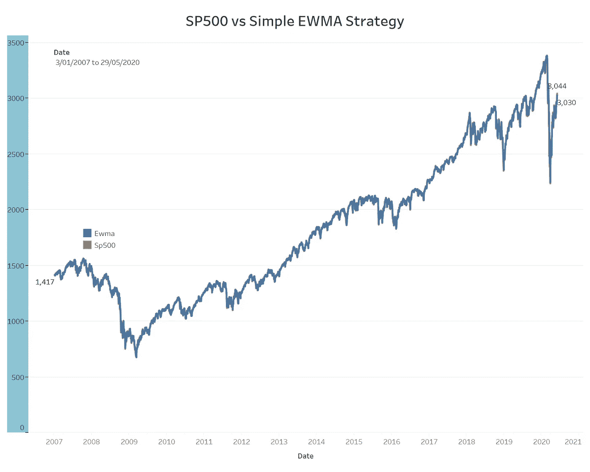

# 股票预测项目失败的 5 个原因

> 原文：<https://towardsdatascience.com/5-reasons-why-stock-prediction-projects-fail-a3dddf30d242?source=collection_archive---------21----------------------->

## 在开始一项计划之前需要考虑什么

帕特里克·托马索在 [Unsplash](https://unsplash.com?utm_source=medium&utm_medium=referral) 上的照片

随着机器学习和人工智能的复兴，实现新老预测算法从未如此简单。只需几行代码，初露头角的数据爱好者就可以轻松获得最先进的模型，随时准备征服手边任何不可逾越的数字任务。但是一知半解可能是一件危险的事情。虽然大部分机器学习可以归功于统计学和编程，但同样重要，但为了即时满足而经常被忽略的是领域知识。

这一点在投资领域最为真实。虽然环境中有丰富的股票价格和可访问且免费的基本数据，但不加选择地应用预处理技术和机器学习算法将产生不加选择的结果。金融时间序列数据极其微妙，系统信噪比很低，从业者花费他们的职业生涯试图实现难以实现的目标，即创造**持续**的优异表现，只有少数人成功。因此，需要对数据有更深入的了解，这与取得某种程度的成功是相关的。因此，本文旨在揭示股票预测项目一旦投入生产就可能失败的一些常见原因。

# **1。选择偏差**

许多项目都是从任意选择一只要应用算法的股票开始的，这只股票通常是苹果或亚马逊之类的科技股，原因很简单，因为这些公司在消费者的日常生活中非常有名，根深蒂固。这是有问题的，因为股票选择不是一个任意的过程，它是投资决策过程的一部分，需要一个模型。

以苹果为例，如果我们看看它在 2019 年的表现与更广泛的标准普尔 500 指数相比，我们看到它的表现超过该指数近 60%。

苹果 vs S&P500

亚马逊、微软和谷歌的情况大致相同，因为美国科技是 2019 年表现最好的行业。从该板块中任意挑选一只股票作为起点将会严重歪曲投资机会集的特征。

# **2。投资组合构建**

对于稳健的投资策略来说，控制风险与创造回报同样重要。如果选股是投资过程的第一步，那么投资组合的构建就是至关重要的下一步。许多项目会建议一种买卖特定股票的策略，但通常假设 100%的潜在投资组合将投资于该股票。在实践中很少出现这种情况，单一的风险敞口会使投资者容易遭受巨大的集中风险。谨慎构建的投资组合非常多样化，因为它是风险控制的最重要来源之一。可行的机器学习投资策略应该同时考虑选股和投资组合构建。

# 3.预处理的不正确应用

像标准化这样的标准冲洗、清洗和重复数据预处理技术不能直接应用于股票价格。下图显示了 S&P500 物价水平的年度分布情况，这应该能给我们一些直观的解释:

2007-2008 年 S&P500 指数价格水平

在机器学习的标准训练/测试分离范例中，通过使用训练集的参数进行变换来应用预处理，在明确假设训练和测试样本是从相同分布中抽取的**的情况下，将预处理应用于测试集。**

我们可以清楚地看到，股票价格的**分布每年都会发生变化**，这意味着均值和标准差也会发生变化。金融时间序列的这种特性被称为非平稳性，这是金融预测中的一个未决问题。还可以观察到，分布很少是正态分布，这使得参数测量(如平均值和标准差)变得毫无意义。

此外，应用其他常见程序(如最小-最大归一化)并不能解决这个问题，因为下限也会逐年变化，而且价格理论上没有上限。从业者通常会应用价格差异转换(股票价格回报)，但是这并不能完全消除股票价格的一些不利属性。

# 4.前瞻偏差

虽然现在只需要几行代码就可以获得有意义的股票和宏观经济基本面数据的历史，但我们需要认识到，这些数据受到了前瞻偏差的困扰。通常，与特定日期相关的观测在该日期实际上是不可用的。例如，股票基本面数据依赖于在生效日期引用的报告，该日期通常与公司的会计日历一致，但是，该报告直到生效日期后几个月才发布，反映了准备时间。

在宏观经济数据中，这种偏差是对前期数据进行修正的结果，有时是在初始信息发布后一个季度进行的。这对于短期交易策略来说尤其成问题。任何使用这些数据集的项目都应考虑适当的滞后和修订。

# 5.工程未完！

许多股票预测项目将像常规的机器学习项目一样，以测试与训练性能的折线图来揭示性能指标，如准确性或 RMSE，推理出如果两条线足够接近并且误差相当低，则该项目是成功的。这个过早的结论忽略了发现成功策略的重要一步；**测试财务结果**。投资不能简化为最小化无形错误率的简单练习，因为犯错的后果是真实存在的。最后一步应该是对这个策略进行回溯测试，就好像它是长期持有的一样，并计算利润/损失或回报。测试人员还需要考虑，如果投资组合在恢复之前的测试期间遭受了重大损失，他们是否有风险承受能力继续执行给定损失的策略。

使用指数加权移动平均策略(EWMA)可以得出一个简单的例子，该策略将过去价格的衰减平均值作为未来价格的预测。

乍一看，EWMA 对 S&P500 的预测非常好，但如果我们仔细观察今年年初市场下跌的时期，我们会发现事情并不像表面上那样。

EWMA 战略 vs S&P500 回归

**尽管蓝色和橙色线似乎仍然紧密固定**，EWMA 策略无法驾驭日内波动，因为它只包含过去的信息，它看起来一直在追逐真实的价格水平，经常导致它预测市场在实际下跌时上涨，反之亦然。在此期间遵循这一策略的表现将会低于标准普尔 500 指数。

# 结论

在开始一个股票预测项目之前，尤其是你打算投资真金白银的项目，做一些关于这个主题的前期研究和理解数据是值得的。如果结果好得令人难以置信(例如，准确性大大超过 50%)，随着参与者的数量和这些参与者的日益成熟，市场在价格发现方面效率极高，特别是在股票方面。虽然这可能不排除潜在机会的可能性，但这确实意味着它需要比开箱即用的算法和标准预处理技术更多的努力才能找到它。

**免责声明** : t **他的帖子纯属个人观点和看法的表达。它不代表任何建议。**