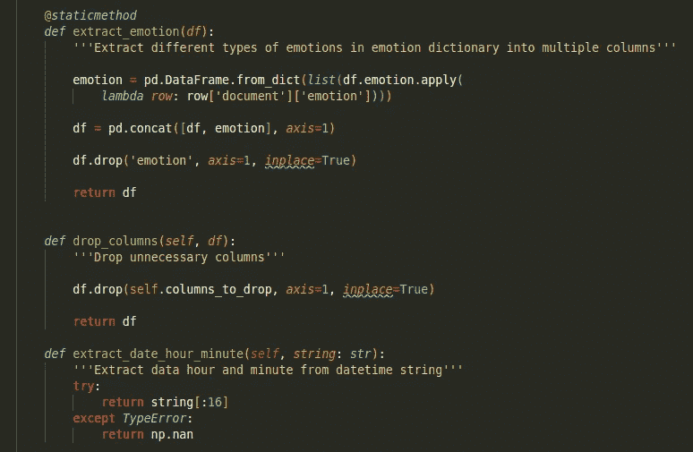
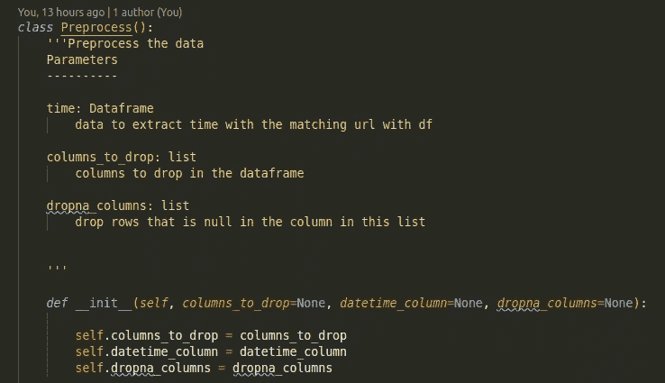
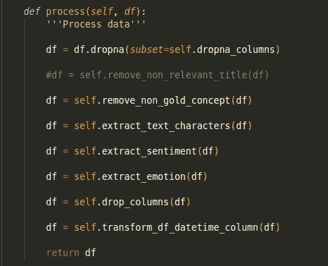

# 你应该从 Jupyter 笔记本转向脚本的 5 个理由

> 原文：<https://towardsdatascience.com/5-reasons-why-you-should-switch-from-jupyter-notebook-to-scripts-cb3535ba9c95?source=collection_archive---------0----------------------->

## 意见

## 使用脚本帮助我认识到 Jupyter 笔记本的缺点


由[卢卡·布拉沃](https://unsplash.com/@lucabravo?utm_source=medium&utm_medium=referral)在 [Unsplash](https://unsplash.com?utm_source=medium&utm_medium=referral) 上拍摄

# 动机

像大多数人一样，我在开始学习数据科学时使用的第一个工具是 Jupyter Notebook。大多数在线数据科学课程使用 Jupyter 笔记本作为教学媒介。这很有意义，因为对于初学者来说，在 Jupyter Notebook 的单元格中开始编写代码比编写一个包含类和函数的脚本更容易。

Jupyter Notebook 是数据科学中如此常见的工具的另一个原因是 Jupyter Notebook 使探索和绘制数据变得容易。当我们键入' Shift + Enter '时，我们会立即看到代码的结果，这使我们很容易识别我们的代码是否有效。

然而，随着我从事更多的数据科学项目，我意识到 Jupyter Notebook 有几个缺点:

*   **杂乱无章**:随着我的代码变得越来越大，我越来越难以跟踪我写了什么。不管我用多少次降价把笔记本分成不同的部分，这些不连贯的单元格让我很难专注于代码做什么。
*   **难实验:**你可能想测试用不同的方法处理你的数据，为你的机器学习算法选择不同的参数，看看精度有没有提高。但是每次你试验新方法的时候，你都需要找到并重新运行相关的细胞。这是令人困惑和耗时的，尤其是当处理过程或训练需要长时间运行时。
*   **再现性不理想:**如果您想要使用结构稍有不同的新数据，则很难确定笔记本中的错误来源。
*   **难调试:**当你的代码出现错误时，很难知道错误的原因是**代码**还是**数据**的变化。如果错误在代码中，是代码的哪个部分导致了问题？
*   **不适合生产:** Jupyter 笔记本与其他工具配合不太好。使用其他工具运行 Jupyter Notebook 中的代码并不容易。

我知道一定有更好的方法来处理我的代码，所以我决定尝试一下脚本。为了减少混淆，我引用了。py 文件，当在本文中使用“脚本”一词时。这些是我在使用脚本时发现的好处:

# 组织

Jupyter Notebook 中的单元格很难将代码组织成不同的部分。通过一个脚本，我们可以创建几个小函数，每个函数指定代码做什么，就像这样



更好的是，如果这些函数可以归入同一个类别，比如处理数据的函数，我们可以把它们放在同一个类中！



每当我们想要处理我们的数据时，我们知道类`Preprocess`中的函数可以用于这个目的。

# 鼓励实验

当我们想尝试不同的方法来预处理数据时，我们可以像这样通过注释来添加或删除函数，而不用担心破坏代码！即使我们碰巧破解了代码，我们也知道在哪里修复它。



# 再现性的理想选择

有了类和函数，我们可以使代码足够通用，这样它就能够处理其他数据。

例如，如果我们想要删除我的新数据中的不同列，我们只需要将`columns_to_drop`更改为一个列列表，我们想要删除并且代码将顺利运行！

我还可以创建一个 [**管道**](https://medium.com/vickdata/a-simple-guide-to-scikit-learn-pipelines-4ac0d974bdcf) ，指定处理和训练数据的步骤！一旦我有了管道，我需要做的就是使用

```
pipline.fit_transform(data)
```

对训练和测试数据应用相同的处理。

# 易于调试

使用函数，更容易测试函数是否产生我们期望的输出。我们可以很快找出代码中应该修改的地方，以产生我们想要的输出

如果所有的测试都通过了，但是在运行我们的代码时仍然有一个错误，我们知道数据是我们下一步应该查看的地方。

例如，在通过上面的测试后，我在运行脚本时仍然有一个 TypeError，这让我产生了我的数据有 null 值的想法。我只需要处理好这一点就能顺利运行代码。

我在这里写了一篇关于如何使用 Pytest 进行测试[的文章](/pytest-for-data-scientists-2990319e55e6)。

# 非常适合生产

我们可以在多个脚本中使用不同的函数，就像这样

或者添加一个配置文件来控制变量值。这可以防止我们浪费时间在代码中追踪一个特定的变量来改变它的值。

我们也可以很容易地添加工具来跟踪实验，如 [MLFlow](https://mlflow.org/) 或工具来处理配置，如 [Hydra.cc](https://hydra.cc/) ！

如果你不知道 hydra，它是一个 Python 工具，用来配置你的数据科学项目。这个工具允许你[试验不同的参数和模型，而不需要花费几个小时来修改你的代码。](/introduction-to-hydra-cc-a-powerful-framework-to-configure-your-data-science-projects-ed65713a53c6)

# 我不喜欢不用 Jupyter 笔记本的想法，直到我把自己推出舒适区

我以前一直用 Jupyter 笔记本。当一些数据科学家建议我从 Jupyter 笔记本切换到脚本以防止上面列出的一些问题时，我不理解并对这样做感到抵触。我不喜欢运行单元时看不到结果的不确定性。

但是，随着我在新公司开始我的第一个真正的数据科学项目，Jupyter Notebook 的缺点越来越大，所以我决定将自己推出舒适区，尝试使用脚本。

一开始，我感到不舒服，但开始注意到使用脚本的好处。当我的代码被组织成不同的函数、类和多个脚本时，我开始觉得更有条理了，每个脚本服务于不同的目的，比如预处理、训练和测试。

# 你是在建议我停止使用 Jupyter 笔记本吗？

不要误解我。如果我的代码很小，如果我不打算将代码投入生产，我仍然会使用 Jupyter Notebook。当我想探索和可视化数据时，我使用 Jupyter Notebook。我还用它来解释如何使用一些 python 库。例如，我在这个[资源库](https://github.com/khuyentran1401/Data-science)中主要使用 Jupyter 笔记本作为解释我所有文章中提到的代码的媒介。

如果你不喜欢用脚本编写所有东西，你可以同时使用脚本和 Jupyter Notebook 来实现不同的目的。例如，您可以在脚本中创建类和函数，然后将它们导入到笔记本中，这样笔记本就不会那么杂乱。

另一个替代方案是写完笔记本后把笔记本变成剧本。我个人不喜欢这种方法，因为在我的笔记本上组织代码，比如将它们放入函数和类中，以及编写测试函数，通常会花费我更多的时间。

我发现写一个小函数比写一个小测试函数更快更安全。如果我碰巧想用新的 Python 库来加速我的代码，我可以使用我已经编写的测试函数来确保它仍然按照我的预期工作。

话虽如此，我相信有更多的方法来解决 Jupyter 笔记本的缺点，而不是我在这里提到的，例如[网飞如何将笔记本投入生产，并安排笔记本在特定时间运行](https://netflixtechblog.com/notebook-innovation-591ee3221233)。

# 结论

每个人都有自己的方法来提高工作效率，对我来说，就是利用脚本的效用。如果你刚从 Jupyter 笔记本转到脚本，用脚本写代码可能不太直观，但是相信我，你最终会习惯使用脚本的。

一旦发生这种情况，你将开始意识到脚本比杂乱的 Jupyter 笔记本有很多好处，并希望用脚本编写你的大部分代码。

如果你正在寻找从 Jupyter Notebook 转换的方法，这篇文章提供了一些很好的技巧，让你的代码可复制、可自动化，并且可以用脚本部署。

如果你对大的改变感到不舒服，从小的开始。

> 大变化始于小步

我喜欢写一些基本的数据科学概念，并尝试不同的算法和数据科学工具。你可以通过 [LinkedIn](https://www.linkedin.com/in/khuyen-tran-1ab926151/) 和 [Twitter](https://twitter.com/KhuyenTran16) 与我联系。

如果你想查看我写的所有文章的代码，请点击这里。在 Medium 上关注我，了解我的最新数据科学文章，例如

[](/pytest-for-data-scientists-2990319e55e6) [## 数据科学家 Pytest

### 适用于您的数据科学项目的 Pytest 综合指南

towardsdatascience.com](/pytest-for-data-scientists-2990319e55e6) [](/how-to-learn-data-science-when-life-does-not-give-you-a-break-a26a6ea328fd) [## 当生活不给你喘息的机会，如何学习数据科学

### 我努力为数据科学贡献时间。但是发现新的策略使我能够提高我的学习速度和…

towardsdatascience.com](/how-to-learn-data-science-when-life-does-not-give-you-a-break-a26a6ea328fd) [](/how-to-fine-tune-your-machine-learning-models-with-ease-8ca62d1217b1) [## 如何有效地微调你的机器学习模型

### 发现为您的 ML 模型寻找最佳参数非常耗时？用这三招

towardsdatascience.com](/how-to-fine-tune-your-machine-learning-models-with-ease-8ca62d1217b1) [](/how-to-create-reusable-command-line-f9a2bb356bc9) [## 如何创建可重用的命令行

### 你能把你的多个有用的命令行打包成一个文件以便快速执行吗？

towardsdatascience.com](/how-to-create-reusable-command-line-f9a2bb356bc9)