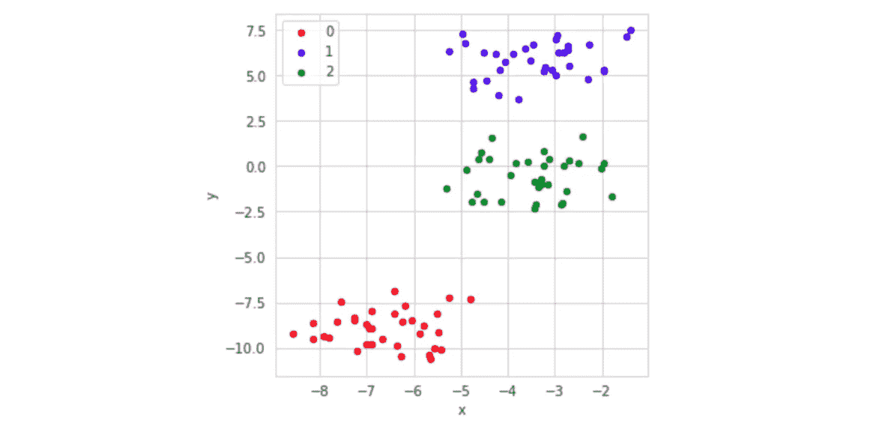
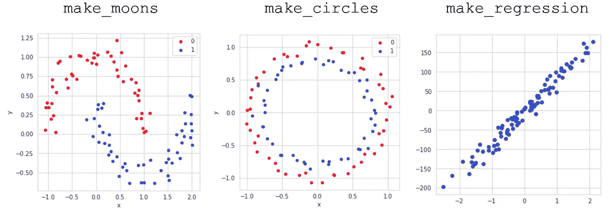
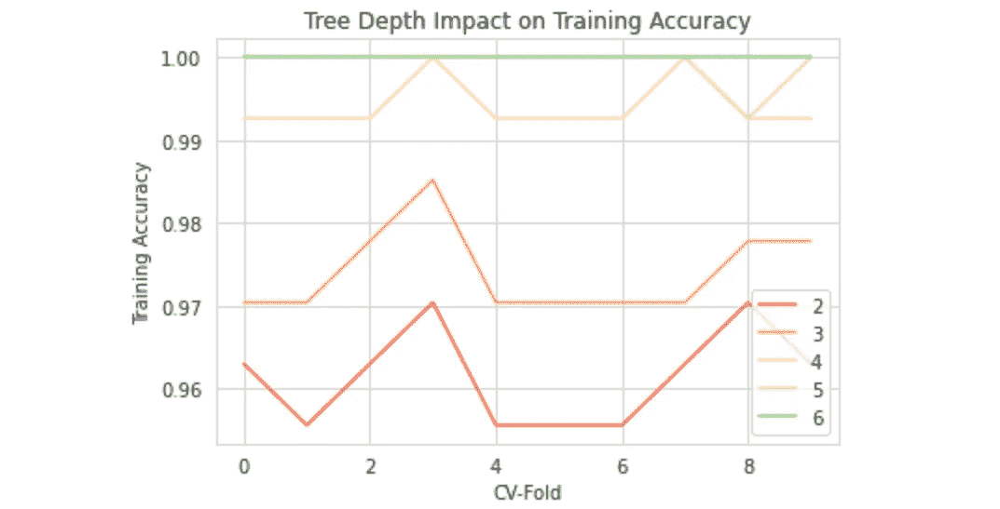

# 5 sci kit-学习必须知道的隐藏宝石

> 原文：<https://towardsdatascience.com/5-scikit-learn-must-know-hidden-gems-8249e5214a73?source=collection_archive---------63----------------------->

[Pixabay](https://pixabay.com/illustrations/precious-diamond-jewelry-expensive-1199183/)

## 数据生成器、管道、验证曲线等

尽管 Scikit-learn 是机器学习中的一个主要部分，但许多人并不知道或没有使用该库中一些最有用的隐藏宝石。这里是 Scikit-learn 最有用的五个隐藏的宝石。

# 数据集生成器

Scikit-learn 有大量的数据集生成器，可用于创建具有不同复杂性和形状的人工数据集。

例如，`make_blobs`函数创建“斑点”或数据簇，具有任意数量的样本、中心/簇和特征/维度。

`X`和`y`的值为:

当`X`根据标签`y`被图形化和着色时，数据的形状可以被可视化:

Scikit-learn 具有许多其他数据集创建功能:

*   `make_moons(n_samples=100, noise=0.1)`
*   `make_circles(n_samples=100, noise=0.05)`
*   `make_regression(n_samples=100, n_features=1, noise=15)`
*   `make_classification(n_samples=100)`

# 管道

管道允许将各种方法合并到一个单一的模型中。在自然语言处理(NLP)应用中尤其如此，这些应用需要需要标准化或规范化的矢量器或数据。可以通过将几个模型组合在一起来创建管道，在管道中，数据按顺序流经聚合模型。它具有标准的拟合和预测能力，使训练过程更有组织性。

各种对象可以放入一个管道中:

*   *估算者*。你有丢失的数据吗？试试简单的估算器或 KNN 估算器。
*   *编码器。*如果您的数据是非二进制分类数据，您可能需要使用标签编码器或一次性编码器。
*   *NLP 矢量器。*如果您正在处理 NLP 数据，请使用计数矢量器、TD-IDF 矢量器或哈希矢量器。
*   *数值转换*。尝试标准化器、规格化器和最小-最大缩放器。

# 网格搜索

机器学习中的一个常见任务是在模型中找到正确的参数集。通常，人们可以根据他们对任务和模型的了解进行猜测，或者通过编程找到最佳的集合。`sklearn`有一个内置函数——`GridSearchCV`——自动为您找到最佳参数集，以优化模型性能。

`GridSearchCV`对象接受两个参数:首先，要训练的模型对象(在这种情况下是支持向量机分类器)，其次，描述模型参数的字典。字典中的每个键都是模型中的一个参数，其中每个值都是一个相应的值列表或元组，参数可以在其中取值。

在网格搜索对象被拟合之后，`best_params_`属性可用于输出每个模型参数的最佳性能参数值。其他模型参数包括决策树中的树深度和随机森林集合中的投票者数量。

# 验证曲线

为了可视化参数对模型性能的影响，使用`sklearn`的`validation_curve`。它接受几个参数:模型、要调整的参数、参数值的范围以及折叠次数。它类似于对一个变量的网格搜索，可以帮助更好地可视化参数变化的结果。

`validation_curve`对象的输出是一个元组——一个是训练分数，另一个是测试分数。每个中的行数代表每个参数值的数组值，而数组中的每个元素代表每个 *k* 折叠的值。

当绘制结果时，参数和精度之间的关系是清楚的。

这使我们可以直观地看到树的深度对精确度的影响。比如说。请注意，树深度为 5 或树深度为 6 时表现相当好。进一步指定树的深度会导致过度拟合，但是需要根据测试精度来评估这一点。

# k 倍交叉验证

交叉验证是一种比标准的`train_test_split`方法给出更准确结果的方法(实际上需要更少的代码！).在传统的训练-测试-拆分中，数据被随机分为训练集和测试集(通常比例为 7:3–8:2)，模型在训练集上接受训练，在测试集上进行评估，以真正衡量模型的测量能力，而不仅仅是记忆能力。但是，由于每次分割都是随机的，将数据分割十次将产生十种不同的精度。

为了解决这个问题，使用 *k* 个折叠的交叉验证将数据分成 *k* 个类别，在 *k* 个折叠上训练模型，并在剩余的 1 个折叠上进行测试。重复这一过程后，每个测试折叠最终覆盖整个数据集，人们会对准确性有一个更完整和诚实的看法。更好的是，不需要跟踪 x-train、x-test、y-train 和 y-test 变量。交叉验证的唯一缺点是需要更多的时间——但是更好的结果总是有更高的成本。

# 感谢阅读！

希望这些 sci-kit learn 隐藏的宝石能够让你的机器学习编码更好。