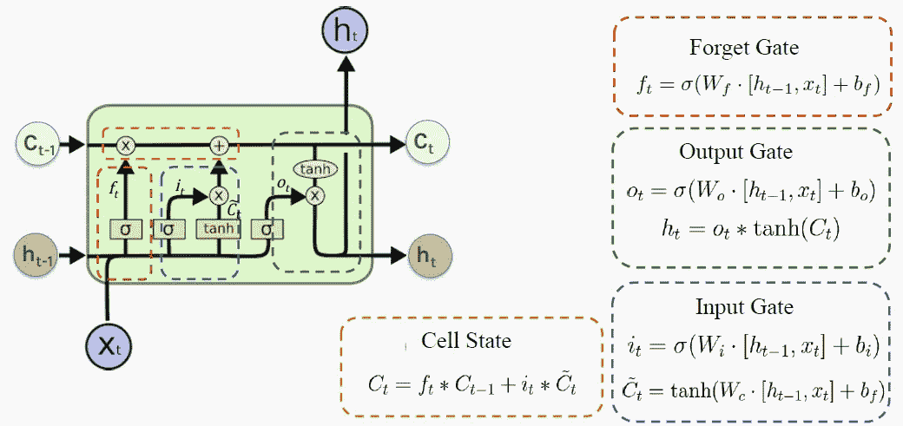
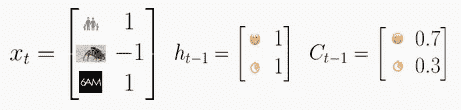
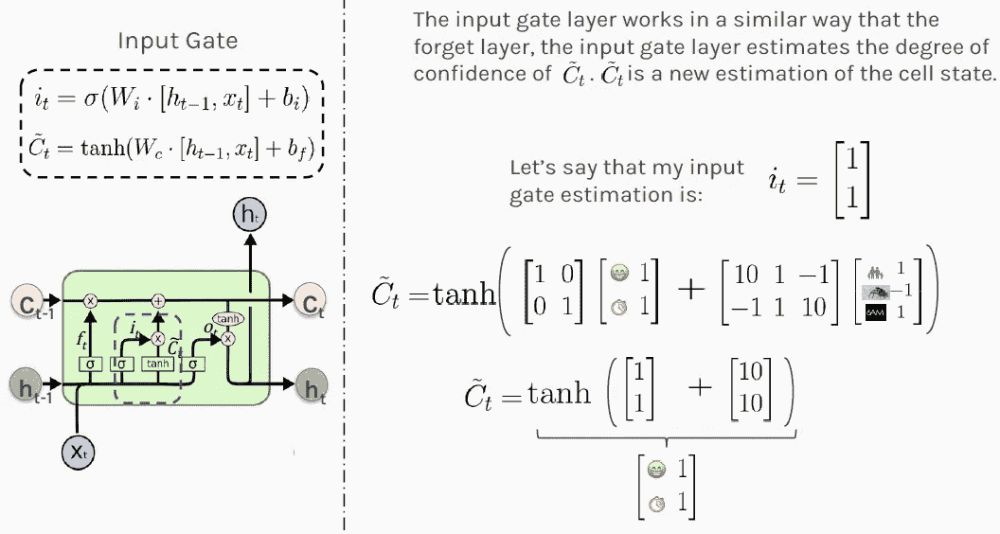
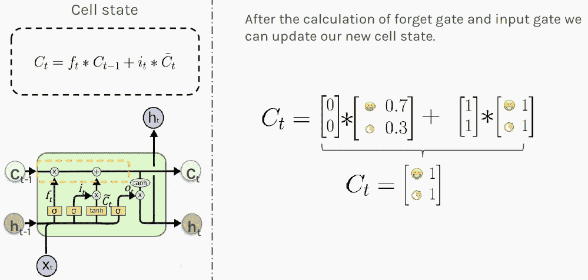
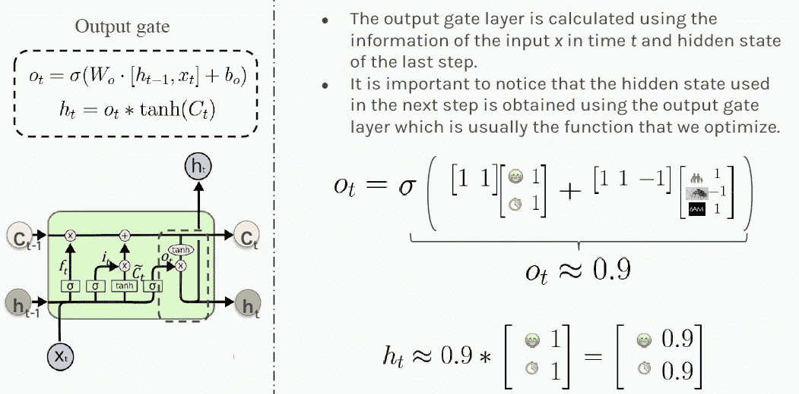
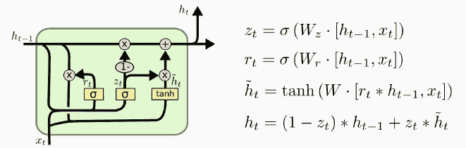
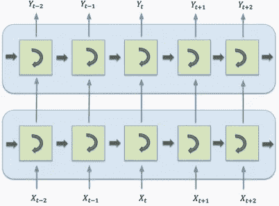
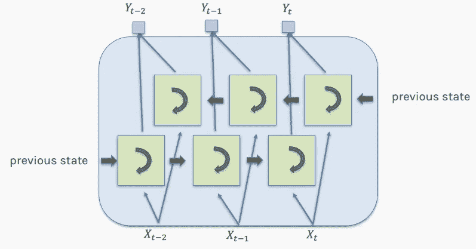
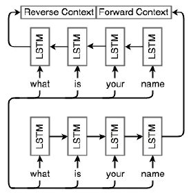

# 其他人都知道的 LSTM 和 GRU 的 5 个秘密

> 原文：<https://towardsdatascience.com/5-secrets-about-lstm-and-gru-everyone-else-know-97446d89e35b?source=collection_archive---------11----------------------->

## 力学解释了强大的视觉效果和一个有趣的故事

我们解释了为什么长短期记忆(LSTM)在处理苹果、谷歌、脸书和亚马逊的序列数据时如此有效和流行。

Peggy Choucair 在 [Pixabay](https://pixabay.com/photos/trees-forest-tribe-wood-dead-wood-3948376/) 上的照片

> 秘密 1 — LSTMs 极大地改善了超过 40 亿部 Android 手机上的语音识别(自 2015 年年中以来)。

# 发明 LSTM 是因为 RNNs 有严重的内存泄漏。

之前，我们介绍了[递归神经网络(RNNs)](/recurrent-neural-networks-explained-ffb9f94c5e09) ，并演示了它们如何用于[情感分析](/sentiment-analysis-a-benchmark-903279cab44a)。

【RNNs 的问题是长时间记忆。例如，他们能够预测句子“云在……”中的下一个单词“sky ”,但是他们不能预测下一个句子中遗漏的单词:

*“她在法国长大。现在她只在中国呆了几个月。她说得很流利……”*

随着这种差距的扩大，rnn 变得无法学习连接信息。在这个例子中，最近的信息表明，下一个单词可能是一种语言的名称，但如果我们想缩小语言的范围，我们需要更早的*法国*的上下文。在自然语言文本中，相关信息和需要它的点之间的差距是完全可能非常大的。这在德语中也很常见。

图片改编自 [FB 工程](https://engineering.fb.com/core-data/using-apache-spark-for-large-scale-language-model-training/)博客上的 Tejas Patil

为什么 rnn 对于长序列有巨大的问题？通过设计，RNNs 在每个时间步接受两个输入:一个输入向量(例如，来自输入句子的一个单词)，和一个隐藏状态(例如，来自先前单词的记忆表示)。

下一个 RNN 步骤采用第二个输入向量和第一个隐藏状态来创建该时间步骤的输出。因此，为了捕捉长序列中的语义，我们需要在许多时间步骤上运行 RNNs，将展开的 RNN 变成非常深的网络。

 [## 用于假人的递归神经网络

### 一个有趣的和有插图的指南来理解直觉。

towardsdatascience.com](/recurrent-neural-networks-explained-ffb9f94c5e09) 

长序列并不是 rnn 的唯一麻烦。就像任何非常深的神经网络一样，RNNs 受到**消失和爆炸梯度问题**的困扰，因此永远需要训练。已经提出了许多技术来缓解这个问题，但是它们不能消除它:

*   小心初始化参数，
*   使用像 ReLU 这样的不饱和激活函数，
*   应用批量标准化、渐变裁剪、丢失，
*   使用截断的反向传播。

这些变通方法仍然有其局限性。此外，除了长的训练时间之外，长时间运行的 RNNs 面临的另一个问题是这样的事实**，即第一次输入的记忆逐渐消失**。

过了一会儿，RNN 的状态实际上不包含最初输入的痕迹。例如，如果我们想对一个以“我喜欢这个产品”开始的长评论进行情感分析，但是评论的其余部分列出了许多可以使产品变得更好的事情，那么，RNN 将逐渐忘记第一个积极的情感，并将评论完全误解为消极的。

> 为了解决这些 RNNs 问题，在研究中引入了各种类型的具有长期记忆的细胞。实际上，基本的 rnn 已经不再使用，大部分工作都是使用所谓的[长短期记忆(LSTM)网络](https://www.bioinf.jku.at/publications/older/2604.pdf)完成的。它们是由 S. Hochreiter 和 J. Schmidhuber 发明的。

> 秘密 2——自 2016 年 11 月以来，LSTMs 通过谷歌翻译极大地改善了机器翻译。

# LSTM 的一个重要概念是星门。

每一个 LSTM 细胞都控制着记忆什么，忘记什么，以及如何用门来更新记忆。通过这样做，LSTM 网络解决了爆炸或消失梯度的问题，以及所有其他前面提到的问题！

下图描述了 LSTM 细胞的结构。

*h* 是隐藏状态，代表**短时记忆**。 *C* 是细胞状态，代表**长期记忆**和 *x* 是输入。

> **门**仅执行少量矩阵变换、 *sigmoid* 和 *tanh* 激活，以便神奇地解决所有 RNN 问题。

在接下来的章节中，我们将通过观察细胞如何遗忘、记忆和更新记忆来探究这是如何发生的。

资料来源:哈佛大学 P. Protopapas 教授的讲稿

## 有趣的故事

让我们在一个有趣的情节中探索这个图表。假设你是老板，你的员工要求加薪。你会同意吗？嗯，这取决于，比方说，你的精神状态。

下面我们认为你的大脑是 LSTM 细胞 T21，无意冒犯你的闪电大脑。

资料来源:哈佛大学 P. Protopapas 教授的讲稿

你的长期状态会影响你的决定。平均来说，70%的时候你心情很好，你还有 30%的预算。因此你的单元格状态是 *C* =[0.7，0.3]。

最近，事情对你来说真的很好，以 100%的概率提升你的好心情，并且你有 100%的高概率剩余运营预算。这就把你的隐藏状态变成了 *h* =[1，1]。

今天，发生了三件事:你的孩子在学校考试中取得了成功，尽管你的老板给了你一个难看的评语，但是你发现你仍然有足够的时间来完成这项工作。所以，今天的输入是 *x* =[1，-1，1]。

根据这个评估，你会给你的员工加薪吗？

> 秘密 3—脸书每天进行超过 40 亿次基于 LSTM 的翻译。

# LSTM 通过使用遗忘门来遗忘。

在上述情况下，你的第一步可能是弄清楚今天发生的事情(输入 *x* )和最近发生的事情(隐藏状态 *h* )将如何影响你对情况的长期看法(单元格状态 *C* )。**忘记盖茨控制着多少过去的记忆被保留。**

在收到你的员工的加薪请求后，你的遗忘门会运行下面的 *f_t* 的计算，其值最终会影响你的长期记忆。

下图中显示的权重是为了便于说明而任意选择的。它们的值通常是在网络训练期间计算的。结果[0，0]表示清除(完全忘记)你的长期记忆，不要让它影响你今天的决定。

资料来源:哈佛大学 P. Protopapas 教授的讲稿

> 秘密 4-Siri 是 LSTM 的，自 2016 年以来，它基于近 20 亿部 iPhones。

# LSTM 记得使用输入门。

接下来你需要决定最近发生了什么(隐藏状态 *h* )和今天发生了什么(输入 *x* )的哪些信息你要记录在你的长观情境(单元格状态 *C* )中。LSTM 通过使用输入门来决定要记住什么。

首先，您将计算您的输入门值 *i_t* ，由于 *sigmoid* 激活，该值介于 0 和 1 之间。

接下来，您将使用 *tanh* 激活在-1 和 1 之间缩放您的输入。

最后，您将通过将两个结果相加来估计新的单元格状态。

结果[1，1]表明，根据最近和当前的信息，你 100%的心情很好，并且很可能有可操作的预算。这对你的员工来说很有希望。

资料来源:哈佛大学 P. Protopapas 教授的讲稿

> 秘密 5——亚马逊的 Alexa 的答案都是基于 LSTMs 的。

# LSTM 利用细胞状态保持长期记忆。

现在，你知道最近发生的事情会如何影响你的状态。接下来，是时候根据新的理论更新你对形势的长期观点了。

当新的值进来时，LSTM 决定**如何更新它的存储器**，再次通过使用门。门控的新值被添加到当前存储器中。这种加法运算解决了简单 rnn 的爆炸或消失梯度问题。

LSTM **将**相加来计算新的状态，而不是相乘。结果 *C_t* 被存储为情况的新的长期视图(单元状态)。

数值[1，1]表明你总的来说 100%的时间心情都很好，并且 100%的可能性一直有钱！你是完美的老板！

资料来源:哈佛大学 P. Protopapas 教授的讲稿

基于这些信息，你可以更新你对局势的短期看法 *h_t* (下一个隐藏状态)。值[0.9，0.9]表示您有 90%的可能性在下一个时间步增加员工的工资！恭喜他！

资料来源:哈佛大学 P. Protopapas 教授的讲稿

# 门控循环单元

LSTM 细胞的一种变体被称为门控循环单位，或 gru。GRU 是由 Kyunghyun Cho 等人在 2014 年的一篇论文中提出的。

> GRU 是 LSTM 细胞的简化版本，可以比 LSTM 快一点，它似乎表现类似，这解释了它越来越受欢迎。

资料来源:哈佛大学 P. Protopapas 教授的讲稿

如上所示，两个状态向量合并成一个向量。单个门控制器控制遗忘门和输入门。如果门控制器输出 1，则输入门打开，遗忘门关闭。如果它输出 0，就会发生相反的情况。换句话说，每当一个存储器必须被存储时，它将被存储的位置首先被擦除。

没有**输出门**；在每个时间步输出完整的状态向量。但是，有一个新的门控制器，它控制先前状态的哪一部分将显示给主层。

# 堆叠 LSTM 细胞

通过排列多个 LSTM 细胞，我们可以处理序列数据的输入，例如，下图中的 4 个单词的句子。

资料来源:哈佛大学 P. Protopapas 教授的讲稿

**LSTM 单元通常按层排列**，因此每个单元的输出都是其他单元的输入。在本例中，我们有 2 层，每层有 4 个单元。这样，网络变得更丰富，捕捉到更多的依赖。

# 双向 LSTM

RNNs、LSTMs 和 GRUs 旨在分析值的序列。有时以**相反的顺序**分析序列是有意义的。

例如，在句子“他需要更努力地工作，老板说关于雇员。”，虽然“他”出现在最开始，但它指的是最后提到的员工。

因此，顺序必须颠倒或通过向前和向后相结合。下图描述了这种双向架构。

资料来源:哈佛大学 P. Protopapas 教授的讲稿

下图进一步说明了双向 LSTMs。底部的网络以原始顺序接收序列，而顶部的网络以相反的顺序接收相同的输入。两个网络不一定完全相同。重要的是，它们的输出被组合用于最终预测。

资料来源:哈佛大学 P. Protopapas 教授的讲稿

# 进一步阅读

正如我们刚刚解释的，LSTM 细胞可以学习识别重要的输入(这是输入门的作用)，将它存储在长期状态中，学习在需要时保存它(这是遗忘门的作用)，并学习在需要时提取它。

> LSTMs 已经改变了机器学习，现在可以通过世界上最有价值的上市公司，如谷歌、亚马逊和脸书，向数十亿用户提供。

如果你想知道更多关于 LSTMs 和 GRUs 的信息，请查看这篇文章中迈克尔·阮的精彩动画。对于那些喜欢从零开始建造自己的 LSTM 的人来说，[这篇文章](http://mlexplained.com/2019/02/15/building-an-lstm-from-scratch-in-pytorch-lstms-in-depth-part-1/)可能有用。

LSTM 网络在 Python 中的实际实现可以在我下面的文章中找到。

 [## 情感分析:一个基准

### 递归神经网络解释。使用 FCNNs、CNN、RNNs 和嵌入对客户评论进行分类。

towardsdatascience.com](/sentiment-analysis-a-benchmark-903279cab44a) 

基于注意力的序列到序列模型和变压器超越了 LSTMs，最近在谷歌的机器翻译和 OpenAI 的文本生成方面取得了令人印象深刻的成果，让人们感到惊讶。你可能想看看[这个博客](https://ai.googleblog.com/2017/08/transformer-novel-neural-network.html)或者我下面的文章来了解更多。

 [## NLU 任务注意机制实用指南

### 测试动手策略以解决注意力问题，从而改进序列到序列模型

towardsdatascience.com](/practical-guide-to-attention-mechanism-for-nlu-tasks-ccc47be8d500) 

使用 BERT，FastText，TextCNN，Transformer，Se2seq 等文本分类的综合实现。可以在这个 GitHub 库上找到，或者你可以查看我的关于 BERT 的教程。

 [## 伯特为假人-一步一步教程

### 变压器 DIY 实用指南。经过实践验证的 PyTorch 代码，用于对 BERT 进行微调的意图分类。

towardsdatascience.com](/bert-for-dummies-step-by-step-tutorial-fb90890ffe03) 

感谢《走向数据科学》的 Anne Bonner 提供的编辑注释。