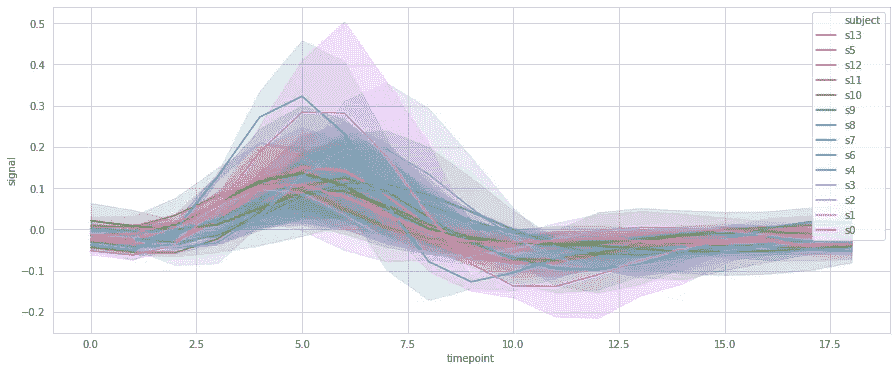

# 5 个以上简单的一行程序来提升您的 Python 可视化水平

> 原文：<https://towardsdatascience.com/5-simple-one-liners-youve-been-looking-for-to-level-up-your-python-visualization-42ebc1deafbc?source=collection_archive---------32----------------------->

来源: [Unsplash](https://unsplash.com/photos/0jTZTMyGym8)

## 最小的努力，最大的收获

富有洞察力和美感的视觉化设计不一定是一种痛苦的创造。本文将介绍 5 个以上简单的一行程序，您可以将它们添加到代码中，以增加代码的风格和信息价值。

## 折线图绘制成面积图

考虑下面的标准线图，用 seaborn 的`lineplot`创建，使用`husl`调色板和`whitegrid`风格。数据生成为正弦波，数据呈正态分布，并高于 *x* 轴。

几个造型的选择，情节看起来像样。然而，有一个问题:默认情况下，Seaborn 不是从零基线开始，并且失去了对 y 轴的数值影响。假设`x`和`y`变量如此命名，添加`plt.fill_between(x,y,alpha=0.4)`将把数据变成一个面积图，更好地从基线开始，并强调 *y* 轴。

请注意，该行是与原始线图`sns.lineplot(x,y)`一起添加的，它在顶部提供了加粗的线条。出现在许多 seaborn 图中的参数`alpha`控制区域的透明度(越小越亮)。`plt`代表 matplotlib 库。在某些情况下，使用面积可能不合适。

当使用多个面积图时，它可以强调线的重叠和交叉，尽管它可能不适合可视化环境。

## 折线图到堆积面积图

有时，线之间的关系要求面积图相互堆叠。使用 matplotlib stackplot: `plt.stackplot(x,y,alpha=0.4)`很容易做到这一点。在这种情况下，颜色是通过`colors=[]`手动指定的，它接受一个颜色名称或十六进制代码的列表。

注意`y`是`y1`和`y2`的列表，分别代表有噪声的正弦波和余弦波。在面积表达中，它们相互堆叠，可以加深对两个面积地块之间相对距离的理解。

## 删除讨厌的图例

当调用`hue`参数来绘制多个相同的图时，Seaborn 通常默认使用图例，不同之处在于指定为`hue`的列。这些传说虽然有时很有帮助，但往往掩盖了情节的重要部分，包含了可以在其他地方更好地表达的信息(也许在标题中)。

例如，考虑下面的医疗数据集，它包含来自不同对象的信号。在这种情况下，我们希望通过将`subject`列设置为`hue` ，使用多条线图来显示不同患者的总体趋势和范围(是的，放置这么多条线被称为“意大利面条图”，通常不建议这样做)。人们可以看到默认标签是如何 a)不有序，b)太长以至于遮挡了图表的一部分，以及 c)不是可视化的点。

这可以通过将情节设置为等于一个变量(通常是`g`)来实现，比如:`g=sns.lineplot(x=…, y=…, hue=…)`。然后，通过访问绘图对象的图例属性，我们可以删除它:`g.legend_.remove()`。如果您正在使用 PairGrid 或 FacetGrid 之类的网格对象，请使用`g._legend.remove()`。

好多了。

## 手动 x 轴和 y 轴基线

默认情况下，Seaborn 并不绘制 *x* 和 *y* 轴线，但是这些轴线对于理解数据的形状以及它们相对于坐标系的位置非常重要。

Matplotlib 提供了一种简单的方法，通过简单地添加`g.axhline(0)`来添加*x*-轴，其中`g`是网格对象，0 表示水平线所在的*y*-轴值。此外，用户可以指定`color`(在本例中为`color=’black’`)和`alpha`(透明度，在本例中为`alpha=0.5`)。`linestyle`是通过设置为`‘--’`来创建虚线的参数。

另外，可以通过`g.axvline(0)`添加垂直线。

您也可以使用`axhline`显示平均值或基准，比如条形图。例如，假设我们想要显示基于`sepal_width`能够满足 0.98 `petal_width`基准的工厂。

## 对数标度

使用对数标度是因为它们可以显示百分比变化。在许多情况下，这正是必要的——毕竟，一个通常收入 300 美元的企业增加 1000 美元与一个收入数十亿美元的大型企业增加 1000 美元是不同的。matplotlib 不需要计算数据中的百分比，而是可以将比例转换为对数。

与许多 matplotlib 特性一样，对数标度在使用`fig, ax = plt.subplots(figsize=(x,y))`创建的标准图形的轴上运行。然后，一个对数 *x* 刻度就像`ax.set_xscale(‘log’)`一样简单:

正弦波。请注意，matplotlib 为您创建了指数符号 x 标签！

更常用的对数 *y* 标度可以用`ax.setyscale(‘log’)`来完成:

带有噪声的正弦波的 y 对数刻度，显示相对于前一时间步长的百分比变化。

## 荣誉奖

*   投资一个好的默认调色板。颜色是视觉效果最重要的方面之一:它将视觉效果联系在一起，表达了一个主题。你可以用`sns.set_palette(name)`选择和设置 Seaborn 众多伟大调色板中的一个。点击查看选择调色板的演示和提示[。](https://medium.com/analytics-vidhya/drastically-beautifying-visualizations-with-one-line-styling-plots-35a5712c4f54)
*   您可以使用`sns.set_style(name)`添加网格和更改背景颜色，其中名称可以是`white`(默认)、`whitegrid`、`dark`或`darkgrid`。
*   您知道 matplotlib 和 seaborn 可以处理 [LaTeX，这种漂亮的数学格式化语言](/latex-for-data-scientists-in-under-6-minutes-3815d973c05c?source=your_stories_page---------------------------)吗？您可以在您的`x` / `y`轴标签、标题、图例等中使用它，方法是将 LaTeX 表达式包含在美元符号`$expression$`中。
*   探索不同的线型、注释大小和字体。Matplotlib 中有很多这样的例子，只要您愿意探索它的文档页面。
*   大多数图都有附加参数，例如条形图的误差线、厚度、虚线和线形图的透明度。花些时间访问文档页面并浏览所有可用的参数可能只需要一分钟，但有可能使您的可视化具有顶级的美学和信息价值。
    例如，在 violinplot 中添加参数`inner=’quartile’`以虚线绘制分布的第一、第二和第三个四分位数。两个词代表巨大的信息收获——我要说这是一笔好交易！

## 附加阅读

 [## 大多数人都不知道的 5 个鲜为人知的海边小镇

### 但是真的应该知道

medium.com](https://medium.com/analytics-vidhya/5-lesser-known-seaborn-plots-most-people-dont-know-82e5a54baea8)  [## 在 Python 中创建复杂可视化的最简单方法不是使用 matplotlib。

### 直接从熊猫身上创造流畅简单的情节

towardsdatascience.com](/the-simplest-way-to-create-complex-visualizations-in-python-isnt-with-matplotlib-a5802f2dba92) 

*作者创作的所有图表。*