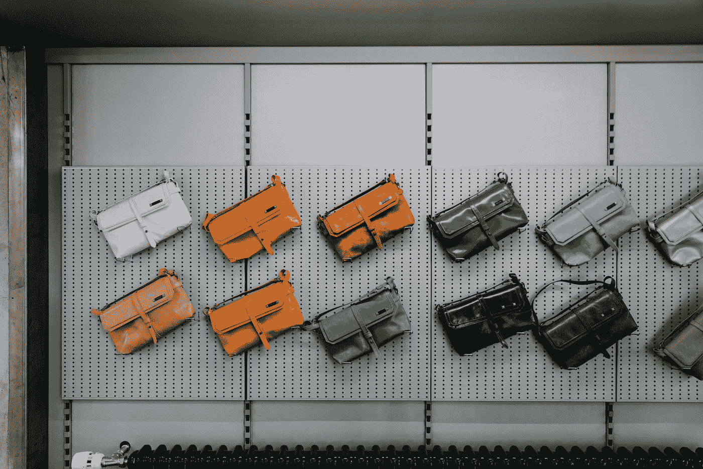

# 改善你的 Kaggle 模型的 5 个简单技巧

> 原文：<https://towardsdatascience.com/5-simple-tips-to-improve-your-kaggle-models-159c00523418?source=collection_archive---------31----------------------->

## 如何在竞赛中获得高性能模型

🇨🇭·克劳迪奥·施瓦茨| @purzlbaum 在 [Unsplash](https://unsplash.com?utm_source=medium&utm_medium=referral) 上拍摄的照片

如果你最近才开始使用 Kaggle，或者你是该平台的老用户，你可能想知道如何轻松地提高你的模型的性能。这里是我在[我的卡格尔之旅](https://www.kaggle.com/louise2001)中积累的一些实用技巧。因此，要么构建自己的模型，要么从一个基线公共内核开始，并尝试实现这些建议！

# 1.总是回顾过去的比赛

虽然 Kaggle 的政策是决不会出现两次相同的比赛，但经常会出现非常相似的问题。例如，一些主持人每年提出一个相同主题的常规挑战(例如 NFL 的大数据碗)，只有很小的变化，或者在某些领域(例如医学成像)有很多目标不同但精神非常相似的比赛。

因此，回顾获胜者的解决方案(由于难以置信的 Kaggle 社区，总是在比赛结束后公布)可能是一个很好的补充，因为它给你提供了开始的想法和获胜的策略。如果你有时间回顾它们，你也会很快发现，即使在非常不同的比赛中，一些流行的基线模型似乎总是做得足够好:

*   卷积神经网络或更复杂的 ResNet 或 EfficientNet 在**计算机视觉挑战**，
*   **音频处理中的 WaveNet 挑战**(如果你只使用 Mel 频谱图，这也可以通过图像识别模型很好地处理)，
*   BERT 及其衍生物(RoBERTa 等)在**自然语言处理挑战**，
*   在**表格数据**上的光梯度增强方法(或其他梯度增强或树策略)…

你既可以直接在 Kaggle 平台上寻找类似的比赛，也可以看看[Sundalai Raj Kumar](https://www.kaggle.com/sudalairajkumar/winning-solutions-of-kaggle-competitions)的这篇很棒的总结。

回顾过去的比赛也可以帮助你得到以下解释的所有其他步骤的提示。例如，获得关于类似问题的预处理的提示和技巧，人们如何选择他们的超参数，他们在他们的模型中实现了哪些额外的工具以使他们赢得比赛，或者他们是否专注于只打包他们的最佳模型的类似版本，或者更确切地说是集合了所有可用公共内核的熔炉。

# 2.你永远不会在数据准备上花足够的时间

这还远不是这份工作最激动人心的部分。然而，这一步的重要性怎么强调都不为过。

*   **清理数据**:永远不要认为主机为你提供了尽可能干净的数据。很多时候，是错的。填充异常值，移除异常值，将数据分成同类观测值的类别…
*   做一些简单的**探索性数据分析**，对你正在做的事情有一个大致的了解(这将帮助你获得洞察力和想法)。**这是现阶段最重要的一步**。如果对数据的结构、所拥有的信息以及目标个体或集体的一般行为特征没有正确的认识，您将会盲目行事，对如何构建模型没有任何直觉。绘制图表、直方图、相关矩阵。
*   扩充你的数据:这可能是提高性能的最好方法之一。但是注意不要把它做得太大，以至于你的模型不能再处理它了。你可以在互联网上找到一些额外的数据集(非常小心权利，否则你可能会遭受与 100 万美元 Deepfake 检测挑战赛获胜者相同的命运)，或者在 Kaggle 平台上(在过去类似的比赛中！)，或者只是处理提供给你的数据:翻转和裁剪图像，叠加录音，回译或替换文本中的同义词…

预处理也是你必须仔细考虑你将依赖什么**交叉验证方法**的步骤。Kaggle 的座右铭基本上可以是:*相信你的简历*。处理你的数据将帮助你知道如何分割它:根据目标值还是样本类别分层？你的数据不平衡吗？如果你有一个聪明的简历策略，并且完全依赖它而不是排行榜分数(尽管它可能非常诱人)，那么你很有可能在私人最终分数上获得惊喜。

# 3.尝试超参数搜索

超参数搜索可帮助您找到模型应该具有的最佳参数(学习速率、softmax 的温度等)，以便获得最佳性能，而无需手动运行一千次枯燥的实验。

最常见的超参数搜索策略包括:

*   **网格搜索**(请不要这样做) :我认为最差的执行方法，因为您可能完全错过某个模式或某些值的非常局部的性能峰值，它包括测试平均分布在您定义的可能值区间上的超参数值；
*   **随机搜索**(及其蒙特卡洛衍生物) :你尝试你的参数的随机值。它的主要问题在于，它是一种并行方法，测试的参数越多，成本就越大。但是，它有一个优点，使您能够在测试中包括先验知识:如果您想找到 1e-4 和 1e-1 之间的最佳学习速率，但您假设它必须在 1e-3 左右，您可以从以 1e-3 为中心的对数正态分布中抽取样本。
*   **贝叶斯搜索**:基本上是随机搜索，但经过改进，因为它是迭代的，因此成本更低。它基于当前模型迭代地评估有希望的超参数配置，然后更新它。这是三个中表现最好的。
*   其他方法包括**基于梯度的搜索**或**进化优化**更加危险，一般不适用。在某些特殊情况下可以推荐使用。

有许多自动化工具可以很好地为你完成这项工作。让我们来看看关于这个话题的优秀媒体&数据资源:

*   [https://towards data science . com/how-to-beat-automl-hyperparameter-optimization-with-flair-3b2f 5092 d9f 5](/how-to-beat-automl-hyperparameter-optimisation-with-flair-3b2f5092d9f5)
*   [https://towards data science . com/automated-machine-learning-hyperparameter-tuning-in-python-dfda 59 b 72 f 8 a](/automated-machine-learning-hyperparameter-tuning-in-python-dfda59b72f8a)
*   [https://medium . com/@ marts alz/automl-hyperparameter-tuning-with-nni-and-keras-ffbef 61206 cf](https://medium.com/@martsalz/automl-hyperparameter-tuning-with-nni-and-keras-ffbef61206cf)

但是，您必须小心，并对超参数值的含义保持坚定的直觉。如果没有可靠的验证集和同质数据，过度的超参数优化可能会导致过度拟合。总是更喜欢一些合理解释的参数选择，而不是在训练数据上取得小数精度。

# 4.简单的练习可以改变游戏

我发现有一些模型包装器可以用来获得更好的结果。他们在不同的层面上工作:

*   在优化过程中，永远不要忘记添加一个**学习率调度器**，它有助于获得更精确的训练(从小规模开始，当您的模型学习良好时逐步增加，例如减少平台上的步骤)。
*   仍然在优化过程中，您可以将 **Lookahead** 包装在您的优化器周围；前瞻算法包括向前进行 k 个优化步骤，找到性能最佳的地方，然后向最优方向后退一步，并从那里重新开始训练。理论上你会得到更好的性能，尽管我从未发现这是真的；但是它稳定了训练，这在你的数据非常嘈杂的时候很好。
*   在开始训练之前，为你的权重找到一个好的初始化:如果你正在使用一个流行的架构，从基线权重开始(如图像识别中的 **ImageNet** ，如果没有，尝试**层顺序单元方差**初始化(LSUV，最好的可能初始化——理论上)。它包括将您的权重初始化为正交，以及所有可训练层的单位方差。
*   最后，我经常发现**从神经网络的最后一层权重**训练一个 LGBM，而不是添加一个 softmax 作为输出层，可以出奇地好。

# 5.包，包，包，包！

除了数据扩充，可能没有比混合(也称为打包)更有效的技术来提高您的性能。

我的个人建议是，我总是保存我运行的每一个模型预测，包括我的折叠和最终模型，并对它们进行平均(只是基本的平均，我从未发现任何证据表明“聪明”的组合，如根据模型的独奏表现加权模型，会增加最终得分)。不要忘记混合公共内核。

你的组合策略中有越多的模型，你就越有可能在私人排行榜变动中幸存下来。事实上，使你的模型多样化会使你的最终结果更加稳健。这与金融中一个潜在的投资组合多样化的想法是一样的:不是一种具有给定回报和给定方差的资产，而是许多具有相同回报和相同方差的不同资产，因为它们同时减少的可能性要小得多，一种资产的损失将由其他资产的盈利来补偿。同样的想法，不要只依赖一个模型，让很多不同的模型投票:它们中的大多数预测的目标(在分类中)或每个预测的目标的平均值(在回归中)将很可能更接近真实的答案。

# 希望你喜欢这篇文章，感谢 theo Viel 的评论。