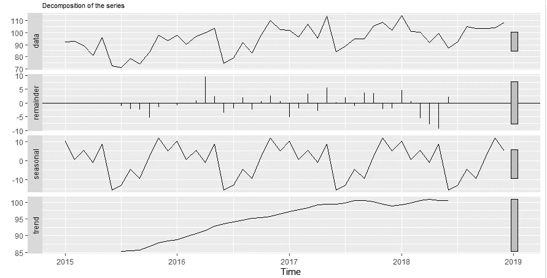
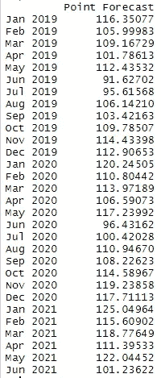
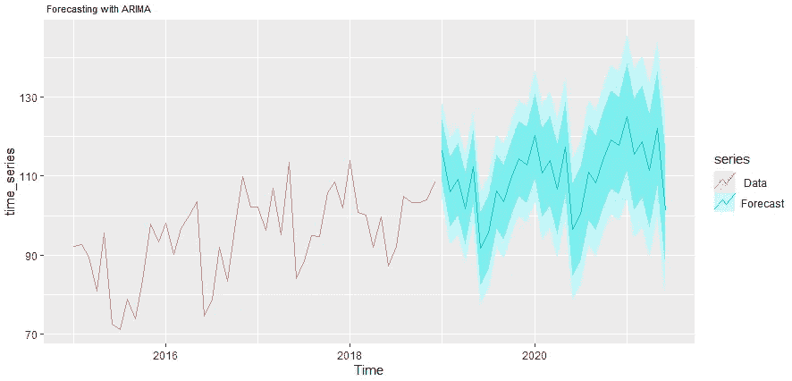
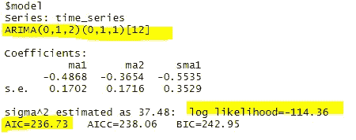
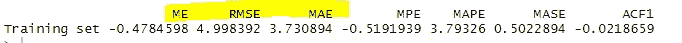

# 建立时间序列预测模型的 5 个简单步骤

> 原文：<https://towardsdatascience.com/5-simples-steps-to-build-your-time-series-forecasting-model-62356336bc35?source=collection_archive---------16----------------------->

## 从数据准备到模型评估—关于构建简单的预测模型，您只需知道这些


照片由[阿德里安](https://unsplash.com/@aows?utm_source=medium&utm_medium=referral)在 [Unsplash](https://unsplash.com?utm_source=medium&utm_medium=referral) 上拍摄

我坚信“边做边学”的哲学。

数据科学是一个应用领域，所以你需要尝试学习一些东西。人们可以阅读所有关于游泳的“如何做”的教程，但在某些时候，他们必须测试水。

数据科学的初学者经常陷入这样一种印象:在做一个项目之前，他们必须学习世界上所有的东西。错了！我相信人们可以通过做一些小事情而不是阅读来学得更快。

在这篇文章中，我想让你学习如何拟合时间序列预测模型 ARIMA——对许多人来说，这是一个令人生畏的算法。在这篇文章中，你将通过 5 个简单的步骤学会它，并做出真正的预测。你不会造一辆法拉利，但我相信你会学会造一辆可以上街的车。

让我们卷起袖子。

# 步骤 1:数据准备

对于这个演示，我们将在 R 编程环境中使用一个名为`fpp2`的预测包。让我们装载那个包裹。

```
# Required packages
library(fpp2)
```

我从一个真实的时间序列中提取了一些数据。下面是这些值，让我们也把它们复制到 R 脚本中。

```
# your data
values = c(92.1,  92.6,  89.5,  80.9,  95.6,  72.5,  71.2,  78.8,  73.8,  83.5,  97.9, 93.4,  98.0,  90.2,  96.7, 100.0, 103.6,  74.6,  78.9,  92.0,  83.4,  98.1, 109.9, 102.2, 102.1,  96.2, 106.9,  95.1, 113.4,  84.0,  88.6,  94.9,  94.7, 105.7, 108.6, 101.9,  113.9, 100.9, 100.2,  91.9,  99.6,  87.2,  92.1, 104.9, 103.4, 103.3, 103.9, 108.5)
```

像其他建模软件一样，这个软件包有特定的数据格式要求。`ts()`函数通过将数据转换成时间序列对象来处理这个问题。

在此函数中，我们指定起始年份(2015 年)和 12 个月的频率。

```
# your time series
time_series = ts(values, start = 2015, frequency =12)
```

# 步骤 2:时间序列分解

分解基本上意味着将系列分解和可视化为其组成部分。

```
# time series decomposition
autoplot(decompose(time_series)) + theme(plot.title = element_text(size=8))
```

下图显示了 4 条信息:您的数据(顶部一条)、总体趋势和季节性。最后一块被称为余数或随机部分。



时间序列分解

# 第三步:建模

实际的模型构建是一个简单的使用`auto.arima()`函数的 2 行代码。`auto.arima`会照顾到最佳的参数值，你只需要指定几个布尔参数。

```
model = auto.arima(time_series, seasonal = TRUE, stepwise = FALSE, approximation = FALSE)
```

# 第四步:预测

做一个实际的预测是上面所有步骤中最简单的，仅仅是半行代码的长度——你能相信吗？我们正在使用`forecast()`函数，传递上面的模型，并指定你想要预测的未来的时间步数(我指定的是未来 30 个月)

```
# making forecast
forecast_arima = forecast(model, h=30)
```

你实际上已经完成了预测。您可以使用`print(forecast_arima)`功能打印预测值。



预测值

或者，您可能希望将预测值、输入序列和置信区间一起可视化。

```
# visualizing forecast
autoplot(time_series, series = " Data") +
  autolayer(forecast_arima, series = "Forecast") +
  ggtitle(" Forecasting with ARIMA") +
  theme(plot.title = element_text(size=8))
```



用 ARIMA 预测

# 第五步:模型评估

这是模型评估和准确性测试的额外步骤。首先，让我们看看模型描述:

```
# model description
model['model']
```

我强调了一些你可能感兴趣的东西:模型的描述(ARIMA(0，1，2(0，1，1)[12])和 AIC 值。AIC 通常用于比较两个或多个模型的性能。



在大多数机器学习模型中，精度是基于 RMSE 或 MAE 值来确定的。我们也把它们打印出来吧。

```
# accuracy
accuracy(model)
```



仅此而已！

# 后续步骤

您刚刚使用 5 个简单的步骤构建并实现了一个预测模型。这是否意味着你成为了预测大师？不，但是你从头到尾都知道模型的整体结构，并且能够用不同的数据集、不同的参数值等来处理它。

就像我一开始说的，你没有造出一辆法拉利，但是你造出了一辆可以带到杂货店的车！

可以通过 [Twitter](https://twitter.com/DataEnthus) 或 [LinkedIn](https://www.linkedin.com/in/mab-alam/) 联系我。