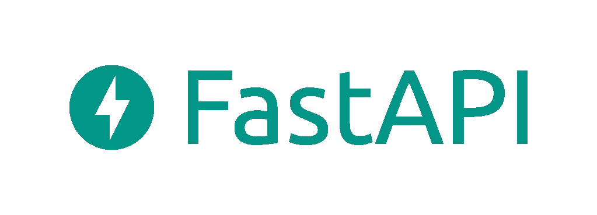

# 面向现代开发人员的 5 个平滑 Python Web 框架

> 原文：<https://towardsdatascience.com/5-smooth-python-web-frameworks-for-the-modern-developer-47db692dfd52?source=collection_archive---------7----------------------->

## 5 个更棒的 Python Web 框架供你欣赏！


(python logo src =[http://python.org](http://python.org)

大约一个月前，我写了一篇短文，重点介绍了我最喜欢的 Flask 和 Django 的老式轻量级替代方案，我喜欢用它们来部署端点。虽然这肯定是一些伟大的 web 框架的列表，但它们更以轻量级为中心，比可能吸引现代 Python 数据科学家或开发人员的选项更过时。由于这篇文章，我收到了几个惊人的回复，启发我使用 Python 部署端点的更好的选择。其中一些我很熟悉，但另一些对我来说是全新的，尝试这些新模块并使用它们的酷功能是令人兴奋的！如果你想阅读之前的文章，这里是:

[](/5-cool-alternatives-to-django-and-flask-for-deploying-endpoints-5c99a066696) [## 用于部署端点的 Django 和 Flask 的 5 个很酷的替代方案

### 不用 Flask 或 Django 部署 API 的有用框架。

towardsdatascience.com](/5-cool-alternatives-to-django-and-flask-for-deploying-endpoints-5c99a066696) 

# №1: FastAPI



(https://fastapi.tiangolo.com/的 src =

从我们的列表开始是一个 web 框架，它遵循与我喜欢的许多模块相同的方法。FastAPI 是一个 Python web 框架，专注于轻量级和快速性。我真正喜欢 FastAPI 的一点是它的开发是如此的快速和简单。这对于端点特别有用，因为除了逻辑之外通常没有什么，而且你很可能不需要 Django 或 TurboGears 之类的东西来创建。

FastAPI 也有很棒的文档，很容易学习。考虑到它的易用性和简单性，这一点尤为重要。FastAPI 中的“快”既代表了开发 API 的速度，也代表了这些 API 的返回速度。它还基于为 API 创建而精心编排的开放标准，因此与其他 web 框架类似，您可以在一个方便的包中获得传输数据可能需要的所有工具。

至于语法，FastAPI 采用了一种非常类似 Flask 的方法来创建端点。这是有充分理由的，因为 Flask 是另一个框架，它在保持事物特别小的同时又非常灵活。

```
from fastapi import FastAPI
app = FastAPI()   
@app.get("/") 
async def root():
     return {"message": "Hello World"}
```

# №2:龙卷风


https://www.tornadoweb.org/en/stable/(src =

Tornado 不仅是一个伟大的 web 框架，而且还是一个异步网络库。凭借这一特性，Tornado 能够为数千个开放连接提供服务。这是因为 tornado 使用非阻塞网络进出流。这使得 Tornado 对于需要庞大和可扩展的解决方案非常有用！

Tornado 实际上与大多数其他 Python web 框架有很大不同，因为它不在 WSGI 上运行。虽然这意味着您在网络服务器选项上可能会受到一些限制，但 Tornado 自带预打包的服务器，可以让您立即启动并运行。虽然我很喜欢 Tornado，但要注意的是，当我试图用 NGINX 部署它时，我确实遇到了更多的错误，在某些时候，让 NGINX 路由到正确的位置是非常令人沮丧的。我在用 Genie for Julia 时也遇到过这个问题，所以我不确定是什么原因造成的，但是如果你在用 Tornado，那么你可能想试着设置一个 Apache 服务器，而不是 NGINX 服务器。

在语法方面，Tornado 采用了一种非常类似涡轮的路由方法。使用 Tornado，而不是将逻辑放入路由中，您通常会构建类来处理这些路由上的响应，就像他们文档中的这个示例:

```
**import** **tornado.ioloop**
**import** **tornado.web**

**class** **MainHandler**(tornado.web.RequestHandler):
    **def** get(self):
        self.write("Hello, world")

**def** make_app():
    **return** tornado.web.Application([
        (r"/", MainHandler),
    ])

**if** __name__ == "__main__":
    app = make_app()
    app.listen(8888)
    tornado.ioloop.IOLoop.current().start()
```

# №3:金字塔


(src =[https://trypyramid.com/](https://trypyramid.com/)

金字塔是我主观上非常喜欢使用的网络框架之一。金字塔有什么了不起的？虽然 Pyramid 坚持轻量级思想，并提供了用最少的代码快速创建端点的非常简单的方法，但它也包括了如果您打算扩大操作规模时可能需要的所有功能。

金字塔吹捧的最大好处之一是可伸缩性。金字塔既可以是基本的，也可以是复杂的，这可能会吸引那些希望在未来扩展其端点的数据科学家。从语法上来说，Pyramid 和 Tornado 的方法论差不多。它一直遵循面向对象的范例，这可能是一件好事，也可能是一件坏事。

```
**from** wsgiref.simple_server **import** make_server
**from** pyramid.config **import** Configurator 
**from** pyramid.response **import** Response  
**def** **hello_world**(request):
     **return** Response('Hello World!')
**if** __name__ == '__main__':
     **with** Configurator() **as** config:   
        config.add_route('hello', '/')
        config.add_view(hello_world, route_name='hello')         
        app = config.make_wsgi_app()
        server = make_server('0.0.0.0', 6543, app)
        server.serve_forever()
```

# №4:夸


(https://pgjones.gitlab.io/quart/的 src =

不要让夸脱的标志欺骗了你，它与模块闪光灯的关系比与瓶子的关系更大。Quart 本质上是放入一个模块中两个 web 框架的组合:

> 阿辛西奥和弗拉斯克。

这是一件奇妙的事情，因为这两者的结合是一个致命的组合！Quart 是轻量级的，就像 Flask 一样，但是也包含了一个完整的异步特性列表，您可能会从 Tornado 这样的东西中看到这些特性。这是另一个我主观上非常喜欢的作品。Quart 感觉就像一个稍微加强了的烧瓶，在添加更多功能的过程中，它没有牺牲速度或易用性。有趣的是，Quart 文档实际上建议您去访问 Flask 文档，我认为这确实说明了它的分叉性质。

```
**from** **quart** **import** Quart

app = Quart(__name__)

**@app**.route('/')
**async** **def** hello():
    **return** 'hello'

app.run()
```

> 如果你曾经想要一个异步的 Flask，Quart 就是你的框架！

# №5:害群之马


https://github.com/RobertoPrevato/BlackSheep(src =

现在是时候来点不同的东西了；一只害群之马，如果你愿意的话。

> (不好意思，烂笑话。)

Black Sheep 是一个 web 框架，灵感来自于像 ASP.NET 和 Flask 这样的优秀工具，可以用来轻松地创建基于事件的 web 应用程序。考虑到这一点，我真的不明白为什么它被称为害群之马，因为该框架背后的语法和方法与 Flask 非常相似。

```
from datetime import datetime
from blacksheep.server import Application
from blacksheep.server.responses import text

app = Application()

@app.route('/')
async def home(request):
    return text(f'Hello, World! {datetime.utcnow().isoformat()}')
```

像 Quart 一样，Black Sheep 也包含了用于同步和跨 web 创建非阻塞端点的神奇工具。总的来说，这的确是一个很好的使用框架，但是与 Quart 非常相似——所以如果你使用其中一个，你就已经很好地使用了它们两个，至少就我所知。所以我还是会问这个问题，

> “那怎么是败家子？”

> (也许我对这个命名方案看得太远了……)

# 结论

因此，现在有了一些更现代、更常用的网络框架，它们一定会帮助您部署新的终端。虽然在我看来，它们都值得添加，如果我必须选择一个，我可能会选择 FastAPI。FastAPI 简单、轻量，顾名思义；很快。然而，这并不是说 FastAPI 在任何情况下都是最佳选择。没有一个应用程序能够一次突破所有的限制，考虑到这一点，我会决定你的具体情况需要什么样的最佳功能，并根据这个选择，而不是主观意见。

总的来说，我认为所有这些都值得添加和尝试，如果你有足够的存储空间来实现它们的话。将来，我可能会对请求响应进行一些速度测试，看看我们实际上可以获得什么样的收益，并量化这些框架经常声称的速度。