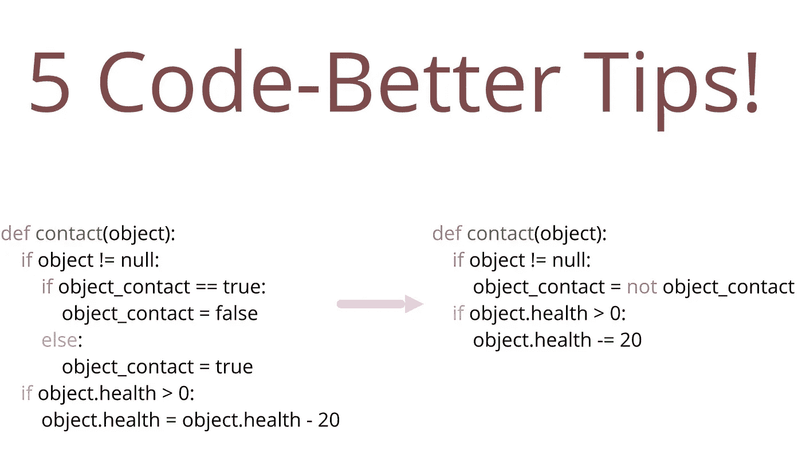

# Python 的 5 个流畅语法技巧

> 原文：<https://towardsdatascience.com/5-smooth-syntactical-tricks-for-python-61cd69663cc9?source=collection_archive---------16----------------------->

## 通过使用这些极其简单的技巧，让你的代码更加简洁和快速



(图片由作者提供)

# 介绍

众所周知，编程可能非常复杂。伴随这种复杂性而来的还有语法的复杂性。虽然有时很容易避免在条件语句上堆叠循环，但在某些情况下，在条件语句上堆叠循环可能是您试图解决的问题的唯一解决方案。记住这一点，不管代码的大小或范围如何，都有一些简单的技巧可以让你的操作更加简洁、易读，有时甚至更快！

> 重要提示:

我不喜欢强调在开发阶段编写“干净”代码的想法。关于这些技巧，要说的重要一点是，虽然它们方便简洁，但相反的往往是**而不是错误的**做事方式。换句话说，不遵循这些指导方针不会让你成为一个更差的程序员，但是会让你的代码更难看。也就是说，在调试过程中，很难用您所做的每一个测试或打印语句来编写简洁而完美的代码，所以我的建议是——不要！使用干净且格式化的代码的一个很好的方法是在代码完成并工作后**让它干净并格式化。**

# №1:不是

Python 编程语言中一个我认为经常被忽视的伟大特性就是它的英语式语法是多么的直观。如何表达这一点的一个很好的例子是 not 的用法。要完全否定一个布尔值，就像写出一个英文负数一样简单。这当然也适用于条件语句，比如:

```
if number not in list:
```

当然，如果给定的数字不在列表中，这个条件将返回 true。这是一种非常简单明了的方法，使得解决这样的问题变得轻而易举。考虑下面的例子:

```
def toggle_switch(self):
    if self.toggled == false:
        self.toggled = true
    else:
        self.toggled = false
```

这段代码当然可以很好地切换开关，但是坦白地说，这是浪费代码行。我们可以用 not 简单地否定布尔值，而不是首先做一个条件语句。

```
def toggle_switch(self):
    self.toggled = not self.toggled
```

# №2:加/减断言

我不喜欢在代码中看到的一件事是:

```
newvar = newvar - 5
```

这当然是正确的。它将从我们的变量中减去 5，并将我们的别名设置为等于差值。然而，我们可以让它看起来更整洁，特别是当它被更多的代码包围时，只需使用-=操作符。

```
newvar -= 5
```

与后者相比，我更喜欢后者，因为查看单个操作数更容易理解发生了什么，而不是查看两个操作数的组合并辨别回报是什么。当然，这只是个人偏好，但我确实认为很难争论它是否看起来更好。

# №3:反转列表

你曾经需要改变你的生活吗？事情没有按照你的清单进行，而你希望事情是相反的吗？幸运的是，Python 的列表类型有一个默认函数 reverse()，它允许您这样做。

```
arr = [5,10,15]
revarr = arr.reverse()
print(revarr)[15,10,5]
```

# №4:转置矩阵

在处理线性代数和大型矩阵时，你可能会遇到的一个问题就是转置这些矩阵。当然，您总是可以通过对矩阵使用 Numpy 来实现这一点，但是也可以尝试使用 zip()方法！

```
x = [[37,22],
[48 ,29],
[18 ,12]]print (zip(*x))[(37, 48, 18), (22, 29, 12)]
```

# №5:系列变量

通常，在 Pythonic 代码中，您可以命名几个变量来执行算术运算，如下所示:

```
a = 5
b = 8
c = 9
```

当然，像许多其他人一样，这当然是正确的！如您所料，这会将 a 分配给 5，b 分配给 8，c 分配给 9。然而，我们可以将这三行断言压缩成一行，如下所示:

```
a, b, c = 5, 8, 9
```

这当然会产生相同的结果。在我看来，这看起来比后者好得多。当然这不是必须的，是喜好问题。然而在我看来，它一定会让你的作品看起来漂亮很多！

# №6:(奖金)计数器

在数据科学中，很有可能会遇到这样的情况，他们可能希望从列表中抽取计数。这可能是为了检查样本中某些属性的表示，或者只是为了查看给定特性中的所有选项。获取列表中计数的最佳方式是使用集合模块中的计数器，如下所示:

```
from collections import Counter
lst = [4, 3, 3, 2, 4, 3]
print(Counter(lst))
Counter({3: 3, 4: 2, 2: 1})
```

这将返回一个字典，其中包含列表中每个唯一观察值的键和它们各自的计数。

# 结论

代码肯定会很快变得糟糕透顶。对 Python 程序员来说幸运的是，Python 有很多相当简单的方法来解决和防止难看的代码。从简单的关键字，如不否定布尔和改变条件，到非常简单的方法来创建交叉列表和转置矩阵。虽然这些技巧中只有一部分可能会让您的代码工作得更好一点，或者运行得更快一点，但所有这些技巧肯定会让您的代码看起来更好。归根结底，可读性是非常重要的，尤其是对你可能与之共事的其他人而言。因此，记住这一点，考虑本文中提出的要点，整理您的代码！