# 对不平衡数据进行过采样的 5 种 SMOTE 技术

> 原文：<https://towardsdatascience.com/5-smote-techniques-for-oversampling-your-imbalance-data-b8155bdbe2b5?source=collection_archive---------2----------------------->

## 了解过采样数据的 SMOTE 方法


[粘土银行](https://unsplash.com/@claybanks?utm_source=medium&utm_medium=referral)在 [Unsplash](https://unsplash.com?utm_source=medium&utm_medium=referral) 拍摄的照片

不平衡数据是指分类数据集类的比例不均衡。例如，我将在本文中使用来自 [Kaggle](https://www.kaggle.com/shubh0799/churn-modelling) 的客户流失数据集。

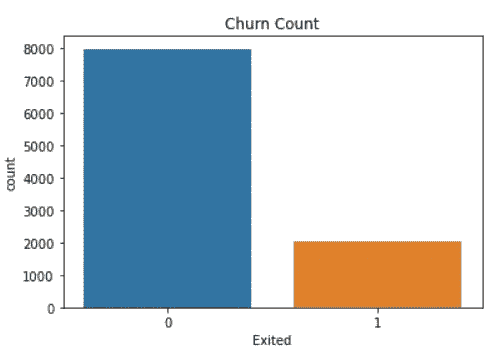

作者创造的形象

我们可以看到“是”类与“否”类相比存在偏差。如果我们计算一下比例，Yes 类比例在整个数据集的 20.4%左右。虽然，不平衡的数据怎么分类？下表可能对你有所帮助。

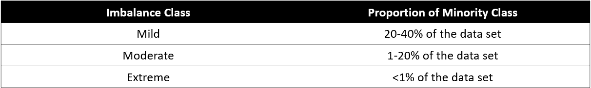

作者创造的形象

不平衡有三种情况——轻度、中度和极端；取决于少数类占整个数据集的比例。在上面的例子中，我们只有轻微的不平衡数据。

现在，为什么在创建我们的机器学习模型时，我们需要关心不平衡的数据？嗯，不平衡类会产生偏差，机器学习模型倾向于预测多数类。你不希望预测模型忽略少数阶级，对不对？

这就是为什么存在克服不平衡问题的技术——欠采样和过采样。这两种技术有什么区别？

欠采样会降低多数阶级的比例，直到人数与少数阶级相似。同时，**过采样**将按照多数类比例对少数类比例进行重新采样。

在本文中，我将只写一种称为 SMOTE 的特定过采样技术和各种 SMOTE。

请注意，我是一名数据科学家，我认为应该保持比例不变，因为它代表了数据。在使用这些技术之前，最好先尝试一下特性工程。

# 重击

那么，什么是 SMOTE？SMOTE 或**合成少数过采样技术**是一种过采样技术，但 SMOTE 的工作方式与典型的过采样不同。

在经典的过采样技术中，**少数数据是从少数数据总体中复制的。**虽然它增加了数据的数量，但它并没有给机器学习模型提供任何新的信息或变化。

出于上述原因， [Nitesh Chawla](https://www3.nd.edu/~nchawla/) 等人(2002)在他们的 [SMOTE 论文](https://arxiv.org/abs/1106.1813)中介绍了一种新技术，用于创建用于过采样目的的合成数据。

SMOTE 的工作原理是利用一种 **k 近邻**算法来创建合成数据。SMOTE 首先从少数类中选择随机数据，然后设置数据的 k-最近邻。然后在随机数据和随机选择的 k-最近邻之间产生合成数据。让我给你看下面的例子。

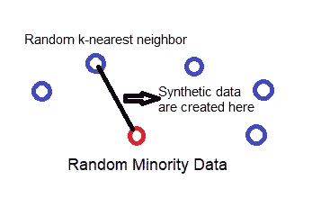

作者创造的形象

重复该过程足够多次，直到少数类具有与多数类相同的比例。

我省略了更深入的解释，因为上面的段落已经总结了 SMOTE 是如何工作的。在这篇文章中，我想重点介绍 SMOTE 及其变体，以及何时使用它，而不会在理论上触及太多。如果你想知道更多，让我把我在这里提到的每个变化的链接附在纸上。

作为准备，我会使用 **imblearn** 包，其中包括 SMOTE 及其在包中的变体。

```
#Installing imblearnpip install -U imbalanced-learn
```

## 1.重击

我们将从使用默认形式的 SMOTE 开始。我们将使用上面相同的客户流失数据集。让我们先准备好数据，然后尝试 SMOTE。

如果你从我上面的解释中意识到，SMOTE 用于合成特征连续的数据，是一个分类问题。为此，在本节中，我们将只尝试对分类目标使用两个连续的特征。

```
import pandas as pd
import seaborns as sns#I read the csv churn data into variable called df. Here I would only use two continuous features CreditScore and Age with the target Exiteddf_example = df[['CreditScore', 'Age', 'Exited']]
sns.scatterplot(data = df, x ='CreditScore', y = 'Age', hue = 'Exited')
```

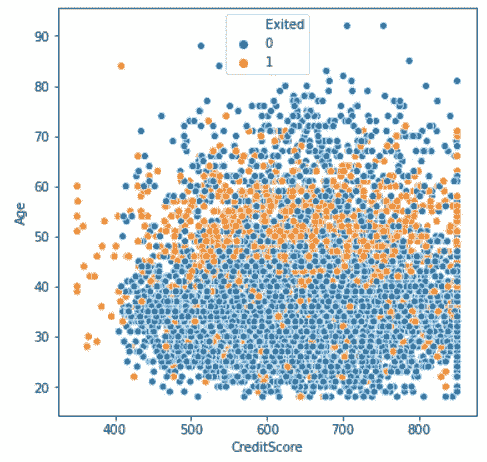

作者创造的形象

正如我们在上面“信用分数”和“年龄”特征之间的散点图中看到的，0 和 1 类之间有混淆。

让我们尝试使用 SMOTE 技术对数据进行过采样。

```
#Importing SMOTE
from imblearn.over_sampling import SMOTE#Oversampling the data
smote = SMOTE(random_state = 101)
X, y = smote.fit_resample(df[['CreditScore', 'Age']], df['Exited'])#Creating a new Oversampling Data Frame
df_oversampler = pd.DataFrame(X, columns = ['CreditScore', 'Age'])
df_oversampler['Exited']sns.countplot(df_oversampler['Exited'])
```

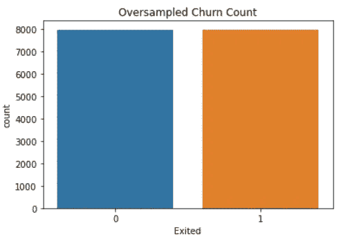

作者创造的形象

正如我们在上面的图表中看到的，0 类和 1 类现在有相似的比例。让我们看看如果我们像以前一样创建一个相似的散点图会怎么样。

```
sns.scatterplot(data = df_oversampler, x ='CreditScore', y = 'Age', hue = 'Exited')
```

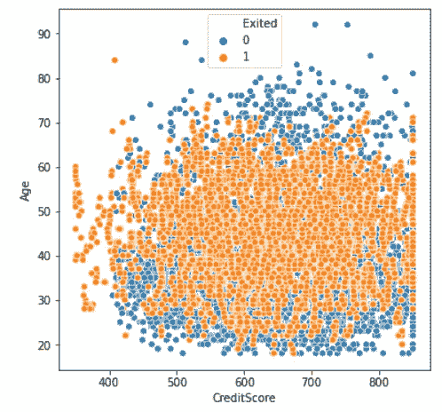

作者创造的形象

目前，我们有过采样数据来填充之前用合成数据填充的空白区域。

正如我之前所说，过采样的目的是为了获得更好的预测模型。这项技术不是为任何分析目的而创建的，因为创建的每个数据都是合成的，所以这是一个提醒。

出于上述原因，我们需要评估过采样数据是否会导致更好的模型。让我们从拆分数据来创建预测模型开始。

```
# Importing the splitter, classification model, and the metric
from sklearn.linear_model import LogisticRegression
from sklearn.model_selection import train_test_split
from sklearn.metrics import classification_report#Splitting the data with stratificationX_train, X_test, y_train, y_test = train_test_split(df_example[['CreditScore', 'Age']], df['Exited'], test_size = 0.2, stratify = df['Exited'], random_state = 101)
```

此外，您应该只对训练数据而不是整个数据进行过采样，除非您将整个数据用作训练数据。如果要拆分数据，应该先拆分数据，然后再对定型数据进行过采样。

```
#Create an oversampled training data
smote = SMOTE(random_state = 101)
X_oversample, y_oversample = smote.fit_resample(X_train, y_train)
```

现在我们有了不平衡数据和过采样数据，让我们尝试使用这两种数据创建分类模型。首先，让我们看看用不平衡数据训练的逻辑回归模型的性能。

```
#Training with imbalance data
classifier = LogisticRegression()
classifier.fit(X_train, y_train)print(classification_report(y_test, classifier.predict(X_test)))
```

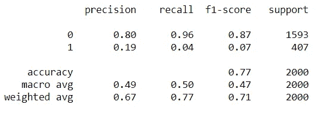

作者创造的形象

正如我们从指标中看到的，我们用不平衡数据训练的逻辑回归模型倾向于预测 0 类而不是 1 类。偏差存在于我们的模型中。

让我们看看如何使用过采样数据训练模型的结果。

```
#Training with oversampled dataclassifier_o = LogisticRegression()
classifier_o.fit(X_oversample, y_oversample)print(classification_report(y_test, classifier_o.predict(X_test)))
```

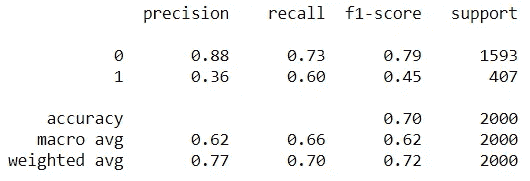

作者创造的形象

在这种情况下，模型在预测类 1 中表现更好。在这种情况下，我们可以说过采样数据有助于我们的逻辑回归模型更好地预测类别 1。

我可以说，过采样数据改进了用于预测目的的逻辑回归模型，尽管“改进”的上下文再次回到了用户。

## 2.SMOTE-NC

我提到过 SMOTE 只对连续特征有效。那么，如果你有混合的(分类的和连续的)特征该怎么办呢？在这种情况下，我们有 SMOTE 的另一种变体，称为 SMOTE-NC(标称和连续)。

那么，你可能会想，只是把分类数据转换成数字；因此，我们有一个供 SMOTE 使用的数字特性。问题是当我们这么做的时候。我们会得到毫无意义的数据。

例如，在上面的流失数据中，我们有“IsActiveMember”分类特征，数据为 0 或 1。如果我们使用 SMOTE 对此数据进行过采样，最终可能会得到 0.67 或 0.5 等过采样数据，这根本没有意义。

这就是为什么当我们有混合数据的情况下，我们需要使用 SMOTE-NC。前提很简单，**我们表示哪些特征是分类的，SMOTE 将对分类数据进行重采样，而不是创建合成数据。**

我们试试应用 SMOTE-NC。在这种情况下，我将选择另一个特征作为示例(一个分类，一个连续)。

```
df_example = df[['CreditScore', 'IsActiveMember', 'Exited']]
```

在这种情况下，“CreditScore”是连续特征，“IsActiveMember”是分类特征。然后，让我们像以前一样拆分数据。

```
X_train, X_test, y_train, y_test = train_test_split(df_example[['CreditScore', 'IsActiveMember']],df['Exited'], test_size = 0.2,stratify = df['Exited'], random_state = 101)
```

然后，让我们再次创建两个不同的分类模型；一个用不平衡数据训练，一个用过采样数据训练。首先，让我们尝试 SMOTE-NC 对数据进行过采样。

```
#Import the SMOTE-NC
from imblearn.over_sampling import SMOTENC#Create the oversampler. For SMOTE-NC we need to pinpoint the column position where is the categorical features are. In this case, 'IsActiveMember' is positioned in the second column we input [1] as the parameter. If you have more than one categorical columns, just input all the columns positionsmotenc = SMOTENC([1],random_state = 101)
X_oversample, y_oversample = smotenc.fit_resample(X_train, y_train)
```

准备好数据后，让我们试着创建分类器。

```
#Classifier with imbalance dataclassifier = LogisticRegression()
classifier.fit(X_train, y_train)print(classification_report(y_test, classifier.predict(X_test)))
```

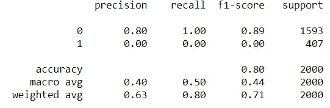

作者创造的形象

有了不平衡数据，我们可以看到分类器偏向类 0，完全忽略类 1。那么，如果我们用 SMOTE-NC 过采样数据来训练它呢？

```
#Classifier with SMOTE-NCclassifier_o = LogisticRegression()
classifier_o.fit(X_oversample, y_oversample)print(classification_report(y_test, classifier_o.predict(X_test)))
```

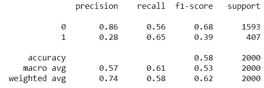

作者创造的形象

就像 SMOTE 一样，具有 SMOTE-NC 过采样数据的分类器为机器学习模型提供了预测不平衡数据的新视角。这不一定是最好的，但比不平衡的数据要好。

## 3.临界 SMOTE

边界 SMOTE 是 SMOTE 的变体。顾名思义，和边界有关系。

因此，与 SMOTE 不同，在 SMOTE 中，合成数据是在两个数据之间随机创建的， **Borderline-SMOTE 仅沿着两个类**之间的决策边界生成合成数据。

此外，有两种边界 SMOTE 有边界-SMOTE1 和边界-SMOTE2。区别很简单；Borderline-SMOTE1 还对多数类进行过采样，其中多数数据会导致决策边界中的错误分类，而 Borderline-SMOTE2 只对少数类进行过采样。

让我们用我们以前的数据来试试边界 SMOTE。我会再一次只使用数字特征。

```
df_example = df[['CreditScore', 'Age', 'Exited']]
```

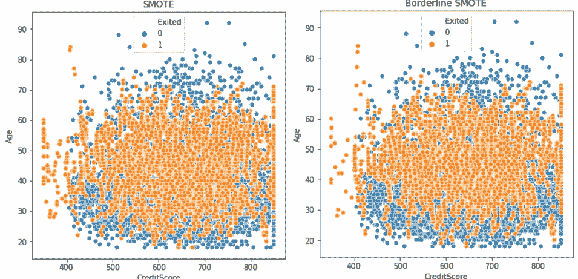

作者创造的形象

上图是 SMOTE 过采样数据和 Borderline-SMOTE1 的区别。它可能看起来略有相似，但我们可以看到在创建合成数据的地方存在差异。

机器学习模型的性能如何？让我们试试吧。首先，像往常一样，我们拆分数据。

```
X_train, X_test, y_train, y_test = train_test_split(df_example[['CreditScore', 'Age']], df['Exited'], test_size = 0.2,  stratify = df['Exited'], random_state = 101)
```

然后，我们使用 Borderline-SMOTE 创建过采样数据。

```
#By default, the BorderlineSMOTE would use the Borderline-SMOTE1
from imblearn.over_sampling import BorderlineSMOTEbsmote = BorderlineSMOTE(random_state = 101, kind = 'borderline-1')X_oversample_borderline, y_oversample_borderline = bsmote.fit_resample(X_train, y_train)
```

最后，让我们用边界 SMOTE 过采样数据来检查机器学习性能。

```
classifier_border = LogisticRegression()
classifier_border.fit(X_oversample_borderline, y_oversample_borderline)print(classification_report(y_test, classifier_border.predict(X_test)))
```

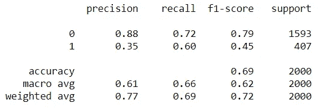

作者创造的形象

性能与用 SMOTE 过采样数据训练的模型没有太大区别。这意味着我们应该关注特征，而不是对数据进行过采样。

当我们知道错误分类经常发生在边界决策附近时，最好使用 Borderline-SMOTE。否则，我们可以使用通常的 SMOTE。如果你想了解更多关于边界线-SMOTE 的信息，你可以在这里查看论文。

## 4.濒临崩溃的 SVM

边界重击的另一个变体是边界重击 SVM，或者我们可以称之为 SVM 重击。

SVM-SMOTE 和其他 SMOTE 之间的主要区别在于，该技术将结合 SVM 算法，而不是使用 K-最近邻来识别边界线-SMOTE 中的错误分类。

在 SVM-SMOTE 中，在原始训练集上训练支持向量机分类器后，边界区域由支持向量近似。合成数据将沿着将每个少数类支持向量与其多个最近邻居连接起来的线被随机创建。

与边界线-SMOTE 相比，边界线-SMOTE SVM 的特殊之处在于，更多的数据是在远离类重叠区域的地方合成的。它更关注数据在哪里被分离。

就像以前一样，让我们尝试在模型创建中使用该技术。在边界 SMOTE 示例中，我仍然使用相同的训练数据。

```
from imblearn.over_sampling import SVMSMOTE
svmsmote = SVMSMOTE(random_state = 101)X_oversample_svm, y_oversample_svm = svmsmote.fit_resample(X_train, y_train)classifier_svm = LogisticRegression()
classifier_svm.fit(X_oversample_svm, y_oversample_svm)print(classification_report(y_test, classifier_svm.predict(X_test)))
```

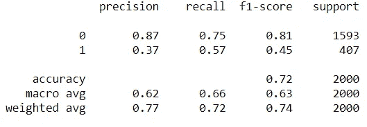

作者创造的形象

性能再一次没有太大的不同，虽然我可以说这个时候的模型比我们使用其他技术的时候稍微更喜欢 0 类，但也不是太多。

这再次取决于你，你的预测模型目标是什么，以及受其影响的业务。如果你想了解更多关于被边界袭击的 SVM 的情况，你可以查看这里的文章。

## 5.自适应合成采样

ADASYN 是 SMOTE 的另一个变体。与 Borderline-SMOTE 相比，ADASYN 采用了一种更加不同的方法。当 Borderline-SMOTE 试图合成数据决策边界附近的数据时， **ADASYN 根据数据密度创建合成数据。**

合成数据的生成将与少数群体的密度成反比。这意味着在少数样本密度低的特征空间区域中创建更多的合成数据，而在密度高的特征空间区域中创建更少或没有合成数据。

简而言之，在少数民族人口密度较低的地区，会产生更多的合成数据。不然合成数据也没做那么多。

让我们看看使用 ADASYN 的性能如何。在边界 SMOTE 示例中，我仍然使用相同的训练数据。

```
from imblearn.over_sampling import ADASYN
adasyn = ADASYN(random_state = 101)X_oversample_ada, y_oversample_ada = adasyn.fit_resample(X_train, y_train)classifier_ada = LogisticRegression()
classifier_ada.fit(X_oversample_ada, y_oversample_ada)print(classification_report(y_test, classifier_ada.predict(X_test)))
```

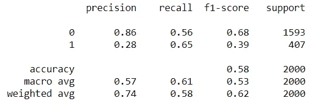

作者创造的形象

从上面的模型性能可以看出，性能比我们使用其他 SMOTE 方法时稍差。

问题可能在于离群值。正如我之前所说的，ADASYN 将重点关注密度较低的密度数据。通常，低密度数据是一个异常值。ADASYN 方法会将过多的注意力放在特征空间的这些区域上，这可能会导致更差的模型性能。在使用 ADASYN 之前，最好移除异常值。

如果你想了解更多关于 ADASYN 的信息，你可以点击查看论文[。](https://ieeexplore.ieee.org/document/4633969)

# 结论

在创建预测性机器学习模型时，不平衡的数据是一个问题。缓解这个问题的一种方法是对少数数据进行过采样。

我们可以通过使用 SMOTE 技术创建合成数据来过采样数据，而不是通过复制数据来过采样数据。SMOTE 有几种变体，包括:

1.  重击
2.  SMOTE-NC
3.  临界 SMOTE
4.  SVM-斯莫特
5.  阿达辛

希望有帮助！

> 如果你没有订阅成为媒体会员，请考虑通过[我的推荐](https://cornelliusyudhawijaya.medium.com/membership)订阅来支持我的写作。

在我的 [**社交媒体**](https://bio.link/cornelli) **上访问我。**