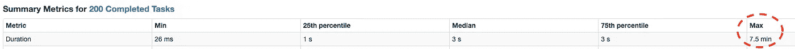

# 5 Spark 数据科学最佳实践

> 原文：<https://towardsdatascience.com/5-spark-best-practices-61587a35ac15?source=collection_archive---------11----------------------->

## 我希望在开始我的项目之前就知道

由 [Unsplash](https://unsplash.com?utm_source=medium&utm_medium=referral) 上的 [chuttersnap](https://unsplash.com/@chuttersnap?utm_source=medium&utm_medium=referral) 拍摄

# 为什么要搬到 spark？

虽然我们都[谈论大数据](https://www.facebook.com/dan.ariely/posts/904383595868)，但通常在你的职业生涯中需要一些时间，直到你遇到它。对我在 Wix.com 的工作来说，这比我想象的要快，超过 1 . 6 亿的用户产生了大量的数据——随之而来的是对扩展我们数据处理的需求。

虽然有其他选择(例如 [Dask](https://dask.org/) )，但我们决定使用 Spark，主要有两个原因:(1)它是当前的技术水平，广泛用于大数据。(2)我们有了 Spark inplace 所需的基础设施。

# 如何用 PySpark 为熊猫们写作

你可能很熟悉熊猫，我说的熟悉是指流利，你的母语:)

下面这个演讲的标题说明了一切— [了解熊猫的数据科学家与 PySpark 的数据争论](https://databricks.com/session/data-wrangling-with-pyspark-for-data-scientists-who-know-pandas)这是一个伟大的争论。

这将是一个很好的时机来说明，简单地获得正确的语法可能是一个很好的起点，但是对于一个成功的 PySpark 项目来说，你需要更多的东西，你需要理解 Spark 是如何工作的。

> 让 Spark 正常工作很难，但当它工作时——它工作得非常好！

# 一言以蔽之

我在这里只会深入膝盖，但我建议访问以下文章并阅读 MapReduce 解释，以获得更广泛的解释— [使用 Spark 处理大数据的搭便车指南](/the-hitchhikers-guide-to-handle-big-data-using-spark-90b9be0fe89a)。

这里我们要理解的概念是**水平缩放。**

从**垂直缩放开始更容易。如果我们有一个运行良好的 pandas 代码，但是数据对它来说变得太大了，我们可以转移到一个更强大的有更多内存的机器上，并希望它能管理。这意味着我们仍然有一台机器同时处理全部数据——我们纵向扩展了**。****

相反，如果我们决定使用 MapReduce，将数据分割成块，让不同的机器处理每个块——我们就在横向扩展**。**

# **5 Spark 最佳实践**

**这些是 5 spark 最佳实践，帮助我将运行时间减少了 10 倍，并扩展了我们的项目。**

## **1 -从小处着手—对数据进行采样**

**如果我们想让大数据发挥作用，我们首先希望看到我们使用一小块数据的方向是正确的。在我的项目中，我对 10%的数据进行了采样，并确保管道正常工作，这允许我使用 Spark UI 中的 SQL 部分，并看到数字在整个流程中增长，同时不会等待流程运行太长时间。**

**从我的经验来看，如果你用小样本达到了你想要的运行时，你通常可以很容易地扩大规模。**

## **2 -了解基础知识—任务、分区、内核**

**这可能是使用 spark 时需要理解的最重要的事情:**

> ****1 个分区支持在 1 个内核上运行 1 个任务****

**您必须时刻注意您拥有的分区数量——跟踪每个阶段的任务数量，并将它们与您的 spark 连接中正确的内核数量相匹配。一些提示和经验法则可以帮助你做到这一点(所有这些都需要在你的案例中进行测试):**

*   **任务与内核之间的比率应该是每个内核大约 2-4 个任务。**
*   **每个分区的大小应该在 200-400 MB 之间，这取决于每个工作者的内存，根据你的需要进行调整。**

## **3 -调试火花**

**Spark 使用惰性求值，这意味着它在执行计算指令图之前会一直等到一个动作被调用。动作的例子有`show(), count(),...`**

**这使得我们很难理解代码中哪里有需要优化的错误/地方。我发现很有帮助的一个实践是使用`df.cache()`将代码分成几个部分，然后使用`df.count()`强制 spark 计算每个部分的 df。**

**现在，使用 spark UI，您可以查看每个部分的计算并找出问题。重要的是要注意，如果不使用我们在(1)中提到的采样，使用这种实践可能会创建一个很长的运行时间，这将很难调试。**

## **4 -寻找和解决偏斜**

**让我们从定义偏斜度开始。正如我们提到的，我们的数据被划分为分区，随着转换的进行，每个分区的大小可能会发生变化。这可能会在分区之间产生很大的大小差异，这意味着我们的数据存在偏斜。**

**通过查看 spark UI 中的阶段细节，并寻找最大值和中值之间的显著差异，可以找到偏斜度:**

****

**较大的方差(中位数= 3 秒，最大值= 7.5 分钟)可能表明数据存在偏斜**

**这意味着我们有一些任务比其他任务慢得多。**

**为什么这不好——这可能会导致其他阶段等待这几个任务，并让内核等待而不做任何事情。**

**最好是，如果你知道偏斜来自哪里，你可以直接解决它，并改变划分。如果您不知道/没有直接解决它的选项，请尝试以下方法:**

****调整任务与内核的比例****

**正如我们提到的，通过拥有比内核更多的任务，我们希望当较长的任务运行时，其他内核将继续忙于其他任务。虽然这是真的，但前面提到的比率(2-4:1)并不能真正解决任务持续时间之间如此大的差异。我们可以尝试将比例提高到 10:1，看看是否有帮助，但这种方法可能有其他缺点。**

****加盐数据****

**Salting 是用一个随机键对数据进行重新分区，这样新的分区就会平衡。下面是 pyspark 的代码示例(使用 groupby，这通常是导致偏斜的原因):**

## **spark 中迭代代码的问题**

**这一次真的很难。正如我们提到的，spark 使用惰性评估，所以当运行代码时，它只构建一个计算图，一个 DAG。但是当你有一个迭代过程时，这种方法可能是非常有问题的，因为 DAG 重新打开先前的迭代，并且变得非常大，我的意思是非常非常大。对于驱动程序来说，这可能太大而无法保存在内存中。这个问题很难定位，因为应用程序被卡住了，但它出现在 spark UI 中，就好像很长时间没有作业运行(这是真的)——直到驱动程序最终崩溃。**

**这是目前 spark 的一个固有问题，对我有效的解决方法是每 5-6 次迭代使用`df.checkpoint() / df.localCheckpoint()`(通过一点试验找到你的数字)。这样做的原因是`checkpoint()`正在打破血统和 DAG(不像`cache()`)，保存结果并从新的检查点开始。缺点是，如果发生了不好的事情，您没有完整的 DAG 来重新创建 df。**

# **摘要**

**正如我之前所说的，学习如何让 spark 发挥其魔力需要时间，但这 5 个实践确实推动了我的项目向前发展，并在我的代码上洒下了一些 spark 的魔力。**

**最后，这是我开始我的项目时一直在寻找(但没有找到)的帖子——我希望你及时找到了它。**

## **参考**

*   **[与 PySpark 争夺了解熊猫的数据科学家](https://databricks.com/session/data-wrangling-with-pyspark-for-data-scientists-who-know-pandas)**
*   **[使用 Spark 处理大数据的搭便车指南](/the-hitchhikers-guide-to-handle-big-data-using-spark-90b9be0fe89a)**
*   **[Spark:权威指南](https://www.oreilly.com/library/view/spark-the-definitive/9781491912201/) —关于监控和调试的第 18 章令人惊叹。**