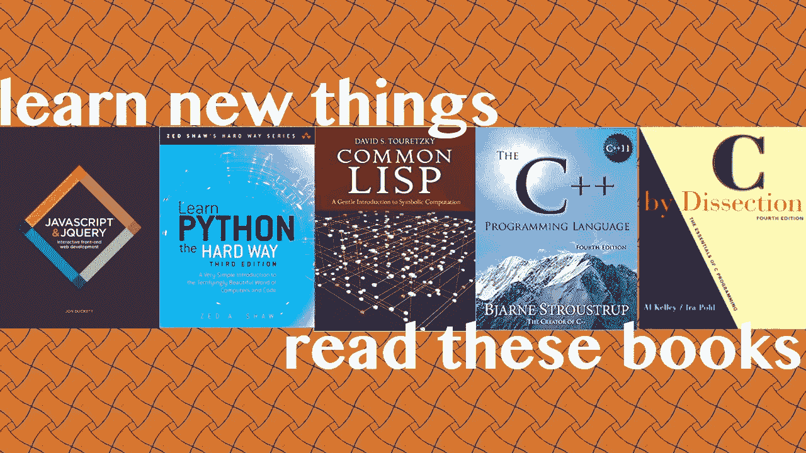
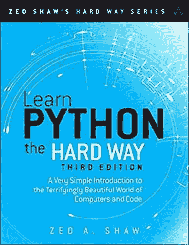
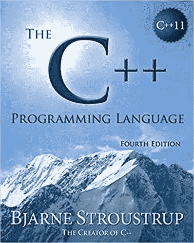
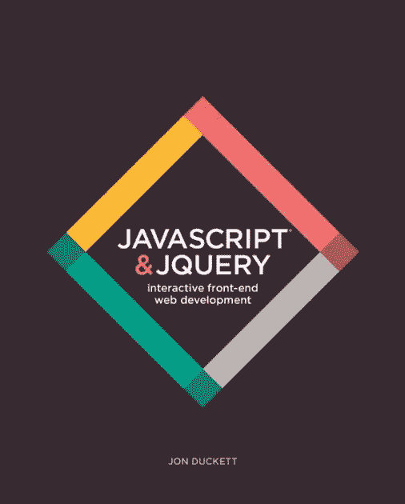

# 学习新编程语言的 5 本精彩书籍

> 原文：<https://towardsdatascience.com/5-spectacular-books-for-learning-new-programming-languages-4b2e21da02da?source=collection_archive---------15----------------------->

## 我最喜欢的学习新编程语言的 5 本概念书。

对于任何有抱负的数据科学家、开发人员或工程师来说，书籍都是一种难以置信的学习资源。互联网上的信息经常可能是不正确的，或者可能没有很好的记录，因为向你解释事情的人不一定是一个伟大的作家，尽管他们在编程方面可能是多么伟大。我非常喜欢的一件事是，通过做你热爱的事情，编程和学习变得有趣起来。我喜欢回想我的一位同行，她有很强的医学背景，对数据科学非常着迷。她的所有项目似乎都与这种兴趣相关，这似乎真的使她的项目脱颖而出，因为她在讨论她正在研究的主题时充满激情和乐趣。

学习一门语言本身就很有趣，但加入一点小元素会变得更有趣。一本伟大的编程书和一本不那么伟大的编程书的区别在于自我意识；我们都是程序员，所以没必要把每件事都看得这么严重。我读过很多很酷的书，里面有有趣的项目，可以帮助你学习一门新的编程语言。

# №1:艰难地学习 Python

作者:泽德·肖

近年来，随着机器学习的兴起，Python 变得更加流行。这是有充分理由的，因为就数据科学而言，Python 和 C 是一个非常有能力的组合。如果你想学习 Python，现在就是你的机会,“艰难地学习 Python”是一种方法。

这是我的一位导师很久以前就让我意识到的一本书，我很高兴他这么做了。这本书非常悲观，可能会让你发笑，但同时也有非常好的方法论。艰难地学习 Python 背后的想法是把你扔进 Python 的世界，完全不知道如何编程并强迫你打字。毕竟，有什么比做更好的学习方法呢？这本书在引导读者理解概念的同时将他们进一步推出舒适区方面做得很好。

如果你正在考虑学习 Python，我肯定会推荐这本书。如果你欣赏自嘲式的幽默，这本书会非常棒，这一点你可以从副标题中推断出来。

> 一个非常简单的关于计算机和代码的可怕的美丽世界的介绍。

这显然是一本给编程新手看的书。这本书的伟大之处在于，它将教会那些一生中从未接触过编程语言的人。如果你正在考虑进入编程领域，尤其是机器学习，那么 Python 无疑是一门可以为你打下基础的好语言。

# №2:c++编程语言

作者:比雅尼·斯特劳斯特鲁普

如果你不熟悉 Bjarne Stroustup，你可能想在接触 C++之前知道他是谁。Bjarne Stroustup 是丹麦的计算机科学家，被认为是 C++编程语言的创始人。因此，作为该语言的创造者，他可能拥有一些关于该语言编程的最佳书籍。

我喜欢这本书的一点是，它让你对 C++的内部工作有了一点了解，而不会变得太复杂，以至于你不得不重读段落。比约恩的写作是直接的，但几乎有一个机智的暗示，使这本书更令人愉快。思想以一种任何其他语言的大多数用户肯定能够理解的方式呈现。

C++至今仍是一门使用非常广泛的语言。大多数情况下，C++用于以下用途之一:

*   应用开发
*   游戏开发
*   基因组学！

但是 C++还有很多其他的用途没有列出来，就我而言，将这种语言用于几乎任何应用程序都绝对没有错。但是，请注意，C++比 Python 或 Java-script 等简单的脚本语言更难学，更类似于 Java SE。学习 C++作为你的第一次编程入门当然是可能的，因为 C++是我大约 12 年前学习的第一门编程语言。我认为这是因为我当时并没有意识到脚本语言的可用性。

我认为，无论你对一门编程语言有什么实际用途，都应该是决定你选择哪种语言的唯一因素。例如，我主要使用 Python、Julia、R 和 Common Lisp。其中三种是函数式语言，一半基本上是为统计而设计的。我确实时不时地写一些 C 语言甚至汇编语言，但是通常这些语言对我来说没有用，因为我做的事情。所以你应该做的是弄清楚你到底想要什么样的程序，并追求你感兴趣的、广泛用于这种操作的语言。

# №3: Common LISP:对符号计算的温和介绍

大卫·s·图雷茨基

暂时以函数为中心，我向您介绍 *Common Lisp:对符号计算*的简单介绍。这是一本我珍藏的书，因为它是我用来学习 Lisp 的。Lisp 是我一直想学的语言之一，但是直到去年年中才开始学习。

这本书将带你了解 Lisp 基本上是如何处理所有事情的，这真的很好，因为在网上很难找到关于构建 Lisp 包的信息。除此之外，还有对元编程、宏和在数据中使用符号作为代码的简要介绍——Common Lisp 的面包和黄油。

我想说，不管你想做什么，对于你的程序，你至少应该熟悉一点 Common Lisp——或者一些类似 Clojure 或 Scheme 的 Lisp 变体。为什么？好吧，Lisp 的语法和富于表情的打字会让你成为一个更好的程序员。它还会让你非常熟悉底层的方法是如何工作的。每个人都喜欢构建 Lisp 解释器，没有人喜欢构建 C 解释器，这是有原因的。

> Lisp 是自然处理的。

换句话说，Lisp 的语法和表达式对处理器来说更容易理解，内存移动和汇编中的 CMPs/JNEs 要少得多。因此，与大多数其他语言相比，用汇编语言来解释 Lisp 是相当自然的。

# №4: C 通过解剖

作者:艾拉·波尔和凯利

让我们面对事实:C 是一个相当难学和编程的级别。特别是对于一个新的程序员来说，学习 C 可能是一项艰巨的任务，需要做大量的工作。然而，与此同时，C 语言却没有替代品。C 语言在整个计算生态系统中根深蒂固，我们永远不会摆脱它，所以我们不妨学习它。

我喜欢这本书的一点是，它将每一个单独的部分放在一起，解释它们是如何组合在一起的，它们组合在一起的顺序是什么，最重要的是:

> 为什么？

像 C++一样，我当然不会建议把 C 作为你的第一语言来学习，即使这是可能的。我这样说只是因为有其他语言可以让你更快地学习编程概念，而不必担心语法和指针。当你熟悉了这些概念后，你所建立的编程基础将会很好地移植到你所接触的任何其他语言中，包括 c。

# №5: Java-script 和 JQuery

乔恩·达克特

来个一百八十度的大转弯，请允许我向您介绍乔恩·达克特的 Javascript & JQuery 。这本书的伟大之处在于，它采用了一种相当基础和相对简单的方法来编写一种初学者友好的脚本语言。作为一种语言，Java-script 很像 Python，并且是我们今天可用的 web 开发领域中最大的工具。

JQuery 也是网站上常用的行业标准技术。然而，真正令人兴奋的是当这两者结合在一起并相互协同时。我对这本书的一个批评是，它相当基础，纯粹是解释性的，这使得从头到尾连贯地阅读有点无聊。我对这本书采取的方法是把它作为一本参考书，而不是一本读物。这本书里有很多非常有用的信息，可以很容易地参考和重复利用，因为例子通常都是非常顶尖的。对于绝对的初学者来说，这无疑是这个列表中的最佳选择之一，尤其是如果你也喜欢 web 开发的话。

# 结论

好吧，你有它；这些是我读过的一些我最喜欢的书，它们要么让我开始学习一门我不熟悉的语言，要么在我陷入代码时作为参考。尽管所有这些书都值得一读，但对有些人来说，读某些书可能比读其他书更有动力。或许还有上百万种不同的书籍可供学习一门新语言。有这么多，我永远不可能量化他们，但我会感谢任何书籍的建议留在回应！请随意留下你认为对学习你选择的语言最有帮助的书！