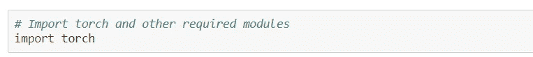
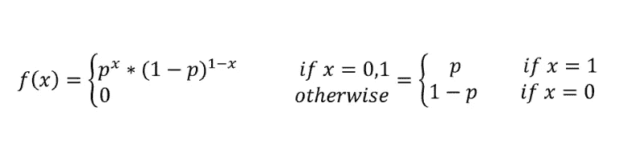

# PyTorch 中的 5 个统计函数

> 原文：<https://towardsdatascience.com/5-statistical-functions-in-pytorch-2d75e3dcc1fd?source=collection_archive---------70----------------------->

## PyTorch 函数对机器学习有用

PyTorch 官方标志

PyTorch 是一个 Python 包，它提供了两个高级特性:

*   具有强大 GPU 加速的张量计算(如 NumPy)
*   建立在基于磁带的自动签名系统上的深度神经网络

PyTorch 的设计是直观的，线性思维，易于使用。当你执行一行代码时，它就会被执行。它具有最小的框架开销。它很快——不管你运行的是小型还是大型神经网络。

在这篇博客中，我们将讨论 PyTorch 中我觉得有趣的 5 个统计函数:

*   火炬.伯努利()
*   火炬.泊松()
*   torch.normal()
*   torch.normal_()
*   torch.norm()

导入库

我们创建一个自定义张量并传递给伯努利函数，它返回一个二进制数(0 或 1)。

如果我们创建一个全张量。抽中“1”的概率是 1。

矩阵里全是零。`*probability of drawing "1" is 0*`

这是 torch.bernoulli()函数的三种类型的示例。

伯努利分布是一种随机实验，只有两种结果(通常称为“成功”或“失败”)。当一个事件有两种结果时，最好使用它。

伯努利分布

输入张量包含 3 行 3 列 0 到 6 之间的速率参数，返回泊松分布的输出。

输入张量包含 5 行 4 列 0 到 7 之间的速率参数，返回泊松分布的输出

泊松分布常用于模拟事件在时间或空间间隔内发生的次数。

它返回从独立的正态分布中抽取的随机数的张量。

它返回从标准偏差为 1 的独立正态分布中抽取的随机数张量。

当 mean 为 0 且 std 为 1 时，它不起作用，因此您将在下一个函数中了解 tensor.normal_()的内容。

正态分布是一种概率函数，描述了变量的值是如何分布的。

它创建一个均值=0、标准差=1 的标准正态分布。

它创建一个 1 × 5 维的矩阵 Z(1 维张量),其中填充了来自正态分布的随机元素样本，参数为 mean = 4 和 std = 0.5。

它有助于创建标准的正态分布

它返回给定张量的向量范数，其中 dim =0。

它返回给定张量的向量范数，其中 dim =1。

它返回给定张量的向量范数，其中 dim =1，p=1。

矩阵范数间接用于任何需要矩阵函数和/或矩阵级数的应用中。

# 结论

以上是我觉得有趣的 5 个统计 PyTorch 函数，你可以在 PyTorch 文档中找到更多。

# 参考链接

提供关于张量的参考链接

*   `torch.Tensor`:[https://pytorch.org/docs/stable/tensors.html](https://jovian.ml/outlink?url=https%3A%2F%2Fpytorch.org%2Fdocs%2Fstable%2Ftensors.html)的官方文件