# 使用 Python 从点云生成 3D 网格的 5 步指南

> 原文：<https://towardsdatascience.com/5-step-guide-to-generate-3d-meshes-from-point-clouds-with-python-36bad397d8ba?source=collection_archive---------0----------------------->

## 3D Python

## 生成 3D 网格的教程(。obj，。ply，。stl，。gltf)自动从三维点云使用 python。(加分)表面重建，创造几个层次的细节。

在本文中，我将向您展示我的 3D 表面重建过程，使用 python 从点云快速创建网格。您将能够导出，可视化和集成到您最喜爱的三维软件的结果，没有任何编码经验。此外，我将为您提供一种生成多层次细节(LoD)的简单方法，如果您想要创建实时应用程序(例如，使用 Unity 的虚拟现实)，这将非常有用。

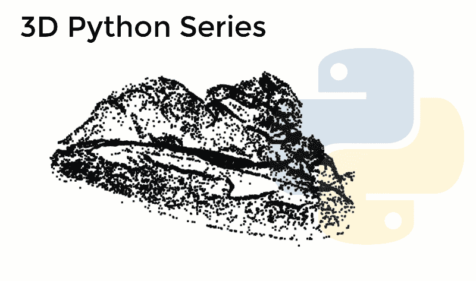

使用 Python 自动生成的几个网格。在本文结束时，您将能够从点云创建数据集

3D 网格是一种几何数据结构，通常由一组相连的三角形组成，这些三角形明确描述了一个表面🤔。它们被用于从地理空间重建到 VFX、电影和视频游戏的广泛应用中。当需要一个物理副本时，或者当我需要在游戏引擎中集成环境时，我经常创建它们，在这些情况下，点云支持是有限的。

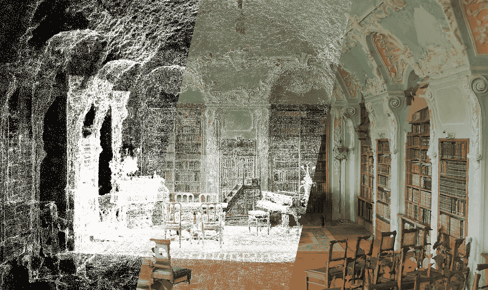

Roman Robroek 为[酷遗产项目从 3D 捕捉环境生成的网格示例。(左)3D 点云，(中)网格覆盖的顶点，(右)纹理网格。如果你想了解如何获得这样的结果，请查看](https://www.insider.com/3d-virtual-tours-of-abandoned-places-2020-4#the-factory-was-the-largest-space-that-robroek-and-poux-have-converted-into-a-3d-image-8)[地理数据学院](https://learngeodata.eu/)令人惊叹的地层 3D 重建器。

它们很好地集成在大多数软件专业人员的工作中。最重要的是，如果你想探索 3D 打印的奇迹，你需要能够从你拥有的数据中生成一致的网格。本文旨在为您提供一个高效的工作流程，分为 5 个可定制的步骤，并在文章结尾提供了我的可远程执行的脚本。让我们开始吧！

# 步骤 1:设置环境

在上一篇文章中，我们看到了如何使用 Anaconda 轻松设置环境，以及如何使用 GUI Spyder 管理代码。我们将以这种方式继续，仅使用两个库。

[](/discover-3d-point-cloud-processing-with-python-6112d9ee38e7) [## 使用 Python 探索 3D 点云处理

### 教程简单地设置 python 环境，开始处理和可视化 3D 点云数据。

towardsdatascience.com](/discover-3d-point-cloud-processing-with-python-6112d9ee38e7) 

为了从点云中自动获取 3D 网格，我们将在我们的环境中添加另一个库，Open3D。它是一个开源库，允许使用一组高效的数据结构和算法来处理 3D 数据。安装需要单击您的环境旁边的▶️图标。

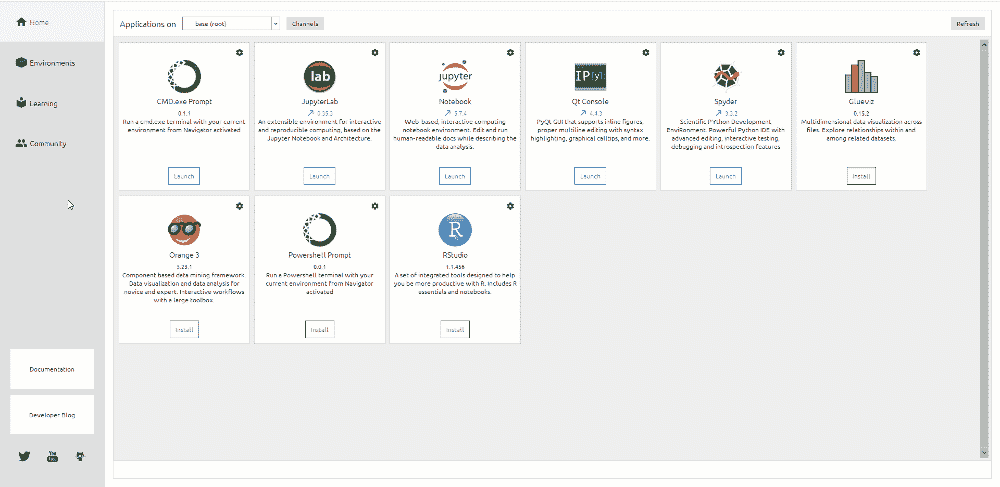

打开终端并运行以下命令:

```
conda install -c open3d-admin open3d==0.8.0.0
```

🤓 ***注****:*open 3d 包兼容 python、3.5、3.6 版本。如果您有另一个环境，您可以创建一个新的环境(best ),或者如果您从上一篇文章开始，通过在终端中键入`conda install python=3.5`来更改您的终端中的 python 版本。

这将自动安装软件包及其依赖项，您可以在终端提示时输入`y`来允许这个过程。现在，您已经为项目做好了准备。

# 步骤 2:加载和准备数据

启动你的 python 脚本工具(Spyder GUI，Jupyter 或者 Google Colab)，在这里我们将调用 2 个库:Numpy 和 Open3D。

```
import numpy as np
import open3d as o3d
```

然后，我们创建保存数据路径和点云数据的变量:

```
input_path="your_path_to_file/"
output_path="your_path_to_output_folder/"
dataname="sample.xyz"
point_cloud= np.loadtxt(input_path+dataname,skiprows=1)
```

🤓 ***注*** *:* 至于前面的帖子，我们会使用一个采样的点云，你可以从[这个库](https://drive.google.com/drive/folders/1Ih_Zz9a6UcbUlaA-puEB_is7DYvXrb4w?usp=sharing)中自由下载。如果想在不安装任何东西的情况下提前可视化，可以查看 [webGL 版本](https://www.flyvast.com/flyvast/app/page-snapshot-viewer.html#/333/ec8d9a6c-de38-7249-e6fc-026c4ff67ef7)。

最后，我们将`point_cloud`变量类型从 Numpy 转换为 Open3D `o3d.geometry.PointCloud`类型，以便进一步处理:

```
pcd = o3d.geometry.PointCloud()
pcd.points = o3d.utility.Vector3dVector(point_cloud[:,:3])
pcd.colors = o3d.utility.Vector3dVector(point_cloud[:,3:6]/255)
pcd.normals = o3d.utility.Vector3dVector(point_cloud[:,6:9])
```

🤓 ***注意*** *:* 下面这个命令首先实例化 Open3d 点云对象，然后从原来的 NumPy 数组给它添加点、颜色、法线。

为了快速查看您加载的内容，您可以执行以下命令(在 Google Colab 中不起作用):

```
o3d.visualization.draw_geometries([pcd])
```

# 第三步:选择啮合策略

现在我们准备通过网格化`pcd`点云开始表面重建过程。我将给出我最喜欢的有效获得结果的方法，但是在我们开始之前，一些浓缩的细节对于理解底层的过程是必要的。我将把自己限制在两个啮合策略。

## 策略 1:球旋转算法[1]

球旋转算法(BPA)背后的思想是模拟使用虚拟球从点云中生成网格。我们首先假设给定的点云由从物体表面采样的点组成。点必须**严格**表示一个表面(无噪声)，即重建的网格显式。

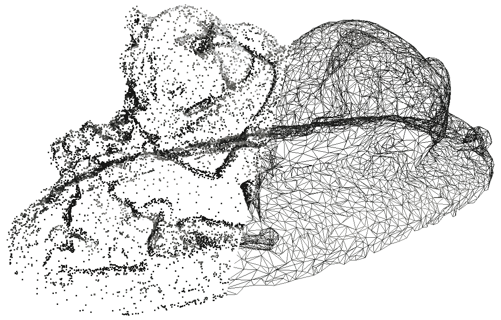

使用这个假设，想象在点云“表面”上滚动一个微小的球。这个小球取决于网格的比例，应该比点与点之间的平均间距稍大。当你把一个球丢到点的表面时，球会被抓住并停留在三个点上，这三个点将形成*种子三角形。从那个位置，球沿着两点形成的三角形边缘滚动。然后球在一个新的位置:一个新的三角形由两个先前的顶点形成，一个新的三角形被添加到网格中。随着我们继续滚动和旋转球，新的三角形形成并添加到网格中。球继续滚动，直到网完全形成。*

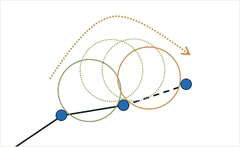

Brett Rapponotti，Michael Snowden 和 Allen Zeng 的插图。[来源](https://cs184team.github.io/cs184-final/writeup.html)

球旋转算法背后的想法很简单，但是当然，这个过程有许多注意事项，如最初表达的[这里的](https://cs184team.github.io/cs184-final/writeup.html):

*   *球半径是如何选择的？*半径是根据输入点云的大小和比例根据经验获得的。理论上，球的直径应该略大于点与点之间的平均距离。
*   *如果某些位置的点相隔太远，球掉了怎么办？*当球沿着一条边旋转时，它可能会错过表面上的适当点，而是击中对象上的另一个点，甚至正好是它的三个旧点。在这种情况下，我们检查新三角形`Facet`的法线与点的`Vertex`法线方向一致。如果不是，那么我们拒绝三角形并创建一个洞。
*   *如果表面有折痕或凹陷，使得表面与自身之间的距离小于球的大小，该怎么办？*在这种情况下，球只会滚过折痕，而忽略折痕内的点。但是，这不是理想的行为，因为重建的网格对对象不精确。
*   *如果曲面被分隔成多个点区域，使得球无法在这些区域之间成功滚动，该怎么办？*虚拟球在不同的位置多次掉落到表面上。这确保球捕获整个网格，即使这些点的间隔不一致。

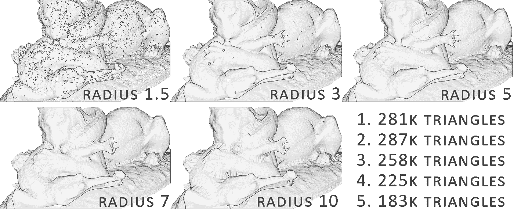

5 视觉效果中的半径影响。您可以看到，最佳网格会自动平衡最佳几何体拟合和三角形数量。

## 策略 2:泊松重建[2]

泊松重建更具技术性/数学性。它的方法被称为隐式网格化方法，我将其描述为试图将数据“包裹”在一块光滑的布中。在不涉及太多细节的情况下，我们试图通过创建一个全新的点集来拟合原始点集的水密表面，该点集代表一个与法线关联的等值面。有几个参数会影响网格划分的结果:

*   *哪个深度？*树深度用于重建。网格越高越详细(默认值:8)。对于有噪声的数据，您可以在生成的网格中保留离群点，但算法不会检测到它们。所以低值(可能在 5 到 7 之间)提供了平滑效果，但是你会丢失细节。深度值越高，生成的网格的顶点数量就越多。

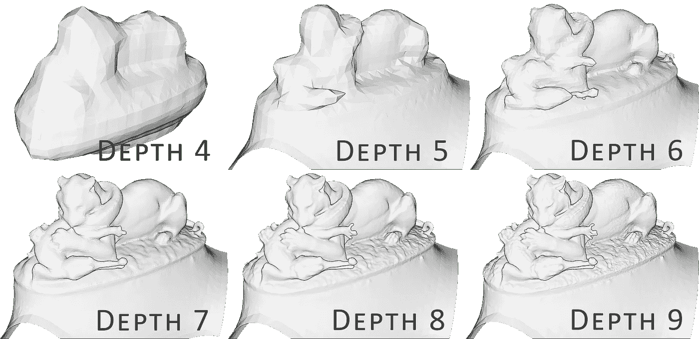

*   *哪个宽度？*这指定了树结构最细层次的目标宽度，称为八叉树🤯。不要担心，我将在另一篇文章中讨论这一点以及 3D 的最佳数据结构，因为它扩展了本文的范围。无论如何，如果指定了深度，这个参数将被忽略。
*   *哪个尺度？*它描述了用于重建的立方体直径与样本包围立方体直径之间的比率。非常抽象，默认参数通常很好用(1.1)。

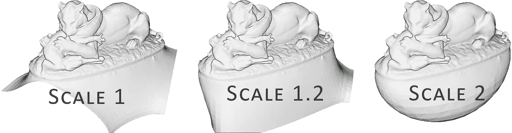

比例参数对结果的影响。看看它是如何包围初始点云的。

*   *哪个合适？*linear _ fit 参数如果设置为真，则让重建器使用线性插值来估计等值顶点的位置。

# 步骤 4:处理数据

## 策略 1: BPA

我们首先根据从所有点之间的距离计算出的平均距离来计算必要的半径参数:

```
distances = pcd.compute_nearest_neighbor_distance()
avg_dist = np.mean(distances)
radius = 3 * avg_dist
```

在一个命令行中，我们可以创建一个网格并将其存储在`bpa_mesh`变量中:

```
bpa_mesh = o3d.geometry.TriangleMesh.create_from_point_cloud_ball_pivoting(pcd,o3d.utility.DoubleVector([radius, radius * 2]))
```

在导出网格之前，我们可以将结果缩减采样到可接受的三角形数量，例如 100k 个三角形:

```
dec_mesh = mesh.simplify_quadric_decimation(100000)
```

此外，如果您认为网格可能会出现一些奇怪的工件，您可以运行以下命令来确保其一致性:

```
dec_mesh.remove_degenerate_triangles()
dec_mesh.remove_duplicated_triangles()
dec_mesh.remove_duplicated_vertices()
dec_mesh.remove_non_manifold_edges()
```

## 策略 2:泊松重建

🤓 ***注*** *:* *该策略从 Open3D 的* ***版本 0.9.0.0*** *开始可用，因此目前只能远程工作。你可以通过我提供的 google colab 代码执行* [*这里*](https://colab.research.google.com/drive/1HXVOK53ac6BJHAFxdEVluhFr7UAZKtDV) *。*

要用泊松得到结果，非常简单。您只需调整传递给函数的参数，如上所述:

```
poisson_mesh = o3d.geometry.TriangleMesh.create_from_point_cloud_poisson(pcd, depth=8, width=0, scale=1.1, linear_fit=False)[0]
```

🤓 ***注意*** *:* *该函数输出一个由 o3d.geometry 对象后跟 Numpy 数组组成的列表。您只想选择 o3d.geometry 来调整结尾的[0]。*

为了获得清晰的结果，通常需要添加一个裁剪步骤来清除下图中突出显示为黄色的不想要的伪像:

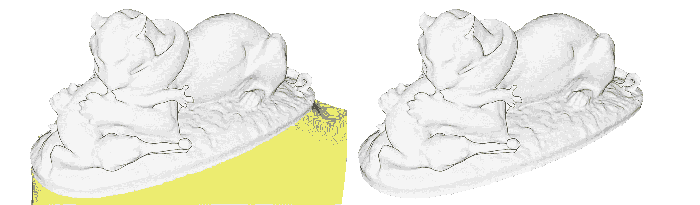

原始泊松重建(左)和裁剪网格(右)

为此，我们计算包含原始点云的初始边界框，并使用它从边界框外的网格中过滤所有表面:

```
bbox = pcd.get_axis_aligned_bounding_box()
p_mesh_crop = poisson_mesh.crop(bbox)
```

你现在有了一个或多个变量，每个变量都包含了网格几何体，干得好！在应用程序中获得它的最后一步是导出它！

# 步骤 5:导出并可视化

使用`write_triangle_mesh`函数可以直接导出数据。我们只需在创建的文件的名称中指定我们想要的扩展名。ply，。obj，。stl 或者。gltf 和要导出的网格。下面，我们将 BPA 和泊松重建导出为。ply 文件:

```
o3d.io.write_triangle_mesh(output_path+"bpa_mesh.ply", dec_mesh)
o3d.io.write_triangle_mesh(output_path+"p_mesh_c.ply", p_mesh_crop)
```

为了快速生成细节层次(LoD ),让我们编写第一个函数。这真的很简单。该函数将网格、LoD 列表(作为三角形的目标数量)、结果文件的文件格式和文件写入路径作为参数。该函数(在脚本中编写)如下所示:

```
def lod_mesh_export(mesh, lods, extension, path):
    mesh_lods={}
    for i in lods:
        mesh_lod = mesh.simplify_quadric_decimation(i)
        o3d.io.write_triangle_mesh(path+"lod_"+str(i)+extension, mesh_lod)
        mesh_lods[i]=mesh_lod
    print("generation of "+str(i)+" LoD successful")
    return mesh_lods
```

💡 ***提示:*** *我将在另一篇文章中介绍这个函数的基本功能以及它的结构。此时，了解该函数将(1)以所需的文件格式将数据导出到您选择的指定位置，以及(2)如果需要在 python 中进行更多处理，可以将结果存储在变量中，这是很有用的。*

这个函数有一些魔力，但是一旦执行，它看起来就像什么也没发生。不要担心，您的程序现在知道什么是`lod_mesh_export`，您可以在控制台中直接调用它，在那里我们只需根据需要的值更改参数:

```
my_lods = lod_mesh_export(bpa_mesh, [100000,50000,10000,1000,100], ".ply", output_path)
```

有趣的是，现在你不需要每次为不同的负载重写一堆代码。您只需向函数传递不同的参数:

```
my_lods2 = lod_mesh_export(bpa_mesh, [8000,800,300], ".ply", output_path)
```

如果您想在 python 中可视化一个特定的 LoD，比如有 100 个三角形的 LoD，您可以通过以下命令访问并可视化它:

```
o3d.visualization.draw_geometries([my_lods[100]])
```

为了在 python 之外进行可视化，你可以使用你选择的软件(例如开源的 Blender、MeshLab 和 CloudCompare)并在 GUI 中加载导出的文件。直接在 web 上通过 WebGL，您可以使用 [Three.js](https://threejs.org/editor/) 编辑器或 [Flyvast](https://www.flyvast.com/flyvast/app/index.html#/login/overviewOfferFree) 来简单地访问网格。

最后，你可以将它导入任何 3D 打印软件，并通过在线打印服务获得报价🤑。

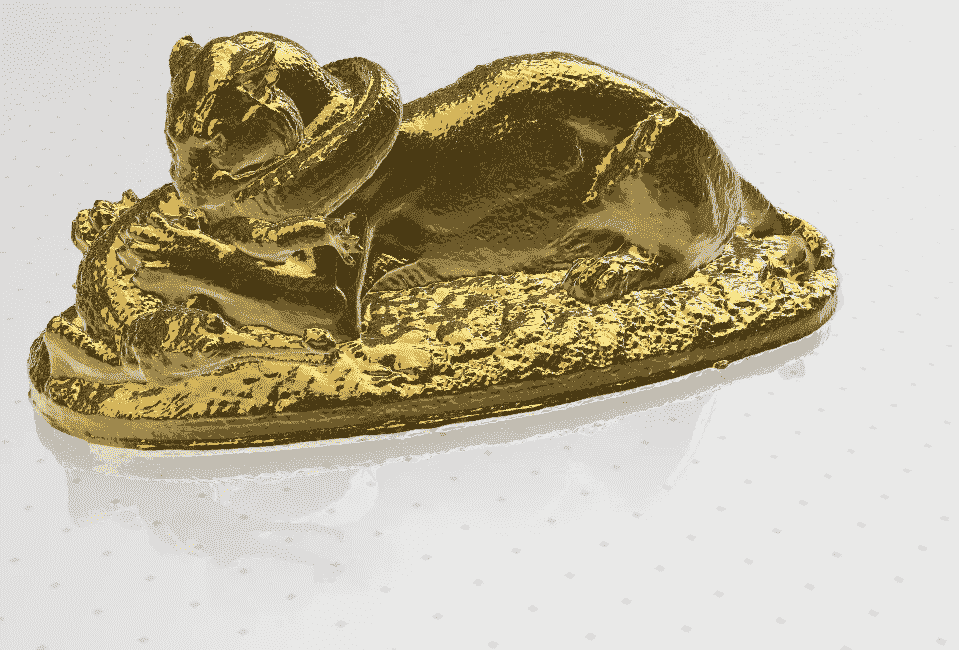

约 20 cm 的模型金色印花示例。使用在线服务获得价格的大致概念，你可以计算出一个基本的树脂打印需要 400 欧元。这扩展了本教程的范围，将在另一篇文章中讨论

太棒了。在这个 5 步指南中，我们介绍了如何从点云设置自动 python 3D 网格创建器。这是一个非常好的工具，将证明在许多 3D 自动化项目中非常方便！然而，我们假设点云已经是无噪声的，并且法线方向良好。

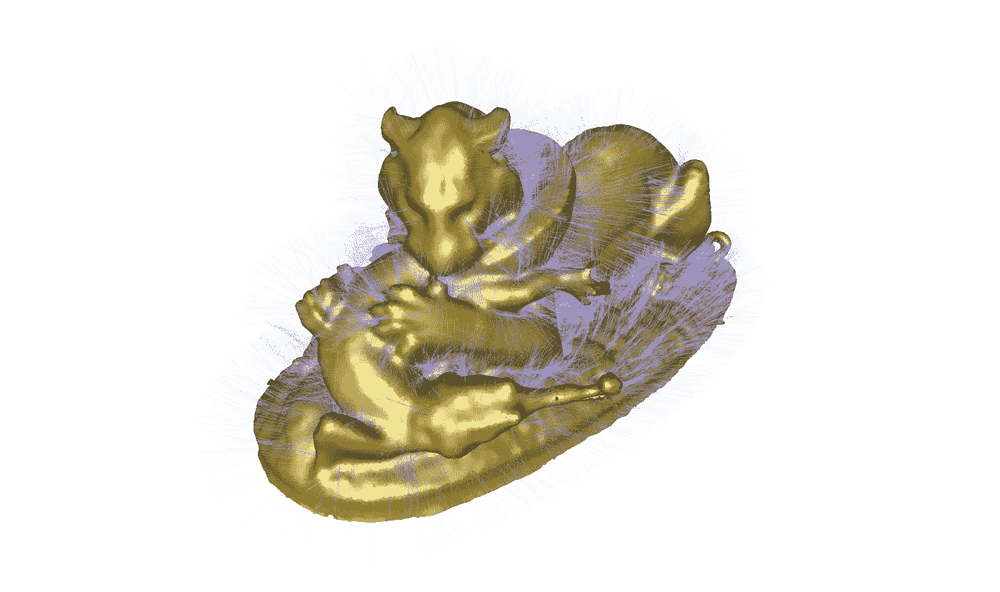

一些显示的法线

如果不是这种情况，那么就需要一些额外的步骤，下面文章中已经讨论过的一些很好的见解将在另一篇文章中讨论

完整的代码可以在这里获得:[谷歌 Colab 笔记本](https://colab.research.google.com/drive/1HXVOK53ac6BJHAFxdEVluhFr7UAZKtDV)

# 结论

您刚刚学习了如何导入、网格化、导出和可视化由数百万个点组成的具有不同 LoD 的点云！干得好！但这条路并没有到此为止，未来的帖子将深入点云空间分析、文件格式、数据结构、可视化、动画和网格划分。我们将特别关注如何管理大点云数据，如下面的文章中所定义的。

[](/the-future-of-3d-point-clouds-a-new-perspective-125b35b558b9) [## 三维点云的未来:一个新的视角

### 被称为点云的离散空间数据集通常为决策应用奠定基础。但是他们能不能…

towardsdatascience.com](/the-future-of-3d-point-clouds-a-new-perspective-125b35b558b9) 

我的贡献旨在浓缩可操作的信息，以便您可以从零开始为您的项目构建 3D 自动化系统。你可以从今天开始在[地理数据学院](https://learngeodata.eu)参加一个编队

[](https://learngeodata.eu/point-cloud-processor-formation/) [## 点云处理在线课程- 3D 地理数据学院

### 编队学习先进的点云处理和三维自动化。开发新的 python 地理数据技能和开源…

learngeodata.eu](https://learngeodata.eu/point-cloud-processor-formation/) 

## 参考

1.贝尔纳迪尼，女；米特勒曼，j。拉什迈尔；席尔瓦角；表面重建的球旋转算法。*可视化与计算机图形学汇刊* **1999** ， *5* ，349–359。

2.卡日丹，m；波利索，m；泊松表面重建。*欧洲几何图形研讨会* **2006** ，1–10。