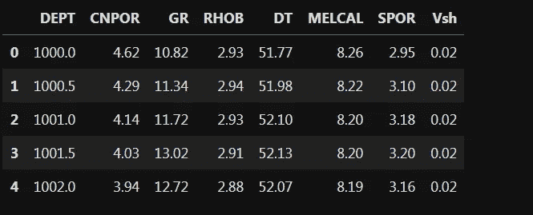
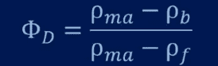
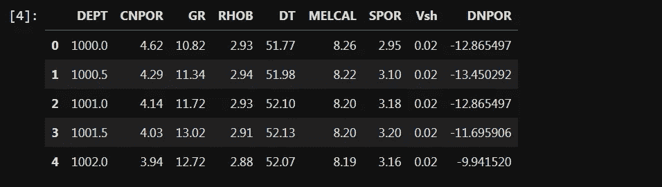
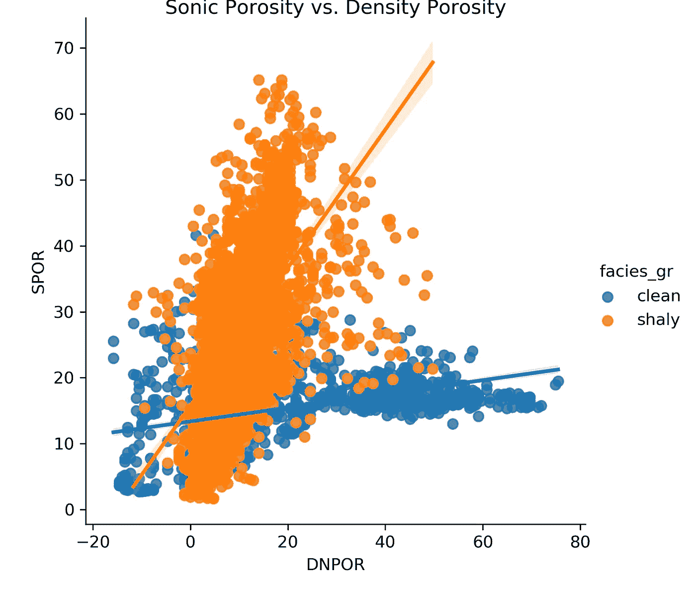

# Pandas 处理岩石物理测井的 5 个步骤(下)

> 原文：<https://towardsdatascience.com/5-steps-in-pandas-to-process-petrophysical-well-logs-de6c8d03d9b1?source=collection_archive---------58----------------------->

## 我使用这些更高级的步骤来处理 python 中的测井数据

在之前的[工作](/10-steps-in-pandas-to-process-las-file-and-plot-610732093338)中，我们使用 pandas 实现了 10 个简单的步骤来处理 LAS 格式的岩石物理测井记录。在这个项目中，我们将更深入地使用更先进的方法来处理测井数据。

这 5 个步骤是:
1)函数定义
2)应用函数
3)λ函数
4)切割函数
5)可视化

为了避免我们之前已经在特定油井数据上做的额外工作，我们将使用该项目的输出。如果你以前做过一个项目，你可以将数据帧写入 csv 文件(使用 *to_csv* 命令)在这里使用。否则，您可以通过[我的 github 账号](https://github.com/mardani72/LAS_Pandas)访问并下载名为 1050383876v2.csv 的 csv 格式，您也可以从我的账号[这里](https://github.com/mardani72/LAS_Pandas/blob/master/5stepsV2.ipynb)下载完整的 Jupiter 笔记本文件。

让我们首先在工作簿上添加所需的库:

```
import numpy as np
import pandas as pd
import matplotlib.pyplot as plt
import seaborn as sns
%matplotlib inline
```

然后，将 csv 数据读入 df 变量:

```
df = pd.read_csv('1050383876v2.csv')
df.head()
```



数据集看起来很干净。我还去掉了上面有一些 NaN 值的部分，所以起始深度是 1000 米。

# **1。功能定义**

函数是一组执行特定任务的语句。函数可以使更大的程序更具可读性。它还可以帮助我们防止重复。一个函数有一个特殊的结构:
1-关键字 ***def*** ，
2-函数名，
3-我们传递值给函数的参数，
4-冒号(:)，
5-主体中的更多语句，
6-可选的返回语句。

## 根据密度测井计算孔隙度

根据岩石物理测井计算孔隙度有几种方法。这里我们将使用密度法。密度工具测量井筒条件下的岩石中等体积密度( *b* )。了解充填岩石孔隙度的流体密度( *f* )和颗粒密度( *ma* )有助于我们计算岩石的孔隙面积百分比。等式是:



从 *def* 关键字开始，密度孔隙度( *den* )函数可以用以下自变量(参数)定义: *rb* ， *rf* ， *rm。*

```
def den(rb, rf, rm):
    # rb = bulk density from well log readings
    # rf = fluid density
    # rm = matrix density or grain density of rocks
    return (rm-rb)*100/(rm-rf)
```

简单地说，该函数将返回密度孔隙度，如代码的最后一行所示。这里我们更喜欢用百分比(乘以 100)来表示孔隙率。定义密度孔隙度函数后，我们可以将其应用于数据集。

# 2.应用功能

使用 a*apply*函数，可将预定义函数(此处为密度孔隙度)应用于列或行方向的数据帧的每个元素。如果我们将其保留为默认值，它将出现在列上。

```
df['DNPOR'] = df['RHOB'].apply(den, rf=1, rm=2.71 )
```

由于 *den* 函数取 3 个值( *rb* ， *rf* ， *rm* )，我们可以从数据集引入主值( *rb =df['RHOB']* )，并使用 apply 函数手动定义 *rf* 和 *rm* 常量。这里我假设流体成分是密度为 1 的水，主要矿物是密度为 2.71 的方解石。密度孔隙度存储在一个名为 DNPOR 的新列中。

# 3.λ函数

Lambda 函数是一个简单的单行函数，没有 *def* 或 *return* 关键字。事实上，它们是隐含的。要使用这个函数，我们需要键入 lambda，后跟参数。然后，冒号出现在 return 参数之前。

## 根据密度和中子孔隙度计算总孔隙度

总孔隙度定义为密度和中子孔隙度的平均值。

```
Tot_por = lambda DN,CN: (DN+CN)/2
```

函数名为 *Tot_por* 。对于*λ*函数，DN 和 CN 是密度和中子参数，后跟一个冒号。函数将返回这两个输入的平均值。

```
df['TPOR'] = Tot_por(df['CNPOR'], df["DNPOR"])
df.head()
```

调用 *Tot_por* 函数并引入 DataFrame 的相应列作为输入将创建总孔隙度，该孔隙度将存储在数据集中名为 TPOR 的新列中。



# 4.切割功能

当我们需要将数据值分段并分类到特定的容器中时，我们可以使用 Cut 函数。这里，我们将使用该函数根据岩石物理性质 GR 定义简单的岩石相。

## 相分类

相分类在地球科学中是一个巨大的主题，各种度量标准都可以发挥作用，但在这里，我们非常简单地看待它。根据测井记录中的自然伽马读数，我们可以从泥质地层中识别清洁地层。

```
df['facies_gr'] = pd.cut(df['GR'], bins=[0,40,300], labels=['clean', 'shaly'] )
```

根据 0 到 40(清洁)和 40 到 300(泥质)之间的 GR 读数，向数据集添加一个新列。

# 5.形象化

通常，python 中使用 matplotlib 库进行绘图。在这项工作中，我更喜欢使用 seaborn 库，因为它很简单。我想用我们在前面部分定义的相的图例颜色来显示密度孔隙度与中子孔隙度的散点图。这只需一行代码即可实现，而在 matplotlib 中，这需要 for 循环。

```
sns.lmplot(x='DNPOR', y='DT', hue='facies_gr', data=df)
```



# 结论

在这项工作中，我尝试在 pandas 中使用更高级的步骤来处理岩石物理测井数据。函数是使用编程避免重复的一种便捷方式。python 的函数如 *apply* 和 *cut* 或者自定义函数(本工作中的*den*&*Tot _ por*)对处理测井数据都是有用的。

如果你有任何建议，我很乐意看到你的评论！