# 5 个步骤:通过 SSH 从 Windows 到 Linux 系统进行远程开发的设置和代码

> 原文：<https://towardsdatascience.com/5-steps-setup-vs-code-for-remote-development-via-ssh-from-windows-to-linux-b9bae9e8f904?source=collection_archive---------2----------------------->

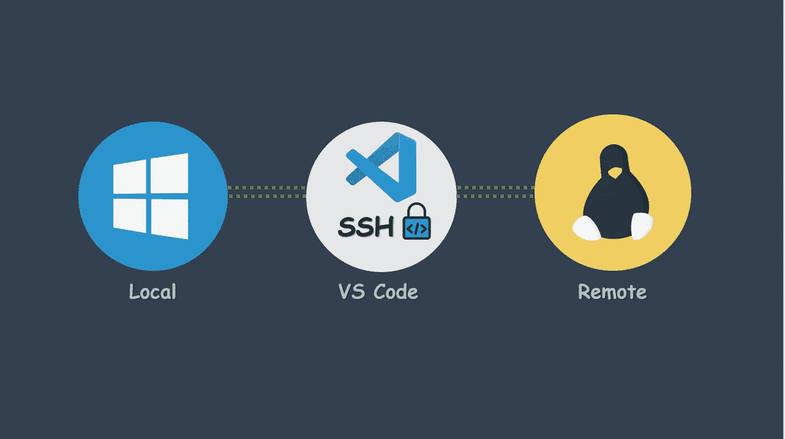

来自 www.flaction.com[的 Pixel Perfect 制作的图标](https://www.flaticon.com/home)

远程开发是 VS 代码中非常受欢迎的功能。他们的官方[文档](https://code.visualstudio.com/docs/remote/remote-overview)提供了以通用方式配置它的标准说明。但是当我从 Windows 系统连接到远程 Linux 服务器时，我总是在输入 错误时得到下面的 ***损坏的 MAC，并且很难在一个地方找到完整的解决方案。***

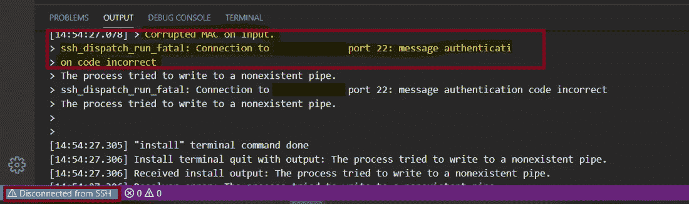

错误:输入的 MAC 损坏

因此，本文将提供一个 VS 代码指南，专门用于通过基于密钥的 SSH 在 Windows 系统和 Linux 系统之间进行远程连接，SSH 还可以处理输入错误导致的 MAC 损坏。

## 为什么我们需要远程开发:

*   对于软件开发人员来说，他们通常在本地开发新功能，然后在远程服务器上测试。
*   对于数据科学家来说，他们需要额外的计算资源，如远程 GPU 节点，以支持大型数据处理。
*   对于 DevOps 工程师来说，他们的主要任务之一是在不同的服务器上部署不同的产品，这需要频繁的远程配置。

## 先决条件:

*   已安装的 **VS 代码。**

你可以从他们的[网站](https://code.visualstudio.com/download)下载，然后按照我之前的指导[做必要的设置。该指南也适用于一般的开发工作区。](/10-steps-to-setup-a-comprehensive-data-science-workspace-with-vscode-on-windows-32fe190a8f3)

*   在本地 Windows 和远程 Linux 系统上都安装了 OpenSSH。

简而言之，这将允许您与`ssh`一起工作。您可以通过`ssh -V`在两个系统上查看。它将返回您系统上安装的 OpenSSH 的版本。否则，不会安装 OpenSSH。你可以从[这里安装](https://docs.microsoft.com/en-us/windows-server/administration/openssh/openssh_install_firstuse)用于 Windows，从[这里安装](https://www.cyberciti.biz/faq/ubuntu-linux-install-openssh-server/)用于 Linux。

现在，我们开始吧~🚀

```
**Overview of Contents**
Step 1: Install the Remote-SSH Extension in VS Code
Step 2: Verify the SSH Connection in PowerShell
Step 3: Enable the Remote Connection in VS Code
Step 4: Generate SSH Key Pairs
Step 5: Copy the Public Key to the Remote Server
```

**【以下设置基于 win 10 PowerShell】**

## 第一步:在 VS 代码中安装 ***Remote-SSH* 扩展**

启动 VS 代码->点击左边栏*扩展*图标- >搜索框**远程-SSH**->安装:

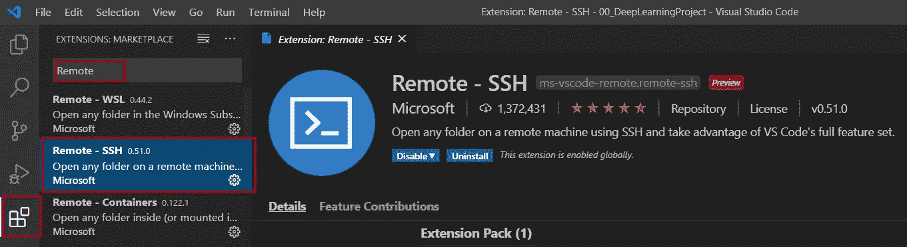

然后您会看到一个小的远程连接图标显示在*状态栏*的左下方:


## 步骤 2:在 PowerShell 中验证 SSH 连接

点击左上方的*终端*或快捷方式`ctrl+shift+``在 VS Code - >中打开一个 PowerShell 终端，如果不是 PowerShell，从这里更改:


通过在 PowerShell 中执行`ssh username@hostname`来验证 SSH 连接。(不管您是否在 conda 环境中运行它)

如果您可以成功登录到远程服务器，就可以开始下一步了。

💢如果您在输入 时得到如下 ***损坏的 MAC 错误:***


**✅** 你可以尝试以下解决方案:

先跑`ssh -Q mac`。它将返回本地系统上所有可用 MAC 加密算法的列表:

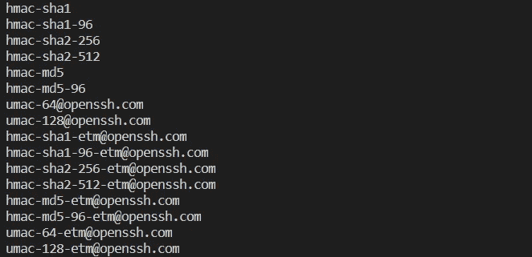

然后，选择您喜欢的其中一个，并通过使用`-m`选项添加所选算法来再次连接到远程服务器:

```
ssh -m hmac-md5-96 username@hostname
```

您可能需要尝试几次，直到找到远程 Linux 服务器支持的算法。

现在，您应该能够登录到远程服务器，并为下一步做好准备。

## 步骤 3:在 VS 代码中启用远程连接

点击左下方的远程连接图标->选择 **Remote-SSH:打开配置文件…**

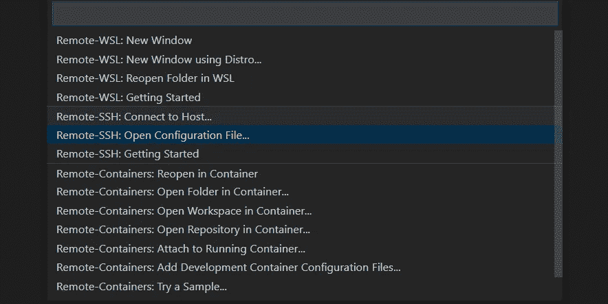

或者你可以直接从你的本地主目录`~/.ssh/config`打开 **ssh 配置文件**。

将您的远程服务器信息添加到配置文件中，格式如下:

```
Host [hostname]
  HostName [hostname]
  User [username]
  MACs **[optional; if you have the MAC error in Step 2, add the available algorithm which you found to here]**
```

如果您有多个服务器要连接，只需保持格式并一个接一个地添加它们。

最后，您将得到如下配置文件:(我们将在下一步回到**标识文件**

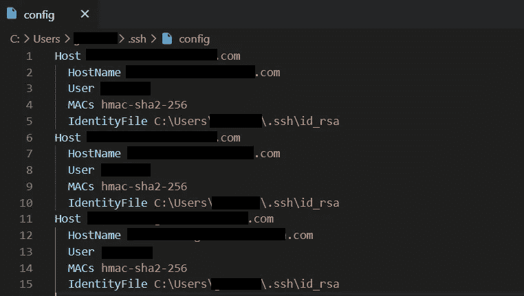

这个例子维护三个不同的远程服务器

现在，您应该能够连接到远程服务器，而不会出现 MAC 错误。

点击左下方的远程连接图标->选择**Remote-SSH:Connect to Host…**->您将会看到在您的配置文件中维护的远程服务器列表- >点击您的目标服务器(您可能需要输入您的登录密码)

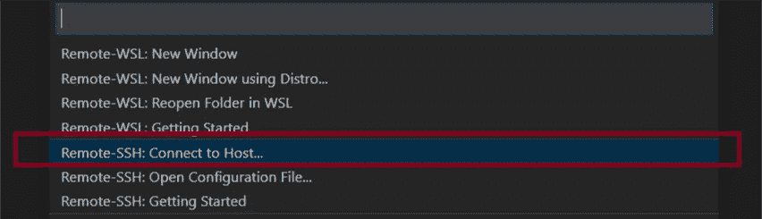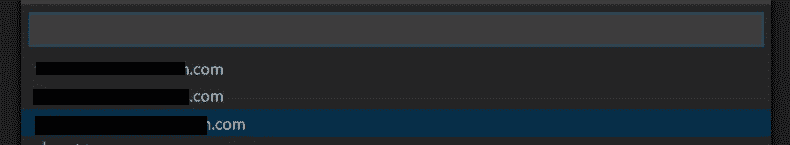

维护的主机列表

成功连接后，您将导航到一个新的 VS 代码窗口，远程主机名显示在左下角:


至此，您已经通过 VS 代码成功地设置了一个可工作的远程开发工作区。但是，还没有结束。

如果在此停止，每次发出远程连接时，都会要求您输入登录密码。你还需要通过 VS 代码为远程服务器上的每个操作输入密码，即使只是打开一个文件夹。这真的很烦人。另一方面，密码登录不够安全。对每个人来说都很容易使用和理解，但这种方便不知何故牺牲了安全级别。密码很容易被暴力攻击破解。

因此，与其在 VS 代码中输入密码，不如使用 SSH 公钥和私钥对来进行身份验证。

## 步骤 4:生成 SSH 密钥对

在 VS 代码 Powershell 终端中，执行命令:

```
ssh-keygen
```

在密钥生成过程中，它会提示:

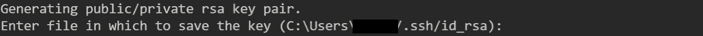

这允许您定义存储密钥的位置。按 ENTER 键将其保留为默认值。

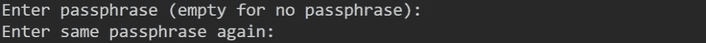

这允许您输入并再次确认密码以保护您的私钥(当您键入时，它不会显示您的密码)。此后，您需要在以后使用私钥时输入该密码。这是额外的保护。可以按回车键跳过。

创建完成后，您将看到一把钥匙的随机艺术图像。您的密钥对存储在默认的隐藏`~/.ssh`目录中:

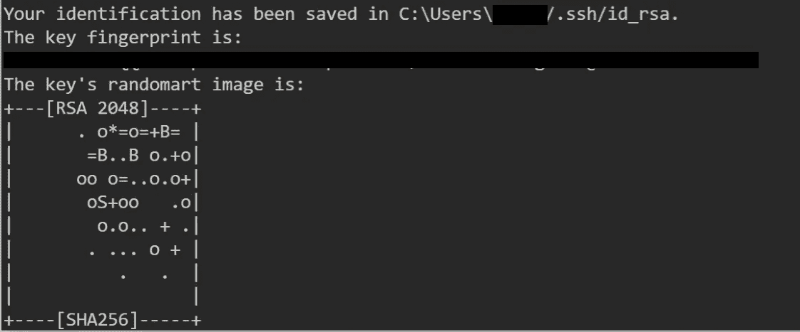

要再次检查，您可以通过以下方式查看上述位置的密钥对:

```
cd ~/.ssh
ls
```

您将看到两个新文件`id_rsa`存储私钥，而`id_rsa.pub`存储公钥。运行`cat [filename]`检查密钥内容。

如果一切顺利。现在，您可以在 ssh 配置文件中添加私钥`~/.ssh/id_rsa`的路径作为**步骤 2** ，名称为**标识文件**:

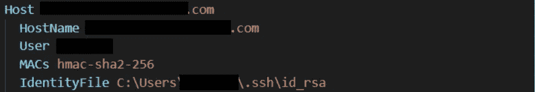

请记住，一个公钥可以使用多次，❗ **不要把你的私钥分享给任何人。**

## 步骤 5:将公钥复制到远程服务器

通过 VS 代码或任何其他带有密码的终端登录到远程服务器。检查`~/.ssh`目录下是否有`authorized_keys`文件。如果没有，请通过以下命令创建一个:

```
cd ~/.ssh  
touch authorized_keys 
```

`authorized_keys`是 OpenSSH 定义的默认文件名，用于存储公钥。您可以在这个文件中维护多个公钥。确保每个键都在一行上，并且键的中间没有换行符。

然后在这个远程文件中维护您的公钥(本地`~/.ssh/id_rsa.pub` 文件中的内容):

`vim authorized_keys` - >按`i`切换到插入模式- >将你的公钥内容粘贴到这里- >按`ESC` + `:` + `wq`写入并退出文件- >到`cat authorized_keys`重新检查。

现在，您在 VS 代码中安全方便的远程开发工作区已经准备好了！

## 结论

回到你的 VS 代码。发出新的远程连接。现在，您应该能够在没有密码的情况下连接到远程服务器，并像在本地一样使用它。玩得开心！