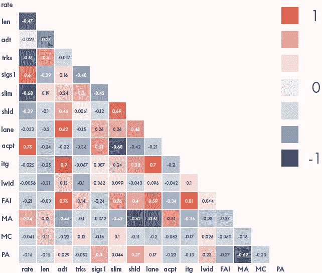
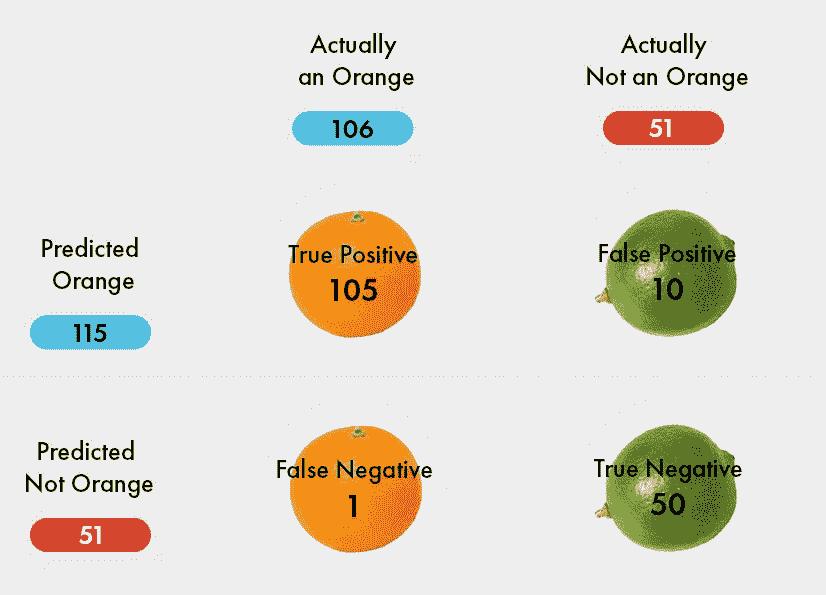
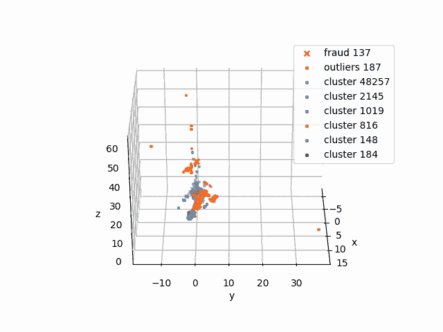
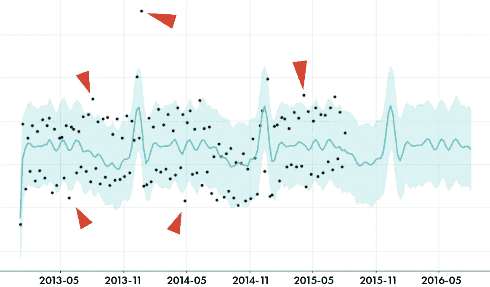

# 构建基于人工智能的欺诈检测系统的 5 个步骤

> 原文：<https://towardsdatascience.com/5-steps-to-build-an-ai-based-fraud-detection-system-3f2411c02bbe?source=collection_archive---------39----------------------->

似乎所有现代欺诈检测系统都是基于人工智能的，但它实际上是如何工作的？建立这样一个系统的具体步骤是什么？系统决策是如何控制的？

图片作者。

*原来这篇文章已经被* [*贴在了*](https://blog.dataart.com/how-to-build-a-fraud-detection-system-in-house) *的 DataArt 博客上，这是一家我领导 AI/ML 能力的技术咨询公司。它非常受欢迎，所以我要确保更多的人可以访问它。*

让我们将构建基于人工智能的欺诈检测系统的高级流程分为 5 个步骤。

# 步骤 0。数据准备

数据是机器学习的燃料；燃料越好，汽车能跑得越快。我将跳过描述如何聚集数据以及如何存储和传输数据的部分，直接跳到应该如何处理数据来实现 ML 的神奇。

重要的是从清理数据开始，以获得用于分析的一组特定特征。让我们以支付为例；相关功能将是买方细节，卖方细节，付款金额，交易发送的时间，银行细节，知识产权以及其他。事实上，可能有数百个参数。领域越复杂，需要的参数就越多。因此，我们对数据清理得越好，移除依赖或相关的特征，最终算法的性能就越好。否则，很难判断哪个特征导致了预测。通常情况下，数据准备和探索可能会比 ML 项目的其余部分花费更多的时间。

技术图片:红色方块是高度相关的特征，红色方块越少，模型的可解释性越好。图片作者。

# 第一步。监督学习，或者你能从你已经知道的东西中利用什么？

公司通常有某种类型的欺诈检测系统。它们可能是基于规则的，因为需要大量的规则而变得不堪重负，仍然难以过滤所有可疑案例，或者是基于人工智能的/混合的，由第三方供应商提供，在公司基础架构之外处理敏感数据。

如果您决定提升保护级别并在内部构建欺诈检测系统，是否有办法利用现有的欺诈知识？其实是有的。有监督的机器学习意味着一个人告诉机器什么是错的，什么是对的。使用来自现有系统的可信结果，您可以大大加快学习过程。

通常，有许多算法可以使用。主要目标是找到最适合特定数据集的方法，并调整其参数，以获得真阳性(真正的欺诈)、假阳性(未被标记为欺诈的欺诈)和假阴性(未被识别为欺诈的欺诈)的最佳平衡。有一个图表叫做混淆矩阵，数据科学家用它来优化算法。

技术图片:混淆矩阵——橙色还是非橙色？图片作者。

你在这里得到的数字越好，新系统替换过时系统的速度就越快，因为它从历史数据中学习得越好。

# 第二步。异常检测

但是，如果现有的算法遗漏了许多欺诈元素，那该怎么办呢？这就是我们在这里的原因——寻找可能是欺诈性的可疑记录。

为了做到这一点，我们需要将所有的项目、交易、支付或我们处理的任何东西进行分组。小而远的星团是可疑的元素。这意味着聚类算法将它们标记为非典型的。他们不一定是欺诈性的，但他们值得一看，更深入的研究。

技术图像:集群的 3D 表示。真实的维数可能是作者的数百个 d .图像。

稍后，主题专家可以查看这些集群并确认

*   所有记录看起来都不合法，所有出现在该群集中的新交易都应该被自动阻止
*   或者只有一部分记录是可疑的，我们应该调整聚类参数或者将所有这些可疑的记录发送给人类专家进行审查。

# 第三步。时序分析和动态限制

一般来说，可以在静态数据集上进行聚类，但是预期的行为会随着时间而改变。个人或企业收入可能会增长，从而增加支出模式。此外，支出可能具有季节性，例如，假日期间的支出较高。还必须适应这些行为模式，以确保系统运行良好。它应审查异常交易，同时动态调整预期范围，以适应交易随时间演变的性质。

预测低风险走廊是时间序列算法的工作，从简单的自回归模型开始，到更复杂的模型，如 FBProphet(由脸书开发)，它将季节性因素计算在内。

技术图像:深蓝色线—实际平均值和预期平均值，蓝色范围—预期偏差，黑点—实际值。范围外的黑点是可疑的。图片作者。

# 第四步。综合

一旦我们准备好了数据，训练并测试了模型，我们如何将它与现有的基础设施集成呢？

关于技术，没有什么复杂的。ML 模型被包装成服务(即 REST)以拥有一个 API，这样系统的其余部分就可以与之交互。然后，它应该被测试和部署(即作为 Docker 容器)，连接到数据源和决策支持 UI。

从风险管理和验证的角度来看，并行运行新的欺诈检测系统和旧的系统(如果有)以确保新系统的一致性可能是有意义的。此外，可以引入人工验证来降低现实生活中错误决策的风险，以及通过额外的监督训练来改进模型。