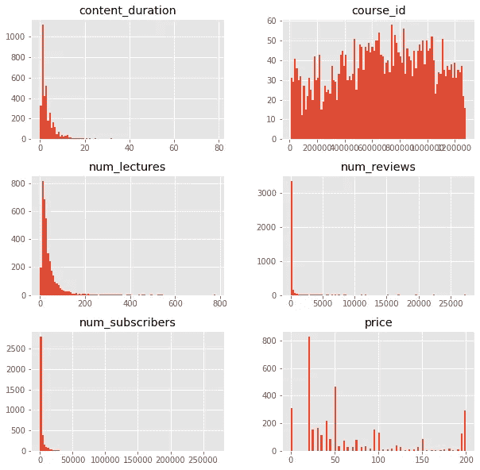
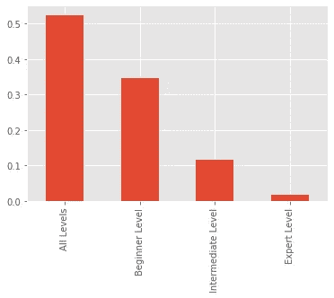
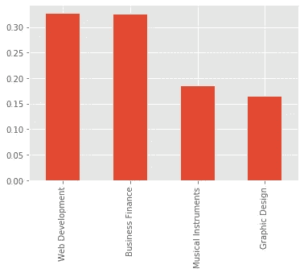
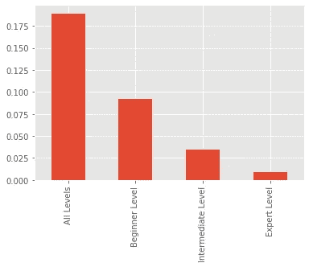
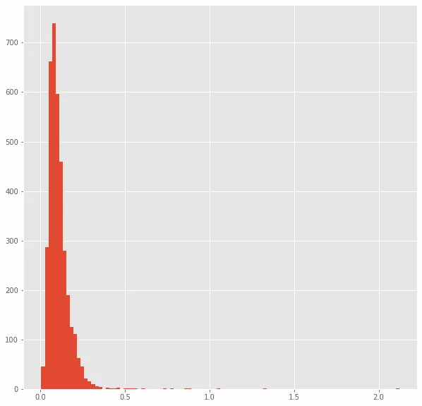
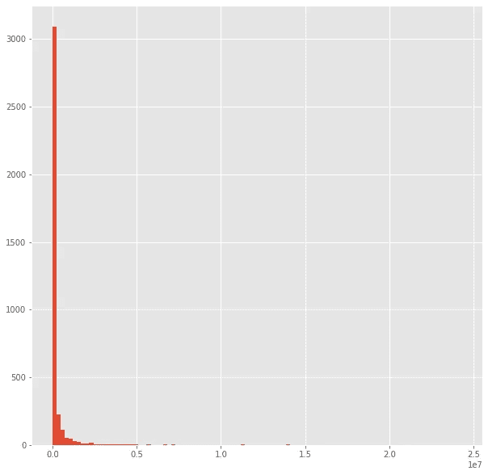
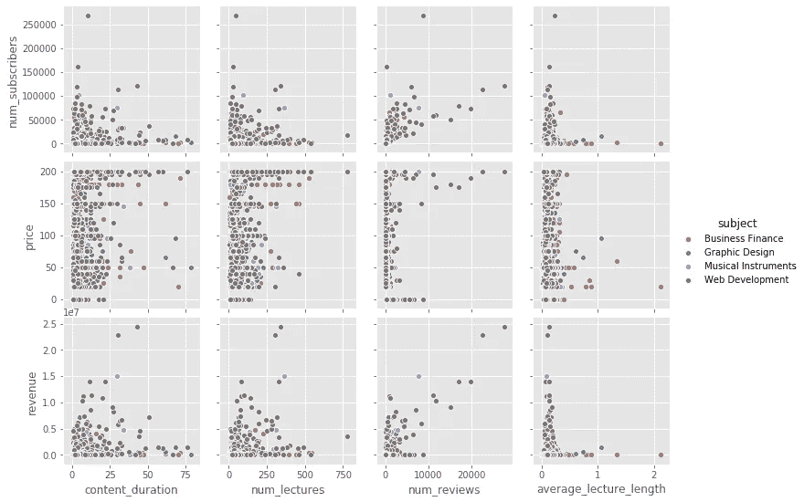
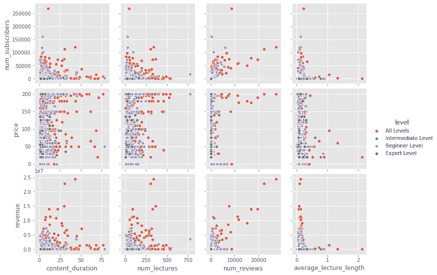

# 使用 Python 创建基本机器学习模型的 5 个步骤

> 原文：<https://towardsdatascience.com/5-steps-to-create-a-basic-machine-learning-model-using-python-7f981858cc6?source=collection_archive---------22----------------------->


由约翰内斯·普利尼奥在 [**风景画**](https://negativespace.co/category/landscapes/)

## 机器学习

## 在本文中，我们将探索来自[Kaggle.com](https://www.kaggle.com/)的 [Udemy](https://www.udemy.com/) 类数据，并尝试使用 [Pandas](https://pandas.pydata.org/) 、 [Matplotlib](https://matplotlib.org/gallery.html) 、 [Seaborn](https://seaborn.pydata.org/examples/index.html) 和 [Scikit-learn](https://scikit-learn.org/stable/) 来预测哪些类是成功的。

数据集可以在这里找到[，代码可以在这个](https://www.kaggle.com/andrewmvd/udemy-courses) [GitHub](https://github.com/andrewhong5297/UdemyAnalysis) repo 找到。

首先，我们将导入以下包并读入数据集:

```
import pandas as pd
import numpy as np
import seaborn as sns
import matplotlib.pyplot as pltdf = pd.read_csv(r"C:\Users\Andrew\Documents\Python Scripts\data set\udemy_courses.csv")
```

在开始分析之前，我们将运行`df.info()`来查看我们的数据集。我们可以看到我们有 3678 门课程，幸运的是在列中没有丢失数据！

```
RangeIndex: 3678 entries, 0 to 3677
Data columns (total 12 columns):
 #   Column               Non-Null Count  Dtype  
---  ------               --------------  -----  
 0   course_id            3678 non-null   int64  
 1   course_title         3678 non-null   object 
 2   url                  3678 non-null   object 
 3   is_paid              3678 non-null   bool   
 4   price                3678 non-null   int64  
 5   num_subscribers      3678 non-null   int64  
 6   num_reviews          3678 non-null   int64  
 7   num_lectures         3678 non-null   int64  
 8   level                3678 non-null   object 
 9   content_duration     3678 non-null   float64
 10  published_timestamp  3678 non-null   object 
 11  subject              3678 non-null   object 
dtypes: bool(1), float64(1), int64(5), object(5)
memory usage: 319.8+ KB
```

我们可以看到“published_timestamp”是作为一个对象存储的，所以在继续之前，让我们将其转换为一个日期时间变量。

```
df["published_timestamp"] = pd.to_datetime(df["published_timestamp"])
```

以下是我们将共同采取的步骤:

1.  **分布分析:**课程的常见科目、时长、价位有哪些？
2.  **组合特性:**我们可以组合任何列来获得更多有趣的特性吗？
3.  **将特征与目标变量进行比较:**我们能否对成功的课程有初步的了解？
4.  **建立模型:**我们能预测哪些课程最成功吗？
5.  **改进和部署模型:**为了构建一个更好的模型并让其他人更容易访问，接下来我们可以做些什么？

**分布分析:** 一种常见的开始方式是对数值数据使用`df.hist()`，然后在对分类数据应用`value_counts()`后绘制条形图。我们可以使用`df.select_dtypes([‘type’])`来分离数字和分类数据。

```
num_cols_df = df.select_dtypes(['int64','float64','datetime64[ns, UTC]'])
cat_cols_df = df.select_dtypes(['object'])num_cols_df.hist(figsize = (10,10),bins=100)
```



这些特征大部分是指数分布的，除了价格。

对于分类变量，我们使用以下格式绘制*相对频率*:

```
(cat_cols_df[column_name].value_counts()/cat_cols_df.shape[0]).plot(kind="bar")
```

将“column_name”替换为“level ”,得到了下面的图表:



水平相对频率

再用“主语”:



主题相对频率

我们可能还想看看子分布，比如一个主题中的级别。为此，我们通过在`[‘subject’]`前添加`[cat_cols_df[‘subject’]==’Business Finance’]`来选择我们想要的主题，并运行几乎相同的代码行:

```
(cat_cols_df[cat_cols_df['subject']=='Business Finance']['level'].value_counts()/cat_cols_df.shape[0]).plot(kind="bar")
```



“业务财务”中“级别”的相对频率

**组合功能:**

我通常从寻找我能创造的相对价值开始。在这种情况下，我们可以用“内容持续时间”除以“讲课次数”来计算以小时为单位的平均讲课时间。

```
num_cols_df["average_lecture_length"] = num_cols_df["content_duration"]/num_cols_df["num_lectures"]
```

绘制直方图告诉我们，大多数讲座大约 0.1 小时，或 6 分钟长。



平均授课时长(小时)

虽然我们可能会马上说订阅者的数量是一个成功的类，但这并没有考虑到一些类是免费的或非常便宜的。为了更准确地衡量成功，我们应该看看收入，或“价格”*“订户数量”

```
num_cols_df["revenue"] = num_cols_df["price"]*num_cols_df["num_subscribers"]
```

绘制直方图显示了强指数分布，采用`num_cols_df[“revenue”].mean()` 会给我们带来 25 万美元的收入。



收入(十万美元)

**比较特征与目标变量:**

为了与我们的目标变量“收入”进行比较，我们可以使用 [Seaborn](https://seaborn.pydata.org/examples/index.html) 库。这可以帮助我们确定在模型中包含什么特性(或者以后删除)。

```
temp_df = pd.concat([num_cols_df,cat_cols_df], axis = 1)
sns.pairplot(temp_df, x_vars = ['content_duration','num_lectures','num_reviews','average_lecture_length'],y_vars = ['num_subscribers','price','revenue'], hue = 'subject')
```



`pairplot()`中的“色调”参数允许我们在图表上覆盖分类数据。“评论数量”看起来与 y 变量有很强的相关性，而且“商业金融”科目在“平均演讲长度”上有较大的差异，但在任何 y 变量上没有太大的变化。“Web 开发”在“平均授课长度”方面更为严格，但在 y 变量方面有很大的变化。有可能我们的组合特征‘average _ lecture _ length’在模型中不是一个好的预测器。

与“价格”或“订户数量”相比，“收入”似乎显示出更清晰的相关性，因此我们将坚持把它作为我们的目标变量。同样从商业角度来看，收入应该更重要。

下面是相同的 pairplot，但是用`hue = ‘level’` 代替。“所有级别”在所有地块上的分布比其他的大得多，这一点在以后的研究中可能会很有趣。



**建立模型:**

我们通过分别准备前面的数字列和分类列来开始我们的数据管道。如果我们有任何空值，我们可以通过应用以下 lambda 函数之一来删除或估算数据中的缺失值:

```
fill_mean = lambda col: col.fillna(col.mean())
fill_mode = lambda col: col.fillna(col.mode()[0])
fill_median = lambda col: col.fillna(col.median())
```

对于“cat_cols_df ”,我们使用`pd.get_dummies()`创建虚拟变量列。我们将删除“课程名称”和“课程网址”,因为它们目前不太可能有用。以下函数为 *'* cat_cols' *中的每个特定列创建虚拟列。*

```
cat_cols_df = cat_cols_df.iloc[:,2:]def create_dummy_df(df, cat_cols, dummy_na):
    for col in  cat_cols:
        try:
            # for each cat add dummy var, drop original column
            df = pd.concat([df.drop(col, axis=1), pd.get_dummies(df[col], prefix=col, prefix_sep='_', drop_first=False, dummy_na=dummy_na)], axis=1)
        except:
            continue
    return dfcat_cols_df = create_dummy_df(cat_cols_df, cat_cols_df.columns, dummy_na = False)
```

值得注意的是，大多数管道使用 Scikit-learn 的 OneHotEncoder，因为该方法可以处理未知的数据类型以及稀疏矩阵。假设您的训练数据有一个“颜色”列，其中只有“红色”和“绿色”作为值，但新数据有一个额外的值“蓝色”。`get_dummies()`将为“蓝色”创建一个新列，即使它不在已训练的模型中，这将导致错误。

在为我们的分类列创建虚拟变量后，我们使用 Scikit-learn 的`train_test_split()`方法将数据随机分为训练集和测试集(“random_state”保存了分割，因此任何人都可以复制结果)。

对于 X，我们创建“X_num_cols_df”并删除“course_id ”,因为它可能只是噪声。“收入”和“订户数量”也被删除，因为这些是我们试图预测的。

```
from sklearn.model_selection import train_test_splitX_num_cols_df = num_cols_df[['content_duration','num_lectures','num_reviews','price']]X = pd.concat([X_num_cols_df,cat_cols_df],axis = 1)
y = num_cols_df['revenue']#Split into train and test
X_train, X_test, y_train, y_test = train_test_split(X, y, test_size = .30, random_state=42)
```

我们使用 Scikit-learn 创建一个模型，我们希望将数据拟合到该模型中，在本例中，我们使用的是线性回归模型。

```
from sklearn.linear_model import LinearRegressionlm_model = LinearRegression(normalize=True) # Instantiate
lm_model.fit(X_train, y_train) #Fit
```

拟合模型后，我们基于 X_test 数据预测成功，并寻找其均方误差(MSE)，这是一种常用的评分指标。

```
from sklearn.metrics import mean_squared_errory_test_preds = lm_model.predict(X_test)mse_score = mean_squared_error(y_test, y_test_preds)
length_y_test = len(y_test)print("The MSE for your model was {} on {} values.".format(mse_score, length_y_test))
```

这输出

```
The MSE for your model was 312248327184.6464 on 1104 values.
```

**改进和部署模型:**
现在我们的模型显然很糟糕，所以让我们试着了解一下为什么。通常情况下，您的第一个模型会非常遥远——没关系，许多实际工作来自于选择功能子集、交叉验证/集成方法或使用不同的模型！

然而，在此之前，尽可能地了解您的数据领域是非常重要的——数据中可能有未捕捉到的事件和趋势，这些事件和趋势可能会破坏您的模型。Udemy 经常会将所有课程的价格降到 10 美元，不管初始价格是多少。除非我们能够找到一个类别的平均销售价格，否则删除“价格”是值得的。我还建议深入研究第三步**将特征与目标变量进行比较，**因为更好地理解模式将有助于推动洞察力，而不仅仅是调整模型本身。

改进模型的另一种方法是对“course_title”列应用自然语言处理(NLP ),以查看某些关键字的存在是否有影响。

分享这种模式的最简单的方法是把你所有的代码放在一个[笔记本](https://jupyter.org/)和[活页夹](https://mybinder.org/)里。如果你想要一个更干净的用户界面，你可以创建一个 [Plotly Dash](https://plotly.com/dash/) 应用，并将其部署在 [Heroku](https://www.heroku.com/) 上。

祝你好运，编码愉快！