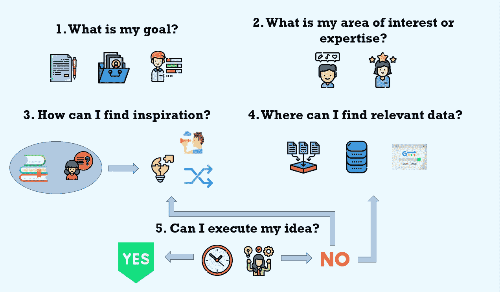

# 开发独特数据科学项目创意的 5 个步骤

> 原文：<https://towardsdatascience.com/5-steps-to-develop-unique-data-science-project-ideas-6c2b3a0014b?source=collection_archive---------10----------------------->

由 Julia Nikulski 制作的图形显示了开发独特的数据科学项目创意的必要步骤。由 [Freepik](https://www.flaticon.com/authors/freepik) 、 [Smashicons](https://www.flaticon.com/authors/smashicons) 、[eucalype](https://www.flaticon.com/de/autoren/eucalyp)、 [Kiranshastry](https://www.flaticon.com/de/autoren/kiranshastry) 、 [Becris](https://creativemarket.com/Becris) 和 [monkik](https://www.flaticon.com/de/autoren/monkik) 从 [Flaticon](https://www.flaticon.com/) 制作的图标。

## [入门](https://towardsdatascience.com/tagged/getting-started)

## 帮助您识别值得一试的新颖独特的数据项目的指南

任何项目中最困难的部分显然是想出一个新颖但可执行的想法。你很容易陷入**数据集兔子洞**。你花几个小时浏览现有的数据集，试图提出新的有趣的想法。但这种方法有一个问题:当你只关注现有的数据集时——关注 [Kaggle](https://www.kaggle.com/) 、 [Google Datasets](https://datasetsearch.research.google.com/) 、[fivethirtyeeight](https://fivethirtyeight.com/)—**你会把你的创造力限制在这个数据集设计用来解决的一小部分问题上。**

有时，我喜欢探索一个我觉得有趣的数据集。Kaggle 预测任务的第一百万次复制可能有利于我的学习进度。但是作为数据科学家，我们努力创造新的独特的东西，并产生有用的见解。

那么你怎么能想出一个新的主意呢？我将创造力研究的见解与自己的经历结合起来。这导致了 5 个关键问题，包括项目想法的例子。**这些问题指导你的想法产生过程，让你充分发挥你的创造力。这将产生新的独特的数据科学项目想法**。

丹尼尔·麦金尼斯在 [Unsplash](https://unsplash.com/s/photos/creativity?utm_source=unsplash&utm_medium=referral&utm_content=creditCopyText) 上的图片。

# 1.我为什么要开始一个项目？

当你考虑开始一个新的项目时，你会在头脑中有一个意图或目标。为什么一开始要做另一个数据科学项目？对你的目标进行广泛的分类可以帮助你集中精力寻找一个想法。所以想想你是否想创造

*   一个**投资组合项目**向潜在雇主展示，
*   一篇关于概念、模型或探索性数据分析的博客文章，
*   一个让你**实践一项技能**的项目——比如自然语言处理、数据可视化、数据角力，或者某个特定的机器学习算法，
*   或者你是否有完全不同的想法。

图片来自 [Pixabay](https://pixabay.com/?utm_source=link-attribution&amp;utm_medium=referral&amp;utm_campaign=image&amp;utm_content=1246633) 的[自由照片](https://pixabay.com/photos/?utm_source=link-attribution&amp;utm_medium=referral&amp;utm_campaign=image&amp;utm_content=1246633)。

# 2.我的专长和兴趣领域是什么？

思考这个问题很重要，主要有三个原因。首先，记住数据科学的[维恩图](https://www.kdnuggets.com/2016/10/battle-data-science-venn-diagrams.html)。领域专业知识是每个数据科学家都应该拥有的重要资产。只有你也理解了潜在的问题，你才能用数据解决问题。否则，你实现的算法、可视化和创造的预测与该领域的任何从业者都无关。而如果你的工作会无关紧要，那你当初为什么要去做呢？

其次，对你正在处理的想法和数据集感兴趣是很重要的。你不想强迫自己把空闲时间花在一个你不关心的项目上。如果你对某个领域感兴趣，你不需要成为这个领域的专家。但是你需要愿意花时间做额外的研究，并且理解数据之外的问题。

第三，[研究人员](https://psycnet.apa.org/record/2016-17972-001)发现，在创作过程中引入约束会带来更好的结果。这意味着**专注于某个特定领域或某个领域的组合会比试图在搜索过程中不受任何限制地提出一个想法产生更好的结果**。例如，我的兴趣和专长领域是可持续性、金融、流行文化和自然语言处理。专注于这些主题将允许我在确定灵感是否可以转化为可执行的新想法时利用我现有的知识。

图片由[马库斯·斯皮斯克](https://unsplash.com/@markusspiske?utm_source=unsplash&utm_medium=referral&utm_content=creditCopyText)在 [Unsplash](https://unsplash.com/s/photos/staatliches-museum?utm_source=unsplash&utm_medium=referral&utm_content=creditCopyText) 拍摄。

# 3.怎么才能找到灵感？

要找到灵感，你能做的最重要的事情就是阅读。各种来源可以帮助你在构思过程中发现有趣的主题:

*   **新闻、观点、博客文章**:轶事证据——以故事的形式——是想出点子的好方法。《连线》杂志发表了这篇关于谷歌自动补全功能中的政治偏见的文章。你可以用这个来研究语言模型中的偏见。或者你可以调查是否有可能根据在谷歌中输入的搜索查询来预测一个人的位置。
*   **科学文献**:学术论文通常包含讨论与研究主题相关的公开研究问题的段落。[这篇介绍语言模型 GPT-2](https://www.semanticscholar.org/paper/Language-Models-are-Unsupervised-Multitask-Learners-Radford-Wu/9405cc0d6169988371b2755e573cc28650d14dfe) 的文章提到，如果不进行微调，该模型在某些任务(如回答问题)上的表现并不比 random 好。为什么不写一些关于微调这个模型的复杂性的东西呢？
*   **数据科学帖子**:浏览介绍数据科学主题和项目的博客帖子可以产生新的想法。我看到了这个 [NLP 探索办公室](/nlp-on-the-office-series-cf0ed44430d1)，立刻后悔没有首先想到这个。但是探索另一个电视节目怎么样？还是几部电影确定模式？你可以用 GPT 2 号为你最喜欢的电视节目写剧本。

除了阅读，**在你的日常生活中寻找灵感**。每当你想知道一些事情的时候，考虑一下你是否可以用数据来回答这个问题。例如，我最近偶然发现了电视节目 *The Boys* 的预告片，看到了很多对 IMDb 的积极评价。所以我问自己，流行的[电视剧变得更加暴力](https://www.commonsensemedia.org/violence-in-the-media/have-movies-become-more-violent-over-the-years)有没有一个被证实的趋势？喜欢暴力节目的观众越来越多了吗？利用这些好奇的时刻，用数据探索这些问题。

你有什么选择来从上面的灵感中创造想法？[神经科学家](https://www.semanticscholar.org/paper/Creativity-as-a-Neuroscientific-Mystery-Boden/185d3c3721bfe23dc63bc6b2954f865c81a82ebd)确定了与想法产生有关的三种不同的心理过程:

*   你可以把已有的想法组合起来，创造一个新的结果(**组合创意** ) →各种项目[分析 Airbnb 房源](https://medium.com/@julia.nikulski/here-is-what-you-need-to-know-about-staying-in-boston-with-airbnb-57e81f5296ae)，其他的[分析房市](https://www.freecodecamp.org/news/how-to-build-a-data-science-project-from-scratch-dc4f096a62a1/)。结合这些思路来考察 Airbnb 是否提高了一个城市的房价。
*   你可以探索一个现有的想法，寻找要解决的新问题(**探索性创造力** ) →以围绕[受过大学教育和自学成才的数据科学家](/coding-bootcamps-vs-universities-54b482fc58a7)的现有辩论为例，调查谁更成功。
*   你可以拿一个现有的想法，改变它的一些东西，完全改变它的规则或意义(**转换创造力** ) →这是创造力最罕见的形式，在既定的概念空间之外运作。很难把握和描述。一个例子是，不要预测某件事会发生，而是尝试预测某件不会发生的事。

图片由 [Unsplash](https://unsplash.com/s/photos/think-outside-the-box?utm_source=unsplash&utm_medium=referral&utm_content=creditCopyText) 上的[戴安娜帕克豪斯](https://unsplash.com/@ditakesphotos?utm_source=unsplash&utm_medium=referral&utm_content=creditCopyText)拍摄。

# 4.在哪里可以找到相关数据？

一旦你有了一个总的主题，寻找数据来决定你如何在一个数据科学项目中实现这个想法。这是决定你的想法是否可行的关键。考虑现有数据库以及仍需收集且更难找到的数据:

*   **现有数据集来源** : [Kaggle](https://www.kaggle.com/) ，[谷歌数据集](https://datasetsearch.research.google.com/)， [FiveThirtyEight](https://data.fivethirtyeight.com/) ， [BuzzFeed](https://github.com/BuzzFeedNews/everything) ， [AWS](https://registry.opendata.aws/) ， [UCI 机器学习知识库](https://archive.ics.uci.edu/ml/datasets.php)， [data.world](https://data.world/) ，[Data.gov](https://catalog.data.gov/dataset)等等，一个快速的谷歌搜索就会发现更多。
*   其他人用过的方法:在谷歌和谷歌学术上搜索你选择的话题，看看是否有人已经调查过类似的问题。他们用了哪些数据？我们的数据世界结合了你可能不知道的学术和非学术资源。
*   **通过以下方式收集数据:** Web 抓取、文本挖掘、API、[事件跟踪、日志收集](/four-basic-ways-to-automate-data-extraction-3151064dc110)。

如果你找不到任何可以帮助你表达项目想法的数据，那就重新措辞。试着推导出一个可以用你所拥有的数据来回答的想法。同时问问自己为什么想要的数据得不到？你关注的领域中的问题是什么，如何解决？回答这些问题可能会引发一个数据科学项目。

图片由 [Erol Ahmed](https://unsplash.com/@erol?utm_source=unsplash&utm_medium=referral&utm_content=creditCopyText) 在 [Unsplash](https://unsplash.com/s/photos/pastel?utm_source=unsplash&utm_medium=referral&utm_content=creditCopyText) 上拍摄。

# 5.我能执行我最后的想法吗？

你有一个绝妙的主意！但它可实施吗？回顾你的想法产生过程。想想你想要实现什么(问题 1)，你是否对这个领域感兴趣或有专长(问题 2)，以及你是否有执行这个想法所需的数据(问题 4)。**现在你需要确定你是否有能力实施这个项目并实现你的目标。**

要考虑的一个重要因素是你愿意在这个项目上花费的时间。你不会想在这个话题上做博士的。所以你的期末项目可能只是你想法的一部分，也可能是学习你将来实现想法所需的技能。在这个想法产生过程的最后，应该是一个研究问题，在你愿意为实现目标而花费的时间里，你可以并且想要回答这个问题。

图片由 [Sharon McCutcheon](https://unsplash.com/@sharonmccutcheon?utm_source=unsplash&utm_medium=referral&utm_content=creditCopyText) 在 [Unsplash](https://unsplash.com/s/photos/pastel?utm_source=unsplash&utm_medium=referral&utm_content=creditCopyText) 上拍摄。

# 最后的想法

*   **管理你的期望** : 想出一个可执行的新颖想法需要几个小时以上的时间。这是一个持续的灵感过程，你应该把你想到的任何想法都写下来。在手机上打开便笺，记录你的想法。你也许能把你的几个想法结合成一个强有力的项目。
*   和某人谈论你的想法:和某人讨论你的项目想法会对你有帮助。也许一个相关的问题更有意思。也许他们可以给你指出额外的数据来源。也许你需要一个共鸣板来意识到你的想法是否有意义。
*   不要害怕重新开始:每一次经历都会教会你一些东西。每次你写一行代码，你都在练习和扩展你的技能。当你意识到你的想法没有让你更接近你的目标，或者这个想法是不可执行的，不要害怕离开它，继续前进。你花的时间没有浪费。重要的是要明白什么时候你的努力不会得到至少同样多的回报。

**本指南为我带来了新的独特的数据科学项目想法**，我希望你会发现它和我一样有用。让我知道你的过程是什么，你认为这些步骤中缺少什么。

你想在媒体上阅读更多高质量的故事吗？考虑注册一个支持我和其他媒体作者的会员。

 [## 通过我的推荐链接加入 Medium-Julia Nikulski

### 作为一个媒体会员，你的会员费的一部分会给你阅读的作家，你可以完全接触到每一个故事…

medium.com](https://medium.com/@julia.nikulski/membership)