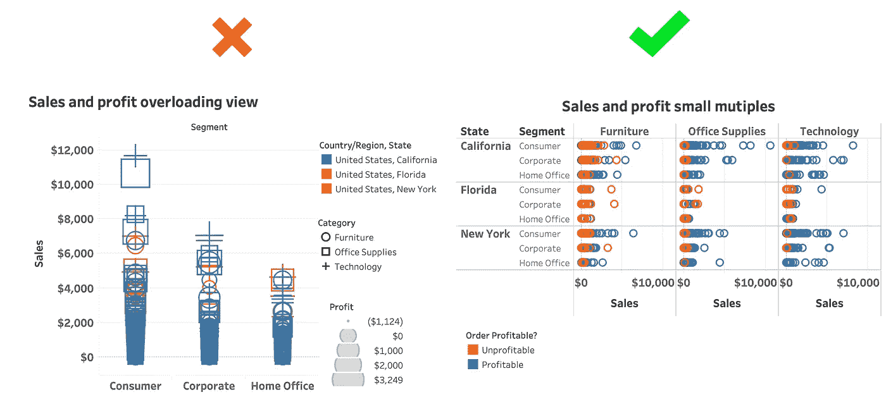
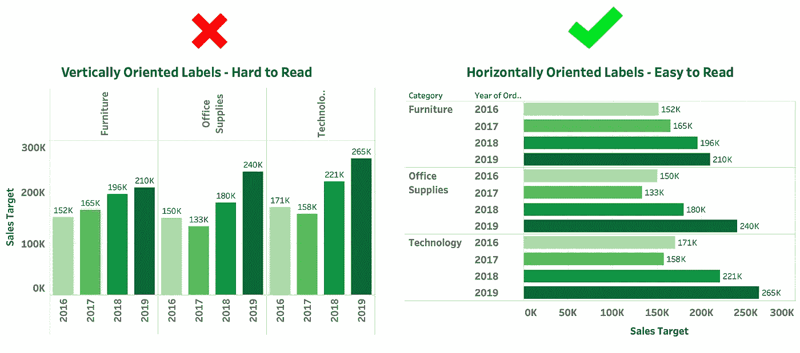
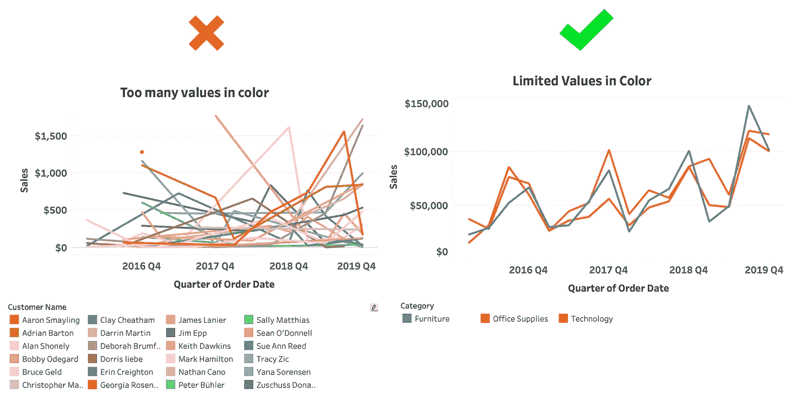
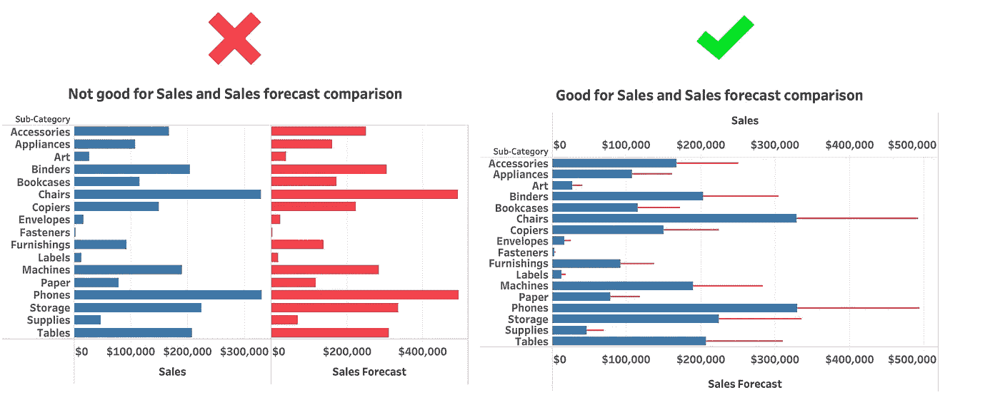

# 有效仪表板设计的 5 个步骤

> 原文：<https://towardsdatascience.com/5-steps-to-effective-dashboard-design-21500fd9b78e?source=collection_archive---------36----------------------->

## 创建有影响力的仪表板的指南

卢克·切瑟在 [Unsplash](https://unsplash.com/) 上的照片

仪表板仍然是任何公司数据科学流程的重要组成部分。从数据分析师到最高级别的高管，仪表板仍然被用来传达关键信息和从数据中获得洞察力。

在设计仪表板时，可以考虑许多不同的方面。数据、数据的可用性、可视化数据的需求、可视化数据的方式、对感知和认知科学的考虑，等等。你会发现数百种仪表盘设计指南和规则手册。面对如此多的信息，被规则所束缚而无法提供有用的东西是很常见的。

本文旨在提供一个清单，当你被要求设计一个仪表板时，你可以考虑 5 点。即使您是新手或经验丰富的人，您也可以使用下面的指针来创建仪表板，以正确有效地传达信息。

所以，让我们开始吧！！

# 步骤 1:评估需求

请记住，仪表板的**目标很重要**。关于仪表板的讨论经常集中在仪表板的外观上。人们喜欢看到按照他们熟悉的方式设计的仪表板。这导致仪表板无法解决手头的问题。这里的关键是关注仪表板解决什么问题，而不是它是如何设计的。

另一件重要的事情是，仪表板**与用户的能力相匹配。如果我们能了解用户的金属模型，我们就能更好地评估仪表板的需求。仪表板既不应该非常复杂，也不应该过于简单，而是应该与用户的能力相匹配。**

**在这一步要问的重要问题:**

*   仪表板将回答的 5 个关键问题是什么？将采取什么行动来应对它们？
*   仪表盘的受众是什么？
*   仪表板上需要显示哪些信息项目，为什么它们很重要？
*   仪表板上的哪些项目回答了您的主要问题？
*   信息需要以什么样的详细程度(**粒度**)来表达？
*   哪些信息项之间的比较有助于回答关键问题？
*   仪表板需要多久更新一次？

# 第二步:制作原型

清楚了解仪表板和信息项的目标后，制作仪表板的原型。这有助于您了解您手头有哪些组件，并找出您可能缺少的东西。

原型可以是简单的手绘草图。不需要设计一个工作原型。

这里的目的是定义将出现在仪表板上的信息的不同部分，它们的重要性以及它们应该如何排列。

此外，征求对原型的反馈。你可能不会第一次就把设计做对。尝试在你的设计中引入新的视角。

# 第三步:选择图表

一张图胜过千言万语。所以选择正确的图片(图表)很重要！图表对于可视化模式、趋势和获得洞察力非常重要，否则仅通过查看原始数据很难获得这些信息。

*   ***随时间变化的趋势:*** 折线图、面积图、条形图
*   ***对比与排名:*** 条形图
*   ***相关性:*** 散点图，棒线组合图
*   ***分布:*** 箱线图，直方图
*   ***部分到整体:*** 堆积条形图
*   ***地理数据:*** 地图搭配其他海图

此外，你也可以查看[data-to-viz.com](https://www.data-to-viz.com/)获取图表类型的详细指南。

# 第四步:确保图表是有效的

除了选择正确的图表类型，我们还需要确保图表是有效的。

Tableau 有一份关于可视化分析最佳实践的白皮书，其中概述了下面一些让图表更容易理解的示例:[https://www . tableau . com/sites/default/files/media/white paper _ visual-analysis-guideline _ 0 . pdf](https://www.tableau.com/sites/default/files/media/whitepaper_visual-analysis-guidebook_0.pdf)

不要让你的图表信息过多。相反，创建分区有助于更好地理解图表。

为图表选择正确的方向。

避免在一个图表中使用太多颜色。

组织图表，使其能够轻松回答问题。

# 第五步:收集反馈并重申

收集用户对图表的反馈，以便更好地评估它。

确保您的仪表板回答了您设计它来回答的关键问题。确保图表类型正确，图表易于理解。找出图表中是否有过滤或深入查看的要求。根据反馈改进设计。

制作仪表板是一门艺术，也是一门科学。因此，为了构建出色的仪表板，您需要投入精力和时间，进行协作和重申！

*演职员表:苏米特·夏尔马*