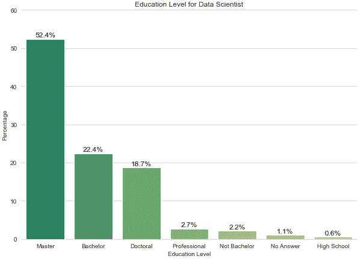
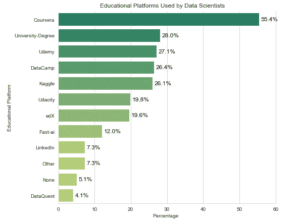
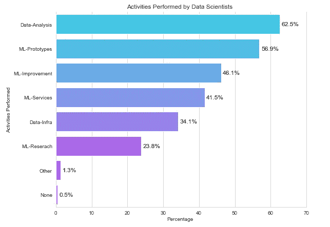
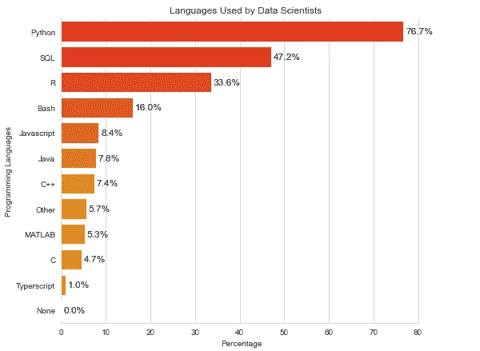
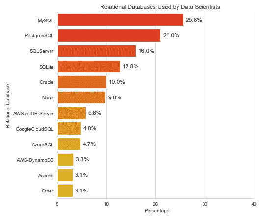
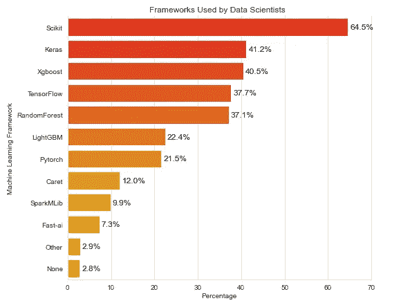
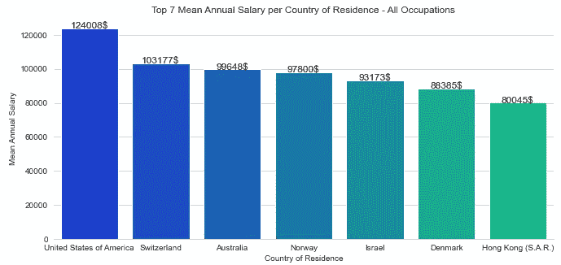
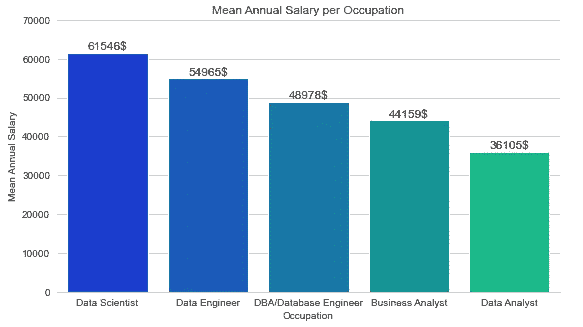
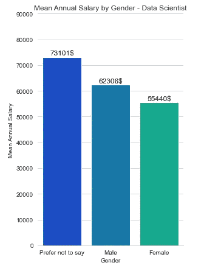
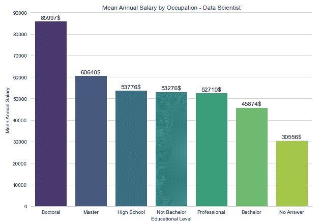

# 数据告诉我们关于数据科学家的 5 个故事

> 原文：<https://towardsdatascience.com/5-stories-data-tell-us-about-data-scientists-7b970a90a8aa?source=collection_archive---------42----------------------->

## 数据科学家通过数据讲故事。但是数据可以讲述数据科学家的哪些故事呢？

照片由 Dariusz Sankowski 拍摄

这听起来像是结构化数据的报复，但实际上这只是由 [Kaggle 平台](https://www.kaggle.com/)进行的一项调查。2019 年 Kaggle 机器学习和数据科学调查的数据在这里[可用](https://www.kaggle.com/c/kaggle-survey-2019/)，因此我们可以听听他们可以告诉我们的关于数据科学家的故事。

这些问题引导我们完成了本次[分析](https://evertonbin.netlify.app/projects/ml-ds_kagglesurvey_en):

*   他们的教育背景如何？
*   他们在日常工作中从事哪些活动？
*   他们使用哪些工具？
*   他们的工资呢？

以下是他们告诉我们的故事:

# 教育

作者图片

我知道，如果你刚刚开始成为数据科学家的旅程，第一个数字对你来说可能是个坏消息。我不想给你任何剧透，但如果你现在感到失望，去看看最后一节叫做*学历 x 工资*的内容，它可能会让你再次冷静下来。

大多数回答调查的数据科学家确实有硕士学位。尽管如此，他们通过受欢迎的平台参加在线课程仍然非常普遍，如 Coursera、Udemy、DataCamp、Udacity 和其他许多平台。

作者图片

这可能表明，无论你的正规教育背景如何，你都必须不断寻求知识，尤其是在这个几乎每天都给我们带来新闻的技术领域。

# 活动

听到数据科学，难免会想到人工智能和机器学习算法的炒作。但是，当谈到数据科学家日常生活时，那会是主要任务吗？

作者图片

他们中超过 60%的人实际上必须处理数据分析，而不仅仅是担心使用什么算法或找到改进模型的方法。实际上，调查向我们表明，无论你是数据科学家还是数据工程师，数据分析都会在你的活动中发挥很大作用。

此外，我们可以看到，几乎 35%参与调查的数据科学家从事与数据基础架构相关的活动。这显示了数据科学领域中不同角色之间的关系。

# 工具

如果我告诉你 [Python](https://www.python.org/) 是数据科学家中最受欢迎的编程语言，你可能不会感到惊讶。但是如果我问你他们最常用的第二语言是什么呢？

作者图片

如果你的答案是 SQL，那你就答对了！SQL 或结构化查询语言是一种简单但功能强大的语言，它的命令可以分为四个主要功能:数据定义语言(DDL)、数据操作语言(DML)、数据控制语言(DCL)和数据查询语言(DQL)。

它向我们展示了数据科学家的大部分工作是通过在数据库中执行查询、转换、操作和分析来理解数据。

但是语言只是我们可以在数据科学家的工具箱中找到的工具之一。使用最多的数据库和机器学习框架呢？

作者提供的图片

我们可以看到，在这些关系数据库中， [MySQL](https://www.mysql.com/) 是最受欢迎的，尽管其他如 [PostgreSQL](https://www.postgresql.org/) 和[微软 SQL Server](https://www.microsoft.com/sql-server/) 似乎也是数据科学家的宝贵工具。

如果说机器学习框架的话，Python 的流行导致 [Scikit-Learn](https://scikit-learn.org/) 成为使用最多的框架，其次是 [Keras](https://keras.io/) 、 [XGBoost](https://xgboost.ai/) 和 [TensorFlow](https://www.tensorflow.org/) 。

# 薪水

作者图片

你可以是数据或业务分析师、数据科学家、数据或数据库工程师。如果你住在美国，你很幸运。那是你更有可能获得更高薪水的地方。

对于数据科学家来说，我们有一个特别的好消息。

作者图片

在所有这些职业中，数据科学家似乎是年底账户金额较高的职业。

然而，这不仅仅是好消息。

作者图片

尽管我们有相当多的人不愿意宣布他们的性别(在这一点上，我们必须说，Kaggle 允许自我描述性别，以防他们与男女选项无关)，但我们可以看到，在那些宣布自己是这两种性别之一的人中，可悲但并不奇怪的是，女性似乎比男性获得的报酬更低。

# 教育程度 x 工资

如果你从第一部分就来到这里，我在这里让你冷静下来:尽管博士和硕士学位显然与更好的报酬有关，但看起来不管你的正式教育背景如何，如果你致力于学习必要的工具和概念，房间里有足够的空间给你。

作者图片

我们可以看到，大多数不同背景的人之间的工资差异并不是很大，这意味着尽管这可能是一条充满挑战的道路，但你肯定可以通过数据科学找到自己的路。

# 结论

通过这篇文章，我们对如何更好地理解现实世界中的数据科学家有了一个大致的了解，这里我们有一个迄今为止我们所见的快速简历:

*   尽管似乎有很多专业人士拥有硕士学位，但每个真正致力于成为有能力的专业人士的人都有一席之地；
*   学习工具和概念的一个好方法是参加在线课程，有很多选择，从大学提供的课程到与该领域最大的公司合作准备的课程；
*   如果你不知道该学哪种语言，Python 是个不错的选择，但是不要忘了 SQL。仍然是关于工具，Scikit-Learn、Keras、TensorFlow 和 MySQL 等数据库似乎在数据科学家中非常受欢迎；
*   数据科学是一个创新领域，但一些旧规则坚持保留下来:在同样的角色下，女性仍然比男性挣得少。但是往好的方面想，成为一名数据科学家可能是一个有利可图的选择。

在 data 与我们分享了所有这些故事之后，**您是否已经决定从哪里开始您的数据科学之旅？**

如果你已经走上了这条路，**你今天会开始学习哪种新工具？**