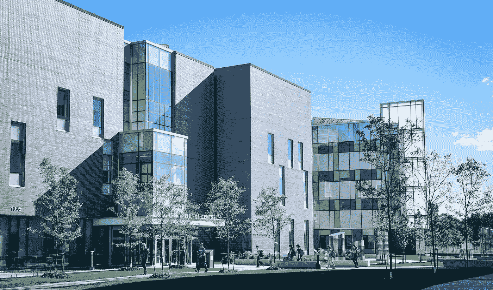
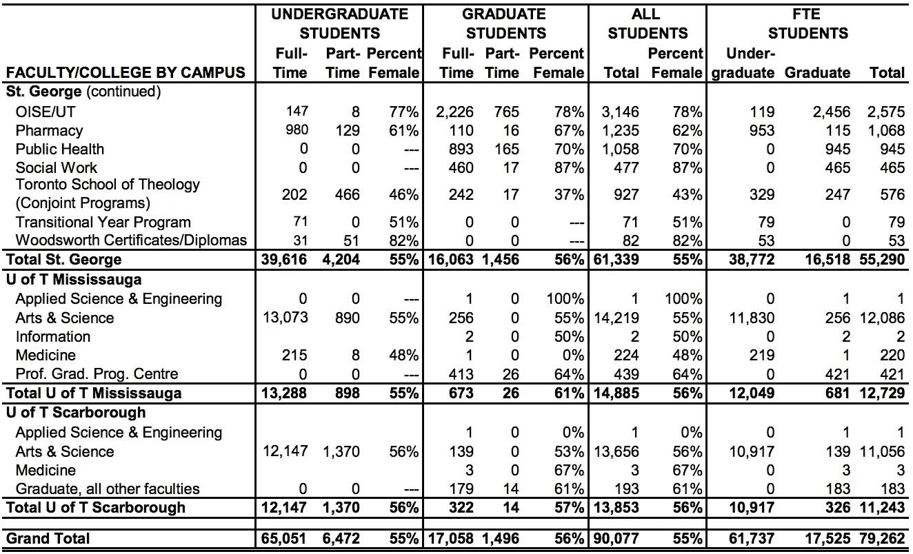
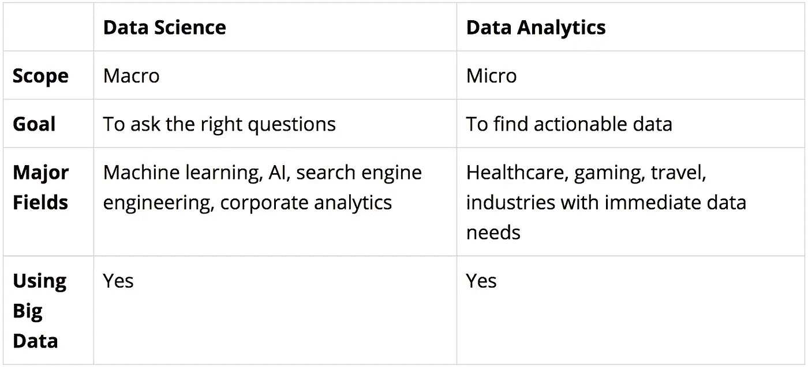

# 多伦多大学机器学习学生的 5 点心得

> 原文：<https://towardsdatascience.com/5-takeaways-from-a-university-of-toronto-machine-learning-student-474b002a7154?source=collection_archive---------33----------------------->

## 从经验中学习

多伦多大学斯卡伯勒校区——肯·琼斯在 UTSC 拍摄的照片

众所周知，多伦多大学是加拿大排名最高的大学之一，但并不是所有的校园都被平等对待。斯卡伯勒校区，我称之为 UTSC，是一个较新的校区，位于 GTA 的东端，提供各种合作项目供新生选择。大约 4 年前，当我申请大学时，我决定以合作计算机和数学科学学生的身份进入多伦多大学斯卡伯勒校区，目标是进入计算机科学(CS)项目(本科学习第一年后必须申请)。

以下是我在整个旅程中学到的五件事，以及我如何开始我的数据科学职业生涯:

# 1.校园选择

大家总是声称多伦多大学的名声完全是建立在圣乔治(市中心)校区的基础上。这种说法并非完全错误，因为大多数大学的排名是基于研究生项目而不是本科项目，圣乔治(UTSG)大学提供最受欢迎的硕士项目。然而，任何人都不应该低估“后代”校园的教育水平，包括斯卡伯勒(UTSC)和米西索加(UTM)校园。普遍的说法是，UofT 的两个新校区比圣乔治校区更容易被录取。这是千真万确的，不一定是因为市中心的校园好得多，而是因为 UTSC 和 UTM 都比较新，没有一百多年的学术声誉来支撑它们。

按校区招生—由多伦多[大学](https://www.utoronto.ca/sites/default/files/Facts%20%26%20Figures%202017%20online%20version.pdf) 2017

毫无疑问，圣乔治校区提供了最多的课程可供选择，拥有最多的学生，当然还有令人惊叹的排名很高的教授。然而，如果适合你的专业课程是在一个较小的校园里提供的，并且你不介意一个不那么拥挤和更紧凑的校园，UTSC 或 UTM 可能是一个很好的适合你的地方。如果你担心你将接受的教育质量，不要！UofT 的大多数教授都在不止一个校区任教。也就是说，如果你听说过这位了不起的统计学教授在 UTSG 大学教授这门令人难以置信的课程，你可能会发现他们在 UTSC 大学也教授同样的课程。作为一名未来的计算机科学学生，毫无疑问，我想体验当实习生的经历，并在学习期间获得实践经验。考虑到这一点，我选择 UTSC 而不是 UTSG 的决定性因素是，前者提供合作项目。

# 2.合作计划的价值

什么是合作社？Co-Op 是一个允许学生在仍然是全日制学生的同时在一个行业相关的领域工作的计划。这给了学生们在一个学期的学校教育和一个学期的工作之间交替的机会。

科技行业竞争非常激烈，因为我们都生活在这个强大的数字时代，越来越多的人加入科技行业，因为它不需要任何强制性的大专教育，并提供相当有竞争力的工资。

克里斯·利维拉尼在 [Unsplash](https://unsplash.com?utm_source=medium&utm_medium=referral) 上的照片

当你毕业时，你将与成百上千的新毕业的学生竞争同一个入门级的技术工作。想想看，任何一个候选人如何在这么多的申请者中脱颖而出。假设有一个职位空缺，剩下两个申请人，你和与你有相同学习成绩和技能的人。招聘经理会选谁？现在考虑一下你在大学期间是否有过与行业相关的实践经验。毫无疑问，招聘经理会聘用有经验的人，而不是没有经验的人。然后，你将与一个小得多的申请者群体竞争，而不是与所有本科技术学生竞争，这个群体由所有具有相关经验的本科技术学生组成。

如果你正在寻找计算机科学或数据科学方面的职业，我怎么强调现实世界中与行业相关的经验在你本科期间的重要性都不为过。当然，你可以在夏季学期自己寻找实习机会，获得同样多的宝贵经验。然而，如果你想要更多的指导来寻找你的工作经验和一般的工作申请咨询(包括求职信和简历，以及关于个人品牌的一般提示)，Co-Op 将是你的一个好选择。此外，一些实习生职位只对合作学生开放，这进一步缩小了申请人的范围，从而增加了你获得该职位面试的机会。

# 3.认识你的优势——从计算机科学到统计学

如前所述，我最初开始攻读本科学位的目标是进入 UTSC 的合作计算机科学项目，专攻软件工程。我记得我想这么做并不是因为我擅长编码，实际上我以前没有编程经验，而是因为 CS 非常流行，可以保证一个好的未来。不要误解我，这个主题非常有用，为你打开了许多大门，但我只是注意到我并没有像我希望的那样喜欢它。第一年后，我意识到我更喜欢统计学课程，并且比计算机科学课程表现得更好。对我来说幸运的是，UofT 给一年级学生提供了一套基于整个计算机和数学科学系的必修课程，而不是针对你希望申请该系的确切项目的任何课程。然后，我可以毫无困难地切换到统计程序。

我不仅发现我在统计学课程中学到的理论在现实世界中非常适用，我还注意到我非常喜欢处理庞大而杂乱的数据集。然而，我知道我想继续发展我的编程技能……所以我发现 UTSC 大学提供了一个统计学项目，重点是机器学习和数据挖掘。就这样开始了我的数据科学之旅。对于那些刚刚接触数据科学主题的人来说，该领域结合了传统数据分析和方法(统计学)的技能以及编程技能(计算机科学)，从而从数据中发现一些潜在信息并估计未知情况。

# 4.建筑经验

在我获得第一个数据科学家合作职位之前，我曾是一名数据分析师合作伙伴。到目前为止，我所受的教育(在我最初几个工作任期申请工作时)和经验主要包括与数据测试和清理方法相关的统计理论，这些理论可以很容易地应用于可操作的数据。这与数据分析师的角色密切相关，数据分析师更专注于获得有意义的见解，以直接解决问题。另一方面，数据科学是一个更广泛的领域，包括专注于构建数据建模的新流程，创建算法等更复杂的问题。机器学习是数据科学家最常用的技术之一。因此，除了当时没有多少数据科学领域的知识之外，我还寻找了分析实习机会。

数据科学和数据分析的主要区别—图片来自 [SISENSE](https://www.sisense.com/blog/data-science-vs-data-analytics/)

作为一名数据分析师，我工作了三个学期，终于有了足够的行业经验，开始考虑数据科学合作机会。在学习了机器学习算法及其背后的基本理论(以及过去的合作经验)后，我成功获得了第一份数据科学实习。

虽然我走了很长的弯路才获得数据科学职位，但这让我拓宽了数据应用方面的知识。有很多方法可以让你接近这个职业，这只是我个人的大学之旅。我鼓励你选择最适合自己、最符合你工作风格的路线。

# 5.我需要高等教育吗？

我申请的实习越多，我就越注意到全职数据科学家职位要求申请者拥有相关领域的硕士或博士学位。随着我对这个领域了解的越来越多，这样的要求对我来说就越有意义。数据科学需要各种各样的数据技术，因此需要更先进的理论来完成这项工作。然而，我知道这些知识不是你只能通过更高层次的教育才能获得的知识！事实上，许多公司规定，在该领域全职工作几年也同样有价值。我知道，如果你希望在正式研究、机器学习算法开发、深度学习等领域做出贡献，许多人会建议你攻读研究生学位。不过，我需要提一下，我还没有亲身经历过这种经历。当我在多伦多大学完成统计学的本科学位时，在机器学习和数据挖掘方面，我仍然在考虑自己的硕士学位。