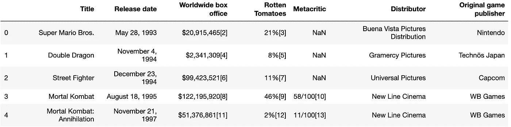
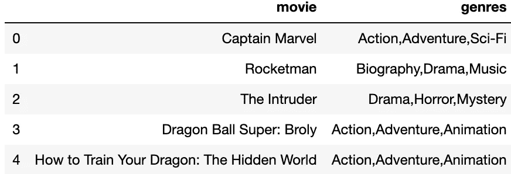
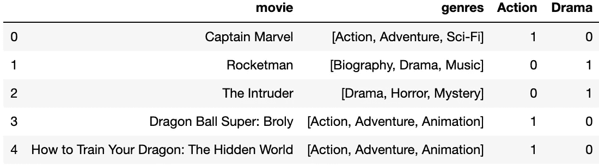
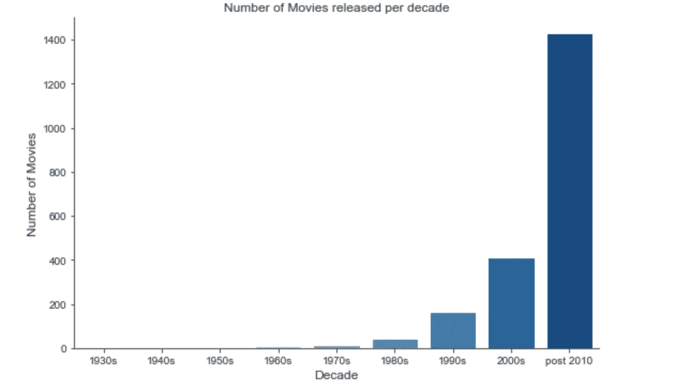

# 我的第一个 EDA 项目的 5 个技术要点

> 原文：<https://towardsdatascience.com/5-technical-takeaways-from-my-first-eda-project-f806375574ce?source=collection_archive---------41----------------------->

在过去的两周里，我一直在做我的第一个涉及电影行业的数据探索项目。以下是我学到的五个技巧。请注意，正如标题所暗示的，我是数据科学的初学者，因此欢迎任何评论。

# **念多个。使用 glob** 的 csv 文件

我从各种电影网站获得数据，包括 IMDB、电影数据库和烂番茄。第一项任务是把它们读到我们的笔记本里。一种简单的方法是使用 glob，它创建一个特定扩展名的所有文件的列表。

```
# Create a list of all csv files using glob
csv_files = glob("./zippedData/*.csv.gz")
```

**为什么有用:**这样可以节省时间，因为我们不必单独读取每个文件。如果文件夹中添加了其他数据，这些数据将自动添加到列表中。

另外，以下是我每次使用 glob 时想到的:


Jabba glob——来源:starwars.com

# **熊猫的 read_html()函数**

作为我项目的一部分，我想从网上抓取额外的数据，比如维基百科上的网飞原创电影表。我不假思索地使用了 [BeautifulSoup](https://www.crummy.com/software/BeautifulSoup/bs4/doc/) ，这是一个 Python 库，通过导航和搜索解析树从 HTML 文件中提取数据。

然而[熊猫](https://pandas.pydata.org/pandas-docs/version/0.23.4/generated/pandas.read_html.html)有一个`read_html()`功能，可以帮我节省几个小时的工作。由于数据整齐地显示在一个表格中，用几行就可以得到一个近乎完美的数据框架。

后来，我还想要关于基于视频游戏的[电影的数据，这次记得使用内置函数。](https://en.wikipedia.org/wiki/List_of_films_based_on_video_games)

```
DF = pd.read_html('List of films based on video games - Wikipedia.html')
```

然后，由于我只对已发行的真人电影感兴趣，所以我限制在第一张表的前 38 行。

```
Videogamemovies = DF[0][:38]
```



**为什么这个有用:**省时又轻松！如果数据已经整齐地显示在表格中，这可能是从 web 上抓取数据的最佳方式。

# **一个热编码**

在我们的数据集中，电影被分为三种类型。哪一个是主要类型并不明显，最好的方法是将每部电影归入其列出的每个类型。以下是我们的`movies`熊猫数据框架的相关栏目。



首先，使用`map()`以逗号分隔流派列中的值。然后，为每个具有零值的独特的单个流派创建额外的列。然后，我遍历流派列，将与电影流派匹配的列中的值更改为`1`。

```
# Create columns with genres
for genre in individualgenrelist:
    movies[genre] = 0# Set value to 1 if genre applies
for index, genres in enumerate(movies['genres']):
    for genre in genres:
        movies.loc[index,genre] = 1
```

使用枚举不是很有效，但由于时间限制，我无法找到更好的方法。如果你做了，请让我知道！

下面是结果的样子，显示了列`Action`和`Drama`。



**为什么这很有用:**这让我们不仅可以简单地对比如说`Action`电影的数量求和，还可以创建比如说`Action`和`Adventure`电影的子数据帧。当我们考虑机器学习和预测分析时，以这种格式保存我们的数据将非常有用。


这里有一些熊猫！照片由 [Ilona Froehlich](https://unsplash.com/@julilona?utm_source=medium&utm_medium=referral) 在 [Unsplash](https://unsplash.com?utm_source=medium&utm_medium=referral) 上拍摄

# 熊猫**切**()功能

Pandas cut()函数用于将一维数组元素分离到不同的容器中。当你有数字数据并希望转换成分类数据以便更好的可视化时，这是很有用的。在我的项目中，我正在调查一部电影的制作预算，并将数据分为“小预算”、“中预算”和“大预算”电影。过程很简单:创建 bin 和名称列表，然后让 Pandas.cut()完成这项工作，而不是进行迭代。

```
# Create bins and names lists
bins = [0, 100000000, 200000000, np.inf]
names = ['Low','Medium', 'High' ]# Use pd.cut() to create budgetrange column
movies['budget_range'] = pd.cut(movies['production_budget'], bins, labels=names)
```

**为什么这很有用:**创建分类箱将使数据可视化和研究特征变得更容易。使用`pd.cut()`效率高。

# **西伯恩的计数图**

计数图使用条形显示每个分类箱中的观察值数量。它可以被视为分类数据的直方图。虽然这当然可以“手动”实现(例如，通过使用关键类别和值计数的字典进行迭代)，但使用 Seaborn 的快速可视化功能要快得多。

```
# Plot number of movies released per decade
sns.catplot(x = 'decade', kind = 'count', data = movies)
```



**为什么有用:**直观显示分类数据分布的快速简单的方法。

这就是你要的，我将带着这五点去做我的下一个项目。

如果你有兴趣看我的电影项目，什么类型的电影票房最好，请查看我的 [GitHub 资源库](https://github.com/nadinezab/making-movies)。