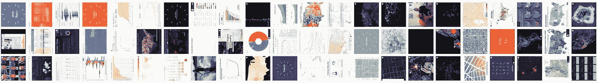
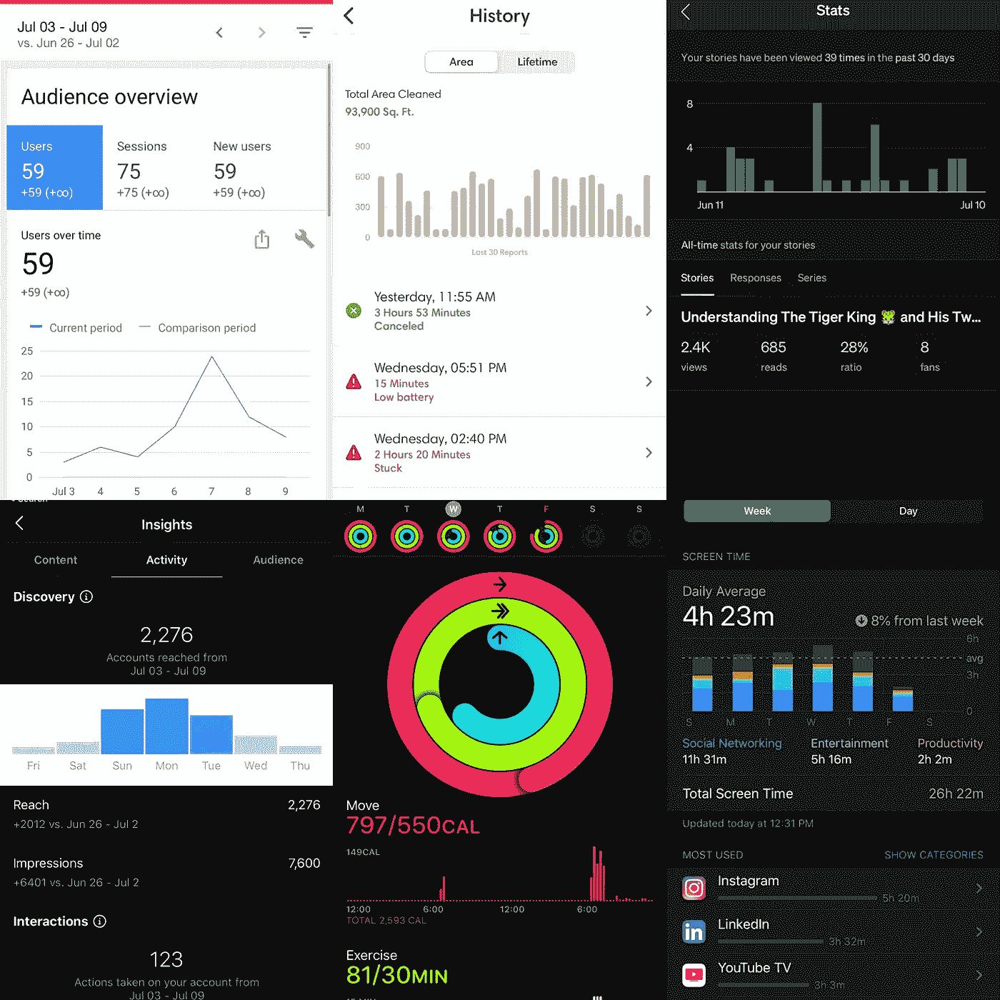
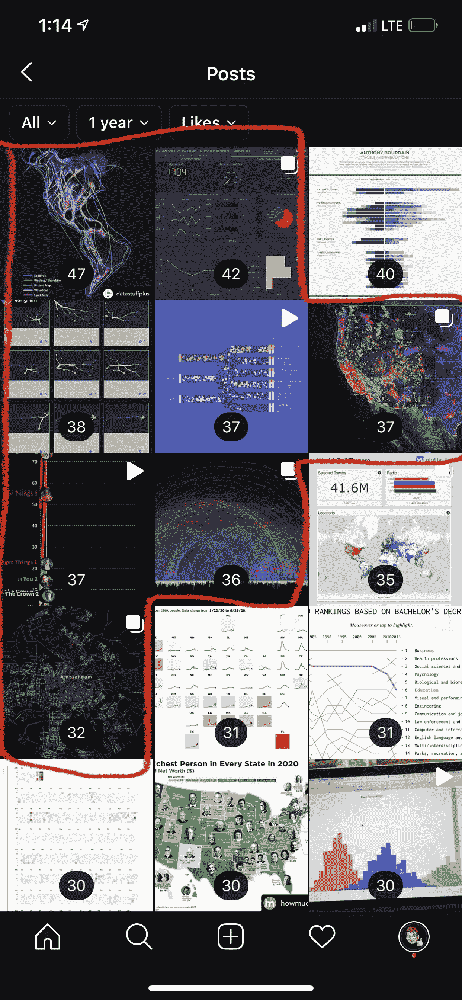
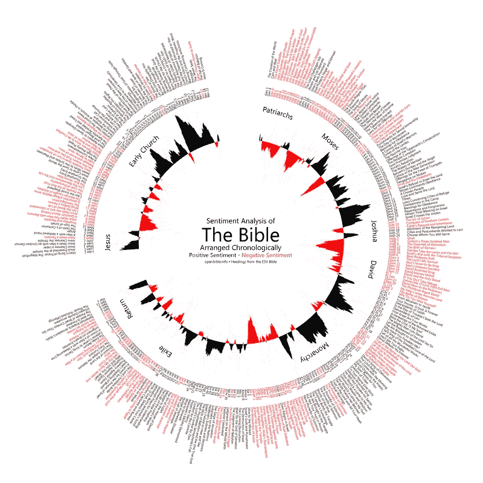
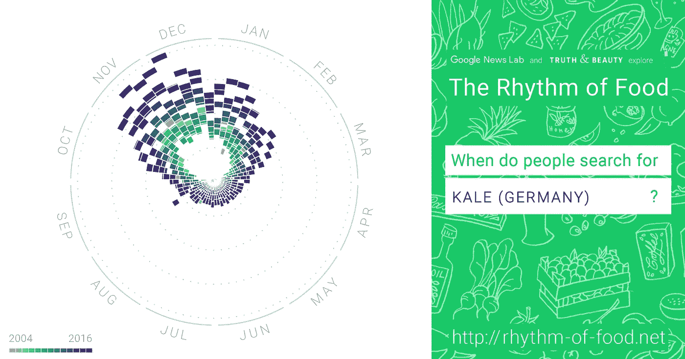
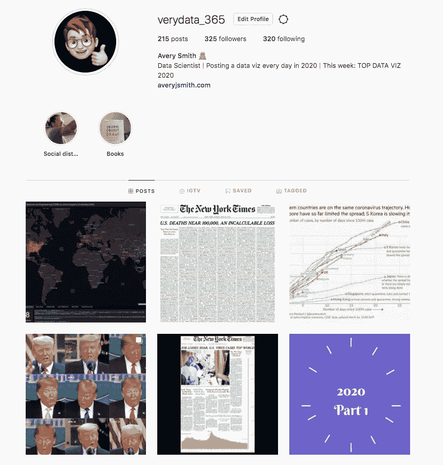

# 我在 2020 年上半年每天发布一个数据学到的 5 件事

> 原文：<https://towardsdatascience.com/5-things-ive-learned-posting-a-data-viz-everyday-in-the-first-half-of-2020-1ef6f4b892d2?source=collection_archive---------58----------------------->

## 📊半年的数据分析工作，即

## 每日 Instagram 贴子 ft。数据即

来自@VeryData_365 的 Instagram 图库

2020 年，我的目标是每天在我的 Instagram 上发布一个很酷的数据可视化。我们的目标是从你所有惊人的数据中获得个人灵感，然后传递给其他人。我还想学习和理解所有不同的技术、图表和显示数据的方式。

**六个月后，我浏览、分析并发布了超过 182 个不同的数据可视化。我学到了什么？**

# 1)如果您正在寻找，数据可视化无处不在

因为我开始每天发布一个数据可视化，所以我开始寻找它们。你猜怎么着？它们在野外无处不在。找到他们非常容易。似乎每个应用程序、网站和公司都有一个“统计”页面。只要打开你的手机，这些页面有你熟悉的吗？

左上至右下:谷歌分析、iRobot Roomba、Medium、Instagram、苹果健康、苹果屏幕时间

数据正在成为我们日常生活的一部分。我们不断地看到图表并解释它们的含义。*随着大数据的兴起，数据可视化制作和理解也必须同步增长。*未可视化的数据仍然相对无用。我们看到这是极其真实的电晕病毒新闻。媒体一直在分享约翰·霍普金的仪表盘或者约翰·伯恩-默多克的乡村追踪。通过可视化显示，人类最容易消化数据。

我原以为每天很难找到值得分享的东西，但事实证明，决定分享什么更难！谷歌搜索、Instagram、[FlowingData.com](http://FlowData.com)、Tableau Public、Twitter、Reddit、 [Data Viz Society](https://www.datavisualizationsociety.com/) 等都让人们很容易找到美观、信息丰富的图表。

# 2)人们真的很喜欢地图

地图在数据可视化方面有双重功能。第一，他们以一种每个人都能理解的熟悉方式非常好地描绘了多维度。第二，他们允许观众将数据联系起来。它让用户通过说“哦，我住在这里…这是我妈妈住的地方…哦，伙计，看看约翰尼住的地方发生了什么。”它允许数据个性化。

例如，我目前正在我的任天堂 Switch 上玩[动物穿越](https://animal-crossing.com/)。这很有趣，但更重要的是，[这是令人难以置信的治疗和放松](https://www.newsweek.com/animal-crossing-new-horizons-great-your-mental-health-through-covid-19-professionals-say-1494525)。我通过谷歌趋势数据和[繁荣](https://flourish.studio/)制作了这张地图，以显示哪些州对这个游戏最感兴趣。结果呢？西海岸喜欢它！俄勒冈州？真的很喜欢！你所在的州喜欢动物穿越吗？

来自我的 Instagram 的动物穿越搜索地图

# 3)人们对动画数据感到惊讶，即

动画是有趣的，有意思的，有知识性的。数字时代，视频为王。将图表转化为视频证明了对于一个参与的观众。

以我制作的这张愚蠢的动画图表为例，它显示了网飞原版电影在发行后几天内的成功程度。这张小图在抖音获得了超过 17 万的点击率(个人记录)！事实证明，这也是我在 Instagram 上浏览、点赞和保存最多的帖子之一。声音开启以获得完整体验😉

网飞的原始比较(由 fluore 制作，数据来自 Google Trends)

# 4)人们喜欢黑暗模式

当[黑暗和光明模式的争论在](https://www.nngroup.com/articles/dark-mode/)上激烈进行时，我是黑暗模式的超级粉丝。虎王动画是黑屏和大粉丝的最爱…但其他人呢？人们似乎更喜欢深色背景的图表，还是更干净的白色？

虽然我对此没有任何具体的分析，但我有自己的经验证据表明，黑暗模式至少在 Instagram 上更受欢迎。

来自我的 Instagram 的见解

这张截图显示了我在 Instagram 上最喜欢的帖子。我的前十名中有八名是黑暗模式。相关还是因果关系？我没有统计测试来证明这一点，但我相信。胜利的黑暗模式！

这很有趣，因为大多数数据可视化工具默认以白色背景开始。有没有证据表明从深色背景开始会让你的视觉更有趣？

请注意，本文中的第二点在这里有效；前十名中有五个是地图。

# 5)人们对极坐标图很感兴趣

数据专业人士通常不喜欢极坐标图，但公众似乎真的很喜欢它们。

《圣经》中这个惊人的情感分析图表让人们很感兴趣:

阅读[打开圣经。Info 关于制作这个的帖子](https://www.openbible.info/blog/2011/10/applying-sentiment-analysis-to-the-bible/)

谷歌新闻实验室探索食物节奏的这些图也是如此。

羽衣甘蓝的节奏([好消息实验室](http://rhythm-of-food.net/)

我认为一般人都认为圆很有美感。我还认为图表和图形通常主要被认为是矩形的。几何图形的改变很有趣，也很容易理解，同时保持了影响力

# 还有一半路程

虽然过去的 182.5 天很棒，但我对未来的 182.5 天感到兴奋。仍然有主题要探索，有工具要学习，有大量的数据要分享和启发。

[请和我一起踏上这段旅程](https://www.instagram.com/verydata_365/)！给我发一些你自己的数据可视化。从他人的作品中获得灵感。让我们一起学习吧！

